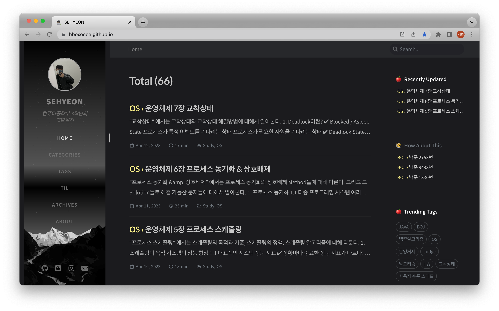
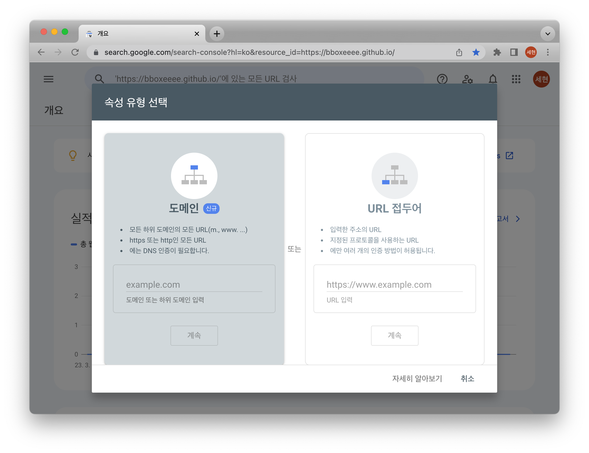
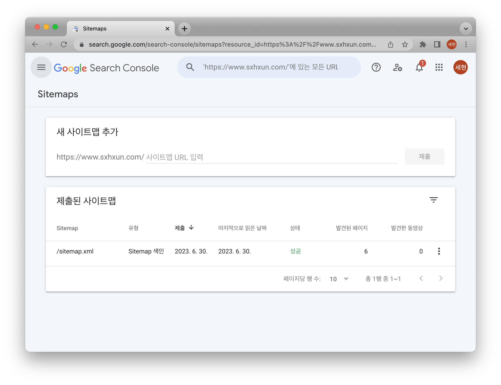

## ✋ 블로그를 시작하게된 계기



블로그를 처음 시작하게 된 것은 네이버 블로그였다. 단순히 일상적인 내용을 포스팅했는데, 컴퓨터공학부를 다니며 내가 하는 공부들을 정리할 수 있는 공간이 있었으면 했다. <br>
그래서 velog로 기술 블로그를 시작했다가 뭔가 마음에 들지 않아 나만의 블로그를 만들고 싶었다. <br>
그래서 Github Pages로 Jekyll 테마를 이용해 블로그를 제작했지만, 포스팅하는 것이 살짝 불편했고 이것저것 커스터마이징을 했음에도 UI가 마음에 들지 않았다.

## ❗️ Gatsby로 블로그 제작하기!

UI 측면에서도 기능적인 측면에서도 내가 생각하고 원했던 Gatsby 테마를 찾았는데 바로 줌코딩님의 테마였다. 그 테마로 블로그를 시작하고자 한다면 [여기]((https://zoomkoding.com/gatsby-starter-zoomkoding-introduction/)) 로 가면 된다! <br>
물론, 내가 직접 블로그를 제작해보면 어떨까 생각은 했지만, 아직은 그럴 능력이 없기에 잘 만들어진 테마를 활용하기로 했다. <br>
해당 테마의 가이드라인을 따라 `Netlify` 로 블로그를 배포하고 `가비아` 에서 도메인을 구매해 나만의 블로그를 제작할 수 있었다.

## 🌈 블로그 만드는 과정에서 몇가지 오류 해결

블로그를 만들면서 몇가지 오류를 만났는데 그것을 해결한 방법을 공유하려고 한다. <br>
나처럼 삽질하는 사람들이 있을까봐 한번 정리를 해놓으려고 한다.

### ⚙️ npm install 오류


나는 깃허브 저장소를 clone 한 프로젝트에 `npm install` 을 하니까 이런 에러가 발생했다. <br>
당황하지 말고 `--legacy-peer-deps` 를 추가해 `npm install` 을 하면 된다! 이유는 import 해온 프로젝트이기 때문에 발생하는 문구이고 지극히 정상적인 것이다!

### ⚙️ npm start 오류

블로그 초기 설정을 한 후에 로컬에서 확인하고자 npm start를 했을 땐 또 몇가지 오류들이 발생했다. <br>
`@emotion/react` ,  `@emotion/styled` , `react-helmet` 모듈을 찾을 수 없다는 오류였는데 이것은 다음과 같이 각 모듈을 개별적으로 설치해주면 해결되는 문제이다! 역시 뒤에 `--legacy-peer-deps` 를 추가해 설치해주도록 하자! <br>
만약 `WEBPACK` 어쩌고 하면서 오류가 발생한다면, `npm update` 를 해주거나 `gatsby clean` 을 해주면 해결된다!

### ⚙️ netlify 배포 오류

처음 netlify에 배포 시 또 무슨 에러가 발생했었다. 빌드에 실패했다는 오류였는데 이것은 프로젝트에서 `npm build` 를 먼저 해주고 배포를 하면 해결이 되었다!

## 🌈 Google Analytics와 Google Search Console 등록하기!

### ⚙️ Google Analytics 설정

블로그 방문자를 알기 위해 `Google Analytics` 를 등록해주어야하는데, 이것은 검색 몇 번이면 등록을 쉽게 할 수 있다. <br>
애널리틱스에 가입하고 사이트를 등록하는 것은 뭐.. 쉬우니까 생략하도록 하고! <br>
`Tracking ID` 를 어디에 등록하느냐! `gatsby-meta-config.js` 파일에 가보면 주석처리 된 부분이 있다. 그곳에 내 트래킹 ID를 등록하면된다!

### ⚙️ Google Search Console 설정

SEO를 위해 `Google Search Console` 을 등록하는 과정에서 나는 애를 조금 먹었다. 



처음에는 도메인을 선택하고 내가 도메인을 등록한 `가비아` 에서 DNS 설정을 하려고 했으나 이것이 잘 안되는 것이다. 그래서 이것저것 찾아보다보니 URL 접두어로 선택하고, 메타태그로 블로그 프로젝트에 등록을 해주면 된다. <br>

```javascript
    {
     resolve: 'gatsby-plugin-robots-txt',
     options: {
      host: 'https://your-site-URL.com/',
      sitemap: 'https://your-site-URL.com/sitemap.xml',
      policy: [{ userAgent: '*', allow: '/' }],
     },
    },
```

먼저 `gatsby-config.js` 파일로 가서 `plugins` 안에 이 부분을 위와 같이 수정해준다! <br>

```javascript
    {
        name: 'google-site-verification',
        content: 'your-google-verification-code',
    },
```

그리고 `src/components/seo` 경로에 `index.js` 파일을 열어 `<helmet` 태그 안에 위의 내용을 추가해준다. <br>
이렇게 하고 돌아와 확인을 누르고 `Sitemaps` 탭으로 들어가 아래와 같이 `sitemap.xml` 을 제출해주고 몇시간 기다리면 성공이라고 뜬다.



## 💡 블로그 운영 계획

앞으로 내 블로그는 공부하는 것을 기록하고, 프로젝트한 것을 포스팅하는 용도로 운영해갈 계획이다. <br>
음..! 도메인도 샀기 때문에 아마 더 애착을 가지고 열심히 운영할 수 있지 않을까 생각해본다!

<br><br>

> 본 포스팅은 [줌코딩님의 쉽고 빠르게 나만의 개츠비(Gatsby) 블로그 만들기](https://zoomkoding.com/gatsby-starter-zoomkoding-introduction/) 를 통해 블로그를 제작 후 작성하는 글입니다. <br>

```toc

```