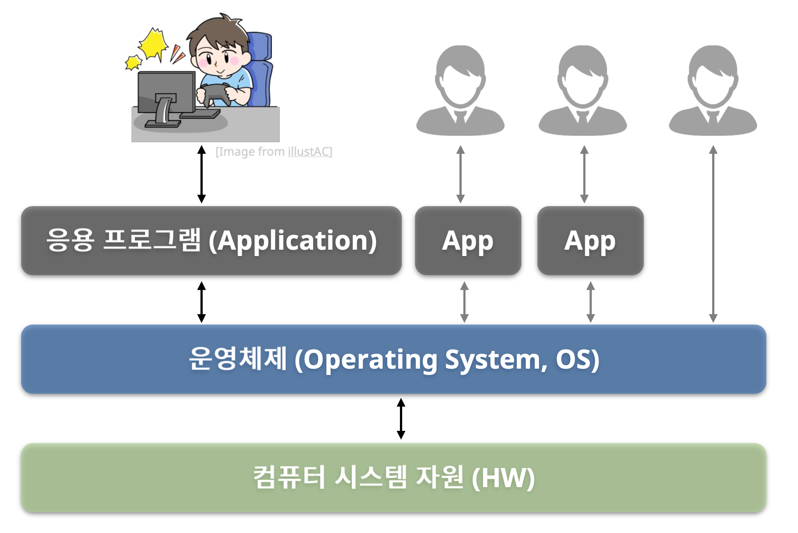
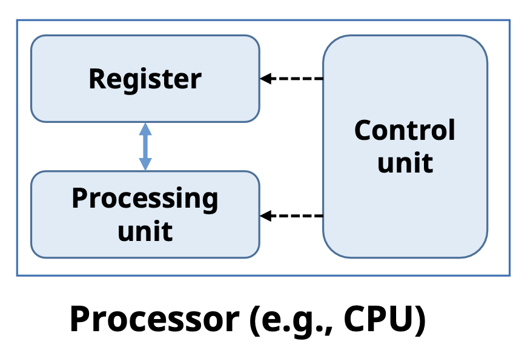
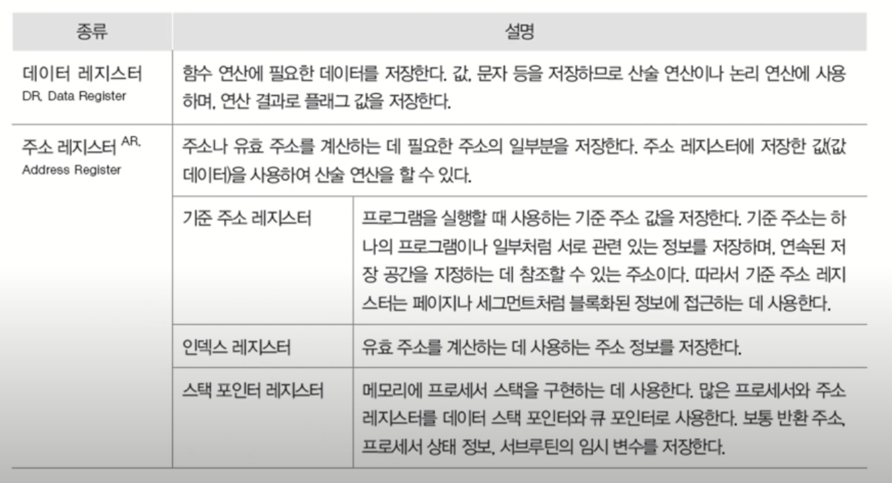
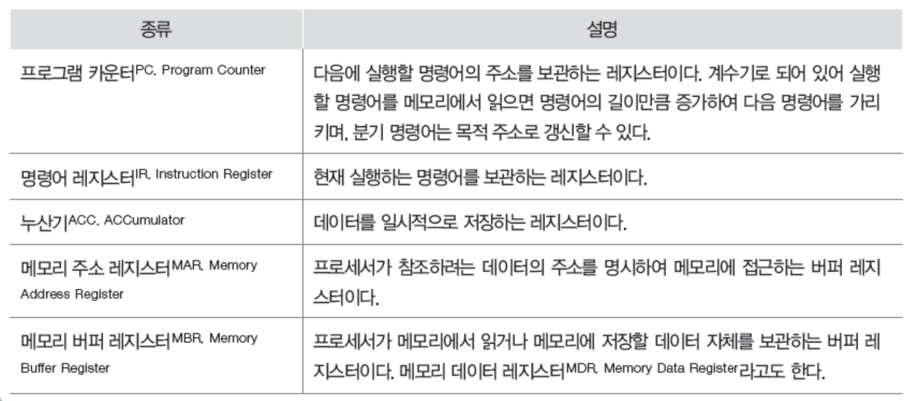
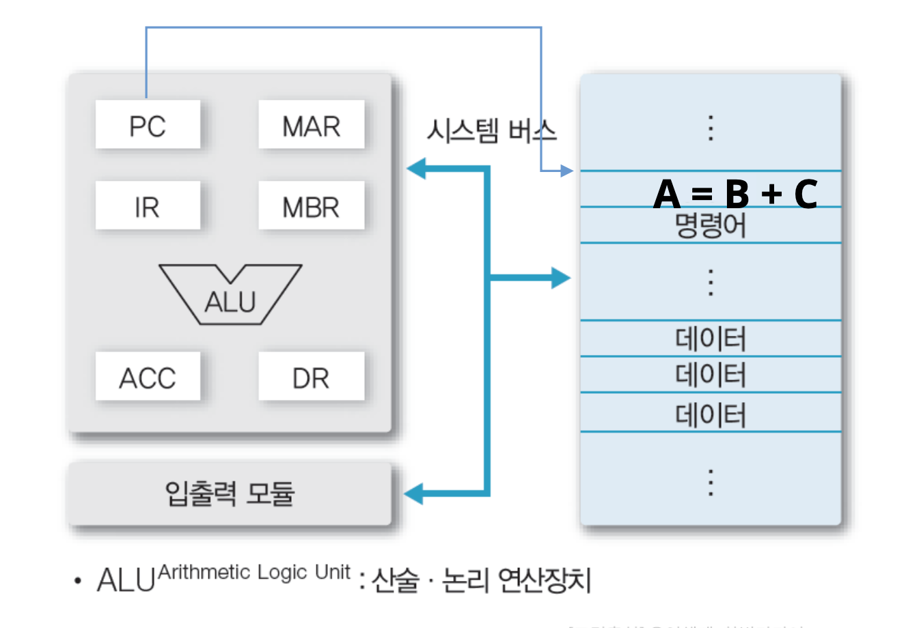
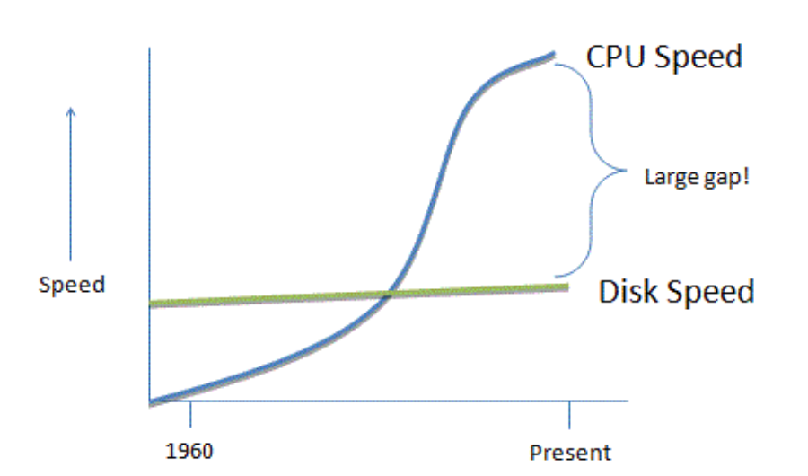
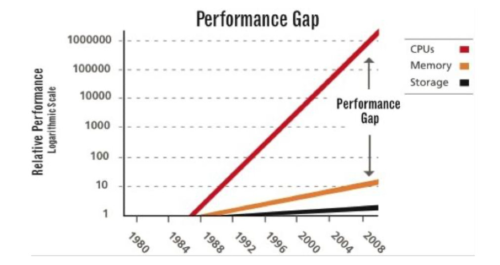
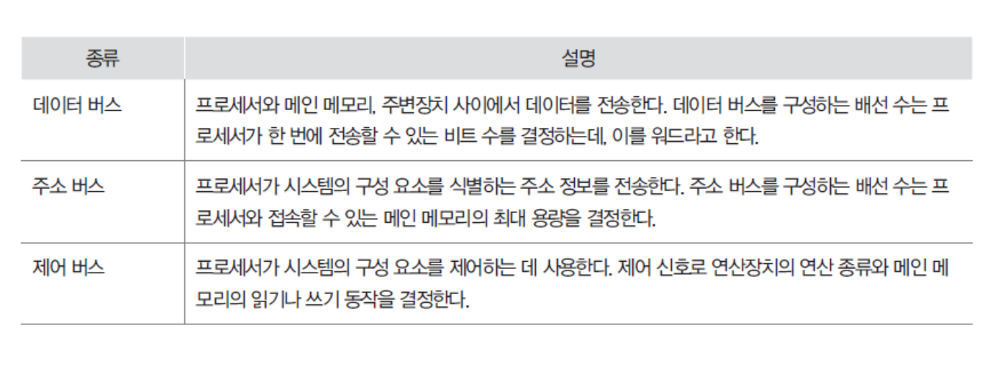
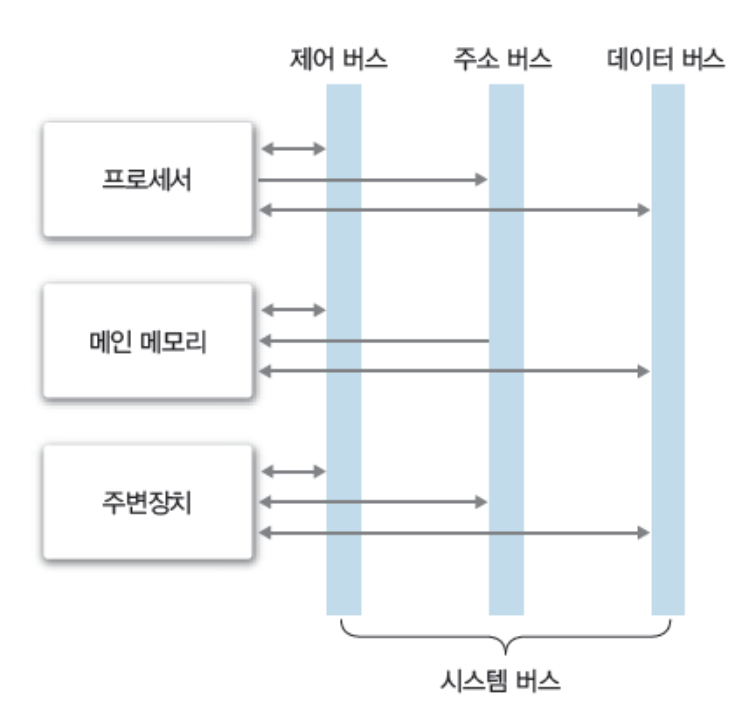

## 1. 운영체제



> 컴퓨터 시스템 자원을 효율적으로 관리하여 사용자나 응용프로그램에 서비스를 제공하는 장치 

## 2. 컴퓨터 하드웨어
> 프로세서 : CPU, GPU 등 <br>
> 메모리 : 주 기억장치, 보조 기억장치 <br>
> 주변장치 : 키보드/마우스, 모니터, 네트워크 모뎀

### 2.1 프로세서 (Processor)
> 중앙처리장치
- 연산 수행
- 컴퓨터의 모든 장치 제어



### 2.2 레지스터 (Register)
> 프로세서 내부에 있는 메모리
- 프로세서가 사용할 데이터를 저장
- 가장 빠른 메모리

#### 레지스터의 종류
- 용도에 따른 분류
  - 전용 레지스터, 범용 레지스터
- 사용자가 정보 변경 가능 여부에 따른 분류
  - 사용자 가시 레지스터, 사용자 불가시 레지스터
- 저장하는 정보의 종류에 따른 분류
  - 데이터 레지스터, 주소 레지스터, 상태 레지스터

#### 사용자 가시 레지스터


#### 사용자 불가시 레지스터


### 2.3 프로세서의 동작


> 동작순서 <br>
> - PC : 다음 실행할 명령어
> - IR : 명령어 보관
> - MAR : 메모리에 접근
> - DR : 연산에 필요한 데이터 저장
> - ALU : 연산 장치
> - ACC : 데이터 일시적 저장

#### 운영체제와 프로세서
- 프로세서에게 처리할 작업 할당 및 관리
  - 프로세스 생성 및 관리
- 프로그램의 프로세서 사용 제어
  - 프로그램의 프로세서 사용 시간 관리
  - 복수 프로그램간 사용 시간 조율 등

### 2.4 메모리
> 데이터를 저장하는 장치

#### 메모리의 종류
- 레지스터 : HW에서 관리
- 캐시 : HW에서 관리
- 메인 메모리 : SW/OS에서 관리
- 보조 기억장치 : SW/OS에서 관리

### 2.5 주 기억장치
> CPU와 디스크 간의 성능차이를 중간에서 도와줄 수 있는 장치
- 프로세서가 수행할 프로그램과 데이터 저장
- DRAM을 주로 사용 (용량이 크고, 가격이 저렴)


#### 📌 I/O bottle neck (디스크 입출력 병목현상) 해소!

### 2.6 캐시
> 프로세서 내부에 있는 메모리 (L1 캐시, L2 캐시) <br>
> 속도 빠르고, 가격도 비쌈


#### 📌 메인 메모리 입출력 병목현상 해소!

#### 캐시의 동작
- 하드웨어적으로 관리
- 캐시 히트 (Cashe hit) : 데이터 블록이 캐시에 존재
- 캐시 미스 (Cashe miss) : 데이터 블록이 캐시에 존재 X

#### 지역성
- 공간적 지역성 : 참조한 주소와 인접한 주소를 참조 (순차적 프로그램 실행)
- 시간적 지역성 : 한 번 참조한 주소를 다시 참조하는 특성 (for 문 등의 순환문)

📌 지역성은 캐시 적중률 (Cashe hit ratio)과 밀접!

### 2.7 보조 기억장치
- 프로그램과 데이터 저장
- 프로세서가 직접 접근할 수 없다.
  - 주 기억장치를 거쳐서 접근
  - 프로그램/데이터 > 주 기억장치인 경우? 가상 메모리!
- 용량이 크고, 가격이 저렴

#### 메모리와 운영체제
- 메모리 할당 및 관리
  - 프로그램의 요청에 따른 메모리 할당 및 회수
  - 할당된 메모리 관리
- 가상 메모리 관리
  - 가상메모리 생성 및 관리
  - 논리주소를 물리주소로 변환

### 2.8 시스템 버스
> 하드웨어들이 데이터 및 신호를 주고 받는 물리적인 통로





### 2.9 주변장치
> 프로세서와 메모리를 제외한 하드웨어들

- 입력장치
- 출력장치
- 저장장치

#### 주변장치와 운영체제
- 장치드라이버 관리
  - 주변 장치 사용을 위한 인터페이스 제공
- 인터럽트 처리
  - 주변 장치의 요청 처리
- 파일 및 디스크 관리
  - 파일 생성 및 삭제
  - 디스크 공간 관리 등

```toc

```