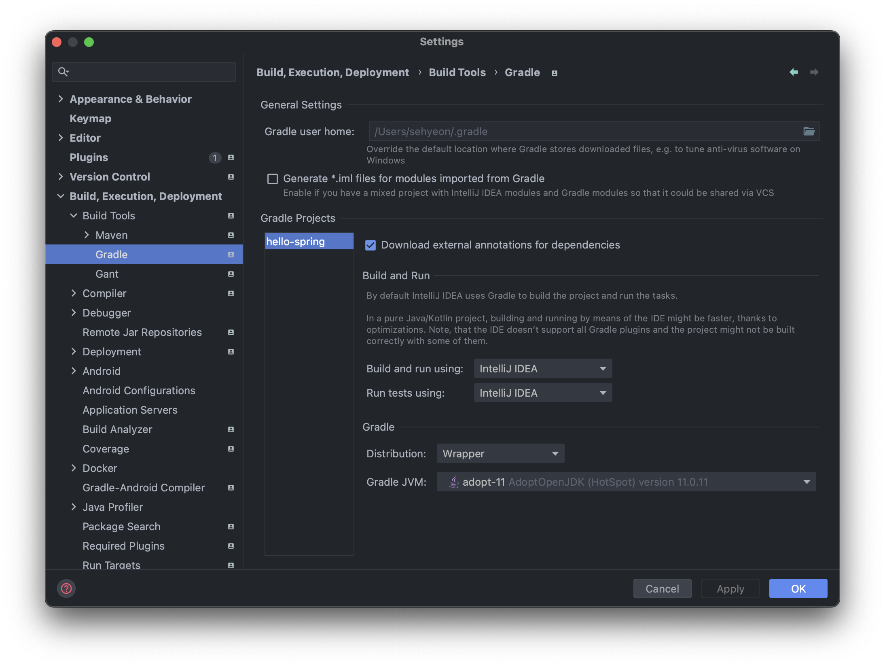
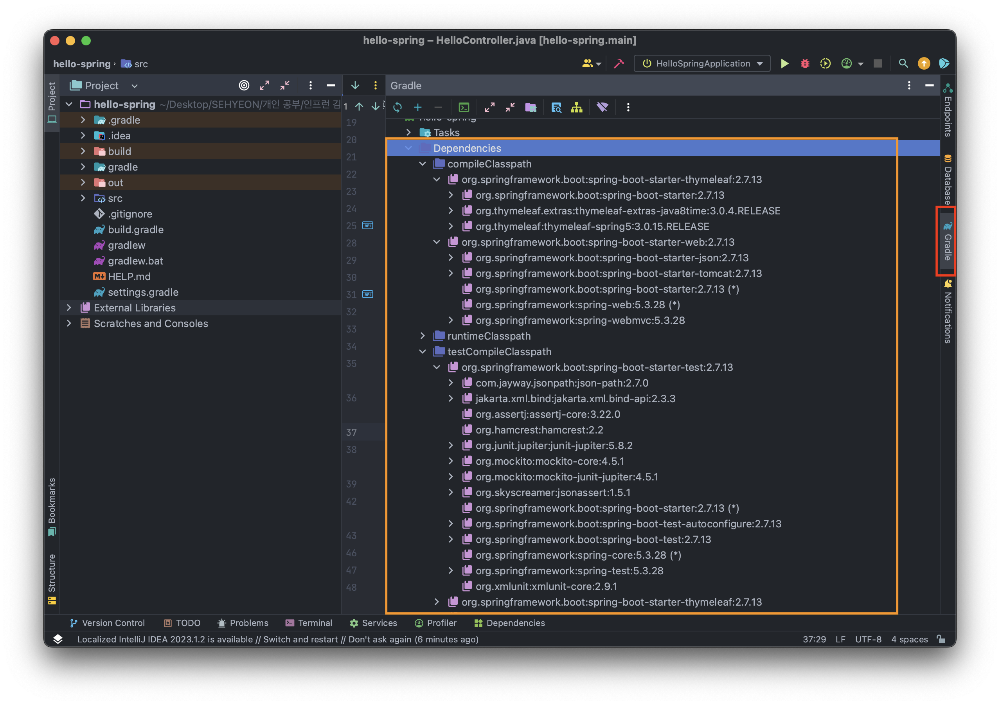
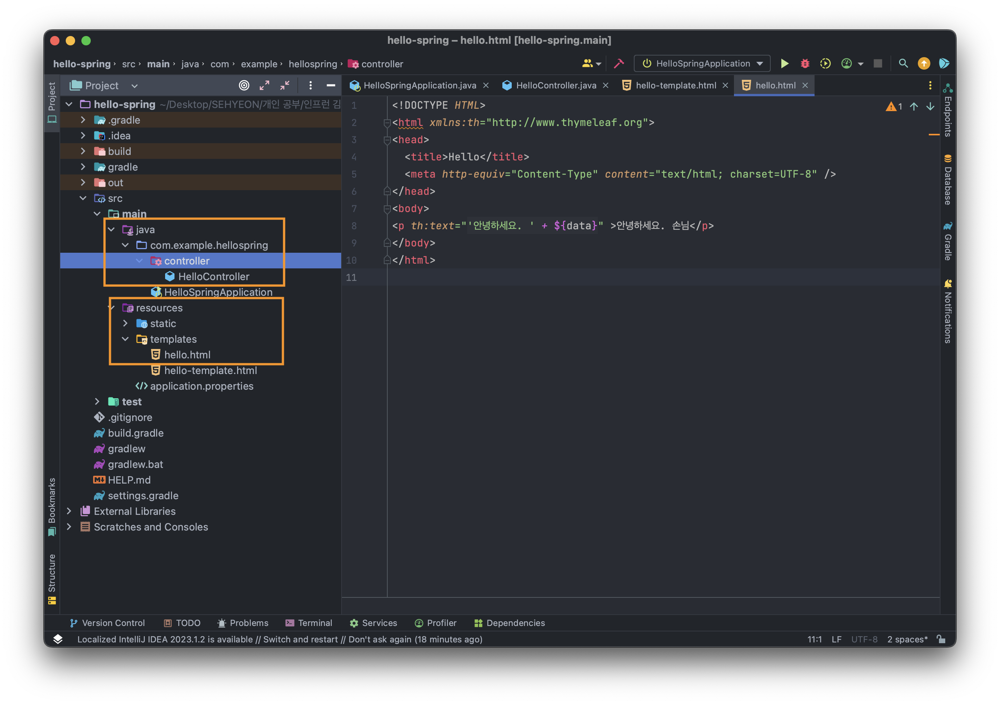
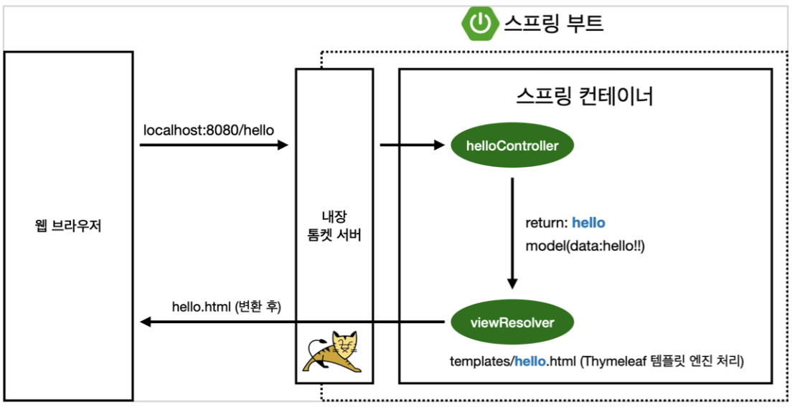

<br>

## 1. 스프링 프로젝트 생성
### ⚙️ 프로젝트 생성
- [start.spring.io](https://start.spring.io) 을 통해 스프링 프로젝트를 간편하게 생성할 수 있다!
- 이제 몇가지 의미를 알아보자!
- `Project Metadata`
  - `Group` 은 기업 도메인 명을 주로 사용한다.
  - `Artifact` 는 빌드되어 나오는 결과물을 의미한다.
- `Dependencies`
  - 스프링 부트 기반 프로젝트 생성 시 어떤 라이브러리를 사용할 것인지 선택할 수 있다!
  - 이 강의에서는 웹 프로젝트를 만들기 위한 라이브러리를 선택하는데, `Spring Web` 과 `Thymeleaf` 를 선택한다.

### ⚙️ 프로젝트 환경 설정
- 이 강의에서는 자바 11 버전을 사용한다. 따라서, 스프링 부트 버전을 `2.x` 버전을 사용해줘야하는데, 현재 나온 버전은 `2.7.13` 버전이 최신 버전이므로 이것을 선택한다!
- 만약 스프링 부트 버전이 `3.x` 를 선택한다면 자바 17 이상을 사용하도록 하자!
- 또한, 빌드 설정을 아래와 같이 해준다면 속도가 훨씬 빠르다.


## 2. 스프링 부트 라이브러리
먼저 Gradle이나 Maven은 의존관계가 있는 라이브러리를 함께 다운로드한다. 예를 들어 A와 B 라이브러리는 의존관계라고 하자. 만약 내가 A 라이브러리를 사용하려고 가져왔을 때, B 라이브러리를 추가로 가져올 필요가 없도록 해주는 것이 Gradle과 Maven의 역할이다. <br>

또한, IntelliJ에서 빨간색 박스의 Gradle을 클릭하면 현재 프로젝트의 라이브러리를 확인할 수 있다. 해당 버튼을 못찾겠다면, Command를 두 번 눌러보면 된다. <br>
이제, 생성한 프로젝트에서 선택한 2가지 라이브러리에 대해 살펴보도록 한다.

### 📌 spring-boot-starter-web
- spring-boot-starter-tomcat: 톰캣(웹서버)
- spring-webmvc: 스프링 웹 MVC

### 📌 spring-boot-starter-thymeleaf
- HTML 타임리프 템플릿 엔진 (view)

### 📌 spring-boot-starter
- 스프링부트 + 스프링 코어 + 로깅
- spring-boot
    - spring-core
- spring-boot-starter-logging
    - logback, slf4j
    - slf4j 는 인터페이스
    - 실제 로그를 어떤 구현체로 출력할 것인지에 대해 logback을 많이 선호!

### 📌 테스트 라이브러리
- spring-boot-starter-test
    - junit: 자바 진영에서 테스트할 때 사용하는 프레임워크
    - mockito: 목 라이브러리
    - assertj: 테스트 코드를 조금 더 편하게 작성하게 도와주는 라이브러리
    - spring-test: 스프링 통합 테스트 지원

## 3. Welcome Page 만들기
지금부터는 서버를 처음 시작했을 때의 Welcome Page를 만들어본다.
```HTML
<!DOCTYPE HTML>
  <html>
  <head>
      <title>Hello</title>
      <meta http-equiv="Content-Type" content="text/html; charset=UTF-8" />
  </head>
  <body>
  Hello
  <a href="/hello">hello</a>
  </body>
  </html>
```
위의 소스코드를 `resources/static` 경로에 `index.html` 파일을 생성해 입력하면 Welcome Page를 만들 수 있다! <br>
스프링 부트에서는 해당 경로에 index.html 파일을 생성하면 Welcome Page 기능을 제공한다. <br>
[스프링 부트 Welcome Page 문서](https://docs.spring.io/spring-boot/docs/2.3.1.RELEASE/reference/html/spring-boot-features.html#boot-features-spring-mvc-welcome-page) 를 통해 확인할 수 있다!

## 4. Thymeleaf 템플릿 엔진을 사용해보자
### 📌 Thymeleaf 템플릿 엔진이란?
Thymeleaf 템플릿 엔진은 쉽게 말해 HTML을 만들어주는 템플릿 엔진이라고 이해하면 된다!

### 📌 간단한 예시

위와 같은 경로에 아래 소스코드를 입력한다!
- Controller 
```JAVA
@Controller
  public class HelloController {
      @GetMapping("hello")
      public String hello(Model model) {
          model.addAttribute("data", "hello!!");
          return "hello";
      }
}
```
- View
```HTML
<!DOCTYPE HTML>
<html xmlns:th="http://www.thymeleaf.org">
<head>
    <title>Hello</title>
    <meta http-equiv="Content-Type" content="text/html; charset=UTF-8" />
</head>
<body>
<p th:text="'안녕하세요. ' + ${data}" >안녕하세요. 손님</p>
</body>
</html>
```

### 📌 동작 원리

위 코드가 동작하는 원리는 다음과 같다!
- 내장 톰켓 서버는 `localhost:8080/hello` 라는 요청을 받으면 스프링 컨테이너의 Controller를 호출한다.
- Controller에서 return 값으로 문자를 반환하면 `viewResolver` 가 화면을 찾아서 처리한다.
- 이때, 스프링 부트 템플릿 엔진이 기본 `viewName` 을 매핑한다.
- `resources/templates/(viewName).html` 을 찾는다. 즉, `hello.html` 을 매핑한다는 것이다!

## 5. 프로젝트 빌드하기
### 📌 빌드 과정
프로젝트를 빌드하는 과정은 다음과 같다. 먼저 터미널을 열고, 프로젝트의 폴더로 이동해 다음 명령어들을 실행한다!
- ./gradlew build
- cd build/libs
- java -jar hello-spring-0.0.1-SNAPSHOT.jar (이것은 프로젝트 이름에 따라 다르기 때문에 `ll` 명령어를 통해 빌드되어 나온 결과물 이름에 맞게 실행하면 된다!)

### ⚙️ 자바 버전 관련 오류
나는 처음 빌드했을 때, 자바 버전이 맞지 않는다는 오류가 발생했다. 내 맥북에서 사용중인 자바 버전은 18이었는데, 프로젝트의 자바 버전은 11이었기 때문에 발생한 오류이다. <br>
`sudo vi ./zshrc` 에서 자바 버전과 맞는 경로를 잘 설정해주어야 한다! 이 명령어는 자신의 터미널에서 사용 중인 쉘에 따라 다를 수 `sudo vi ./bash_profile` 이 될 수도 있다! 어쨋든, 자바 버전을 잘 설정해주면 오류는 해결된다!

## ✋ 마무리하며
이번 방학동안의 목표는 스프링을 좀 제대로 배워보는 것이다. 따라서, 인프런 김영한님의 강의 스프링 완전 정복 로드맵 강의를 쭉 수강해볼 계획이고, 배운 것들을 잘 정리해서 포스팅 해보도록 하겠다! 유료 강의는 포스팅하게 된다면, 세부 내용은 다루지 않고 강의를 통해 배운 점 + 오류 해결 과정들을 중점으로 다룰 예정이다. 알찬 방학을 보내길..

<br>

> [인프런 스프링 입문 - 코드로 배우는 스프링 부트, 웹 MVC, DB 접근 기술](https://www.inflearn.com/course/%EC%8A%A4%ED%94%84%EB%A7%81-%EC%9E%85%EB%AC%B8-%EC%8A%A4%ED%94%84%EB%A7%81%EB%B6%80%ED%8A%B8) <br>
> > 이 글은 은 인프런 김영한님의 강좌, 스프링 입문 - 코드로 배우는 스프링 부트, 웹 MVC, DB 접근 기술 강좌를 수강 후 작성한 것입니다. <br>
> > 모든 코드와 사진들은 강의에서 가져왔습니다. <br>
> > 문제가 있다면 알려주세요!

```toc

```