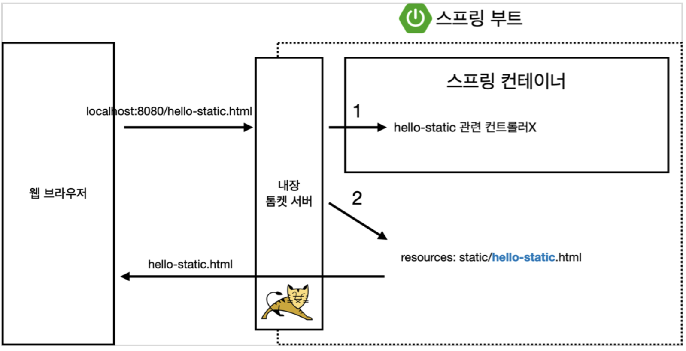
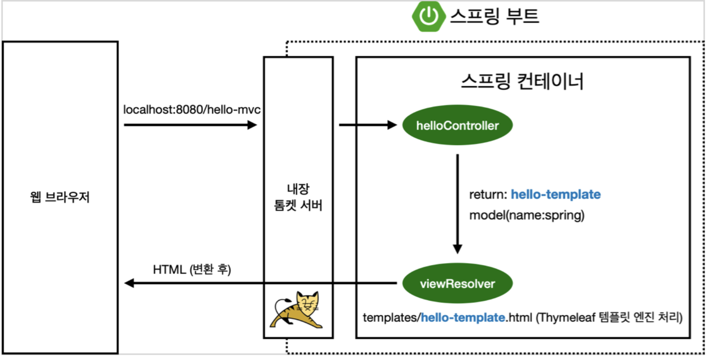
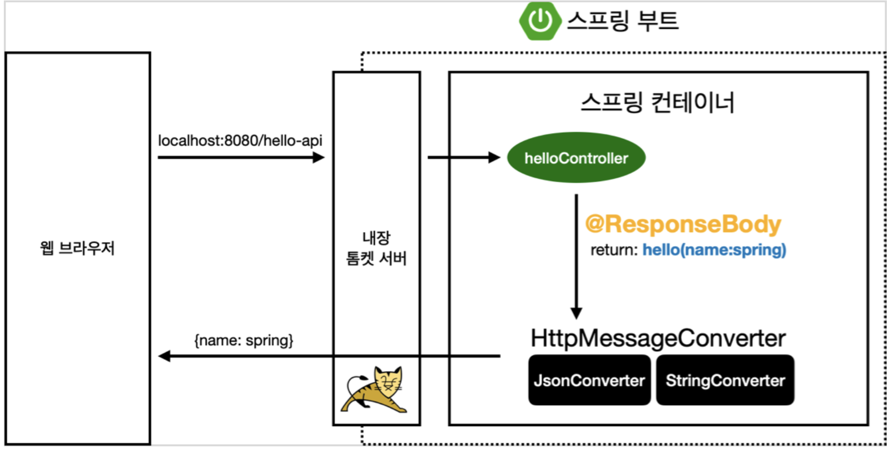

<br>

## 🤜 TIL (2023.07.01)
오늘 학습한 내용은 정적 컨텐츠와 MVC, 템플릿 엔진 그리고 API 방식에 대해 알아보았다. 그리고 간단한 예시를 통해 각각의 방식이 어떻게 동작하는지 알아보았다.

## 1. 정적 컨텐츠
### ❓ 정적 컨텐츠란?
정적 컨텐츠란, 단순히 파일 그대로를 웹 브라우저에 반환하는 것을 말한다. 다시 말하면 `resources/static` 하위에 html 파일을 생성하면 단순한 정적인 html 컨텐츠를 웹 브라우저에 반환해준다. 
### 📌 예시를 통해 알아보자!
```html
<!DOCTYPE HTML>
<html>
<head>
    <title>static content</title>
    <meta http-equiv="Content-Type" content="text/html; charset=UTF-8" />
</head>
<body>
정적 컨텐츠 입니다.
</body>
</html>
```
위와 같은 파일을 resources/static 하위 폴더에 `hello-static.html` 파일로 만들어준다. 그리고 실행한 후에 `localhost:8080/hello-static.html` 경로로 접속하면 '정적 컨텐츠 입니다.' 라고 화면에 표시되는 것을 확인할 수 있다.
### ⚙️ 동작 원리
그러면 이제 정적 컨텐츠가 어떻게 동작하는지 알아보자! <br>


- 먼저 내장 톰켓 서버에서 `localhost:8080/hello-static.html` 요청을 받으면 스프링 컨테이너에서 1순위로 hello-static 관련 Controller를 찾는다!
- 해당 Controller가 없다면, 내부 `resources/static/hello-static.html` 을 찾아 웹 브라우저에 반환하는 방식으로 동작한다.

## 2. MVC와 템플릿 엔진
### ❓ MVC란?
Model, View, Controller의 약자로 역할과 책임을 분리하기 위해 각각의 역할을 나누어 동작을 수행하도록 하는 디자인 패턴이다. 기존에는 View에서 Controller의 기능까지 모두 구현했었다. 이것을 Model 1 방식이라고 한다. 그러나 MVC 방식에서는 Model과 Controller는 내부적으로 비지니스 로직을 처리하는데 집중하고, View는 화면 설계 및 보여지는 부분을 처리하는데 집중하는데, 이것을 Model 2 방식이라고 한다.
### 📌 예시를 통해 알아보자!
- Controller
```java
@Controller
public class HelloController {
    @GetMapping("hello-mvc")
    public String helloMvc(@RequestParam("name") String name, Model model) {
        model.addAttribute("name", name);
        return "hello-template";
    }
}
```
- 우리가 처음 만들었던, `HelloController` 파일 안에 위의 코드를 추가해준다. <br><br>

- View
```html
<html xmlns:th="http://www.thymeleaf.org">
<body>
<p th:text="'hello ' + ${name}">hello! empty</p>
</body>
</html>
```
- 그리고 `resources/templates` 하위에 hello-template.html 파일을 생성해 위의 코드를 추가해준다.<br>

이제 `localhost:8080/hello-mvc?name=spring!!` 과 같이 GET 방식으로 name에 spring!!을 전달해주면, 화면에 hello spring!! 이라는 것을 확인할 수 있다.
### ⚙️ 동작 원리
그러면 위의 예시가 어떻게 동작하는지 알아보자!<br>


- 내장 톰켓 서버에서 `localhost:8080/hello-mvc` 요청을 받으면 스프링은 Controller를 찾는다.
- helloController는 url에 맞는 메소드를 매핑해준다.
- 메소드가 모델에 변수를 지정하고, `hello-template` 를 반환한다.
- viewResolver는 화면과 관련된 view를 찾아 템플릿 엔진을 연결시켜준다.
- hello-tempate.html을 찾아서 Thymeleaf 엔진에게 전달하면 랜더링해서 변환한 html을 웹브라우저에 반환한다.

## 3. API
### ❓ API란?
정적 컨텐츠를 제외하면 값을 반환하는 방식은 2가지가 있는데, `HTML` 파일을 반환할 것인지, `API` 를 사용해 값을 줄 것인지로 나뉜다고 볼 수 있다. 오늘 강의에서는 `@ResponseBody` 를 통해 문자를 반환하는 것과 객체를 반환하는 것을 다루었고, 이 2가지에 대해 알아보자!
### 📌 @ResponseBody 문자 반환
```java
@Controller
public class HelloController {
	@GetMapping("hello-string")
	@ResponseBody
	public String helloString(@RequestParam("name") String name) {
		return "hello " + name;
	}
	// HTTP Body에 문자 내용을 직접 반환!
}
```
- HelloController 파일에 위의 코드를 추가해준다.
- `@ResponseBody`를 사용하게 되면 viewResolver를 사용하지 않고, HTTP의 Body에 문자 내용을 직접 반환한다. 여기서 HTTP Body는 HTML의 body 태그가 아니다!
### 📌 @ResponseBody 객체 반환
```java
@Controller
public class HelloController {
	@GetMapping("hello-api")
	@ResponseBody
	public Hello helloApi(@RequestParam("name") String name) {
		Hello hello = new Hello();
		hello.setName(name);
		return hello;
	}
	// {"name": "spring!!"} 과 같이 json 형태로 반환!!
	
	static class Hello {
		private String name;
    
		public String getName() {
			return name;
		}
		public void setName(String name) {
			this.name = name;
		}
	}
}
```
- 마찬가지로, HelloController 파일에 위의 코드를 추가해준다.
- `@ResponseBody`를 사용하고, 객체를 반환하면 객체가 `json` 형태로 변환된다. 즉, {key: value} 형식으로 변환되어 출력된다.
### ⚙️ 동작 원리
그러면 위의 예시가 어떻게 동작하는지 알아보자!<br>


- Controller는 @RequestBody라는 anotation이 있기 때문에 HTTP Body에 응답을 그대로 반환해야함을 미리 인지한다.
- 객체가 오면 viewResolver 대신 `HttpMessageConverter` 가 동작한다.
    - 기본 문자 처리 : `StringHttpMessageCoverter`
    - 기본 객체 처리 : `MappingJackson2HttpMessageConverter`
    - byte 처리 등 기타 여러 HttpMessageConverter가 기본으로 등록되어 있다.
- 참고로, 클라이언트의 HTTP Accept 헤더와 서버의 컨트롤러 반환 타입 정보 두 개를 조합해서 HttpMessageConverter가 선택된다.

## ✋ 마무리하며
아직까지는 초반이기도 하고, 이전에 조금씩 주어들은 내용들이 있어 비교적 가벼운 마음으로 듣고 있다. 그런데도 강사님의 설명이나 이런 것들은 매우 좋다고 생각이 들고 계속해서 듣고 싶다고 생각이 드는 것 같다! 내일도 열심히하자^^

<br>

> [인프런 스프링 입문 - 코드로 배우는 스프링 부트, 웹 MVC, DB 접근 기술](https://www.inflearn.com/course/%EC%8A%A4%ED%94%84%EB%A7%81-%EC%9E%85%EB%AC%B8-%EC%8A%A4%ED%94%84%EB%A7%81%EB%B6%80%ED%8A%B8) <br>
> > 이 글은 은 인프런 김영한님의 강좌, 스프링 입문 - 코드로 배우는 스프링 부트, 웹 MVC, DB 접근 기술 강좌를 수강 후 작성한 것입니다. <br>
> > 모든 코드와 사진들은 강의에서 가져왔습니다. <br>
> > 문제가 있다면 알려주세요!

```toc

```