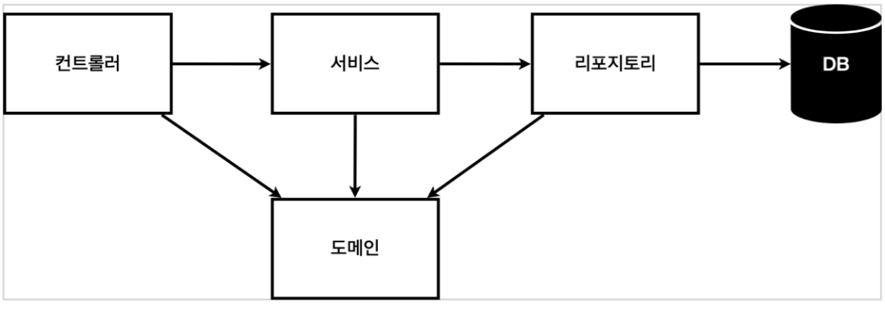
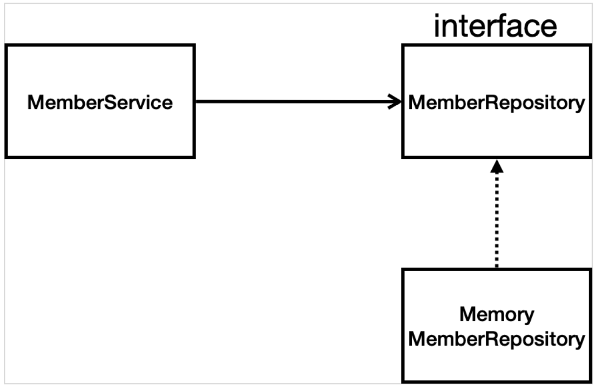
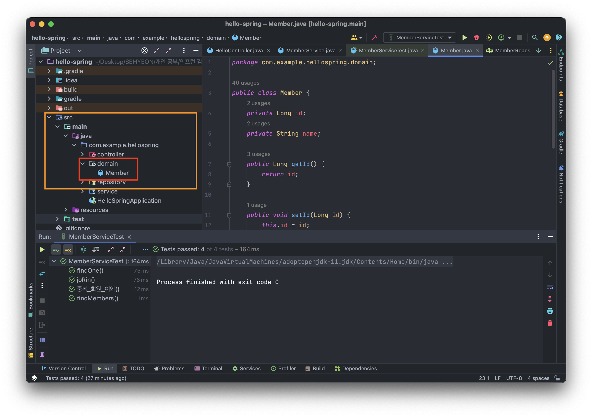
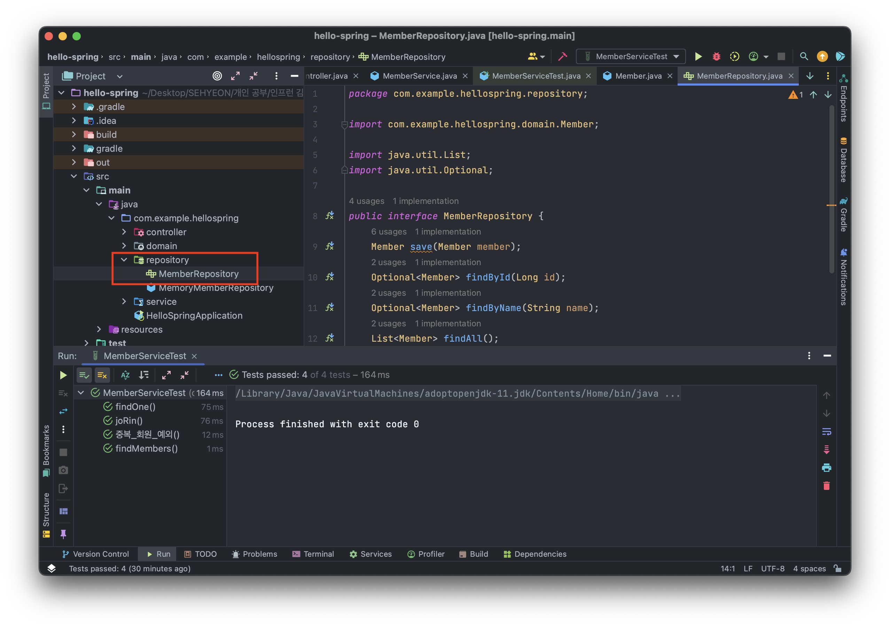
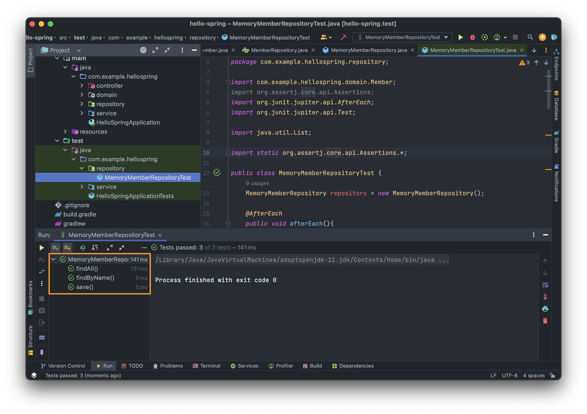
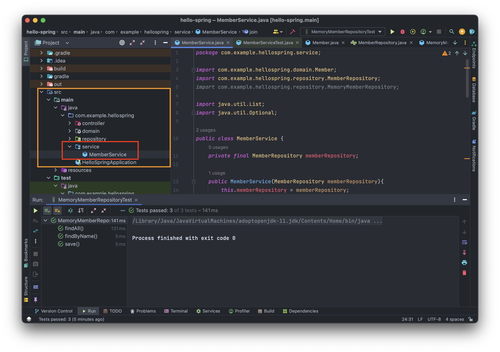
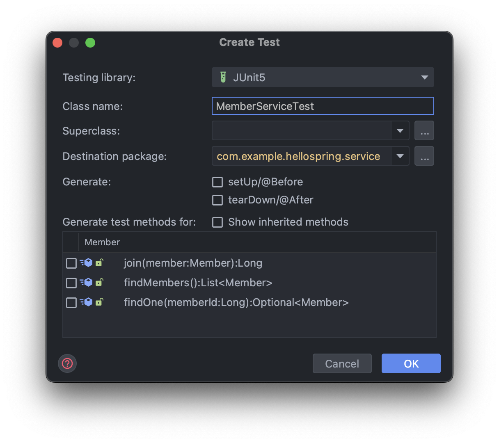

<br>

## 🤜 TIL (2023.07.02)
오늘 학습한 내용은 간단한 회원 관리 예제 개발을 통해 간단한 비즈니스 개발을 해보는 것이다. 따라서 요구사항은 간단하고 쉬운 것으로 진행한다. 요구사항을 정리하고, 도메인과 리포지토리, 테스트 케이스와 서비스 개발 및 테스트를 진행해본다.

## 1. 비즈니스 요구사항 정리
비즈니스 요구사항은 정말 쉽고 간단하게 구성되어 있다. <br>
### 📌 비즈니스 요구사항
- 데이터 : 회원 ID, 이름
- 기능 : 회원 등록, 조회
- 그리고 여기선 데이터 저장소가 선정되지 않은 상황을 가정한다.
### 📌 일반적인 웹 애플리케이션 계층 구조


각각의 역할은 다음과 같다.
- 컨트롤러 : 웹 MVC의 컨트롤러 역할
- 서비스 : 핵심 비즈니스 로직 구현
- 리포지토리 : 데이터베이스에 접근, 도메인 객체를 데이터베이스에 저장하고 관리
- 도메인 : 비즈니스 도메인 객체, 예를 들어 회원 or 주문 등 주로 데이터베이스에 저장하고 관리된다.

### 📌 클래스 의존관계


회원 정보를 저장하는 MemberRepository는 `인터페이스`로 설계되어 있는데, 이유는 다음과 같다.
- 아직 데이터 저장소가 선정되지 않아서 우선 인터페이스로 구현 클래스를 변경할 수 있도록 설계한다.
- 데이터 저장소는 RDB, NoSQL 등 다양한 저장소를 고민중인 상황으로 가정한다.
- 개발을 진행하기 위해 초기 개발 단계에서는 구현체로 가벼운 메모리 기반의 데이터 저장소를 사용한다!

## 2. 회원 도메인과 리포지토리 만들기
### 💡 회원 도메인
- 아래와 같이 `domain` 패키지를 만들고, `Member.java` 파일을 생성해 회원 정보를 담는 객체를 생성한다.

```JAVA
package com.example.hellospring.domain;

public class Member {
    private Long id;
    private String name;

    public Long getId() {
        return id;
    }

    public void setId(Long id) {
        this.id = id;
    }

    public String getName() {
        return name;
    }

    public void setName(String name) {
        this.name = name;
    }
}
```
### 💡 회원 리포지토리
- 아래와 같이 `repository` 패키지를 만들고, `MemberRepository.java` 인터페이스를 만들어 4가지 기능을 선언해준다.

```JAVA
package com.example.hellospring.repository;

import com.example.hellospring.domain.Member;

import java.util.List;
import java.util.Optional;

public interface MemberRepository {
    Member save(Member member);
    Optional<Member> findById(Long id);
    Optional<Member> findByName(String name);
    List<Member> findAll();
}
```
- 여기서 `Optional` 은 반환값이 null인 경우를 고려해 Optional로 null을 감싸서 반환해주는 자바 8부터 지원하는 기능이다.
### 💡 회원 리포지토리 메모리 구현체
- `repository` 패키지 하위에 `MemoryMemberRepository.java` 파일을 생성해 인터페이스에 담긴 기능을 작성한다.
```JAVA
package com.example.hellospring.repository;

import com.example.hellospring.domain.Member;

import java.util.HashMap;
import java.util.List;
import java.util.ArrayList;
import java.util.Map;
import java.util.Optional;

public class MemoryMemberRepository implements MemberRepository{
    private static Map<Long, Member> store = new HashMap<>();
    private static long sequence = 0L;

    @Override
    public Member save(Member member) {
        member.setId(++sequence);
        store.put(member.getId(), member);
        return member;
    }

    @Override
    public Optional<Member> findById(Long id) {
        return Optional.ofNullable(store.get(id));
    }

    @Override
    public Optional<Member> findByName(String name) {
        return store.values().stream()
                .filter(member -> member.getName().equals(name))
                .findAny();
    }

    @Override
    public List<Member> findAll() {
        return new ArrayList<>(store.values());
    }

    public void clearStore(){
        store.clear();
    }
}
```
- 기능은 4가지가 있다. 저장, ID로 찾기, 이름으로 찾기, 모두 검색
- 그리고 마지막에 있는 `clearStore` 메소드는 추후에 리포지토리 테스트 코드를 설명하며 함께 다룬다.

## 3. 회원 리포지토리 테스트 케이스 개발
- 개발한 기능을 실행해서 테스트할 때는 `main` 메소드를 통해 실행하거나 웹 애플리케이션의 `컨트롤러` 를 통해서 해당 기능을 실행할 수 있다.
- 하지만, 이 2가지 방법은 준비하고 실행하는데 오래걸리고, 반복 실행하기 어려우며 여러 테스트를 한 번에 실행하기 어렵다는 단점이 있다.
- 자바는 `JUnit` 이라는 프레임워크로 테스트를 실행해 이러한 문제를 해결한다.
### 💡 회원 리포지토리 메모리 구현체 테스트
- 아래와 같이 `repository` 패키지를 만들고, `MemoryMemberRepositoryTest.java` 파일을 생성한다.
- 일반적으로 테스트하고자 하는 파일명 뒤에 `Test` 를 붙여 클래스를 생성한다.
- 테스트는 `@Test` 어노테이션을 사용해 테스트 코드를 작성하며 테스트하고자 하는 코드를 작성하면 된다.
```JAVA
package com.example.hellospring.repository;

import com.example.hellospring.domain.Member;
import org.assertj.core.api.Assertions;
import org.junit.jupiter.api.AfterEach;
import org.junit.jupiter.api.Test;

import java.util.List;

import static org.assertj.core.api.Assertions.*;

public class MemoryMemberRepositoryTest {
    MemoryMemberRepository repository = new MemoryMemberRepository();

    @AfterEach
    public void afterEach(){
        repository.clearStore();
    }

    @Test
    public void save(){
        Member member = new Member();
        member.setName("spring");

        repository.save(member);

        Member result = repository.findById(member.getId()).get();
        assertThat(member).isEqualTo(result);
    }

    @Test
    public void findByName(){
        Member member1 = new Member();
        member1.setName("spring1");
        repository.save(member1);

        Member member2 = new Member();
        member2.setName("spring2");
        repository.save(member2);

        Member result = repository.findByName("spring1").get();
        assertThat(result).isEqualTo(member1);
    }

    @Test
    public void findAll() {
        Member member1 = new Member();
        member1.setName("spring1");
        repository.save(member1);

        Member member2 = new Member();
        member2.setName("spring2");
        repository.save(member2);

        List<Member> result = repository.findAll();
        assertThat(result.size()).isEqualTo(2);
    }
}
```
- 이렇게 테스트 케이스를 작성하고 실행하면 아래와 같은 결과를 볼 수 있다. 테스트에 통과되면 각 테스트가 모두 초록색이되고, 실패하면 빨간색으로 뜨는 것을 확인할 수 있다.

- 자, 그런데 자세히 보면 테스트 실행 순서는 우리가 코드를 작성한 순서와는 다르다는 것을 확인할 수 있다.
- 테스트는 각각 독립적으로 실행되어야 하며, 테스트 순서에 의존관계가 있는 것은 좋은 테스트가 아니다!
- 또한, `@AfterEach` 코드를 조금 더 자세히 알아보도록 하자!
``` JAVA
    @AfterEach
    public void afterEach(){
        repository.clearStore();
    }
```
- 이 코드를 보면, 메모리 구현체에서 만들었던 `clearStore` 메소드를 실행하고 있다.
- `@AfterEach` 는 한 번에 여러 테스트를 실행하면 메모리 DB에 직전 테스트의 결과가 남을 수 있는데, 이렇게 되면 이전 테스트에 영향을 받아 다음 테스트가 실패할 가능성이 있다. 그래서 이것을 사용해 각 테스트가 종료될 때마다 메소드 안에 있는 기능을 실행한다!
- 여기서는 메모리 DB에 저장된 데이터를 삭제해 이전 테스트에서 만든 데이터가 다음 테스트에 영향을 주지 않도록 하는 것이다!

## 4. 회원 서비스 개발
- 위에서도 언급했듯 서비스는 회원 도메인과 리포지토리를 활용해 비즈니스 로직을 작성하는 것이다.
- 아래와 같이 `service` 패키지를 만들고, `MemberService.java` 파일을 생성한다.

- 여기서는 회원가입 시 같은 이름이 있는 중복회원을 방지하기 위한 로직을 작성하고, 전체 회원을 조회하는 로직을 작성한다.
```JAVA
package com.example.hellospring.service;

import com.example.hellospring.domain.Member;
import com.example.hellospring.repository.MemberRepository;
import com.example.hellospring.repository.MemoryMemberRepository;

import java.util.List;
import java.util.Optional;

public class MemberService {
    private final MemberRepository memberRepository = new MemoryMemberRepository();

    /**
     * 회원가입
     */
    public Long join(Member member){
        // 같은 이름이 있는 중복 회원 X
        validateDuplicateMember(member);
        memberRepository.save(member);
        return member.getId();
    }

    private void validateDuplicateMember(Member member) {
        memberRepository.findByName(member.getName())
            .ifPresent(m ->{
                throw new IllegalStateException("이미 존재하는 회원입니다.");
            });
    }

    /**
     * 전체 회원 조회
     */
    public List<Member> findMembers() {
        return memberRepository.findAll();
    }

    public Optional<Member> findOne(Long memberId){
        return memberRepository.findById(memberId);
    }
}
```

## 5. 회원 서비스 테스트 케이스 개발
- 메모리 구현체 테스트와 같이 테스트 케이스를 만든다. 이번에는 유용한 단축키를 이용해 직접 패키지를 생성하지 않고, 파일을 생성해보도록 하겠다.
- 단축키는 맥OS 기준 `Command + Shift + T` 를 누르면 아래와 같이 클래스를 만들 수 있다.

- 이름도 일반적으로 사용하는 이름으로 생성되고, 아래에 테스트를 만들 메소드를 선택하면 겉의 껍데기를 모두 포함해 클래스를 만들어준다! (인텔리제이를 처음 써보는데 유용한 단축키가 많은 것 같다. 이건 따로 정리를 해봐야겠다!)
### 💡 회원 서비스 코드를 DI 가능하게 변경
- 기존에는 회원 서비스가 메모리 회원 리포지토리를 직접 생성하게 했다.
- 각 테스트가 서로 영향이 없도록 항상 새로운 객체를 생성하도록 하기 위해 `MemberService.java` 코드를 아래와 같이 수정해준다!
```JAVA
public class MemberService {
    private final MemberRepository memberRepository;

    public MemberService(MemberRepository memberRepository){
        this.memberRepository = memberRepository;
    }
		...
}
```
### 💡 회원 서비스 테스트
```JAVA
package com.example.hellospring.service;

import com.example.hellospring.domain.Member;
import com.example.hellospring.repository.MemoryMemberRepository;
import org.assertj.core.api.Assertions;
import org.junit.jupiter.api.AfterEach;
import org.junit.jupiter.api.BeforeEach;
import org.junit.jupiter.api.Test;

import static org.assertj.core.api.Assertions.*;
import static org.junit.jupiter.api.Assertions.*;

class MemberServiceTest {
    MemberService memberService;
    MemoryMemberRepository memoryRepository;

    @BeforeEach
    public void beforeEach(){
        memoryRepository = new MemoryMemberRepository();
        memberService = new MemberService(memoryRepository);
    }

    @AfterEach
    public void afterEach(){
        memoryRepository.clearStore();
    }

    @Test
    void joRin() {
        // given
        Member member = new Member();
        member.setName("hello");

        // when
        Long saveId = memberService.join(member);

        // then
        Member findMember = memberService.findOne(saveId).get();
        assertThat(member.getName()).isEqualTo(findMember.getName());
    }

    @Test
    public void 중복_회원_예외(){
        //given
        Member member1 = new Member();
        member1.setName("spring");

        Member member2 = new Member();
        member2.setName("spring");

        //when
        memberService.join(member1);
        IllegalStateException e = assertThrows(IllegalStateException.class, () -> memberService.join(member2));

        //then
        assertThat(e.getMessage()).isEqualTo("이미 존재하는 회원입니다.");
    }

    @Test
    void findMembers() {
    }

    @Test
    void findOne() {
    }
}
```
몇가지 살펴볼 사항들이 있다.
- 첫 번째로, 테스트 메소드 이름은 한글로 작성해도 된다. 직관적으로 알아보기 쉽게 하기 위해서 빌드 파일에 포함되지 않는 테스트 코드의 메소드는 한글로 작성해도 무방하다!
- 두 번째로, 테스트 코드를 작성할 때 `//given //when //then` 주석을 활용하면 테스트 코드를 작성하기 쉬워진다. 즉, 어떤 값이 주어지고, 어떤 상황에서, 어떤 결과가 나와야하는지 구분해놓으면 긴 코드를 작성할 때 코드를 알아보기 쉬워진다는 것이다!
- 세 번째로, 중복된 이름을 가진 회원가입은 예외처리를 하도록 했다. 테스트에서는 정상 작동하는지 확인하는 것도 중요하지만 지정한 예외처리가 잘 작동하는지를 확인하는 것도 중요하다. 이것은 `중복_회원_예외` 에서 테스트를 진행하고 있다.
- 마지막으로, `@BeforeEach` 어노테이션은 각 테스트 실행 전에 호출된다. 위에서 회원 서비스 코드에서 객체를 매번 생성하지 않고, 생성자를 통해 생성하도록 변경했었다. 즉, 각 테스트가 서로 영향이 없도록 항상 새로운 객체를 생성하고 의존관계를 새로 맺어주도록 한다.

## ✋ 마무리하며
오늘은 간단한 예제를 통해 스프링 생테계 전체의 개발이 어떤식으로 진행되고 동작하는지 알아보았다. 뭔가 어디서 흘끔흘끔 봤던 것 같기도 하면서 나름 재밌기도 하다. ㅋㅋㅋ 앞으로의 강의가 기대된다! (과연..?)

<br>

> [인프런 스프링 입문 - 코드로 배우는 스프링 부트, 웹 MVC, DB 접근 기술](https://www.inflearn.com/course/%EC%8A%A4%ED%94%84%EB%A7%81-%EC%9E%85%EB%AC%B8-%EC%8A%A4%ED%94%84%EB%A7%81%EB%B6%80%ED%8A%B8) <br>
> > 이 글은 은 인프런 김영한님의 강좌, 스프링 입문 - 코드로 배우는 스프링 부트, 웹 MVC, DB 접근 기술 강좌를 수강 후 작성한 것입니다. <br>
> > 모든 코드와 사진들은 강의에서 가져왔습니다. <br>
> > 문제가 있다면 알려주세요!

```toc

```