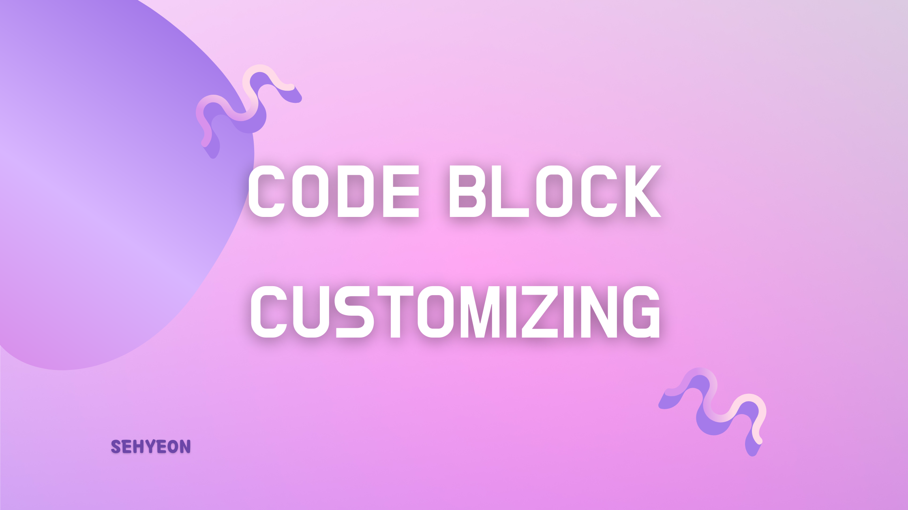
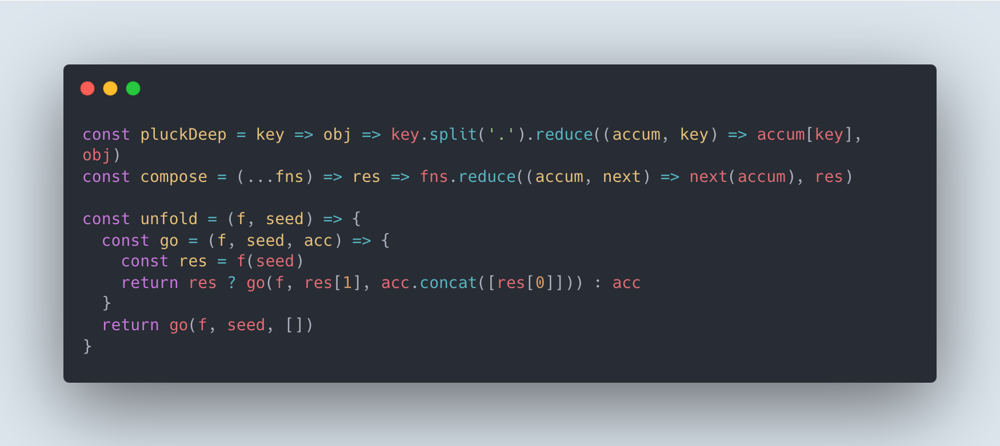

<br><br>

## 👋 코드블록을 개선해보자!
 블로그를 개설하고 포스팅을 하면서 코드블록이 조금 아쉽다고 생각을 했었다. Syntax Highlighting 테마가 내 취향이 아니였기 때문에 이것을 한 번 바꿔보기로 했다. 먼저 내가 원하는 것은 다음과 같았다.
- 가독성이 좋아야한다.
- 디자인이 예뻐야한다.
  
그래서 먼저 이 블로그에서 사용중인 `prism js` 사이트에 들어가 제공하는 테마들을 살펴봤다. 음.. 뭔가 2%씩 부족한 느낌이었다. 그래서 또 계속 구글링을 하다가 발견한 것이 `carbon` 테마였다.



보자마자 이거다! 싶었다. 맥 OS 창을 좋아하는 나는 바로 이거지! 하면서 이걸로 적용하려고 했다. 어라? 이거는 코드 이미지화 사이트인 것이다. 다시 말해 내가 올리려고 하는 코드를 사이트에 넣고, 이미지로만 export 할 수 있다는 것이다. <br>
그러면, 코드블록이 필요할 때마다 저 사이트를 왔다갔다하면서 이미지를 만들어야하는 번거로움이 생긴다..😱

## 😝 Highlight Code
그래서 다른 방법은 없을까 찾아보다가 웹 오픈소스 에디터 [DeckDeckGo](https://docs.deckdeckgo.com/?path=/docs/components-highlight-code--highlight-code) 를 발견했다!! <br>
무려, `carbon` 테마를 사용하면서 Gatsby 플러그인으로 만들어져 블로그에 적용하면 기존처럼 코드블록 태그로 사용할 수 있다는 것이다. <br>
공식문서를 참고해서 내 블로그에 적용해보았다.
### ⚙️ 설치하기
```shell
$ npm install --save gatsby-transformer-remark gatsby-remark-highlight-code @deckdeckgo/highlight-code
```
이 명령어를 실행해 플러그인을 설치한다.
### 📍 플러그인 적용하기
`gatsby-config.js` 파일에 플러그인 설정을 추가한다.
```javascript
plugins: [
  {
    resolve: `gatsby-transformer-remark`,
    options: {
      plugins: [
        {
          resolve: `gatsby-remark-highlight-code`
        },
        options: {
            terminal: "carbon",
            theme: "one-dark",
            lineNumbers: true,
        },
      ],
    },
  },
]
```
공식문서에 따르면 몇가지 옵션을 적용할 수 있는데, `carbon` 테마를 사용한다면, 아까 위에서 찾았던 carbon 홈페이지에서 지원하는 테마를 옵션으로 추가할 수 있다. 그리고 코드블록 내에 줄 번호를 표시하고 싶으면 `lineNumbers` 옵션을 `true` 로 설정하면 된다. 기본값은 false 이므로, 사용하고 싶다면 추가하도록 하자! 몇가지 옵션들이 더 있는데 공식문서를 참고하길 바란다!
### 📌 마지막 설정!
추가로 load하기 위해 코드 내에 아래 내용을 추가해야한다. <br>
이 테마를 사용한다면, 아래 경로에 추가하면 된다. <br>
`src/components/post-content/index.js` 
```javascript
import { defineCustomElements as deckDeckGoHighlightElement } from "@deckdeckgo/highlight-code/dist/loader";
deckDeckGoHighlightElement();
```
그냥 제일 위에 두 줄 추가해주니까 적용이 되었다! <br>
다른 테마를 사용한다면 아마 `layout` 쪽에 추가하면 된다. 참고로 이 테마에서도 layout에 추가해도 적용이 되긴 하더라!

## ✋ 약간의 아쉬운점?
원래 원했던 것 중에 Title을 붙이는 것과 Copy 기능을 추가하고 싶었다. prism 테마에서는 적용할 수 있는 것 같은데, 이걸로는 어떻게 하는지 잘 모르겠다.. 검색을 해봐도 그것까지 적용한 사람은 찾기 힘들었다. 아니 애초에 이 플러그인과 관련된 자료가 별로 없기도 하다.. 그래도 뭐! 예쁘니까~ 만족이다!

```toc

```