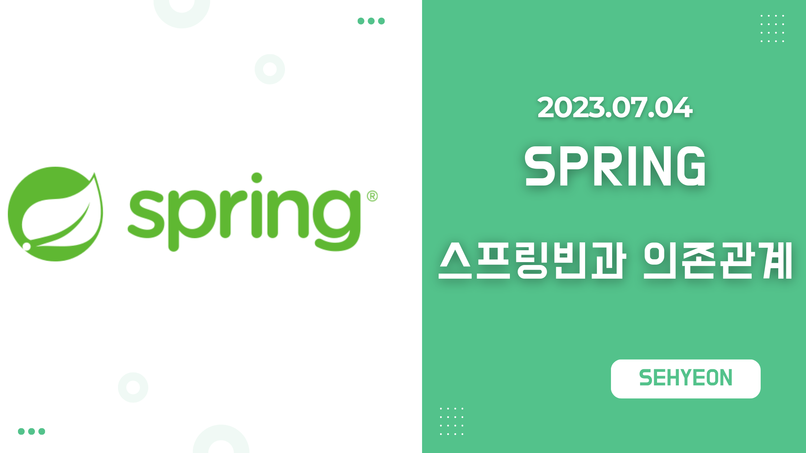
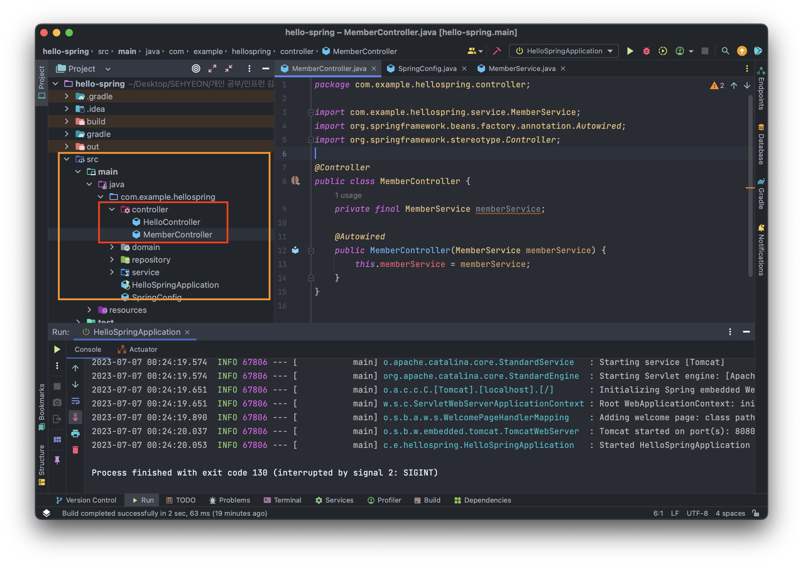
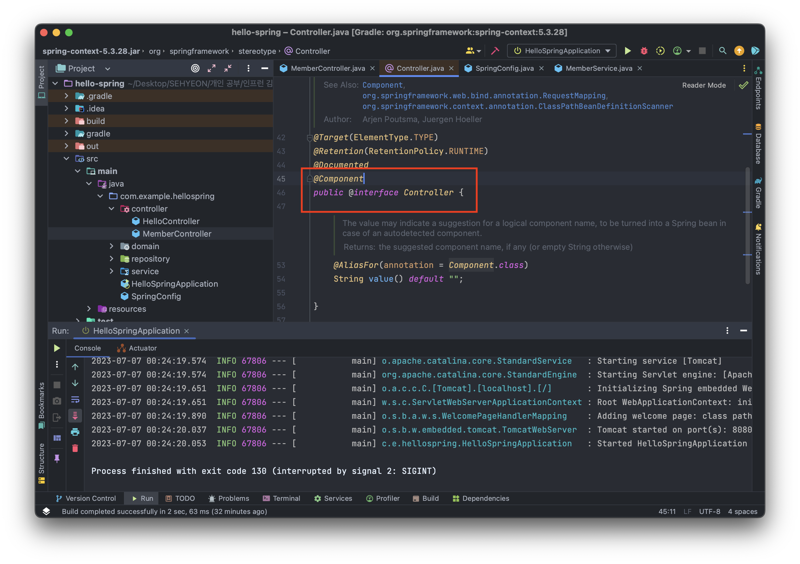
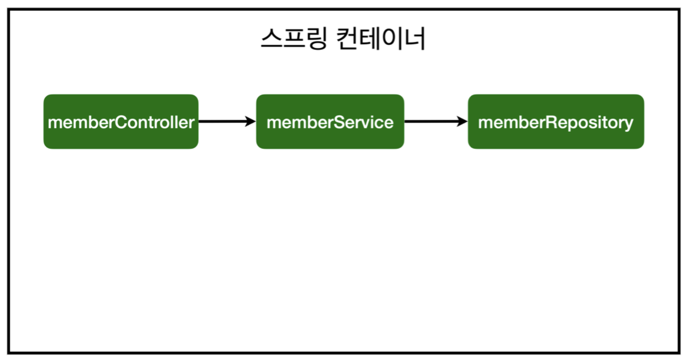
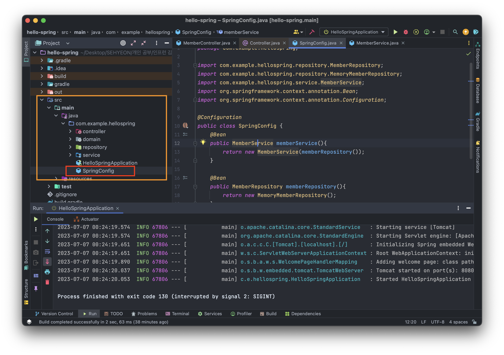

<br>

## 🤜 TIL (2023.07.04)
오늘 학습한 내용은 스프링 컨테이너에서 스프링 빈을 등록하는 두 가지 방법에 대해서 알아보았다. 그리고 그것을 [회원 관리 예제](https://sxhxun.com/04-spring-003/) 에서 만들었던 코드에 화면을 연결하기 위한 컨트롤러를 추가하고, 스프링 빈을 등록하는 것을 실습했다.

## 1. 컴포넌트 스캔과 자동 의존관계 설정
기존에 만들었던 회원 서비스와 리포지토리 그리고 객체에 화면을 붙이고자 한다. 그러기 위해서는 컨트롤러와 뷰 템플릿이 필요하다. <br>
컨트롤러는 회원 서비스를 통해 회원가입을 하고, 회원 서비스를 통해 회원을 조회할 수 있어야한다. 이러한 것을 서로 `의존관계` 가 있다고 표현한다. 즉, 컨트롤러가 서비스에 의존한다! 고 표현한다.
### ❓ 스프링 컨테이너에서 스프링 빈이 관리된다?
`@Controller` 어노테이션이 붙으면 스프링 컨테이너에서 스프링이 작동할 때 컨트롤러 객체를 생성해 가지고 있는다. 이것을 `스프링 컨테이너에서 스프링 빈이 관리된다` 라고 표현한다. <br>
자세한 것은 `MemberController` 를 구현하면서 알아보도록 하자!

## 2. 회원 컨트롤러에 의존관계 추가
### 📌 MemberController 생성

위와 같이 `MemberController.java` 파일을 생성하고, 아래 코드를 작성한다.
```java
package com.example.hellospring.controller;

import com.example.hellospring.service.MemberService;
import org.springframework.beans.factory.annotation.Autowired;
import org.springframework.stereotype.Controller;

@Controller
public class MemberController {
    private final MemberService memberService;

    @Autowired
    public MemberController(MemberService memberService) {
        this.memberService = memberService;
    }
}
```
여기서 스프링에서 객체 생성 방식을 살펴보도록 하자!
### ❓ 일반적인 객체 생성
우리는 객체를 생성할 때 보통 다음과 같이 `new` 를 이용해서 생성한다.
```java
public class MemberController {
    private final MemberService memberService = new MemberService();
    ...
}
```
이렇게 객체를 생성하면 발생하는 문제점이 무엇일까?
- new를 이용해 객체를 생성하면 여러 개의 컨트롤러가 매번 회원 서비스 객체를 생성해서 사용하게 된다. 다시 말해 서비스 객체가 여러개 존재하게 되는 것이다.
- 서비스 객체는 하나로도 충분하기 때문에 회원 서비스 객체를 사용하는 컨트롤러에서 서비스 객체는 동일하도록 수정해야한다.
### ❓ 어떻게 해야할까?
여기서는 `@Autowired` 어노테이션을 활용한다.
```java
public class MemberController {
    private final MemberService memberService;

    @Autowired
    public MemberController(MemberService memberService) {
        this.memberService = memberService;
    }
}
```
- 생성자에 `@Autowired` 어노테이션이 있으면 스프링이 연관된 객체를 스프링 컨테이너에서 찾아서 넣어준다. 이렇게 객체 의존관계를 외부에서 넣어주는 것을 `DI` (Dependency Injection), `의존성 주입` 이라고 한다.
- 이전 테스트에서는 개발자가 직접 주입했고, 여기서는 @Autowired에 의해 스프링이 주입해준다!

## 3. 스프링 빈을 등록하는 2가지 방법
### ⚙️ 실행을 해보자!
지금까지 작성한 코드를 실행하면 다음과 같이 오류가 발생한다.
```shell
Consider defining a bean of type 'hello.hellospring.service.MemberService' in your configuration.
```
- MemberService가 스프링 빈으로 등록되어 있지 않아서 발생하는 오류이다.
- MemberController는 `@Controller` 어노테이션이 있기 때문에 스프링 빈으로 자동 등록된다. 왜 그런지는 잠시 뒤에 설명한다!
### 📌 스프링 빈을 등록하는 2가지 방법
스프링 빈을 등록하는 2가지 방법은 다음과 같다.
- 컴포넌트 스캔과 자동 의존관계 설정
- 자바 코드로 직접 스프링 빈 등록

다음 두 개의 목차에서 이 두가지 방법에 대해 알아보도록 하자!
### ❓ 컴포넌트 스캔의 원리
`@Component` 어노테이션이 있으면 스프링 빈으로 자동 등록된다. <br>
또한, @Component 어노테이션을 포함하고 있는 어노테이션은 스프링 빈으로 자동 등록되는데 다음 3가지 어노테이션을 포함하고 있으면 스프링 빈으로 자동 등록된다.
- @Controller
- @Service
- @Repository

@Controller 어노테이션이 붙은 MemberController가 스프링 빈으로 등록되었던 이유도 이와 같다. 이에 대해 자세히 알고 싶다면, 위 3가지 어노테이션에 `Command + B` 키를 눌러 다음과 같이 확인할 수 있다.


### 💡 회원 서비스와 리포지토리에 스프링 빈 등록하기
그러면 이제 발생했던 오류를 해결해보자! 오류를 해결하려면 회원 서비스와 회원 리포지토리를 스프링 빈으로 등록하도록 어노테이션을 추가해주기만 하면 된다!
- `MemberService.java`
```java
@Service
    public class MemberService {
        private final MemberRepository memberRepository;

        @Autowired
        public MemberService(MemberRepository memberRepository) {
            this.memberRepository = memberRepository;
        }
}
```
- `MemoryMemberRepository.java`
```java
@Repository
    public class MemoryMemberRepository implements MemberRepository {
        ...
    }
```
위 코드를 작성하고 실행하면 문제없이 동작하는 것을 확인할 수 있다. 그리고 이것을 이미지로 표현하면 다음과 같다!

- 여기서 참고로 스프링은 스프링 컨테이너에 스프링 빈을 등록할 때, 기본으로 싱글톤으로 등록한다. (유일하게 하나만 등록해서 공유한다) 따라서 같은 스프링 빈이면 모두 같은 인스턴스이다. 설정을 통해 싱글톤이 아니게 설정할 수 있지만, 특별한 경우를 제외하면 대부분 싱글톤을 사용한다.

## 4. 자바 코드로 직접 스프링 빈 등록하기
지금까지 했던 @Service, @Repository, @Autowired 어노테이션을 제거하고, 직접 스프링 빈을 등록해보자!
### ⚙️ 설정 파일 생성

위와 같이 `hellospring` 패키지 하위에 `SpringConfig.java` 파일을 생성하고 아래와 같이 코드를 작성한다.
```java
package com.example.hellospring;

import com.example.hellospring.repository.MemberRepository;
import com.example.hellospring.repository.MemoryMemberRepository;
import com.example.hellospring.service.MemberService;
import org.springframework.context.annotation.Bean;
import org.springframework.context.annotation.Configuration;

@Configuration
public class SpringConfig {
    @Bean
    public MemberService memberService(){
        return new MemberService(memberRepository());
    }

    @Bean
    public MemberRepository memberRepository(){
        return new MemoryMemberRepository();
    }
}
```
- 스프링 빈을 XML로 설정하는 방법도 있지만, 최근에는 잘 사용하지 않는다고 한다.
### ❓ 의존성을 주입하는 3가지 방법
`DI` 에는 생성자 주입, 필드 주입, setter 주입 이렇게 3가지 방법이 있다. 의존관계가 실행중에 동적으로 변하는 경우는 거의 없으므로 (아예 없다고 한다..) `생성자 주입` 을 권장한다. <br>
각각의 방법을 어떻게 사용하는지 간략하게 살펴본다!
- 생성자 주입
```java
public class MemberController {
    private final MemberService memberService;

    @Autowired
    public MemberController(MemberService memberService){
        this.memberService = memberService;
    }
	...
}
```
- 필드 주입
  - 필드 주입은 스프링이 동작할 때만 컨테이너에 넣어주고 중간에 바꿀 수 있는 방법이 없다.
```java
public class MemberController {
    @Autowired private MemberService memberService;
	...
}
```
- setter 주입
  - setter 주입의 단점은 누군가가 회원 컨트롤러를 호출했을 때 setter가 public 이어야 한다. setter 는 한 번 설정하면 바꿀 이유가 없는데 public 하게 노출이 되는 문제가 있다.
```java
public class MemberController {
    private MemberService memberService;

    @Autowired
    public setMemberService(MemberService memberService){
        this.memberService = memberService;
    }
	...
}
```
<br>

마지막으로 실무에서는 주로 정형화된 컨트롤러, 서비스, 리포지토리 같은 코드는 컴포넌트 스캔 을 사용한다. 그리고 정형화 되지 않거나, 상황에 따라 구현 클래스를 변경해야 하면 설정을 통해 스프링 빈 으로 등록한다. <br><br>
또한, @Autowired 를 통한 DI는 스프링이 관리하는 객체에서만 동작한다. 스프링 빈으로 등록하지 않고 내가 직접 생성한 객체에서는 동작하지 않는다. <br><br>
앞으로 진행될 강의에서는 메모리 리포지토리를 다른 리포지토리로 변경할 예정이므로, 컴포넌트 스캔 방식 대신에 자바 코드로 스프링 빈을 설정한다!

## ✋ 마무리하며
처음 들어보는 내용이었지만, 깊이 있게 다루지 않아 받아들이는데 어려움은 없었다. 그냥 그렇구나~ 하는 정도! 핵심 원리 강의에서 조금 더 깊이 있게 다룬다고 하니 그때가서 조금 더 심도있게 이해해보도록 하겠다!

<br>

> [인프런 스프링 입문 - 코드로 배우는 스프링 부트, 웹 MVC, DB 접근 기술](https://www.inflearn.com/course/%EC%8A%A4%ED%94%84%EB%A7%81-%EC%9E%85%EB%AC%B8-%EC%8A%A4%ED%94%84%EB%A7%81%EB%B6%80%ED%8A%B8) <br>
> > 이 글은 은 인프런 김영한님의 강좌, 스프링 입문 - 코드로 배우는 스프링 부트, 웹 MVC, DB 접근 기술 강좌를 수강 후 작성한 것입니다. <br>
> > 모든 코드와 사진들은 강의에서 가져왔습니다. <br>
> > 문제가 있다면 알려주세요!

```toc

```