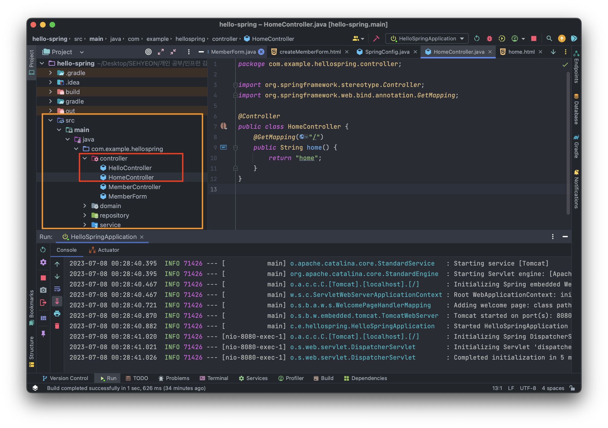
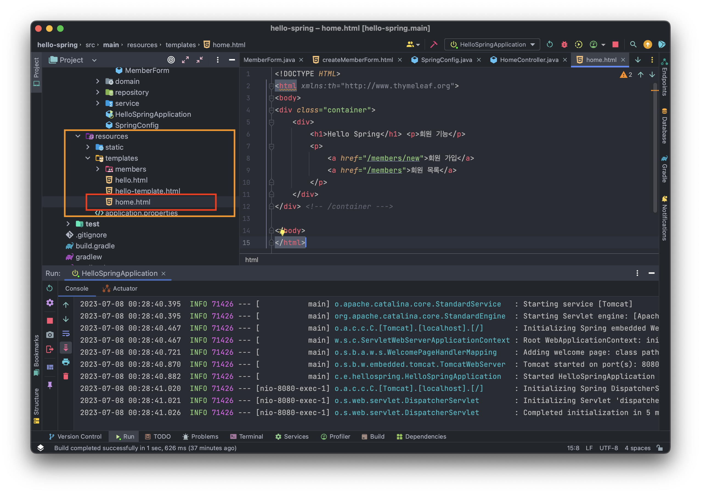
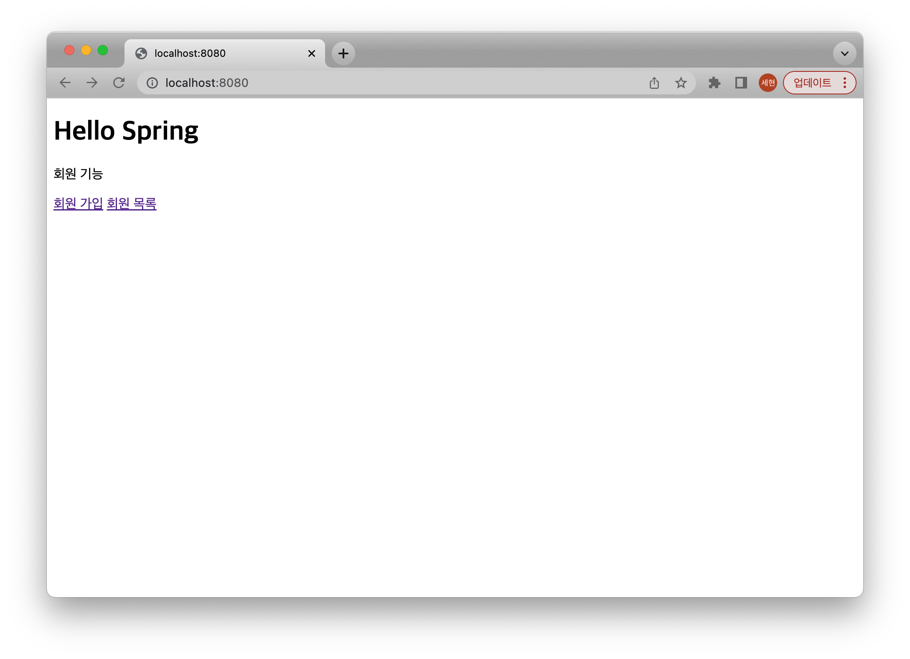
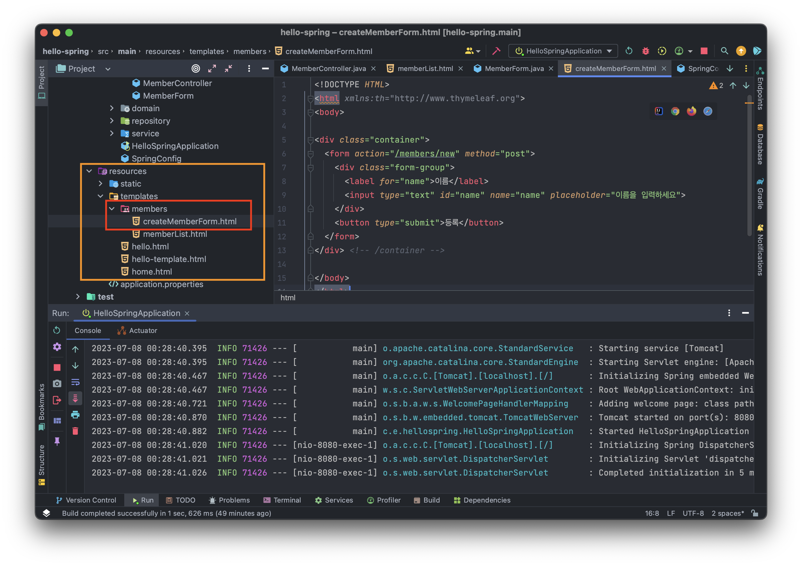
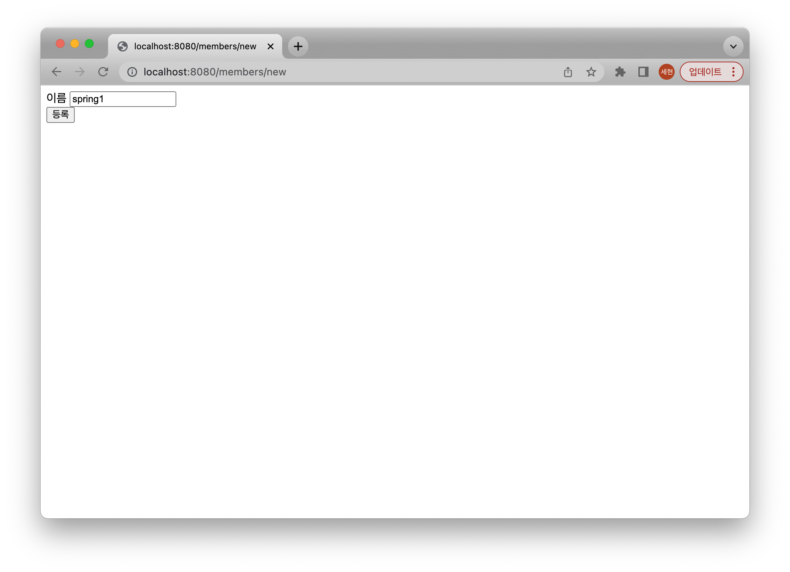
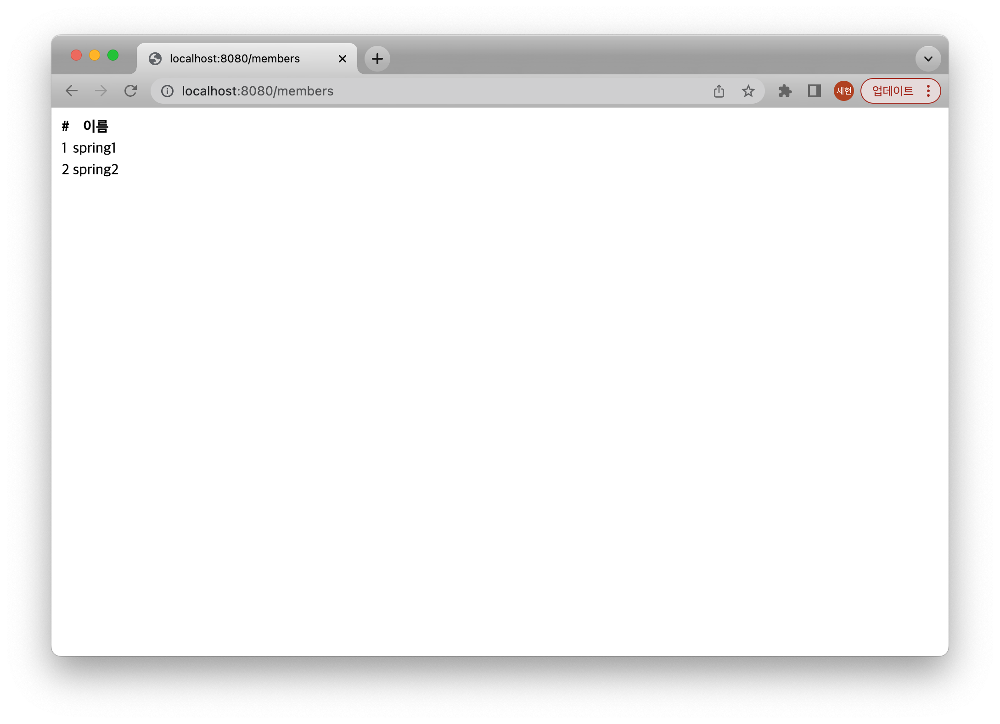

<br>

## 🤜 TIL (2023.07.05)
오늘 학습한 내용은 [회원 관리 예제](https://sxhxun.com/04-spring-003/) 에서 만들었던 회원 가입과 조회 기능을 화면에서 동작할 수 있게 웹 MVC 개발을 하는 것이다. 뷰 템플릿을 만들고, 화면에서 동작 처리를 담당하는 컨트롤러를 만들어 메모리 수준에서 회원을 등록하고 조회하는 기능을 만들어보았다.

## 1. 홈 화면을 추가해보자
### 📌 홈 컨트롤러
먼저 서버를 실행하고 로컬에서 접속 시 회원 등록과 회원 조회 기능으로 이동할 수 있는 링크를 포함하는 홈 화면을 만들어야한다. 그러기 위해서 홈 컨트롤러를 추가해보자!

- 위와 같이 `controller` 패키지 하위에 `HomeController.java` 파일을 생성하고 아래 코드를 작성한다.
```java
package com.example.hellospring.controller;

import org.springframework.stereotype.Controller;
import org.springframework.web.bind.annotation.GetMapping;

@Controller
public class HomeController {
    @GetMapping("/")
    public String home() {
        return "home";
    }
}
```
### 🏠 회원 관리용 홈 화면
위에서 만든 `HomeController` 는 `home` 을 리턴한다. 그러므로 우리는 뷰 템플릿인 `home` 을 만들어주어야한다.

- 위와 같이 `resources/templates` 하위에 `home.html` 파일을 생성하고 아래 코드를 작성한다.
```html
<!DOCTYPE HTML>
<html xmlns:th="http://www.thymeleaf.org">
<body>
<div class="container">
    <div>
        <h1>Hello Spring</h1> 
        <p>회원 기능</p>
        <p>
            <a href="/members/new">회원 가입</a>
            <a href="/members">회원 목록</a>
        </p>
    </div>
</div> <!-- /container --->

</body>
</html>
```
자, 지금까지 한 것들을 실행시켜보자!

이렇게 `localhost:8080` 으로 접속하면 첫 화면에 우리가 올려놓은 웹 화면을 확인할 수 있다. 그런데, 우리는 이전에 `index.html` 파일을 생성해 WelcomePage를 만들었다. 이 페이지도 로컬로 접속 시 처음 뜨는 화면이었는데 이것은 어디갔지? 라고 생각이 들 수 있다.
- `HomeController` 의 GetMapping URL이 `"/"` 이다. 즉, 로컬의 첫 화면이라는 말이다.
- 그러면 우리는 이렇게 생각할 수 있다. ➡️ 컨트롤러가 정적 파일보다 우선순위가 높다!

## 2. 회원 등록하기
홈 화면에서 회원 등록 링크를 클릭하면 `localhost:8080/members/new` 링크로 이동하게 되어있다. 앞으로 회원을 등록할 폼을 만들고, 폼에서 값을 입력해 스프링으로 주면 그것을 담을 객체와 회원 등록하는 기능을 수행하는 컨트롤러를 만들어야한다!
### 📌 회원 등록 폼 컨트롤러
앞에서 만들었던 `MemberController` 파일로 가서, `"/members/new` 링크로 접속했을 때 뷰 템플릿과 연결해줄 코드를 작성해보자!
```java
@Controller
public class MemberController {
    private final MemberService memberService;

    @Autowired
    public MemberController(MemberService memberService) {
        this.memberService = memberService;
    }

    @GetMapping("/members/new")
    public String createForm() {
        return "members/createMemberForm";
    }
}
```
createForm 메소드는 `createMemberForm` 을 return 한다. 이제 이것에 해당하는 뷰 템플릿을 만들어보자!
### 🏠 회원 등록 폼 HTML

`resources/templates` 경로 하위에 아래와 같이 `members` 디렉토리를 생성하고, `createMemberForm.html` 파일을 생성한다. 그리고 아래와 같이 코드를 작성한다. <br>
우리는 회원을 등록하고 조회하는 뷰 템플릿을 만들 예정이다. 따라서 members라는 디렉토리를 만들어 비슷한 기능을 하는 템플릿을 관리하면 편하니까 디렉토리를 생성한 것이다!
```html
<!DOCTYPE HTML>
<html xmlns:th="http://www.thymeleaf.org">
<body>

<div class="container">
  <form action="/members/new" method="post">
    <div class="form-group">
      <label for="name">이름</label>
      <input type="text" id="name" name="name" placeholder="이름을 입력하세요">
    </div>
    <button type="submit">등록</button>
  </form>
</div> <!-- /container -->

</body>
</html>
```
자, 여기까지 만들고 서버를 실행해서 회원 등록 링크를 클릭해보자!

이제 이름을 입력하고 등록 버튼을 클릭할 수 있게 즉, 회원 등록을 할 수 있는 화면이 만들어졌다! <br>
그렇다면, 등록 버튼을 눌렀을 때 실제로 동작을 하도록 회원을 등록할 수 있도록 만들어보자!
### 📌 웹 등록 화면에서 데이터를 전달 받을 폼 객체
먼저 `controller` 패키지 하위에 `MemberForm.java` 파일을 생성하고 아래와 같이 코드를 작성한다.
```java
package com.example.hellospring.controller;

public class MemberForm {
    private String name;

    public String getName() {
        return name;
    }

    public void setName(String name) {
        this.name = name;
    }
}
```
회원 등록 폼에서 이름을 입력하고 등록을 누르면 이름을 입력하는 input 태그의 값이 `key` 는 name으로, `value` 는 사용자의 입력으로 서버로 넘어온다. 이때, MemberForm의 name 변수에 이 값이 할당된다. 그리고 getter와 setter를 정의해서 추후에 나오는 코드에서 이름을 가져오고, 설정하고 할 수 있는 것이다!
### ⚙️ 회원 컨트롤러에서 회원을 실제 등록하는 기능
다시 `MemberController` 파일로 돌아와 이번에는 PostMapping을 통해 입력된 값을 메모리에 추가해보자!
```java
@Controller
public class MemberController {
    private final MemberService memberService;

    @Autowired
    public MemberController(MemberService memberService) {
        this.memberService = memberService;
    }

    @PostMapping("members/new")
    public String create(MemberForm form) {
        Member member = new Member();
        member.setName(form.getName());

        memberService.join(member);

        return "redirect:/";
    }
}
```
위 코드를 보면 사용자의 입력은 HTTP `POST` 방식으로 서버로 넘어오기 때문에 PostMapping 어노테이션을 추가해주고, create 메소드 내에서 Member 객체에 입력받은 이름을 추가해준다. 그리고 회원 서비스의 `join` 함수를 호출해 회원을 등록해주는 것이다! <br>
마지막 return의 리다이렉트는 등록을 진행한 후 다시 홈 화면으로 이동시켜주는 역할을 한다고 보면 된다.

## 3. 회원 조회하기
지금까지 작성한 코드를 실행하면 별다른 문제가 없다면 회원이 메모리에 등록될 것이다. 그러면 등록한 회원을 조회하는 기능을 추가해보자!
### 📌 회원 컨트롤러에서 조회 기능
먼저, 회원 목록 링크를 클릭하면 `"/members"` 링크로 이동하므로, 이 주소를 매핑해준다. 그리고 members 리스트에 등록된 회원들의 정보를 담아 `memberList` 라는 뷰 템플릿으로 반환해준다. 자세한 것은 아래 코드를 보면 된다.
```java
@Controller
public class MemberController {
    private final MemberService memberService;

    @Autowired
    public MemberController(MemberService memberService) {
        this.memberService = memberService;
    }

    @GetMapping("/members")
    public String list(Model model) {
        List<Member> members = memberService.findMembers();
        model.addAttribute("members", members);
        return "members/memberList";
    }
}
```
### 🏠 회원 리스트 HTML
이제 아까 회원 등록 폼 파일을 생성했던 members 디렉토리 하위에 `memberList.html` 파일을 생성하고 아래 코드를 작성한다.
```html
<!DOCTYPE HTML>
<html xmlns:th="http://www.thymeleaf.org">
<body>

<div class="container">
  <div>
    <table>
      <thead>
      <tr>
        <th>#</th>
        <th>이름</th> </tr>
      </thead>
      <tbody>
      <tr th:each="member : ${members}">
        <td th:text="${member.id}"></td>
        <td th:text="${member.name}"></td>
      </tr>
      </tbody>
    </table>
  </div>
</div> <!-- /container -->

</body>
</html>
```
여기서 table 태그를 통해 등록된 회원 정보를 출력한다. `tbody` 태그 아래에 `tr th:each` 라는 문법은 타임리프 엔진의 반복문이라고 보면 된다. 그리고 반환받은 members 리스트를 순회한다. 변수에 접근할 때는 `${변수명}` 을 이용해 접근할 수 있다. <br>

## 4. 최종 결과 확인
이제 지금까지 만든 것을 실행해보자!
### 📍 회원 등록

예시로 spring1 과 spring2 의 이름을 등록을 해본다!
### 📍 회원 목록

회원 목록을 클릭하면 앞에서 등록한 회원 정보가 뜨는 것을 확인할 수 있다.
### ❗️ 메모리 구현체로 구현
우리는 데이터베이스를 지정하지 않고 메모리 구현체로 이 기능을 구현했다. 즉, 회원 등록 시 데이터가 메모리에 저장되게 된다. 그러면 서버를 재시작하면 기존에 등록한 spring1 과 spring2 는 남아있을까?<br>
`남아있지 않다!` 그래서 우리는 데이터를 저장할 DB를 사용하는 것이다! 다음 시간에는 데이터베이스를 설치하고 스프링에서 데이터베이스의 데이터를 접근하는 방식에 대해 다룰 예정이다. 

## ✋ 마무리하며
앞에서 만들었던 회원 관리 예제를 화면을 만들어 확인하면서 조금 더 스프링에서 동작들이 어떻게 이루어지는 지 알 수 있었다. 이번 학기 팀 프로젝트로 유사한 것을 nodejs로 개발했었는데 이것과 비교하면서 스프링은 어떻게 동작하는지 알아가는 과정이 재밌다! 그래서 더 동기부여가 생기는 느낌?

<br>

> [인프런 스프링 입문 - 코드로 배우는 스프링 부트, 웹 MVC, DB 접근 기술](https://www.inflearn.com/course/%EC%8A%A4%ED%94%84%EB%A7%81-%EC%9E%85%EB%AC%B8-%EC%8A%A4%ED%94%84%EB%A7%81%EB%B6%80%ED%8A%B8) <br>
> > 이 글은 은 인프런 김영한님의 강좌, 스프링 입문 - 코드로 배우는 스프링 부트, 웹 MVC, DB 접근 기술 강좌를 수강 후 작성한 것입니다. <br>
> > 모든 코드와 사진들은 강의에서 가져왔습니다. <br>
> > 문제가 있다면 알려주세요!

```toc

```