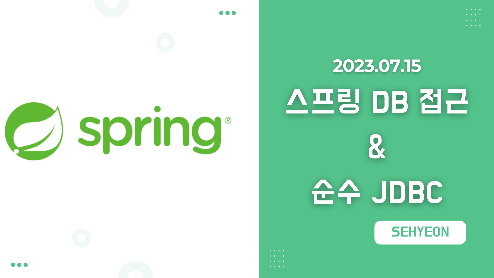
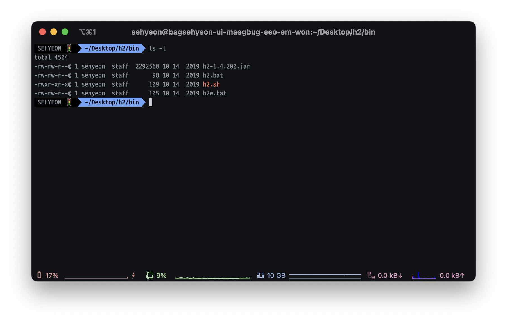
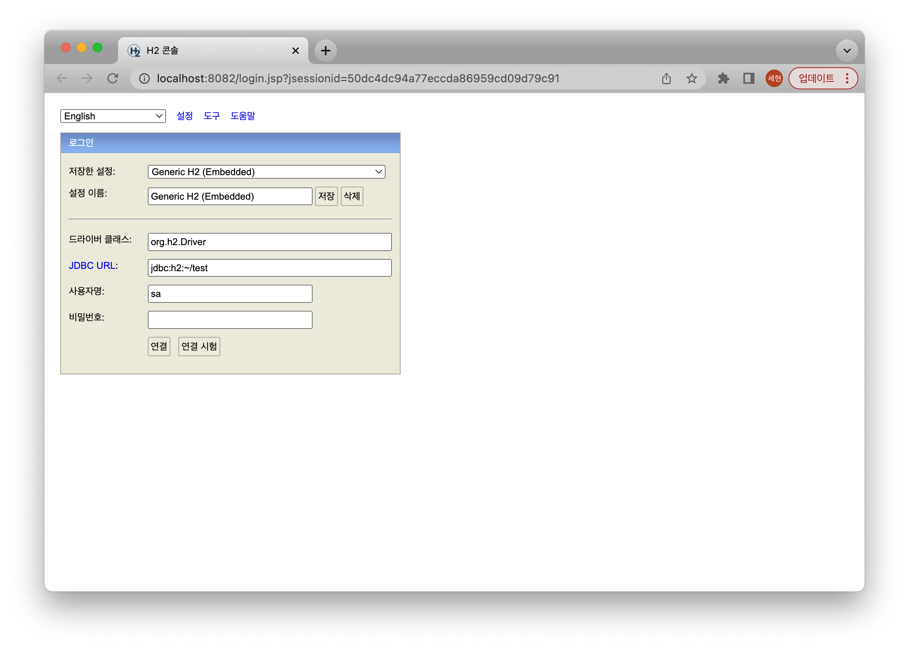
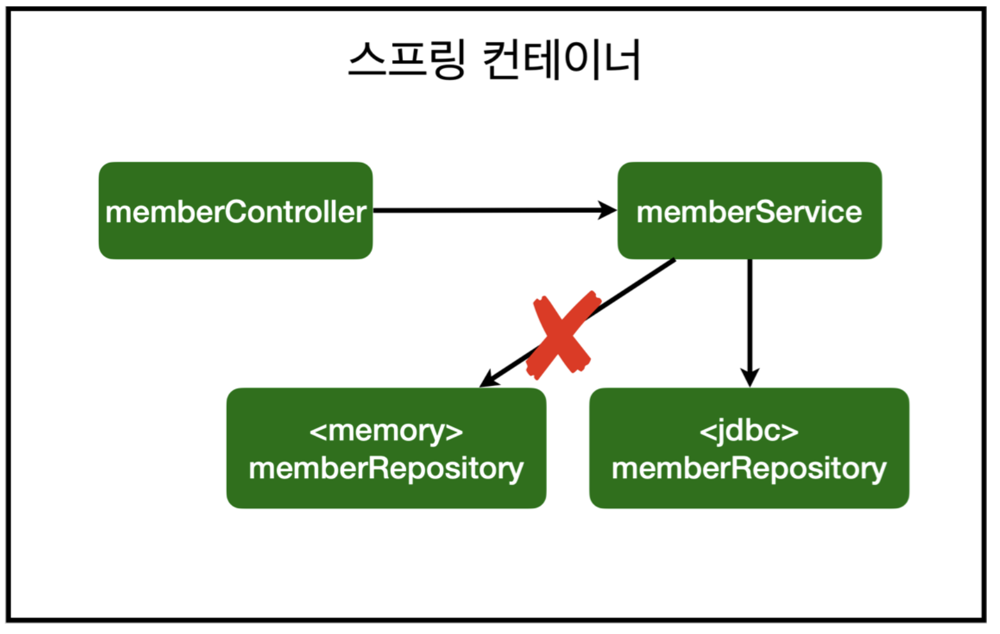

<br>

## 🤜 TIL (2023.07.15)
오늘 학습한 내용은 메모리 기반으로 개발했던 [회원관리예제](https://sxhxun.com/04-spring-003/) 를 `H2 데이터베이스` 에 연결해보는 것이다. 스프링 컨테이너에서 어떻게 데이터베이스에 접근하는지 학습했고, 2개의 포스팅을 통해 알아볼 예정이다. 여기서는 H2 데이터베이스를 설치하고 순수 JDBC에 대해서 알아본다.

## 1. H2 데이터베이스 설치하기
### ❓ H2 데이터베이스?
H2 데이터베이스는 개발이나 테스트 용도로 가볍고 편리한 데이터베이스이다. 웹 화면을 제공하기 때문에 데이터베이스를 설치하고 웹에서 데이터베이스를 조회할 수 있어 편리하게 데이터베이스를 사용할 수 있어 이 강의에서는 H2 데이터베이스를 사용한다. 아래 링크를 클릭하면 설치할 수 있다. <br><br>
[H2 데이터베이스 설치하기](https://www.h2database.com/html/download-archive.html) <br><br>

### ⚙️ 설치하기
버전은 `1.4.200` 버전을 선택해 설치해주자! 최신 버전을 설치할 경우 일부 기능이 정상 동작하지 않을 수 있다고 한다!



압축을 해제하고 해당 폴더를 터미널로 열어 권한을 설정한다. `chmod 755` 명령어를 이용해 위의 사진과 같이 `h2.sh` 파일에 권한을 설정하면 된다! <br>
권한을 주었다면 아래 명령어를 이용해 데이터베이스를 실행할 수 있다.
```shell
$ ./h2.sh
```

### ⚙️ 데이터베이스 파일 생성 방법



H2 데이터베이스 실행까지 완료했다면 이런 화면을 볼 수 있을 것이다. 이 상태 그대로 연결을 시도하고, 잘 되었다면 `home` 디렉토리에 `test.mv.db` 파일이 생성되었을 것이다. 확인하기 위해 터미널에서 아래와 같이 명령어를 실행해보자!

```shell
$ cd ~
$ ls
```

`test.mb.db` 파일이 생성되어있다면, 다음 접속 부터는 `JDBC URL` 에 `jdbc:h2:tcp://localhost/~/test` 을 입력하고 접속하면 된다!

### 🛢️ 테이블 생성
이제 메모리 기반으로 개발했던 데이터를 저장하기 위한 테이블을 아래와 같이 생성해주면 데이터베이스 설정과 관련된 것은 끝이 난다!

```sql
create table member
(
    id   bigint generated by default as identity,
    name varchar(255),
    primary key (id)
);
```

## 2. 순수 JDBC
지금부터는 스프링에서 DB를 접근할 수 있도록 구현을 한다. 지금 소개하는 것과 같이 JDBC API로 직접 코딩하는 것은 약 20년 전 이야기라고 한다. 그러므로 간단히 참고한 하고 넘어가도록 하겠다.

### ⚙️ 환경 설정
먼저 아래와 같이 `build.gradle` 파일에 JDBC와 H2 데이터베이스 관련 라이브러리를 추가한다.

```java
implementation 'org.springframework.boot:spring-boot-starter-jdbc'
runtimeOnly 'com.h2database:h2'
```
다음으로, `resources/application.properties` 파일에 스프링부트 데이터베이스 연결 설정을 추가한다.

```java
spring.datasource.url=jdbc:h2:tcp://localhost/~/test
spring.datasource.driver-class-name=org.h2.Driver
spring.datasource.username=sa
```
❗️ 이때, 스프링부트 2.4 부터는 `spring.datasource.username=sa` 를 꼭 추가해야한다. 그렇지 않으면 `Wrong user name or password` 에러가 발생한다! 마지막에 공백이 들어가도 같은 오류가 발생하니 공백을 주의하자! 

### 🔥 JDBC 회원 리포지토리 구현
`repository` 폴더 아래에 `JdbcMemberRepository.java` 파일을 생성해 아래 코드를 작성한다.

<details>
<summary>JdbcMemberRepository.java</summary>

```java
package com.example.hellospring.repository;

import com.example.hellospring.domain.Member;
import org.springframework.jdbc.datasource.DataSourceUtils;

import javax.sql.DataSource;
import java.sql.*;
import java.util.ArrayList;
import java.util.List;
import java.util.Optional;

public class JdbcMemberRepository implements MemberRepository{
    private final DataSource dataSource;

    public JdbcMemberRepository(DataSource dataSource) {
        this.dataSource = dataSource;
    }

    @Override
    public Member save(Member member) {
        String sql = "insert into member(name) values(?)";

        Connection conn = null;
        PreparedStatement pstmt = null;
        // 결과를 받는 용도
        ResultSet rs = null;

        try {
            conn = getConnection();
            pstmt = conn.prepareStatement(sql, Statement.RETURN_GENERATED_KEYS);

            pstmt.setString(1, member.getName());

            pstmt.executeUpdate();
            rs = pstmt.getGeneratedKeys();

            if (rs.next()) {
                member.setId(rs.getLong(1));
            } else {
                throw new SQLException("id 조회 실패");
            }
            return member;
        } catch (Exception e) {
            throw new IllegalStateException(e);
        } finally {
            close(conn, pstmt, rs);
        }
    }

    @Override
    public Optional<Member> findById(Long id) {
        String sql = "select * from member where id = ?";

        Connection conn = null;
        PreparedStatement pstmt = null;
        ResultSet rs = null;

        try{
            conn = getConnection();
            pstmt = conn.prepareStatement(sql);
            pstmt.setLong(1, id);

            rs = pstmt.executeQuery();

            if(rs.next()) {
                Member member = new Member();
                member.setId(rs.getLong("id"));
                member.setName(rs.getString("name"));
                return Optional.of(member);
            } else {
                return Optional.empty();
            }

        } catch (Exception e) {
            throw new IllegalStateException(e);
        } finally {
            close(conn, pstmt, rs);
        }
    }

    @Override
    public List<Member> findAll() {
        String sql = "select * from member";

        Connection conn = null;
        PreparedStatement pstmt = null;
        ResultSet rs = null;

        try {
            conn = getConnection();
            pstmt = conn.prepareStatement(sql);

            rs = pstmt.executeQuery();

            List<Member> members = new ArrayList<>();
            while(rs.next()) {
                Member member = new Member();
                member.setId(rs.getLong("id"));
                member.setName(rs.getString("name"));
                members.add(member);
            }

            return members;
        } catch (Exception e) {
            throw new IllegalStateException(e);
        } finally {
            close(conn, pstmt, rs);
        }
    }

    @Override
    public Optional<Member> findByName(String name) {
        String sql = "select * from member where name = ?";

        Connection conn = null;
        PreparedStatement pstmt = null;
        ResultSet rs = null;

        try {
            conn = getConnection();
            pstmt = conn.prepareStatement(sql);
            pstmt.setString(1, name);

            rs = pstmt.executeQuery();

            if(rs.next()) {
                Member member = new Member();
                member.setId(rs.getLong("id"));
                member.setName(rs.getString("name"));
                return Optional.of(member);
            }
            return Optional.empty();
        } catch (Exception e) {
            throw new IllegalStateException(e);
        } finally {
            close(conn, pstmt, rs);
        }
    }

    private Connection getConnection() {
        return DataSourceUtils.getConnection(dataSource);
    }

    private void close(Connection conn, PreparedStatement pstmt, ResultSet rs){
        try {
            if(rs != null) {
                rs.close();
            }
        } catch (SQLException e){
            e.printStackTrace();
        }
        try {
            if(pstmt != null){
                pstmt.close();
            }
        } catch (SQLException e){
            e.printStackTrace();
        }
        try {
            if(conn != null){
                close(conn);
            }
        } catch (SQLException e){
            e.printStackTrace();
        }
    }

    private void close(Connection conn) throws SQLException {
        DataSourceUtils.releaseConnection(conn, dataSource);
    }
}
```
</details>

> 코드의 길이가 길지만 각각 기능별 코드의 흐름은 대략적으로 다음과 같다.
> 1. 먼저 DataSource를 이용해 커넥션을 획득한다.
> 2. 데이터베이스에 쿼리문을 질의 후 저장, 조회 등과 같은 기능을 수행한다.
> 3. 커넥션을 반납한다.

다시 말하지만, 이런 방식은 20년 전 이야기라고 하니 간략하게만 이렇구나~ 하고 알아두도록 하자!

### 🚀 스프링 설정 변경
`SpringConfig.java` 파일에서 아래와 같이 기존 메모리 기반 리포지토리를 주석처리하고, 방금 구현한 JDBC 기반 리포지토리를 추가한다.

```java
package com.example.hellospring;

import com.example.hellospring.repository.JdbcMemberRepository;
import com.example.hellospring.repository.MemberRepository;
import com.example.hellospring.repository.MemoryMemberRepository;
import com.example.hellospring.service.MemberService;
import org.springframework.beans.factory.annotation.Autowired;
import org.springframework.context.annotation.Bean;
import org.springframework.context.annotation.Configuration;

import javax.sql.DataSource;

@Configuration
public class SpringConfig {
    private final DataSource dataSource;

    @Autowired
    public SpringConfig(DataSource dataSource) {
        this.dataSource = dataSource;
    }

    @Bean
    public MemberService memberService(){
        return new MemberService(memberRepository());
    }

    @Bean
    public MemberRepository memberRepository(){
        // return new MemoryMemberRepository();
        return new JdbcMemberRepository(dataSource);
    }
}
```
📌 여기서 객체지향의 장점이 나타난다. 



우리는 기존 `MemberRepository` 라는 인터페이스를 메모리 기반으로 확장해 사용했었다. 그리고 지금은 JDBC 기반으로 구현해 사용하는데, 이런 어셈블리 코드만 수정을 했을 뿐 다른 코드는 수정하지 않고 부품만 교체하는 식으로 개발을 편리하게 할 수 있다는 것이다. 이것을 개방-폐쇄 원칙 (OCP) 이라고 한다! <br>
이제 서버를 실행하고 회원을 추가하고 조회하고, 그리고 서버를 재시작하고 추가 및 조회를 해도 데이터가 사라지지 않고 데이터베이스에 저장되는 모습을 확인할 수 있다!

## 3. 스프링 통합 테스트
이제 스프링 컨테이너와 DB까지 연결한 통합 테스트를 개발해보자! <br>
아래와 같이 `MemberServiceIntegrationTest.java` 파일을 생성하고 코드를 작성한다.

```java
package com.example.hellospring.service;

import com.example.hellospring.domain.Member;
import com.example.hellospring.repository.MemberRepository;
import org.junit.jupiter.api.Test;
import org.springframework.beans.factory.annotation.Autowired;
import org.springframework.boot.test.context.SpringBootTest;
import org.springframework.transaction.annotation.Transactional;

import static org.assertj.core.api.Assertions.assertThat;
import static org.junit.jupiter.api.Assertions.assertThrows;

@SpringBootTest
@Transactional
class MemberServiceIntegrationTest {
    @Autowired MemberService memberService;
    @Autowired MemberRepository memberRepository;

    @Test
    void join() {
        // given
        Member member = new Member();
        member.setName("spring");

        // when
        Long saveId = memberService.join(member);

        // then
        Member findMember = memberService.findOne(saveId).get();
        assertThat(member.getName()).isEqualTo(findMember.getName());
    }

    @Test
    public void 중복_회원_예외(){
        //given
        Member member1 = new Member();
        member1.setName("spring");

        Member member2 = new Member();
        member2.setName("spring");

        //when
        memberService.join(member1);
        IllegalStateException e = assertThrows(IllegalStateException.class, () -> memberService.join(member2));

        //then
        assertThat(e.getMessage()).isEqualTo("이미 존재하는 회원입니다.");
    }
}
```
여기서 중요한 몇가지를 살펴보도록 하자!
### ✨ @SpringBootTest
스프링 컨테이너와 테스트를 함께 실행한다.
### ✨ @Transactional
테스트 케이스에 이 어노테이션이 있으면, 테스트 시작 전에 트랜잭션을 생성하고, 테스트 완료 후에 항상 `롤백` 한다. 이렇게 하면 DB에 데이터가 남지 않으므로 다음 테스트에 영향을 주지 않는다!

### ✋ 마무리하며
이렇게 JDBC를 이용해 데이터베이스에 접근하는 방법을 알아보았고, 통합 테스트까지 진행해보았다. 여기서 한 가지 의문을 제기할 수 있다. 여기서 [메모리 기반 통합테스트](https://sxhxun.com/04-spring-003/#5-%ED%9A%8C%EC%9B%90-%EC%84%9C%EB%B9%84%EC%8A%A4-%ED%85%8C%EC%8A%A4%ED%8A%B8-%EC%BC%80%EC%9D%B4%EC%8A%A4-%EA%B0%9C%EB%B0%9C) 를 개발했었던 적이 있다. 이제 이 테스트 즉, 단위 테스트는 필요가 없을까에 대한 의문이다. 강의에서는 순수한 단위 테스트가 훨신 좋은 테스트일 확률이 높다고 한다. DB를 연결해서 구현한 테스트보다 순수한 단위 테스트가 여러 테스트를 한 번에 실행할 때 더욱 극명한 속도 차이를 보인다고 한다. <br>
다음 포스팅에서는 이것을 더욱 간단하게 만들어주는 Jdbc Template과 JPA, 그리고 스프링 데이터 JPA에 대해서 알아볼 예정이다!

<br>

> [인프런 스프링 입문 - 코드로 배우는 스프링 부트, 웹 MVC, DB 접근 기술](https://www.inflearn.com/course/%EC%8A%A4%ED%94%84%EB%A7%81-%EC%9E%85%EB%AC%B8-%EC%8A%A4%ED%94%84%EB%A7%81%EB%B6%80%ED%8A%B8) <br>
> > 이 글은 은 인프런 김영한님의 강좌, 스프링 입문 - 코드로 배우는 스프링 부트, 웹 MVC, DB 접근 기술 강좌를 수강 후 작성한 것입니다. <br>
> > 모든 코드와 사진들은 강의에서 가져왔습니다. <br>
> > 문제가 있다면 알려주세요!

```toc

```