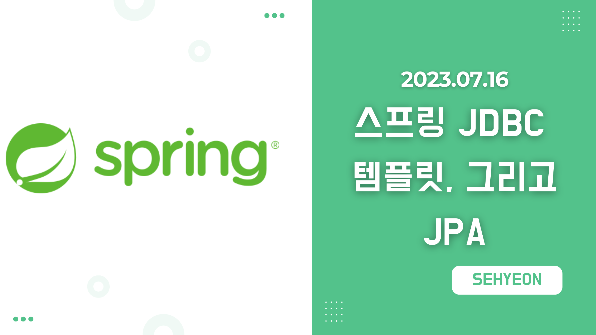
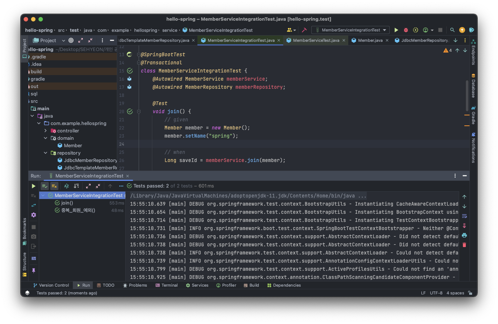
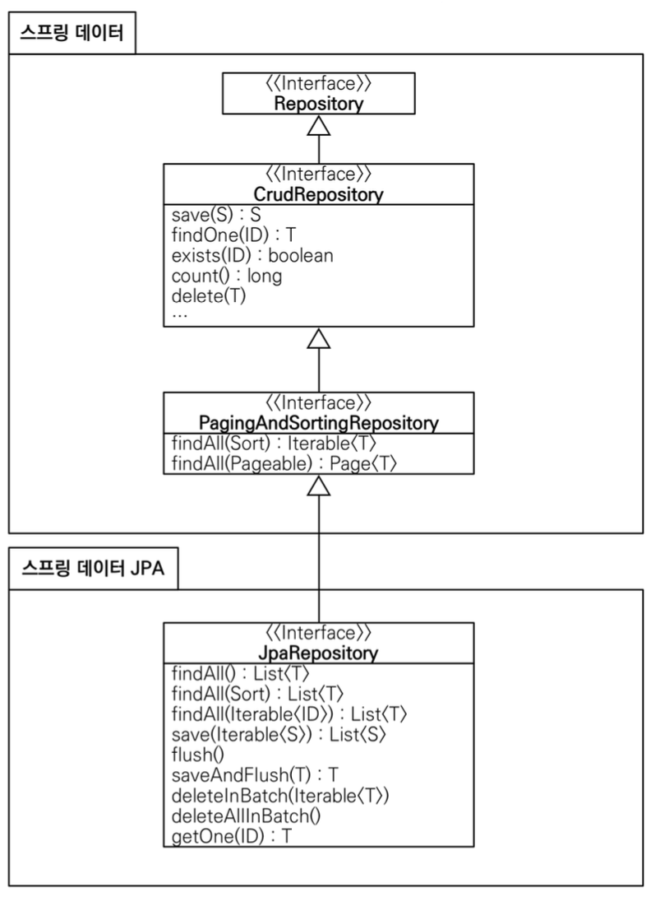

<br>

## 🤜 TIL (2023.07.16)
오늘 학습한 내용은 [스프링 DB 접근기술](https://sxhxun.com/10-spring-006/) 에서 순수하게 JDBC를 이용해 데이터베이스를 연결해보았다면, 이번에는 JDBC Template과 JPA를 이용해 다른 방식으로 DB에 접근하는 방법을 알아보았다. 오늘 배운 것들을 활용하면 반복적인 코드를 제거하고 SQL 문도 작성하지 않아도 되는 장점이 있다고 한다!

## 1. Jdbc Template
먼저, Jdbc Template 라이브러리를 이용해 이전에 개발했던 것과 동일한 기능을 만들어본다. 환경설정은 순수 Jdbc와 동일하게 설정하면 된다. <br>
`Jdbc Template` 과 `MyBatis` 와 같은 라이브러리는 Jdbc API에서 작성했던 반복적인 코드 대부분을 제거해준다. `하지만 SQL 문은 직접 작성해야한다!`
### 🔥 Jdbc Template 회원 리포지토리
`repository` 아래에 `JdbcTemplateMemberRepository.java` 파일을 생성하고 아래와 같이 코드를 작성한다.
```java
package com.example.hellospring.repository;

import com.example.hellospring.domain.Member;
import org.springframework.jdbc.core.JdbcTemplate;
import org.springframework.jdbc.core.RowMapper;
import org.springframework.jdbc.core.namedparam.MapSqlParameterSource;
import org.springframework.jdbc.core.simple.SimpleJdbcInsert;

import javax.sql.DataSource;
import java.util.*;

public class JdbcTemplateMemberRepository implements MemberRepository {
    private final JdbcTemplate jdbcTemplate;

    // 생성자가 1개일 때는 @Autowired 생략 가능!
    public JdbcTemplateMemberRepository(DataSource dataSource) {
        jdbcTemplate = new JdbcTemplate(dataSource);
    }

    @Override
    public Member save(Member member) {
        SimpleJdbcInsert jdbcInsert = new SimpleJdbcInsert(jdbcTemplate);
        jdbcInsert.withTableName("member").usingGeneratedKeyColumns("id");

        Map<String, Object> parameters = new HashMap<>();
        parameters.put("name", member.getName());

        Number key = jdbcInsert.executeAndReturnKey(new MapSqlParameterSource(parameters));
        member.setId(key.longValue());
        return member;
    }

    @Override
    public Optional<Member> findById(Long id) {
        List<Member> result = jdbcTemplate.query("select * from member where id = ?", memberRowMapper(), id);
        return result.stream().findAny();
    }

    @Override
    public Optional<Member> findByName(String name) {
        List<Member> result = jdbcTemplate.query("select * from member where name = ?", memberRowMapper(), name);
        return result.stream().findAny();
    }

    @Override
    public List<Member> findAll() {
        return jdbcTemplate.query("select * from member", memberRowMapper());
    }

    private RowMapper<Member> memberRowMapper() {
        return (rs, rowNum) -> {
            Member member = new Member();
            member.setId(rs.getLong("id"));
            member.setName(rs.getString("name"));
            return member;
        };
    }
}
```

### 🚀 스프링 설정 변경
`SpringConfig` 파일의 설정을 JdbcTemplate 리포지토리를 사용하도록 아래와 같이 변경한다. 이것은 이전 포스팅에서 다루었던 것처럼 어셈블리 코드를 수정하는 것이다!
```java
package com.example.hellospring;

import com.example.hellospring.repository.JdbcMemberRepository;
import com.example.hellospring.repository.JdbcTemplateMemberRepository;
import com.example.hellospring.repository.MemberRepository;
import com.example.hellospring.repository.MemoryMemberRepository;
import com.example.hellospring.service.MemberService;
import org.springframework.beans.factory.annotation.Autowired;
import org.springframework.context.annotation.Bean;
import org.springframework.context.annotation.Configuration;

import javax.sql.DataSource;

@Configuration
public class SpringConfig {
    private final DataSource dataSource;

    @Autowired
    public SpringConfig(DataSource dataSource) {
        this.dataSource = dataSource;
    }

    @Bean
    public MemberService memberService(){
        return new MemberService(memberRepository());
    }

    @Bean
    public MemberRepository memberRepository(){
        // return new MemoryMemberRepository();
        // return new JdbcMemberRepository(dataSource);
        return new JdbcTemplateMemberRepository(dataSource);
    }
}
```
이제 이렇게 하고 직접 테스트를 해봐도 되고, [통합 테스트](https://sxhxun.com/10-spring-006/#3-%EC%8A%A4%ED%94%84%EB%A7%81-%ED%86%B5%ED%95%A9-%ED%85%8C%EC%8A%A4%ED%8A%B8) 이전 포스팅에서 만들었던 통합 테스트 코드를 재사용해 테스트해보면 된다!



테스트 실행 결과 정상적으로 동작하는 것을 확인할 수 있다!

## 2. JPA
다음으로 `JPA` 에 대해서 알아보겠다. JPA는 기존의 반복적인 코드는 물론이고, 기본적인 `SQL문` 도 JPA가 직접 만들어서 실행해준다. JPA를 사용하면, SQL과 데이터 중심의 설게에서 `객체 중심의 설계` 로 패러다임을 전환할 수 있는 장점이 있으며 개발 생산성을 크게 높일 수 있다!
### ⚙️ 라이브러리 추가
`build.gradle` 파일에 JPA와 H2 데이터베이스 관련 라이브러리를 추가한다. 기존에 H2 데이터베이스 라이브러리를 추가했기 때문에 아래와 같이 JPA 라이브러리만 추가하면 된다.
```java
implementation 'org.springframework.boot:spring-boot-starter-data-jpa'
```
여기서 `spring-boot-starter-data-jpa` 는 내부에 Jdbc 관련 라이브러리를 포함한다. 따라서 기존에 추가했던 Jdbc 라이브러리는 제거해도 된다.

### ⚙️ 스프링 부트에 JPA 설정 추가
`resources/application.properties` 파일에 아래와 같이 JPA 설정을 추가한다.
```java
spring.jpa.show-sql=true
spring.jpa.hibernate.ddl-auto=none
```
설정과 관련해서 간략히 살펴보자면 다음과 같다.
- show-sql : JPA가 생성하는 SQL을 콘솔 창에 출력한다.
- ddl-auto : JPA는 테이블을 자동으로 생성하는 기능을 제공하는데, `none` 을 옵션으로 사용하면 해당 기능을 사용하지 않는다. `create` 옵션을 사용할 경우 엔티티 정보를 바탕으로 테이블도 직접 생성해준다!

### 🚀 JPA 엔티티 매핑
JPA는 객체와 관계형 데이터베이스를 매핑한다. 이것을 `ORM` 이라고 한다. 따라서, Member 객체에서 JPA가 매핑할 수 있도록 몇가지 어노테이션을 아래와 같이 추가해주어야한다. <br>
먼저, `domain/member.java` 파일에서 아래와 같이 코드를 수정해준다.
```java
package com.example.hellospring.domain;

import javax.persistence.*;

@Entity
public class Member {

    @Id @GeneratedValue(strategy = GenerationType.IDENTITY)
    private Long id;
    private String name;

    public Long getId() {
        return id;
    }

    public void setId(Long id) {
        this.id = id;
    }

    public String getName() {
        return name;
    }

    public void setName(String name) {
        this.name = name;
    }
}
```
3가지 어노테이션을 추가했는데 이것에 대해 살펴보도록 하자.
- @Entity : 앞서 말한 것처럼 JPA는 객체와 데이터베이스를 매핑한다. 따라서 Member 객체에 `@Entity` 어노테이션을 추가해주어야 한다.
- @Id : 객체를 매핑했으면, PK (Primary Key) 를 매핑해주어야 한다. 우리가 만들고 사용하는 Member 객체에서 `id` 가 PK 이므로, `@Id` 어노테이션을 추가해준다.
- @GeneratedValue : PK인 id는 회원가입을 할 때마다 자동으로 증가하는데 이것을 `Identity` 라고 한다.

### 🔥 JPA 회원 리포지토리
`repository` 아래에 `JpaMemberRepository.java` 파일을 생성하고 아래와 같이 코드를 작성한다.
```java
package com.example.hellospring.repository;

import com.example.hellospring.domain.Member;

import javax.persistence.EntityManager;
import java.util.List;
import java.util.Optional;

public class JpaMemberRepository implements MemberRepository{

    private final EntityManager em;

    public JpaMemberRepository(EntityManager em) {
        this.em = em;
    }

    @Override
    public Member save(Member member) {
        em.persist(member);
        return member;
    }

    @Override
    public Optional<Member> findById(Long id) {
        Member member = em.find(Member.class, id);
        return Optional.ofNullable(member);
    }

    @Override
    public Optional<Member> findByName(String name) {
        List<Member> result = em.createQuery("select m from Member m where m.name = :name", Member.class)
                .setParameter("name", name)
                .getResultList();
        return result.stream().findAny();
    }

    @Override
    public List<Member> findAll() {
        return em.createQuery("select m from Member m", Member.class)
                .getResultList();
    }
}
```
여기서는 `Entity Manager` 를 통해 `save` 와 `findById` 와 같은 이미 제공하는 메소드를 활용하면 SQL 문을 직접 작성하지 않아도 된다.

### 🚀 서비스 계층에 트랜잭션 추가
`service/MemberService.java` 파일로 이동해 아래와 같이 `@Transaction` 어노테이션을 추가한다.
```java
@Transactional
public class MemberService {
    ...
}
```
이렇게 되면 스프링은 해당 클래스의 메소드를 실행할 때 `트랜잭션` 을 시작하고, 메소드가 정상 종료되면 트랜잭션을 커밋한다. 만약 런타임 에러가 발생하면 롤백한다. 여기서 중요한 것은 **JPA를 통한 모든 데이터 변경은 트랜잭션 안에서 실행해야 한다** 는 것이다!

### 🚀 스프링 설정 변경
마찬가지로, `SpringConfig` 파일에서 `JpaMembmerRepository` 를 사용할 수 있도록 코드를 변경한다. 이때, `EntityManager` 를 사용해야 하므로 다음과 같이 코드를 변경하면 된다.
```java
package com.example.hellospring;

import com.example.hellospring.repository.*;
import com.example.hellospring.service.MemberService;
import org.springframework.beans.factory.annotation.Autowired;
import org.springframework.context.annotation.Bean;
import org.springframework.context.annotation.Configuration;

import javax.persistence.EntityManager;
import javax.sql.DataSource;

@Configuration
public class SpringConfig {

    private EntityManager em;

    @Autowired
    public SpringConfig(EntityManager em) {
        this.em = em;
    }

    @Bean
    public MemberService memberService(){
        return new MemberService(memberRepository());
    }

    @Bean
    public MemberRepository memberRepository(){
        // return new MemoryMemberRepository();
        // return new JdbcMemberRepository(dataSource);
        // return new JdbcTemplateMemberRepository(dataSource);
        return new JpaMemberRepository(em);
    }
}
```
역시, 통합 테스트를 통해 테스트해보면 정상적으로 작동하는 것을 확인할 수 있다! 확실히 이전보다 중복되는 코드가 감소하고 코드 작성이 편해진 것을 알 수 있다!

## 3. 스프링 데이터 JPA
지금까지 만들었던 JPA만 사용해도 개발 생산성이 많이 증가하고, 개발해야할 코드도 확연히 줄어든다. 여기에 스프링 데이터 JPA를 사용하면, 기존의 한계를 넘어 리포지토리에 구현 클래스 없이 인터페이스 만으로 개발을 완료할 수 있다. <br>
여기에 더불어 CRUD 기능도 스프링 데이터 JPA가 모두 제공하기 때문에 스프링 부트와 JPA라는 기반 위에 스프링 데이터 JPA라는 프레임워크를 더하면 개발이 간단해지고, 단순 반복이라 생각했던 개발 코드들도 확연히 줄어든다! 이로 인해 **개발자는 비즈니스 로직을 개발하는데 집중할 수 있다!**  <br>
하지만, 스프링 데이터 JPA는 JPA를 편리하게 사용하도록 도와주는 기술이므로 JPA를 먼저 학습한 후 스프링 데이터 JPA를 학습해야한다고 한다.

### 🔥 스프링 데이터 JPA 회원 리포지토리
`repository` 아래에 `SpringDataJpaMemberRepository.java` 파일을 생성하고 아래와 같이 코드를 작성한다.
```java
package com.example.hellospring.repository;

import com.example.hellospring.domain.Member;
import org.springframework.data.jpa.repository.JpaRepository;

import java.util.Optional;

public interface SpringDataJpaMemberRepository extends JpaRepository<Member, Long>, MemberRepository {
    @Override
    Optional<Member> findByName(String name);
}
```
이전과 다른 점은 구현 클래스 없이 `인터페이스` 만으로 코드를 작성했다는 점이다. 이것이 스프링 데이터 JPA의 가장 큰 장점이라 할 수 있다. 또한, `findByName` 메소드는 따로 오버라이드 해주었는데, 이것은 잠시 뒤에 설명하도록 한다.

### 🚀 스프링 설정 변경
`SpringConfig` 파일을 아래와 같이 수정한다.
```java
package com.example.hellospring;

import com.example.hellospring.repository.*;
import com.example.hellospring.service.MemberService;
import org.springframework.beans.factory.annotation.Autowired;
import org.springframework.context.annotation.Bean;
import org.springframework.context.annotation.Configuration;

import javax.persistence.EntityManager;
import javax.sql.DataSource;

@Configuration
public class SpringConfig {

    private final MemberRepository memberRepository;

    @Autowired
    public SpringConfig(MemberRepository memberRepository) {
        this.memberRepository = memberRepository;
    }

    @Bean
    public MemberService memberService(){
        return new MemberService(memberRepository);
    }
}
```
이번에는 기존에 갈아끼우던 코들르 모두 없앴는데, 스프링 데이터 JPA가 `SpringDataJpaMemberRepository` 를 스프링 빈으로 자동 등록해주기 때문이다. <br>
이렇게만 하고, 통합 테스트를 돌리면 정상적으로 작동한다. 놀랍게도 이것이 위에서 했던 코드와 같은 기능을 개발한 것이다. 

### 📌 스프링 데이터 JPA 제공 클래스


스프링 데이터 JPA가 제공하는 기능은 다음과 같다.
- 인터페이스를 통한 기본적인 CRUD
- `findByName()` `findByEmail()` 과 같은 메소드 이름 만으로 조회 기능
- 페이징 기능
<br>
참고로, 실무에서는 JPA와 스프링 데이터 JPA를 기본으로 사용하고, 복잡한 동적 쿼리는 Querydsl 이라는 라이브러리를 사용한다고 한다.

## ✋ 마무리하며
입문 강의에서 아마 가장 긴 강의 시간을 차지하는 섹션을 학습했다. 학교 프로젝트로 NodeJS를 사용해 CRUD 기능을 포함한 API를 개발한 적이 있었는데, 이것과 유사한 점 그리고 차이점을 많이 느낄 수 있었고 그래서 그런지 이해하기 어렵지는 않았다. 좀더 깊은 내용은 다른 강의를 통해 다룬다고 하는데 얼른 들어보고 싶게 만드는 강의였던 것 같다!

<br>

> [인프런 스프링 입문 - 코드로 배우는 스프링 부트, 웹 MVC, DB 접근 기술](https://www.inflearn.com/course/%EC%8A%A4%ED%94%84%EB%A7%81-%EC%9E%85%EB%AC%B8-%EC%8A%A4%ED%94%84%EB%A7%81%EB%B6%80%ED%8A%B8) <br>
> > 이 글은 은 인프런 김영한님의 강좌, 스프링 입문 - 코드로 배우는 스프링 부트, 웹 MVC, DB 접근 기술 강좌를 수강 후 작성한 것입니다. <br>
> > 모든 코드와 사진들은 강의에서 가져왔습니다. <br>
> > 문제가 있다면 알려주세요!

```toc

```