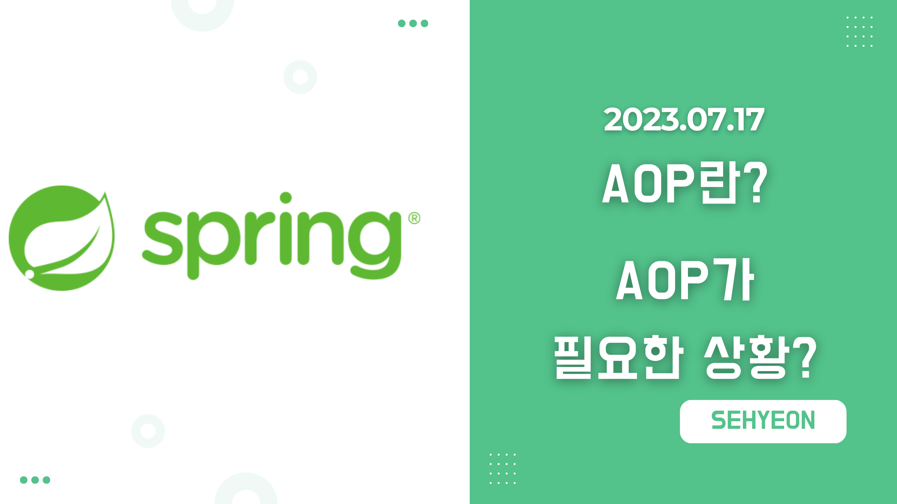
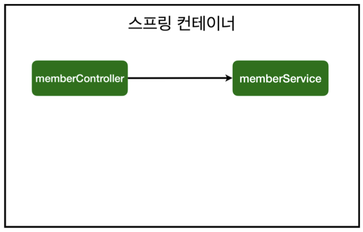
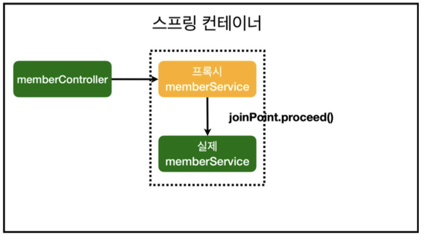

<br>

## 🤜 TIL (2023.07.17)
오늘 학습한 내용은 AOP가 무엇인지에 대해 간략히 알아보고 AOP가 필요한 상황은 언제인지 알아보았다. AOP를 사용하지 않았을 때의 문제점을 먼저 알아보고, AOP를 사용하면 어떻게 해결할 수 있는지, 스프링 컨테이너에서는 어떻게 동작하는지 알아보았다.

## 1. AOP란?
> AOP : Aspect-Oriented Programming <br>
> `AOP` 는 **관점 지향 프로그래밍**으로, 관점을 기준으로 다양한 기능을 분리하여 보는 프로그래밍이다. 대표적으로 공통 관심 사항과 핵심 관심 사항을 분리하는 역할을 한다.

## 2. AOP가 필요한 상황
강의에서는 모든 메소드의 호출 시간을 측정하고 싶은 상황을 가정한다. 즉, 각 메소드를 실행했을 때의 시간과 끝났을 때의 시간을 측정해 메소드 호출에 걸린 시간을 출력하고자 한다. <br>
일반적인 경우 `MemberService.java` 코드에서 회원가입 메소드 호출 시간을 측정하고자 한다면, 다음과 같이 수정할 수 있다.

### 🚀 AOP를 사용하지 않을 경우
```java
package com.example.hellospring.service

@Transactional
public class MemberService {
    public Long join(Member member) {
        long start = System.currentTimeMillis();

        try {
            validateDuplicateMember(member); //중복 회원 검증
            memberRepository.save(member);
            return member.getId();
        } finally {
            long finish = System.currentTimeMillis();
            long timeMs = finish - start;
            System.out.println("join " + timeMs + "ms");
        }
    }
}
```
아래와 같이 기존 코드에서 시간을 측정하는 `System.currentTimeMillis()` 메소드를 추가해 시작시간과 종료시간을 측정하고, 둘의 차이를 출력하는 방식으로 메소드 호출 시간을 측정할 수 있다.
```java
package com.example.hellospring.service

@Transactional
public class MemberService {
    public Long join(Member member) {
        validateDuplicateMember(member); //중복 회원 검증
        memberRepository.save(member);
        return member.getId();
    }
}
```
지금은 `회원가입` 이라는 메소드 하나에 시간 측정 코드를 삽입했지만, 측정하고자 하는 메소드가 1000개라면? 단순 노동을 지속적으로 해야할 것이다. 또한, 시간을 표현하는 단위가 변경되는 등 시간 측정 로직을 변경하기 위해서는 또다시 1000개의 메소드의 코드를 수정해야하는 불상사가 발생한다. 이처럼 AOP를 사용하지 않고 이것을 구현하려면 다음과 같은 문제점들이 발생한다.

### 😢 문제점
- 회원가입, 회원 조회 등에 시간을 측정하는 기능은 핵심 관심 사항이 아니다.
- 시간을 측정하는 로직은 `공통 관심 사항` 이다.
- 시간을 측정하는 로직과 핵심 비즈니스 로직이 섞여 유지보수가 어렵다.
- 시간을 측정하는 로직을 별도의 `공통 로직` 으로 만들기 매우 어렵다.
- 시간을 측정하는 로직을 변경할 때 모든 로직을 찾아가면서 변경해야 한다.

## 3. AOP를 적용해보자.
AOP는 위에서 말한 것처럼 `관점 지향 프로그래밍` 이다. 즉, 공통 관심 사항과 핵심 관심 사항을 분리하는 역할을 한다.

### 🚀 AOP를 사용한 경우
AOP를 적용하기 위해서 먼저, `aop` 라는 패키지를 만들고, `TimeTraceAop.java` 파일을 생성해 아래와 같이 코드를 작성한다.
```java
package com.example.hellospring.aop;

import org.aspectj.lang.ProceedingJoinPoint;
import org.aspectj.lang.annotation.Around;
import org.aspectj.lang.annotation.Aspect;
import org.springframework.stereotype.Component;

@Aspect
@Component
public class TimeTraceAop {
    @Around("execution(* com.example.hellospring..*(..))")
    public Object execute(ProceedingJoinPoint joinPoint) throws Throwable {
        long start = System.currentTimeMillis();
        System.out.println("START: " + joinPoint.toString());
        try {
            return joinPoint.proceed();
        } finally {
            long finish = System.currentTimeMillis();
            long timeMs = finish - start;
            System.out.println("END: " + joinPoint.toString() + " " + timeMs + "ms");
        }
    }
}
```
여기서 `@Around()` 어노테이션 내부의 문법은 적용하고자 하는 패키지 하위의 경로를 명시해주면 된다. 이렇게 적용할 경우, `hellospring` 패키지 하위에 있는 모든 메소드에 대해 시간 측정 로직을 적용할 수 있게 된다. <br>
AOP를 사용함으로써 위의 문제점들을 다음과 같이 해결할 수 있게 된다.

### 😆 문제점 해결
- 회원가입, 회원 조회 등 `핵심 관심 사항` 과 시간을 측정하는 `공통 관심 사항` 을 `분리` 한다.
- 시간을 측정하는 로직을 별도의 `공통 로직` 으로 만들었다.
- 핵심 관심 사항을 깔끔하게 유지할 수 있다.
- 변경이 필요하면 이 로직만 변경하면 된다.
- 원하는 `적용 대상` 을 선택할 수 있다.

## 4. 스프링의 AOP 동작 방식
AOP를 적용하기 전과 후의 스프링 컨테이너에서 의존관계를 그림으로 설명하면 다음과 같다.


***AOP 적용 전의 의존관계***


***AOP 적용 후의 의존관계***

이것을 간단하게 설명하면, AOP 적용 서비스를 지정하면, 가짜 서비스 (프록시) 를 등록하고, 호출 과정에서 프록시가 끝나면 실제 서비스를 실행하는 방식으로 스프링 컨테이너는 동작하게 되는 것이다.

## ✋ 마무리하며
스프링 입문 강의가 오늘로서 끝이 났다. 스프링 맛보기라고 해야할까,, 깊은 내용은 아니더라도 스프링을 공부하고자 하는 내게 어느정도 가이드라인을 제공해준 강의였다고 생각한다. 덕분에 스프링에 흥미를 가질 수 있었고, 스프링 완전 정복 로드맵 강의를 신청했는데 앞으로도 열심히 배워나갈 생각이다.

<br>

> [인프런 스프링 입문 - 코드로 배우는 스프링 부트, 웹 MVC, DB 접근 기술](https://www.inflearn.com/course/%EC%8A%A4%ED%94%84%EB%A7%81-%EC%9E%85%EB%AC%B8-%EC%8A%A4%ED%94%84%EB%A7%81%EB%B6%80%ED%8A%B8) <br>
> > 이 글은 은 인프런 김영한님의 강좌, 스프링 입문 - 코드로 배우는 스프링 부트, 웹 MVC, DB 접근 기술 강좌를 수강 후 작성한 것입니다. <br>
> > 모든 코드와 사진들은 강의에서 가져왔습니다. <br>
> > 문제가 있다면 알려주세요!

```toc

```