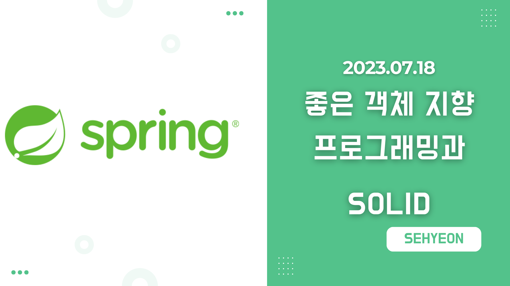
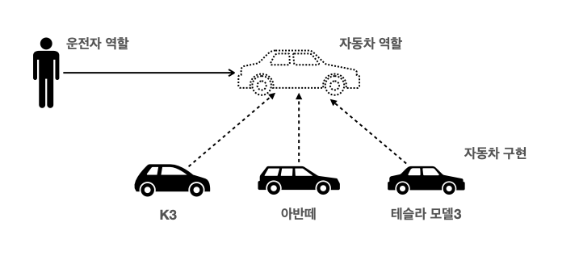
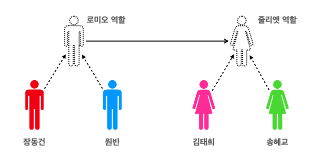

<br>

## 🤜 TIL (2023.07.18)
오늘 학습한 내용은 **좋은 객체 지향 프로그래밍이 무엇인지**, 그리고 **좋은 객체 지향 설계의 5가지 원칙인 SOLID**에 대해 학습했다.

## 1. 좋은 객체 지향 프로그래밍이란?
먼저, 객체 지향의 특징을 나열해보면 아래와 같다.
- 추상화
- 캡슐화
- 상속
- 다형성
그렇다면 **객체 지향 프로그래밍**은 무엇을 말하는 것일까? <br>
- 객체 지향 프로그래밍은 컴퓨터 프로그램을 명령어의 목록으로 보는 시각에서 벗어나 `객체` 들의 `모임` 으로 파악하고자 하는 것이다. 각각의 `객체` 는 `메시지` 를 주고받고, 데이터를 처리할 수 있다.
- 객체 지향 프로그래밍은 프로그램을 `유연` 하고 `변경` 이 용이하게 만들기 때문에 대규모 소프트웨어 개발에 많이 사용된다.
- 여기서 유연하고 변경이 용이하다는 것은 `다형성` 을 의미한다.
### 🔥 다형성의 실세계 비유
다형성을 이해하기 위해 실세계에 비유를 해본다. 실세계와 객체 지향을 1:1로 매칭할 수는 없지만 그럼에도 불구하고 실세계의 비유로 이해하는 것이 편하므로 이와 같이 비유한다. 여기서는 세상을 `역할과 구현` 으로 구분한다!
#### 1️⃣ 운전자와 자동차


***운전자와 자동차***

- 운전자는 **클라이언트** 라고 가정해보자.
- 자동차의 **역할을 구현** 한 것이 **K3, 아반떼, 테슬라** 인 것이다.
- **이때!** 운전자는 K3를 운전하다 자동차가 아반떼로 바뀌어도 동일하게 운전할 수 있다. 이유는 자동차 역할에 대한 구현만 변경되었을 뿐, `자동차 역할 자체` 는 변경되지 않았기 때문이다.
- **즉, 클라이언트에 영향을 주지 않고, 새로운 기능을 제공하며 무한히 확장할 수 있다!**

#### 2️⃣ 공연 무대


***로미오와 줄리엣***

- 로미오 역할을 하는 사람은 장동건, 원빈, 무명배우 등 **누구나** 할 수 있다.
- 로미오 역할을 하는 사람은 줄리엣의 구현체가 누구인지 **(내부구조)** 를 몰라도 된다.
- **즉, 각 역할을 맡은 배우는 누구든지 대체 가능하고 서로에게 영향을 주지 않는다**

### 🚀 역할과 구현을 분리
위와 같이 `역할` 과 `구현` 을 분리하면, **단순해지고 유연해지며 변경도 편리해진다!** <br>
역할과 구현을 구분하는 것의 **장점**은 다음과 같다.
- 클라이언트는 대상의 역할 (인터페이스)만 알면 된다.
- 클라이언트는 구현 대상의 `내부 구조` 를 몰라도 된다.
- 클라이언트는 구현 대상의 `내부 구조가 변경` 되어도 영향을 받지 않는다.
- 클라이언트는 `구현 대상 자체를 변경` 해도 영향을 받지 않는다.

이처럼 장점도 있지만, **한계**도 있다.
- 역할 (인터페이스) 자체가 변하면 클라이언트, 서버 모두에 큰 변경이 발생한다.
- 따라서 인터페이스를 안정적으로 잘 설계하는 것이 중요하다!

자바에서 다형성을 활용한다는 것은 **역할은 인터페이스**, **구현은 인터페이스를 구현한 클래스, 구현 객체** 로 설계하는 것이다. 따라서 객체를 설계할 때는 역할과 구현을 명확히 분리해야 한다. 또한, 객체 설계 시 역할을 먼저 부여하고, 그 역할을 수행하는 객체를 만드는 것이 바람직하다!

## 2. 좋은 객체 지향 설계의 5가지 원칙 - SOLID
### ❓ SOLID 란?
`SOLID` 는 클린코드로 유명한 로버트 마틴이 좋은 객체 지향 설계의 5가지 원칙을 정리한 것으로 다음 5개의 원칙이 있다.
- SRP : 단일 책임 원칙
- OCP : 개방-폐쇄 원칙
- LSP : 리스코프 치환 원칙
- ISP : 인터페이스 분리 원칙
- DIP : 의존관계 역전 원칙

지금부터는 이 5가지 원칙이 무엇을 의미하는지 알아보도록 한다.

### ✅ SRP, 단일 책임 원칙
> SRP : Single Responsibility Principle <br>
> 한 클래스는 `하나의 책임` 만 가져야 한다.

- 하나의 책임이라는 것은 모호하다.
  - 클 수도 있고, 작을 수도 있다.
  - 문맥과 상황에 따라 다르다.
- **중요한 기준은** `변경` 이다. 변경이 있을 때 파급 효과가 적으면 단일 책임 원칙을 잘 따른 것이다.

### ✅ OCP, 개방-폐쇄 원칙

> OCP : Open/Closed Principle <br>
> 소프트웨어 요소는 `확장에는 열려` 있으나 `변경에는 닫혀` 있어야 한다.

- 코드의 변경 없이 `기능을 확장` 할 수 있어야한다.
  - 다형성을 활용!
  - 인터페이스를 구현한 새로운 클래스를 하나 만들어서 새로운 기능을 구현한다.
- 예시
```java
public class MemberService {
    private MemberRepository memberRepository = new MemoryMemberRepository();
}
```
    
```java
public class MemberService {
//	private MemberRepository memberRepository = new MemoryMemberRepository();
    private MemberRepository memberRepository = new JdbcMemberRepository();
}
```
    
- 문제점
  - MemberService 클라이언트가 구현 클래스를 직접 선택하고 있다.
  - 즉, **구현 객체를 변경하려면 클라이언트 코드를 변경** 해야 한다.
  - 분명 다형성을 사용했지만, OCP 원칙을 지킬 수 없다.
  - 이것을 해결하기 위해서 객체를 생성하고 연관관계를 맺어주는 별도의 조립, 설정자가 필요하다.

### ✅ LSP, 리스코프 치환 원칙

> LSP : Liskov Substitution Principle <br>
> 프로그램의 객체는 프로그램의 정확성을 깨트리지 않으면서 `하위 타입의 인스턴스로 바꿀 수 있어야한다.`

- 다형성에서 하위 클래스는 인터페이스 규약을 다 지켜야한다는 것이다.
  - 다형성을 지원하기 위한 원칙이며 인터페이스를 구현한 구현체를 믿고 사용하려면 이 원칙이 필요하다.
- 자동차의 엑셀은 앞으로 가라는 기능, 뒤로 가게 구현하면 LSP 위반!

### ✅ ISP, 인터페이스 분리 원칙

> ISP : Interface Segregation Principle <br>
> 특정 클라이언트를 위한 `인터페이스 여러 개` 가 범용 인터페이스 하나보다 낫다.
 
- 자동차 인터페이스가 있다면, 운전 인터페이스 + 정비 인터페이스로 분리!
- 사용자 클라이언트는 운전자 클라이언트 + 정비사 클라이언트로 분리!
- 분리하면 정비 인터페이스 자체가 변해도 운전자 클라이언트에 영향을 주지 않는다.
- 이를 통해 **인터페이스가 명확해지고, 대체 가능성이 높아진다.**

### ✅ DIP, 의존관계 역전 원칙

> DIP : Dependency Inversion Principle <br>
> 프로그래머는 `추상화에 의존` 해야지, 구체화에 의존하면 안된다.

- 즉, 구현 클래스에 의존하지 말고 인터페이스에 의존하라는 뜻이다.
- 구현이 아닌 `역할 (Role)` 에 의존해야한다는 것!
- 클라이언트가 인터페이스에 의존해야 유연하게 구현체를 변경할 수 있다. 구현체에 의존할 경우 변경이 어려워진다.

### 📚 정리
- 객체 지향의 핵심은 `다형성!`
- 다형성 만으로는 쉽게 부품을 갈아 끼우듯 개발할 수 없다.
- 다형성 만으로는 구현 객체를 변경할 때 클라이언트 코드도 함께 변경된다.
- **다형성 만으로는, OCP & DIP를 지킬 수 없다.**

## ✋ 마무리하며
오늘은 스프링을 본격적으로 배워보기 전에 좋은 객체 지향 프로그래밍이란 무엇인가에 대해 알아보았다. 그리고 다음 포스팅에서는 스프링의 역사와 스프링이 어떻게 객체 지향 설계를 최적으로 도와주는지에 대해 알아볼 예정이다. 앞에서 정리했듯이 다형성만으로는 OCP와 DIP를 지킬 수 없는데, 스프링에서는 어떤 기술로 이것을 가능하게 지원하는지와 같은 내용을 다룰 것이다.

<br>

> [인프런 스프링 핵심 원리 - 기본편](https://www.inflearn.com/course/%EC%8A%A4%ED%94%84%EB%A7%81-%ED%95%B5%EC%8B%AC-%EC%9B%90%EB%A6%AC-%EA%B8%B0%EB%B3%B8%ED%8E%B8) <br>
> > 이 글은 은 인프런 김영한님의 강좌, 스프링 핵심 원리 - 기본편 강좌를 수강 후 작성한 것입니다. <br>
> > 모든 코드와 사진들은 강의에서 가져왔습니다. <br>
> > 문제가 있다면 알려주세요!

```toc

```