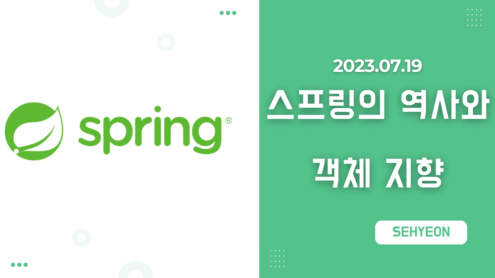
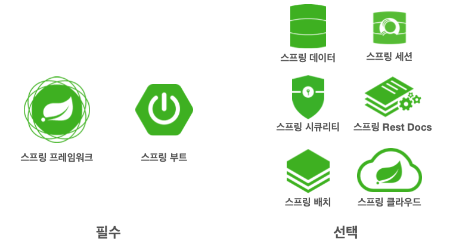
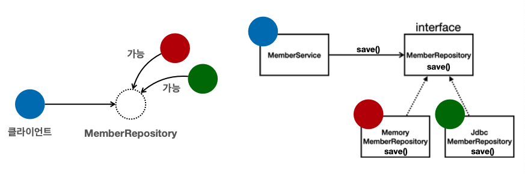

<br>

## 🤜 TIL (2023.07.19)
오늘 학습한 내용은 [좋은 객체 지향 프로그래밍과 SOLID](https://sxhxun.com/13-spring-009/)에 이어서 **스프링은 어떻게 만들어지게 되었는지**, 스프링이 어떻게 **객체 지향 설계를 효율적으로 할 수 있도록 지원**하는지에 대해 알아보았다.

## 1. 스프링은 어떻게 만들어지게 되었는가?
### 😢 EJB의 문제점
- 자바 진영의 표준 기술이던 EJB (Enterprise Java Beans)는 복잡하고 어려우며, 의존적이고 느리다는 단점이 있었다.
- EJB 컨테이너를 대체한 것이 `스프링` 이다.
- EJB 엔티티빈 기술을 대체, Hibernate → Hibernate를 정제, JPA 표준 인터페이스

### 🚀 스프링의 역사
- 2002년 로드 존슨의 책 출간
- EJB의 문제점을 지적하며, EJB 없이 충분히 고품질의 확장 가능한 애플리케이션을 개발할 수 있음을 보여줌.
  - 30,000 라인 이상의 기반 기술을 예제 코드로 선보임.
  - 여기에 현재 스프링의 핵심 개념과 기반 코드가 들어가 있다.
- BeanFactory, ApplicationContext, POJO, 제어의 역전, 의존관계 주입

## 2. 스프링이란?
### 🍃 스프링 생태계


***스프링 생태계***

스프링은 여러가지 기술들의 모임이다. 위 사진의 기술들을 하나씩 설명하면 다음과 같다.
- 스프링 프레임워크 : 스프링의 핵심
- 스프링 부트 : 여러 스프링 기술들을 편리하게 사용하도록 도와준다.
- 스프링 데이터 : CRUD를 편리하게 사용하도록 도와준다.
- 스프링 세션 : 세션 기능을 편리하게 사용하도록 도와준다.
- 스프링 시큐리티 : 보안과 관련
- 스프링 Rest Docs : API 문서 작성을 편리하게 도와준다.
- 스프링 배치 : 배치 처리에 특화된 기술
- 스프링 클라우드 : 클라우드에 특화된 기술

여기서, `스프링 프레임워크` 와 `스프링 부트` 에 대해 조금 더 자세히 알아보도록 하자!

### 📌 스프링 프레임워크
- 핵심 기술 : 스프링 DI 컨테이너, AOP, 이벤트, 기타
- 웹 기술 : 스프링 MVC, 스프링 WebFlux
- 데이터 접근 기술 : 트랜잭션, JDBC, ORM 지원, XML 지원
- 기술 통합 : 캐시, 이메일, 원격접근, 스케줄링
- 테스트 : 스프링 기반 테스트 지원
- 언어 : 코틀린, 그루비
**최근에는 스프링 부트를 통해 스프링 프레임워크 기술들을 편리하게 사용한다.**

### 📌 스프링 부트
- **스프링을 편리하게 사용할 수 있도록 지원, 최근에는 기본으로 사용**
- 단독으로 실행할 수 있는 애플리케이션을 쉽게 생성
- Tomcat 같은 웹 서버를 내장해 별도의 웹 서버 설치하지 않아도 된다.
- 쉬운 빌드 구성을 위한 `starter` 종속성 제공
- 스프링과 3rd party 라이브러리 자동 구성
- 메트릭, 상태 확인, 외부 구성 같은 프로덕션 준비 기능 제공
- 관례에 의한 간결한 설정

### 🔥 스프링의 진짜 핵심
- 스프링은 자바 기반의 프레임워크
- 자바의 가장 큰 특징 → `객체 지향 언어`
- 스프링은 객체 지향 언어가 가진 강력한 특징을 살려내는 프레임 워크
- 스프링은 `좋은 객체 지향` 애플리케이션을 개발할 수 있도록 도와주는 프레임워크

정리하자면, EJB를 사용할 당시 EJB에 의존적으로 개발했기 때문에 객체 지향의 장점을 활용할 수 없었던 것에 반해 스프링을 사용하면 **좋은 객체 지향 애플리케이션** 을 개발할 수 있다!

## 3. 스프링과 객체 지향
### 📍 자바의 다형성
먼저, 자바에서 다형성을 가능하게 하는 것은 `오버라이딩` 이다. 이것은 자바의 기본 문법으로 오버라이딩 된 메소드가 실행된다. 다형성으로 인터페이스를 구현한 객체를 실행 시점에 유연하게 변경할 수 있다. 이것을 이미지로 표현하면 아래와 같다.


***자바의 다형성과 오버라이딩***

### 🔥 다형성의 본질
- 인터페이스를 구현한 객체 인스턴스를 `실행 시점` 에 유연하게 변경할 수 있다.
- 다형성의 본질을 이해하려면 `협력` 이라는 객체 사이의 관계에서 시작해야 한다.
- 즉, 클라이언트를 변경하지 않고, 서버의 구현 기능을 유연하게 변경할 수 있다!

### 🚀 스프링과 객체 지향
- 다형성이 가장 중요하고, 스프링은 다형성을 극대화해서 이용할 수 있게 도와준다.
- 스프링에서 이야기하는 제어의 역전 (IoC), 의존관계 주입(DI)은 다형성을 활용해서 역할과 구현을 편리하게 다룰 수 있도록 지원한다.

## ✋ 마무리하며
이렇게 스프링의 역사와 스프링이 객체 지향을 어떻게 지원하는지에 대해 알아보았다. 또한, 자바에서 다형성에 대해 알아보았다. 이전 포스팅과 더불어 스프링의 본질을 이해하는데에는 객체 지향에 대한 설명이 빠질 수 없다. 강의에서는 이런 이론적인 설명보다도 코드를 통한 이해와 해당 기술의 필요성을 느끼는 것이 더 이해도가 높을 것이라고 한다. 앞으로 진행될 강의를 통해 차근차근 배워나가도록 할 예정이다.

<br>

> [인프런 스프링 핵심 원리 - 기본편](https://www.inflearn.com/course/%EC%8A%A4%ED%94%84%EB%A7%81-%ED%95%B5%EC%8B%AC-%EC%9B%90%EB%A6%AC-%EA%B8%B0%EB%B3%B8%ED%8E%B8) <br>
> > 이 글은 은 인프런 김영한님의 강좌, 스프링 핵심 원리 - 기본편 강좌를 수강 후 작성한 것입니다. <br>
> > 모든 코드와 사진들은 강의에서 가져왔습니다. <br>
> > 문제가 있다면 알려주세요!

```toc

```