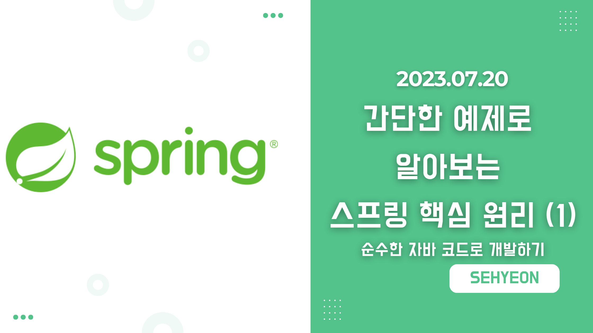
<br>

## 🤜 TIL (2023.07.20)
오늘 학습한 내용은 지난 입문 강의보다 조금 더 복잡한 주문과 할인 정책이 포함된 예제를 통해 스프링의 핵심 원리를 알아보는 것이다. 이번에는 순수하게 자바 코드로만 회원과 주문 할인 정책 관련 비즈니스 요구사항을 설계한다. 이를 통해 문제점은 무엇인지 알아보고 다음에 객체 지향 설계를 도입해 문제점을 해결해 볼 예정이다.

## 1. 비즈니스 요구사항과 설계
### 👥 회원
- 회원을 가입하고 조회할 수 있다.
- 회원은 일반과 VIP 두 가지 등급이 있다.
- **회원 데이터는 자체 DB를 구축할 수 있고, 외부 시스템과 연동할 수 있다. (미확정)**

### 💰 주문과 할인 정책
- 회원은 상품을 주문할 수 있다.
- 회원 등급에 따라 할인 정책을 적용할 수 있다.
- 할인 정책은 모든 VIP는 1000원을 할인해주는 고정 금액 할인을 적용해달라. (나중에 변경 가능)
- **할인 정책은 변경 가능성이 높다. 회사의 기본 할인 정책을 아직 정하지 못했고, 오픈 직전까지 고민을 미루고 싶다. 최악의 경우 할인을 적용하지 않을 수 있다. (미확정)**

먼저, 회원과 주문, 할인정책에 대한 요구사항은 위와 같다. <br>
여기서 중요한 점은 회원 데이터, 할인 정책 같은 부분은 지금 결정하기 어려운 부분이라는 점이다. 그러나 이런 정책이 결정될 때까지 개발을 무기한 기다릴 수 없기에 우리는 다음과 같이 설계할 수 있다! <br>
**인터페이스를 만들고 구현체를 언제든지 갈아 끼울 수 있도록 역할과 구현을 분리해 설계한다!**

## 2. 회원 도메인 설계
### 👥 회원 도메인 요구사항
- 회원을 가입하고 조회할 수 있다.
- 회원은 일반과 VIP 두 가지 등급이 있다.
- **회원 데이터는 자체 DB를 구축할 수 있고, 외부 시스템과 연동할 수 있다. (미확정)**

### 📄 회원 도메인 협력 관계

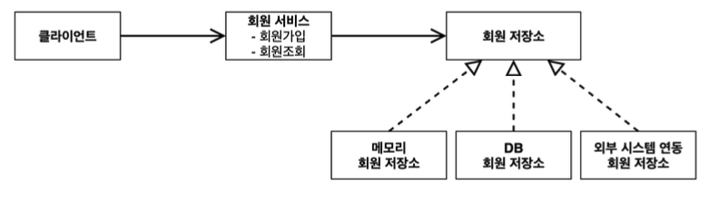
***회원 도메인 협력 관계***

클라이언트는 `회원 서비스` 에 **회원가입과 회원조회** 를 요청할 수 있다. 회원 저장소는 메모리, DB, 외부 시스템 등 구현체에 맞게 회원 데이터에 접근하는 역할을 담당한다.

### 📄 회원 클래스 다이어그램

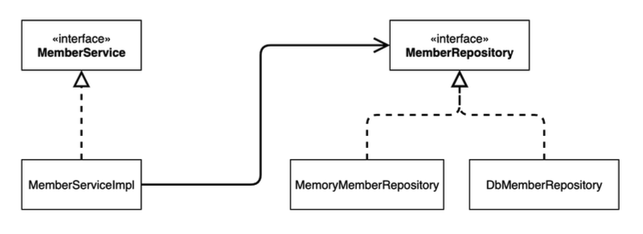
***회원 클래스 다이어그램***

역할을 담당하는 회원 서비스와 회원 저장소는 인터페이스로 설계, 구현체는 언제든지 갈아끼울 수 있다!

### 📄 회원 객체 다이어그램

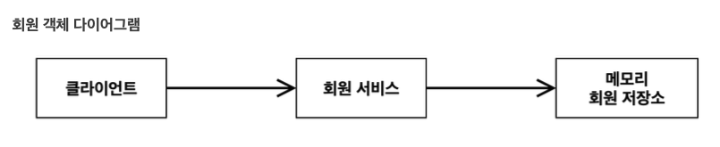
***회원 객체 다이어그램***

객체 간의 메모리 참조는 어떻게 되는지에 대한 그림이다. 현재 우리는 DB에 저장하는 것이 아닌 메모리 계층에서 회원 저장소를 구현한다.

> 1. 도메인 협력 관계는 기획자들도 볼 수 있는 그림이다. <br>
> 2. 클래스 다이어그램은 도메인 협력 관계를 바탕으로 개발자가 구체화한 것을 말한다. <br>
> 3. 객체 다이어그램은 동적으로 정해지는 구현체들이 서버 내에서 실제 클라이언트가 사용하는 인스턴스들의 참조 관계를 말한다.

## 3. 회원 도메인 개발
위에서 정리한 비즈니스 요구사항을 바탕으로 실제 회원 도메인과 서비스를 개발해본다.

### 🚀 회원 엔티티
여기서 회원에 대한 정보와 등급을 담당하는 Enumerate 두 가지를 구현한다. <br> <br>
**1) 회원 등급** <br>
먼저 `member` 라는 패키지를 만든 후 `Grade` 라는 Enum 클래스를 만들어 아래와 같이 코드를 작성한다.
```java
package hello.core.member;

public enum Grade {
    BASIC,
    VIP
}
```
**2) 회원 엔티티** <br>
`member` 패키지 하위에 `Member` 클래스를 만들어 회원 엔티티를 만든다.
```java
package hello.core.member;

public class Member {
    private Long id;
    private String name;
    private Grade grade;

    public Member(Long id, String name, Grade grade) {
        this.id = id;
        this.name = name;
        this.grade = grade;
    }

    public Long getId() {
        return id;
    }

    public void setId(Long id) {
        this.id = id;
    }

    public String getName() {
        return name;
    }

    public void setName(String name) {
        this.name = name;
    }

    public Grade getGrade() {
        return grade;
    }

    public void setGrade(Grade grade) {
        this.grade = grade;
    }
}
```
기본적인 생성자와 Getter, Setter를 포함한다.

### 🚀 회원 저장소
회원 저장소의 역할을 수행하는 인터페이스를 설계하고, DB가 아직 확정되지 않았기 때문에 가장 단순한 메모리 계층의 회원 저장소를 구현한다. <br><br>
**1) 회원 저장소 인터페이스** <br>
`member` 패키지 하위에 `MemberRepository` 인터페이스를 만들어 아래와 같이 회원가입과 회원 조회 기능을 추가한다.
```java
package hello.core.member;

public interface MemberRepository {
    void save(Member member);

    Member findById(Long memberId);
}
```
**2) 메모리 회원 구현체** <br>
`member` 패키지 하위에 `MemoryMemberRepository` 클래스를 만들어 인터페이스로 설계한 것을 구체화한다.
```java
package hello.core.member;

import java.util.HashMap;
import java.util.Map;

public class MemoryMemberRepository implements MemberRepository{

    private static Map<Long, Member> store = new HashMap<>();
    @Override
    public void save(Member member) {
        store.put(member.getId(), member);
    }

    @Override
    public Member findById(Long memberId) {
        return store.get(memberId);
    }
}
```
> 참고로 HashMap은 동시성 이슈가 발생할 수 있기 때문에 이런 경우 `ConcurrentHashMap` 을 사용하면 된다!

### 🚀 회원 서비스
회원 서비스의 역할인 회원 가입과 회원 조회 기능을 인터페이스로 만들고, 구현체를 구현한다. <br><br>
**1) 회원 서비스 인터페이스** <br>
`member` 패키지 하위에 `MemberService` 인터페이스를 만들고 아래와 같이 코드를 작성한다. service 라는 패키지에 따로 분리해도 되지만, 편의상 member 패키지 아래에 같이 만든다.
```java
package hello.core.member;

public interface MemberService {

    void join(Member member);

    Member findMember(Long memberId);
}
```
**2) 회원 서비스 구현체** <br>
`member` 패키지 하위에 `MemberServiceImpl` 파일을 만들어 구체화 한다. 참고로 인터페이스에 대한 구현체가 1개일 경우 `Impl` 을 뒤에 붙인다.
```java
package hello.core.member;

public class MemberServiceImpl implements MemberService{

    private final MemberRepository memberRepository = new MemoryMemberRepository();

    @Override
    public void join(Member member) {
        memberRepository.save(member);
    }

    @Override
    public Member findMember(Long memberId) {
        return memberRepository.findById(memberId);
    }
}
```

## 4. 회원 도메인 실행과 테스트
지금까지 개발한 것이 잘 동작하는지 테스트를 해보는 단계이다. 2가지 방식으로 테스트를 진행한다. main 함수를 만들어 애플리케이션 로직으로 테스트, JUnit 테스트를 사용한 테스트 2가지 방법을 사용한다. <br>
참고로 애플리케이션 로직으로 테스트하는 것은 좋은 방식이 아니므로, **JUnit 테스트를 사용하도록 하자!**

### ⚙️ 애플리케이션 테스트
`MemberApp` 클래스를 만들어 main 함수 안에서 테스트를 아래와 같이 진행한다.
```java
package hello.core;

import hello.core.member.Grade;
import hello.core.member.Member;
import hello.core.member.MemberService;
import hello.core.member.MemberServiceImpl;

public class MemberApp {
    public static void main(String[] args) {
        MemberService memberService = new MemberServiceImpl();
        Member member = new Member(1L, "memberA", Grade.VIP);
        memberService.join(member);

        Member findMember = memberService.findMember(1L);
        System.out.println("newMember = " + member.getName());
        System.out.println("find Member = " + findMember.getName());
    }
}
```

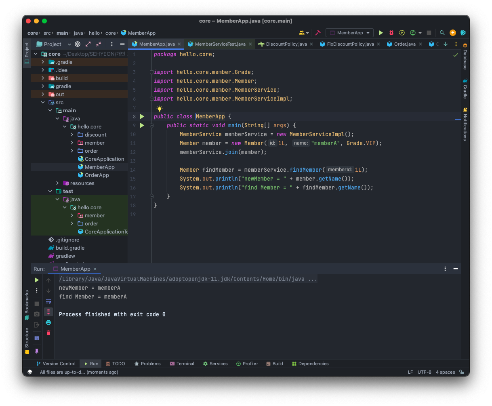
***애플리케이션 테스트 결과***

새로운 회원를 저장하고 회원을 조회한 결과가 동일하다. 정상적으로 작동하는 것을 볼 수 있다!

### ⚙️ JUnit 테스트
`test` 패키지 아래 `member` 패키지를 생성하고 `MemberServiceTest` 클래스 안에서 JUnit 테스트를 진행해보자.
```java
package hello.core.member;

import org.assertj.core.api.Assertions;
import org.junit.jupiter.api.Test;

public class MemberServiceTest {

    MemberService memberService = new MemberServiceImpl();

    @Test
    void join() {
        // given
        Member member = new Member(1L, "memberA", Grade.VIP);

        // when
        memberService.join(member);
        Member findMember = memberService.findMember(1L);

        // then
        Assertions.assertThat(member).isEqualTo(findMember);
    }
}
```

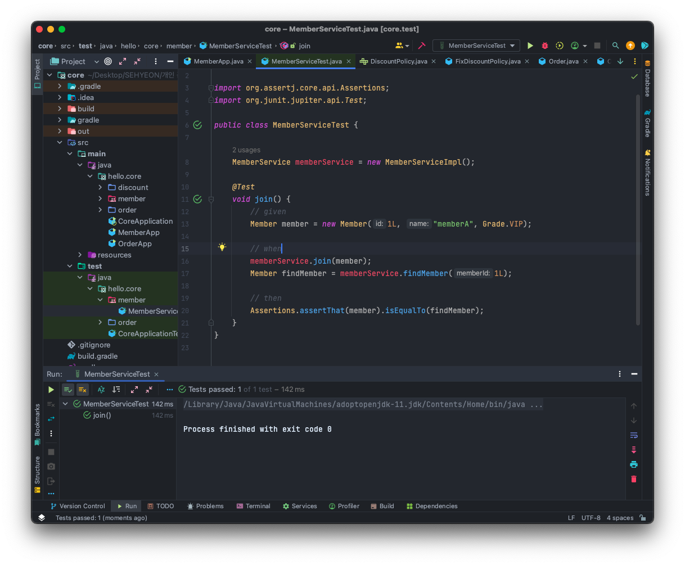
***JUnit 테스트 결과***

테스트 작동 결과 **join** 메소드가 정상적으로 작동하는 것을 확인할 수 있다!

### 🔥 회원 도메인 설계의 문제점
지금까지 개발한 회원 도메인 설계의 문제점은 무엇일까? 아래와 같은 의문을 제기해볼 수 있다.
- 다른 저장소로 변경할 때 OCP 원칙을 잘 준수할까?
- DIP를 잘 지키고 있을까?
**의존관계가 인터페이스 뿐 아니라 구현체까지 모두 의존하는 문제점이 있다.**
이 부분은 MemberServiceImpl (회원 서비스 구현체) 코드를 확인하면 알 수 있다.
```java
package hello.core.member;

public class MemberServiceImpl implements MemberService{

    private final MemberRepository memberRepository = new MemoryMemberRepository();
}
```
위와 같이 회원 서비스 구현체는 회원 저장소 인터페이스와 메모리 회원 저장소 구현체를 모두 의존하고 있다. <br>
이 문제점을 어떻게 해결하는지는 뒤에서 나오는 주문까지 모두 만들고 다음 포스팅을 통해 해결하도록 한다.

## 5. 주문과 할인 도메인 설계
### 💰 주문과 할인 정책 요구사항
- 회원은 상품을 주문할 수 있다.
- 회원 등급에 따라 할인 정책을 적용할 수 있다.
- 할인 정책은 모든 VIP는 1000원을 할인해주는 고정 금액 할인을 적용해달라. (나중에 변경 가능)
- **할인 정책은 변경 가능성이 높다. 회사의 기본 할인 정책을 아직 정하지 못했고, 오픈 직전까지 고민을 미루고 싶다. 최악의 경우 할인을 적용하지 않을 수 있다. (미확정)**

### 📄 주문 도메인 협력, 역할, 책임

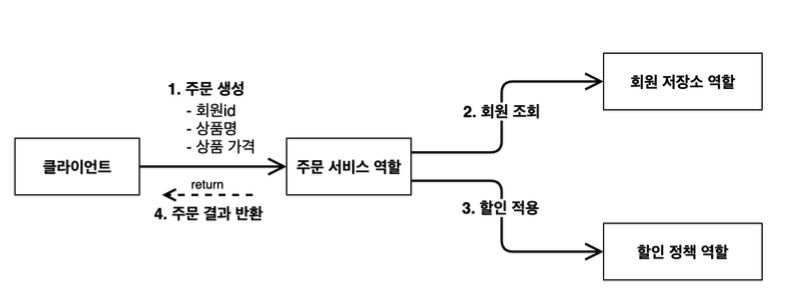
***주문 도메인 협력, 역할, 책임***

- **주문 생성** : 클라이언트는 주문 서비스에 주문 생성을 요청한다.
- **회원 조회** : 할인을 위해서 회원 등급이 필요하다. 따라서 주문 서비스는 회원 저장소에서 회원 등급을 조회한다.
- **할인 적용** : 주문 서비스는 회원 등급에 따라 할인 여부를 할인 정책에 위임한다.
- **주문 결과 반환** : 주문 서비스는 할인 결과를 포함한 주문 결과를 반환한다.
    - 실제로는 주문 데이터를 DB에 저장하지만, 단순한 예제를 위해 생략하고 주문 결과를 반환한다!

### 📄 주문 도메인 전체

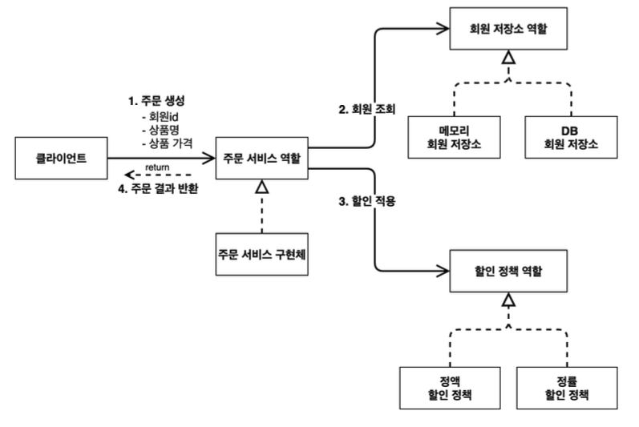
***주문 도메인 전체***

> **역할과 구현을 분리** 해서 자유롭게 구현 객체를 조립할 수 있게 설계했다. 덕분에 회원 저장소는 물론이고, 할인 정책도 유연하게 변경할 수 있다.
> 

### 📄 주문 도메인 클래스 다이어그램

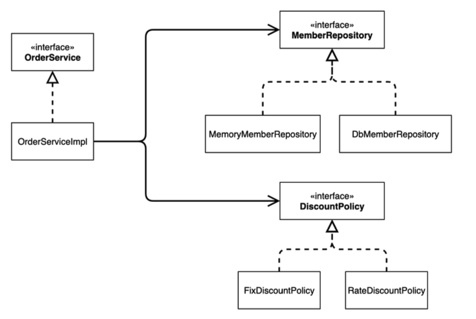
***주문 도메인 클래스 다이어그램***

### 📄 주문 도메인 객체 다이어그램

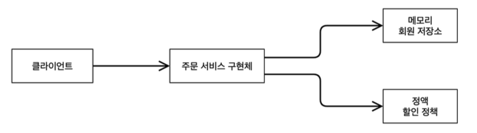
***주문 도메인 객체 다이어그램 1***

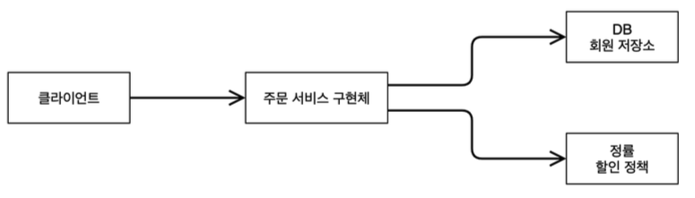
***주문 도메인 객체 다이어그램 2***

> **회원을 메모리가 아닌 실제 DB에서 조회하고, 정률 할인 정책을 지원해도 주문 서비스를 변경하지 않고 협력 관계를 그대로 재사용할 수 있다!**
>

## 6. 주문과 할인 도메인 개발
위에서 정리한 비즈니스 요구사항을 바탕으로 실제 주문과 할인 도메인과 서비스를 개발해본다.
### 🚀 할인 정책
할인 정책에 대한 인터페이스를 개발하고, 여기서는 정액 할인을 적용한 구현체를 개발한다. <br><br>
**1) 할인 정책 인터페이스** <br>
`discount` 패키지를 생성하고 `DiscountPolicy` 인터페이스를 만들어 아래와 같이 작성한다.
```java
package hello.core.discount;

import hello.core.member.Member;

public interface DiscountPolicy {
    /**
     * @return 할인 대상 금액
     */
    int discount(Member member, int price);
}
```
**2) 정액 할인 정책 구현체** <br>
`discount` 패키지 하위에 `FixDiscountPolicy` 클래스를 만들어 VIP 회원 대상으로 1000원을 할인해주는 구현체를 만든다.
```java
package hello.core.discount;

import hello.core.member.Grade;
import hello.core.member.Member;

public class FixDiscountPolicy implements DiscountPolicy{

    private int discountFixAmount = 1000; //1000원 할인

    @Override
    public int discount(Member member, int price) {
        if(member.getGrade() == Grade.VIP) {
            return discountFixAmount;
        } else {
            return 0;
        }
    }
}
```

### 🚀 주문 엔티티
주문에 대한 엔티티를 개발하는데, 회원Id, 상품 이름과 가격, 할인 금액에 대한 정보를 포함한다. <br>
`order` 패키지를 만든 후 `Order` 클래스를 만들어 주문 엔티티를 만든다.
```java
package hello.core.order;

public class Order {
    private Long memberId;
    private String itemName;
    private int itemPrice;
    private int discountPrice;

    public Order(Long memberId, String itemName, int itemPrice, int discountPrice) {
        this.memberId = memberId;
        this.itemName = itemName;
        this.itemPrice = itemPrice;
        this.discountPrice = discountPrice;
    }

    public int calculatePrice() {
        return itemPrice - discountPrice;
    }

    public Long getMemberId() {
        return memberId;
    }

    public void setMemberId(Long memberId) {
        this.memberId = memberId;
    }

    public String getItemName() {
        return itemName;
    }

    public void setItemName(String itemName) {
        this.itemName = itemName;
    }

    public int getItemPrice() {
        return itemPrice;
    }

    public void setItemPrice(int itemPrice) {
        this.itemPrice = itemPrice;
    }

    public int getDiscountPrice() {
        return discountPrice;
    }

    public void setDiscountPrice(int discountPrice) {
        this.discountPrice = discountPrice;
    }

    @Override
    public String toString() {
        return "Order{" +
                "memberId=" + memberId +
                ", itemName='" + itemName + '\'' +
                ", itemPrice=" + itemPrice +
                ", discountPrice=" + discountPrice +
                '}';
    }
}
```
기본적인 생성자와 Getter, Setter를 포함하고, 여기서 할인 금액을 적용한 최종 금액을 반환해주는 `calculatePrice` 메소드와 객체를 출력해주는 `toString` 메소드를 추가로 포함한다.

### 🚀 주문 서비스
회원 서비스와 마찬가지로 인터페이스를 만들고, 구현체를 만든다. <br><br>
**1) 주문 서비스 인터페이스** <br>
`order` 패키지 하위에 `OrderService` 인터페이스를 아래와 같이 만든다.
```java
package hello.core.order;

public interface OrderService {
    Order createOrder(Long memberId, String itemName, int itemPrice);
}
```
**2) 주문 서비스 구현체** <br>
주문 생성 요청이 들어오면, 회원 정보를 조회하고 할인 정책을 적용한 다음 주문 객체를 생성해 반환한다. <br>
여기서는 **메모리 회원 리포지토리, 고정 금액 할인 정책** 을 구현체로 생성한다.
```java
package hello.core.order;

import hello.core.discount.DiscountPolicy;
import hello.core.discount.FixDiscountPolicy;
import hello.core.member.Member;
import hello.core.member.MemberRepository;
import hello.core.member.MemoryMemberRepository;

public class OrderServiceImpl implements OrderService{

    private final MemberRepository memberRepository = new MemoryMemberRepository();
    private final DiscountPolicy discountPolicy = new FixDiscountPolicy();
    @Override
    public Order createOrder(Long memberId, String itemName, int itemPrice) {
        Member member = memberRepository.findById(memberId);
        int discountPrice = discountPolicy.discount(member, itemPrice);

        return new Order(memberId, itemName, itemPrice, discountPrice);
    }
}
```

## 7. 주문과 할인 도메인 실행과 테스트
회원 도메인과 마찬가지로 애플리케이션 로직과 JUnit 테스트로 테스트를 진행해본다. 역시 **JUnit 테스트를 사용하는 것이 좋다!**

### ⚙️ 애플리케이션 테스트
`OrderApp` 클래스를 만들고 main 함수 내에서 테스트 해본다.
```java
package hello.core;

import hello.core.member.Grade;
import hello.core.member.Member;
import hello.core.member.MemberService;
import hello.core.member.MemberServiceImpl;
import hello.core.order.Order;
import hello.core.order.OrderService;
import hello.core.order.OrderServiceImpl;

public class OrderApp {
    public static void main(String[] args) {
        MemberService memberService = new MemberServiceImpl();
        OrderService orderService = new OrderServiceImpl();

        long memberId = 1L;
        Member member = new Member(memberId, "memberA", Grade.VIP);
        memberService.join(member);

        Order order = orderService.createOrder(memberId, "itemA", 10000);

        System.out.println("order = " + order);
    }
}
```

### ⚙️ JUnit 테스트
`test` 패키지 아래에 `order` 패키지를 만든 후 `OrderServiceTest` 클래스 안에서 테스트를 진행한다.
```java
package hello.core.order;

import hello.core.member.Grade;
import hello.core.member.Member;
import hello.core.member.MemberService;
import hello.core.member.MemberServiceImpl;
import org.assertj.core.api.Assertions;
import org.junit.jupiter.api.Test;

public class OrderServiceTest {
    MemberService memberService = new MemberServiceImpl();
    OrderService orderService = new OrderServiceImpl();

    @Test
    void createOrder() {
        Long memberId = 1L;
        Member member = new Member(memberId, "memberA", Grade.VIP);
        memberService.join(member);

        Order order = orderService.createOrder(memberId, "itemA", 10000);
        Assertions.assertThat(order.getDiscountPrice()).isEqualTo(1000);
    }
}
```

두 가지 모두 실행해보면, 회원 도메인과 마찬가지로 정상적으로 동작하는 것을 확인할 수 있다.

## ✋ 마무리하며
오늘은 입문 강의보다 조금 더 복잡해진 예제를 만들어보았다. 순수한 자바코드로만 설계하는 것의 문제점을 다음 강의를 통해 객체 지향 설계 요소를 도입해 해결해 볼 예정이다.

<br>

> [인프런 스프링 핵심 원리 - 기본편](https://www.inflearn.com/course/%EC%8A%A4%ED%94%84%EB%A7%81-%ED%95%B5%EC%8B%AC-%EC%9B%90%EB%A6%AC-%EA%B8%B0%EB%B3%B8%ED%8E%B8) <br>
> > 이 글은 은 인프런 김영한님의 강좌, 스프링 핵심 원리 - 기본편 강좌를 수강 후 작성한 것입니다. <br>
> > 모든 코드와 사진들은 강의에서 가져왔습니다. <br>
> > 문제가 있다면 알려주세요!

```toc

```