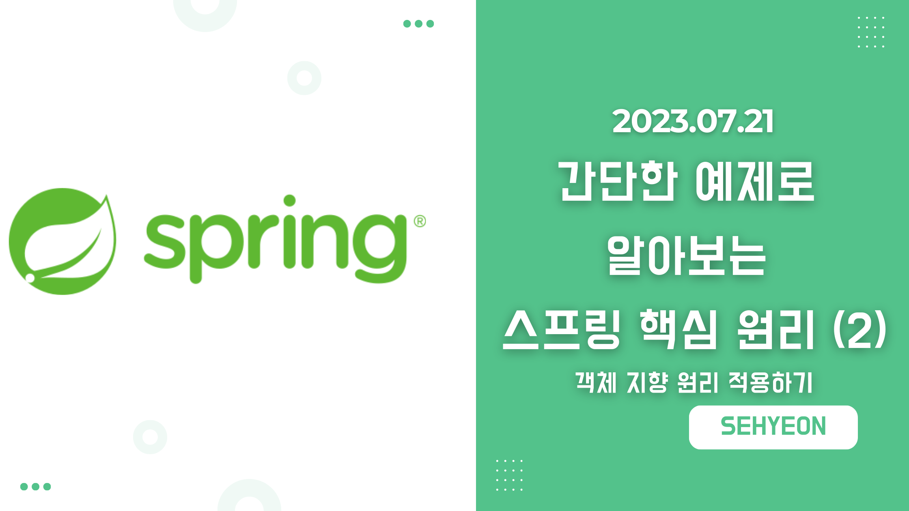
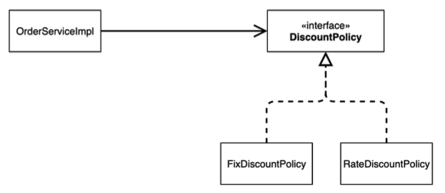
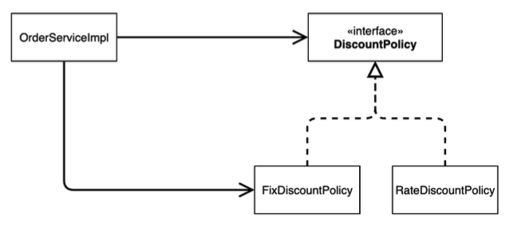
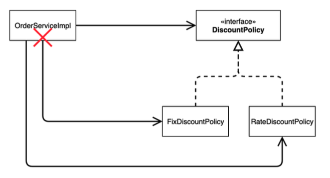
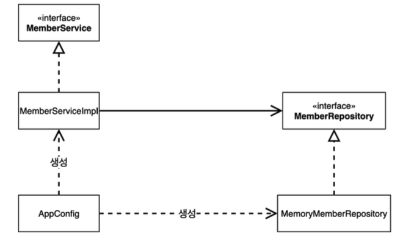
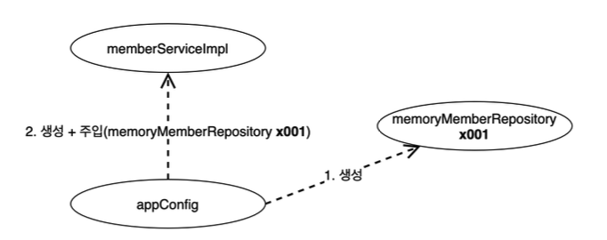
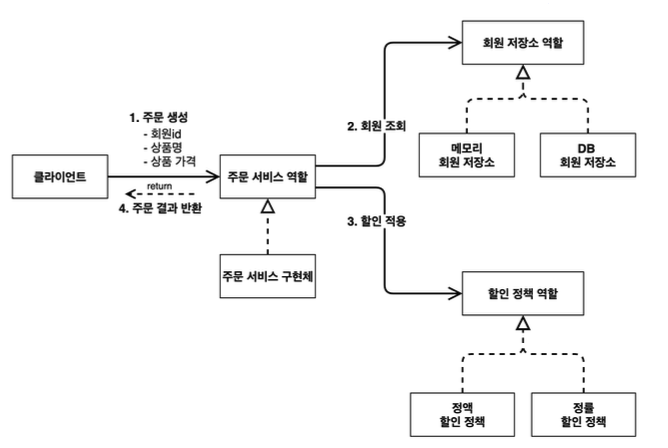
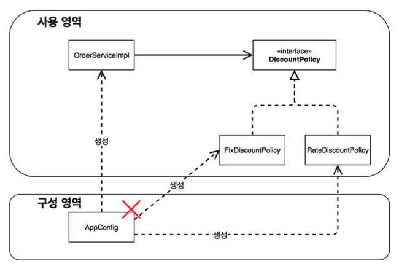
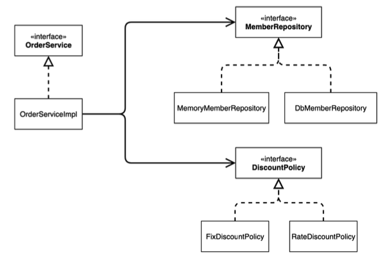
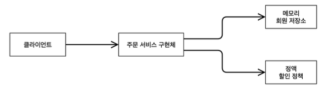

<br>

## 🤜 TIL (2023.07.21)
오늘은 [간단한 예제로 알아보는 스프링 핵심원리 (1)](https://sxhxun.com/15-spring-011/) 에서 개발한 예시에 객체 지향 요소를 적용해보는 것을 학습했다. 기존 코드의 객체 지향 관점에서 문제점은 무엇인지 알아보고, 어떻게 해결할 수 있는지 알아보았다. 또한, 순수한 자바 코드로만 개발한 것을 스프링으로 전환해보았다.

## 1. 새로운 할인 정책 개발
고정 금액 할인이 아닌 주문 금액 당 할인하는 정률 % 할인 정책으로 변경해야한다. 즉, 상품 주문 시 상품 가격의 10% 할인하는 정률 할인 정책으로 변경한다.

### 💰 RateDiscountPolicy 추가
`discount` 패키지 아래에 `RateDiscountPolicy` 클래스를 생성해 아래와 같이 만들어 준다.
```java
package hello.core.discount;

import hello.core.member.Grade;
import hello.core.member.Member;

public class RateDiscountPolicy implements DiscountPolicy{

    private int discountPercent = 10; // 10% 할인
    @Override
    public int discount(Member member, int price) {
        if (member.getGrade() == Grade.VIP) {
            return price * discountPercent / 100;
        } else {
            return 0;
        }
    }
}
```

### 🚀 JUnit 테스트
이제 이것을 테스트 해보자!
```java
package hello.core.discount;

import hello.core.member.Grade;
import hello.core.member.Member;
import org.assertj.core.api.Assertions;
import org.junit.jupiter.api.DisplayName;
import org.junit.jupiter.api.Test;

import static org.assertj.core.api.Assertions.*;
import static org.junit.jupiter.api.Assertions.*;

class RateDiscountPolicyTest {

    RateDiscountPolicy discountPolicy = new RateDiscountPolicy();

    @Test
    @DisplayName("VIP는 10% 할인이 적용되어야 한다.")
    void vip_o() {
        //given
        Member member = new Member(1L, "memberVIP", Grade.VIP);
        //when
        int discount = discountPolicy.discount(member, 10000);
        //then
        assertThat(discount).isEqualTo(1000);
    }

    @Test
    @DisplayName("VIP가 아니면 할인이 적용되지 않아야 한다.")
    void vip_x() {
        //given
        Member member = new Member(1L, "memberBASIC", Grade.BASIC);
        //when
        int discount = discountPolicy.discount(member, 10000);
        //then
        assertThat(discount).isEqualTo(0);
    }
}
```
테스트를 진행할 때, 정상적인 경우 뿐 아니라 적용되지 않는 경우도 테스트를 해봐야한다고 한다. 이 코드에서는 VIP가 아니면 할인이 적용되지 않아야 하는 부분이 이것과 같다.

### ⚙️ 새로운 할인 정책 적용과 문제점
먼저 바뀐 할인 정책을 애플리케이션에 적용해보자.
```java
public class OrderServiceImpl implements OrderService{

//	private final DiscountPolicy discountPolicy = new FixDiscountPolicy();
	private final DiscountPolicy discountPolicy = new RateDiscountPolicy();
}
```
<br>

**문제점**
- 역할과 구현을 충실히 분리했다. 다형성도 활용했으며 인터페이스와 구현 객체를 분리했다.
- OCP, DIP 같은 객체지향 설계 원칙 또한 충실히 준수했다
    - 그렇게 보이지만 사실은 아니다.
- **DIP** : 주문 서비스 클라이언트는 `DiscountPolicy` 인터페이스에 의존하면서 DIP를 지킨 것 같지만, 클래스 의존관계를 분석해보면 인터페이스 뿐만 아니라 **구현 클래스에도 의존**하고 있다.
    - 인터페이스 의존 : DiscountPolicy
    - 구현 클래스 의존 : FixDiscountPolicy, RateDiscountPolicy
- **OCP** : 변경하지 않고 확장할 수 있다고 했는데, 기능을 확장해서 변경하면 **클라이언트 코드에 영향을 준다!**
    - 따라서 `OCP를 위반한다!`

### 📌 클래스 의존관계 분석을 통한 문제점 찾기
**기대했던 의존관계**


***기대했던 의존관계***

- 단순히 주문 서비스 클라이언트는 `DiscountPolicy` 인터페이스만을 의존한다고 생각했다.

**실제 의존관계**


***실제 의존관계***

- 그러나 실제 클래스 의존관계를 살펴보면, 주문 서비스 클라이언트는 `FixDiscountPolicy` 인 구체 클래스도 함께 의존하고 있다. 따라서, 실제 코드를 보면 `DIP` 를 위반하고 있다.

**정책 변경**


***정책 변경 시 의존관계***

- 이러한 상황에서 할인 정책을 변경 시 주문 서비스 클라이언트의 소스 코드도 함께 변경해야 하며 이것은 `OCP` 를 위반하고 있는 것이다.

### ❓ 문제점을 어떻게 해결할 수 있을까?

- 현재 클라이언트 코드는 `DiscountPolicy` 와 `FixDiscountPolicy` 를 함께 의존하고 있다.
- 따라서 구체 클래스를 변경할 때 클라이언트 코드도 함께 변경해야 한다.
- `DIP` 를 위반하지 않도록 **인터페이스에만 의존하도록 설계를 변경해야 한다!**

```java
public class OrderServiceImpl implements OrderService{

//	private final DiscountPolicy discountPolicy = new RateDiscountPolicy();
	private DiscountPolicy discountPolicy;
}
```

이렇게 코드를 변경해 인터페이스에만 의존하도록 설계와 코드를 변경했다.

하지만, **구현체가 없는데 어떻게 코드를 실행할 수 있을까?**

이것을 실제 실행해보면, Null Point Exception 이 발생한다.

따라서, **누군가** 클라이언트에 구현 객체를 대신 생성하고 주입해주어야 한다. 

<br>

## 2. 관심사의 분리
애플리케이션을 공연이라고 생각해보자.

지금 코드는 로미오 역할 (인터페이스)을 하는 배우 (구현체)가 줄리엣 역할 (인터페이스)을 하는 여자 주인공 (구현체)를 직접 섭외하는 것과 같다. 즉, 로미오 역할을 하는 배우는 공연도 해야하고 동시에 여자 주인공도 공연에 섭외해야 하는 **다양한 책임**을 가지고 있다.

**관심사를 분리한다는 것의 의미는 다음과 같다.**

- 배우는 본인의 역할인 배역을 수행하는 것에만 집중해야 한다.
- 공연을 구성하고, 담당 배우를 섭외하는 책임을 담당하는 별도의 `공연 기획자` 가 있어야 한다.

### 🚀 AppConfig의 등장
애플리케이션의 전체 동작 방식을 구성하기 위해, `구현 객체를 생성` 하고 `연결` 하는 책임을 가지는 별도의 설정 클래스를 만들어 보자!

`AppConfig` 파일을 생성 후 아래와 같이 코드를 작성한다.
```java
package hello.core;

import hello.core.discount.FixDiscountPolicy;
import hello.core.member.MemberService;
import hello.core.member.MemberServiceImpl;
import hello.core.member.MemoryMemberRepository;
import hello.core.order.OrderService;
import hello.core.order.OrderServiceImpl;

public class AppConfig {

    public MemberService memberService() {
        return new MemberServiceImpl(new MemoryMemberRepository());
    }

    public OrderService orderService() {
        return new OrderServiceImpl(
								new MemoryMemberRepository(),
								new FixDiscountPolicy());
    }
}
```

### 📌 AppConfig의 역할

**1. AppConfig는 애플리케이션 실제 동작에 필요한 `구현 객체를 생성`한다.**

- MemberServiceImpl
- MemoryMemberRepository
- OrderServiceImpl
- FixDiscountPolicy

**2. AppConfig는 생성한 객체 인스턴스의 참조를 `생성자를 통해 주입` 해준다.**

- MemberServiceImpl → MemoryMemberRepository
- OrderServiceImpl → MemoryMemberRepository, FixDiscountPolicy

### 🔥 생성자 주입
현재는 각 클래스에 생성자가 없어서 컴파일 오류가 발생한다. 따라서, 각 클래스에 생성자를 만들어준다. 
<br>

**MemberServiceImpl - 생성자 주입**
```java
package hello.core.member;

public class MemberServiceImpl implements MemberService{

    private final MemberRepository memberRepository;

    public MemberServiceImpl(MemberRepository memberRepository) {
        this.memberRepository = memberRepository;
    }

    @Override
    public void join(Member member) {
        memberRepository.save(member);
    }

    @Override
    public Member findMember(Long memberId) {
        return memberRepository.findById(memberId);
    }
}
```

**OrderServiceImpl - 생성자 주입**
```java
package hello.core.order;

import hello.core.discount.DiscountPolicy;
import hello.core.member.Member;
import hello.core.member.MemberRepository;
import hello.core.member.MemoryMemberRepository;

public class OrderServiceImpl implements OrderService{

    private final MemberRepository memberRepository;
    private final DiscountPolicy discountPolicy;

    public OrderServiceImpl(MemberRepository memberRepository, DiscountPolicy discountPolicy) {
        this.memberRepository = memberRepository;
        this.discountPolicy = discountPolicy;
    }

    @Override
    public Order createOrder(Long memberId, String itemName, int itemPrice) {
        Member member = memberRepository.findById(memberId);
        int discountPrice = discountPolicy.discount(member, itemPrice);

        return new Order(memberId, itemName, itemPrice, discountPrice);
    }
}
```
- 설계 변경으로 `MemberServiceImpl` 과 `OrderServiceImpl` 은 인터페이스만 의존한다.
- 클라이언트 입장에서 생성자를 통해 어떤 구현 객체가 들어올지는 알 수 없다.
- 생성자를 통해 어떤 객체를 주입할 지는 오직 외부 `AppConfig` 에서 결정된다.
- 따라서, 클라이언트 코드는 **의존관계에 대한 고민은 외부**에 맡기고 **실행에만 집중**하면 된다.

**클래스 다이어그램**


***클래스 다이어그램***

- 객체의 생성과 연결은 `AppConfig` 가 담당한다.
- **DIP 완성** : 클라이언트 코드는 추상 (인터페이스)에만 의존하면 된다. 이제 구현 클래스를 몰라도 된다.
- **관심사의 분리** : 객체를 생성하고 연결하는 역할과 실행하는 역할이 명확하게 분리되었다.

**객체 인스턴스 다이어그램**


***객체 인스턴스 다이어그램***

- `AppConfig` 객체는 `memoryMemberRepository` 를 생성하고, 그 참조값을 `memberServiceImpl` 을 생성하면서 생성자로 전달한다.
- 클라이언트인 `memberServiceImpl` 입장에서 의존관계를 마치 외부에서 주입해주는 것과 같다고 해서 `DI (Dependency Injection),` 의존관계 주입 또는 의존성 주입이라고 한다.

### 🚀 AppConfig 실행
```java
package hello.core;

import hello.core.member.Grade;
import hello.core.member.Member;
import hello.core.member.MemberService;
import hello.core.member.MemberServiceImpl;
import org.springframework.context.ApplicationContext;
import org.springframework.context.annotation.AnnotationConfigApplicationContext;

public class MemberApp {
    public static void main(String[] args) {
        AppConfig appConfig = new AppConfig();
        MemberService memberService = appConfig.memberService();
        Member member = new Member(1L, "memberA", Grade.VIP);
        memberService.join(member);

        Member findMember = memberService.findMember(1L);
        System.out.println("newMember = " + member.getName());
        System.out.println("find Member = " + findMember.getName());
    }
}
```
OrderApp도 마찬가지로 `appConfig` 를 통해 객체를 생성하면 된다.

### ⚙️ 테스트 코드 오류 수정
```java
package hello.core.member;

import hello.core.AppConfig;
import org.assertj.core.api.Assertions;
import org.junit.jupiter.api.BeforeEach;
import org.junit.jupiter.api.Test;

public class MemberServiceTest {

    MemberService memberService;

    @BeforeEach
    public void beforeEach() {
        AppConfig appConfig = new AppConfig();
        memberService = appConfig.memberService();
    }
}
```
OrderServiceTest도 마찬가지로 `@BeforeEach` 를 추가해준다. 이것은 각 테스트를 실행하기 전에 호출된다.

## 3. AppConfig 리팩터링
현재 AppConfig를 보면 **중복** 이 있고, **역할** 에 따른 **구현** 이 잘 안보인다.

**기대하는 그림**


***기대하는 그림***

### 🚀 리팩터링
`AppConfig` 파일을 아래와 같이 코드를 변경한다.
```java
package hello.core;

import hello.core.discount.DiscountPolicy;
import hello.core.discount.RateDiscountPolicy;
import hello.core.member.MemberService;
import hello.core.member.MemberServiceImpl;
import hello.core.member.MemoryMemberRepository;
import hello.core.order.OrderService;
import hello.core.order.OrderServiceImpl;

public class AppConfig {

    public MemberService memberService() {
        return new MemberServiceImpl(memberRepository());
    }

    public MemoryMemberRepository memberRepository() {
        return new MemoryMemberRepository();
    }

    public OrderService orderService() {
        return new OrderServiceImpl(memberRepository(), discountPolicy());
    }

    public DiscountPolicy discountPolicy() {
//        return new FixDiscountPolicy();
        return new RateDiscountPolicy();
    }
}
```
**리팩터링을 통해 변경된 사항은 다음과 같다.**

- `new MemoryMemberRepository()` 부분이 중복 제거 되었다.
    - 이제 MemoryMemberRepository 를 다른 구현체로 변경할 때 한 부분만 변경하면 된다.
- AppConfig를 보면 역할과 구현 클래스가 한 눈에 들어온다. 전체 구성이 어떻게 되어있는지 빠르게 파악할 수 있다.


***사용 영역과 구성 영역의 분리***

- 또한, **새로운 할인 정책으로 변경** 하고자 할 때도 주석처리 한 것처럼 **한 부분만 변경** 하면 된다!

## 4. 좋은 객체 지향 설계의 5가지 원칙의 적용
> 여기서는 `SRP` `DIP` `OCP` 적용

### 📖 SRP, 단일 책임 원칙
> 한 클래스는 **하나의 책임**만 가져야 한다.

- 클라이언트 객체는 직접 구현 객체를 생성하고, 연결하고, 실행하는 다양한 책임을 가지고 있음.
- SRP 단일 책임 원칙을 따르면서 관심사를 분리함.
- 구현 객체를 생성하고 연결하는 책임은 `AppConfig` 가 담당
- 클라이언트 객체는 실행하는 책임만 담당

### 📖 DIP, 의존관계 역전 원칙
> 프로그래머는 **추상화에 의존해야지 구체화에 의존하면 안된다.** `의존성 주입`은 이 원칙을 따르는 방법 중 하나이다.

- 새로운 할인 정책을 개발하고, 적용하려고 하니 클라이언트 코드도 함께 변경해야 했다. 기존 클라이언트 코드는 DIP를 지키며 추상화 인터페이스에만 의존한 것 같지만, 구현 클래스에도 함께 의존했기 때문이다.
- 클라이언트 코드가 추상화 인터페이스에만 의존하도록 코드를 변경했다.
- 하지만 클라이언트 코드는 인터페이스만으로는 아무것도 실행할 수 없다.
- `AppConfig` 가 객체 인스턴스를 클라이언트 코드 대신 생성해 클라이언트 코드에 의존관계를 주입했다. 이렇게 해서 DIP 원칙을 따르면서 문제도 해결했다.

### 📖 OCP, 개방-폐쇄 원칙
> 소프트웨어 요소는 **확장에는 열려 있으나 변경에는 닫혀 있어야 한다.**

- 다형성을 사용하고 클라이언트가 DIP를 지킴.
- 애플리케이션을 사용 영역과 구성 영역으로 나눔.
- `AppConfig` 가 의존관계를 새로운 할인 정책으로 변경해서 클라이언트 코드에 주입하므로 클라이언트 코드는 변경하지 않아도 된다.
- **소프트웨어 요소를 새롭게 확장해도 사용 영역의 변경은 닫혀 있다!**

## 5. IoC, DI 그리고 컨테이너

### 🔥 제어의 역전 (IoC, Inversion of Control)
- 기존 프로그램은 클라이언트 구현 객체가 스스로 필요한 서버 구현 객체를 생성하고, 연결하고 실행했다. 한마디로 구현 객체가 프로그램의 제어 흐름을 스스로 조종했다.
- 반면에 `AppConfig` 가 등장한 이후 구현 객체는 자신의 로직을 실행하는 역할만 담당한다. 프로그램의 제어 흐름은 이제 AppConfig가 가져간다.
- 이렇듯 프로그램의 제어 흐름을 직접 제어하는 것이 아니라 외부에서 관리하는 것을 **제어의 역전 (IoC)**이라 한다.

**프레임워크 vs 라이브러리**

- **프레임워크** : 프레임워크가 내가 작성한 코드를 제어하고 대신 실행하면 그것은 프레임워크가 맞다. (JUnit)
- **라이브러리** : 내가 작성한 코드가 직접 제어의 흐름을 담당한다면 그것은 라이브러리이다.

### 🔥 의존관계 주입 (DI, Dependency Injection)

***클래스 의존관계***

**정적인 클래스 의존관계**
- 클래스가 사용하는 import 코드만 보고 의존관계를 쉽게 판단할 수 있다. 정적인 의존관계는 애플리케이션을 실행하지 않아도 분석할 수 있다.
- 클래스 다이어그램에서 OrderServiceImpl 은 MemoryRepository, DiscountPolicy 에 의존한다는 것을 알 수 있다. 하지만, 실제 어떤 객체가 OrderServiceImpl 에 **주입 될 지 알 수 없다!**

**동적인 객체 인스턴스 의존 관계**
- 애플리케이션 실행 시점에서 실제 생성된 객체 인스턴스의 참조가 연결된 의존관계이다.


***객체 인스턴스 의존관계***

- 애플리케이션 **실행 시점 (런타임)** 에 외부에서 실제 구현 객체를 생성하고 클라이언트에 전달해서 클라이언트와 서버의 실제 의존관계가 연결되는 것을 `의존관계 주입` 이라 한다.
- 객체 인스턴스를 생성하고, 그 참조값을 전달해서 연결된다.
- 의존관계 주입을 사용하면 클라이언트 코드를 변경하지 않고, 클라이언트가 호출하는 대상의 타입 인스턴스를 변경할 수 있다.
- 의존관계 주입을 사용하면 정적인 클래스 의존관계를 변경하지 않고, 동적인 객체 인스턴스 의존관계를 쉽게 변경할 수 있다.

### 🔥 IoC 컨테이너, DI 컨테이너
- `AppConfig` 처럼 객체를 생성하고 관리하면서 의존관계를 연결해주는 것을 **IoC 컨테이너 또는 DI 컨테이너** 라고 한다.
- 최근에는 의존관계 주입에 초점을 맞추어 주로 **DI 컨테이너** 라고 한다.

## 6. 스프링으로 전환하기
지금까지 순수한 자바 코드만으로 DI를 적용했다. 이제 스프링을 사용해보자. 

### 🚀 AppConfig 스프링 기반으로 변경
`AppConfig` 파일을 아래와 같이 수정한다.
```java
package hello.core;

import hello.core.discount.DiscountPolicy;
import hello.core.discount.RateDiscountPolicy;
import hello.core.member.MemberService;
import hello.core.member.MemberServiceImpl;
import hello.core.member.MemoryMemberRepository;
import hello.core.order.OrderService;
import hello.core.order.OrderServiceImpl;
import org.springframework.context.annotation.Bean;
import org.springframework.context.annotation.Configuration;

@Configuration
public class AppConfig {

    @Bean
    public MemberService memberService() {
        return new MemberServiceImpl(memberRepository());
    }

    @Bean
    public MemoryMemberRepository memberRepository() {
        return new MemoryMemberRepository();
    }

    @Bean
    public OrderService orderService() {
        return new OrderServiceImpl(memberRepository(), discountPolicy());
    }

    @Bean
    public DiscountPolicy discountPolicy() {
//        return new FixDiscountPolicy();
        return new RateDiscountPolicy();
    }
}
```
- 설정을 구성한다는 뜻의 `@Configuration` 어노테이션을 붙여준다.
- 각 메소드에 `@Bean` 을 붙여준다. 이렇게 하면 스프링 컨테이너에 스프링 빈으로 등록한다.

### 🚀 MemberApp에 스프링 컨테이너 적용
```java
package hello.core;

import hello.core.member.Grade;
import hello.core.member.Member;
import hello.core.member.MemberService;
import hello.core.member.MemberServiceImpl;
import org.springframework.context.ApplicationContext;
import org.springframework.context.annotation.AnnotationConfigApplicationContext;

public class MemberApp {
    public static void main(String[] args) {
//        AppConfig appConfig = new AppConfig();
//        MemberService memberService = appConfig.memberService();
        ApplicationContext applicationContext = new AnnotationConfigApplicationContext(AppConfig.class);
        MemberService memberService = applicationContext.getBean("memberService", MemberService.class);
        Member member = new Member(1L, "memberA", Grade.VIP);
        memberService.join(member);

        Member findMember = memberService.findMember(1L);
        System.out.println("newMember = " + member.getName());
        System.out.println("find Member = " + findMember.getName());
    }
}
```

### 🚀 OrderApp에 스프링 컨테이너 적용
```java
package hello.core;

import hello.core.member.Grade;
import hello.core.member.Member;
import hello.core.member.MemberService;
import hello.core.order.Order;
import hello.core.order.OrderService;
import org.springframework.context.ApplicationContext;
import org.springframework.context.annotation.AnnotationConfigApplicationContext;

public class OrderApp {
    public static void main(String[] args) {
//        AppConfig appConfig = new AppConfig();
//        MemberService memberService = appConfig.memberService();
//        OrderService orderService = appConfig.orderService();

        ApplicationContext ac = new AnnotationConfigApplicationContext(AppConfig.class);
        MemberService memberService = ac.getBean("memberService", MemberService.class);
        OrderService orderService = ac.getBean("orderService", OrderService.class);

        long memberId = 1L;
        Member member = new Member(memberId, "memberA", Grade.VIP);
        memberService.join(member);

        Order order = orderService.createOrder(memberId, "itemA", 10000);

        System.out.println("order = " + order);
    }
}
```

### ❓ 스프링 컨테이너
- `ApplicationContext` 를 스프링 컨테이너라고 한다.
- 기존에는 `AppConfig` 를 통해 직접 객체를 생성하고 DI를 했지만, 이제부터는 스프링 컨테이너를 통해 사용한다.
- 스프링 컨테이너는 `@Configuration` 이 붙은 `AppConfig` 를 설정 정보로 사용한다. 여기서 `@Bean` 이 붙은 메소드를 모두 호출해서 반환된 객체를 스프링 컨테이너에 등록한다. 이렇게 스프링 컨테이너에 등록된 객체를 **스프링 빈** 이라고 한다.
- 스프링 빈은 `applicationContext.getBean()` 메소드를 사용해 필요한 스프링 빈 (객체) 를 찾을 수 있다.

## ✋ 마무리하며
오늘은 객체 지향 설계 요소를 도입해 기존 코드의 문제점을 알아보았다. 그리고 스프링을 사용하도록 전환해보았다. 그런데, 기존 코드가 스프링을 사용했을 때보다 더 간결한 것 같은데, 스프링을 사용하는 이점이 무엇일까? 입문 강의에서 얼핏 들었지만 이것을 앞으로 더욱 자세하게 알아보도록 하겠다. 이제는 스프링에 대해서 본격적으로 배울 시간이다.

<br>

> [인프런 스프링 핵심 원리 - 기본편](https://www.inflearn.com/course/%EC%8A%A4%ED%94%84%EB%A7%81-%ED%95%B5%EC%8B%AC-%EC%9B%90%EB%A6%AC-%EA%B8%B0%EB%B3%B8%ED%8E%B8) <br>
> > 이 글은 은 인프런 김영한님의 강좌, 스프링 핵심 원리 - 기본편 강좌를 수강 후 작성한 것입니다. <br>
> > 모든 코드와 사진들은 강의에서 가져왔습니다. <br>
> > 문제가 있다면 알려주세요!

```toc
```