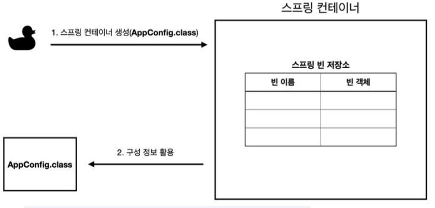
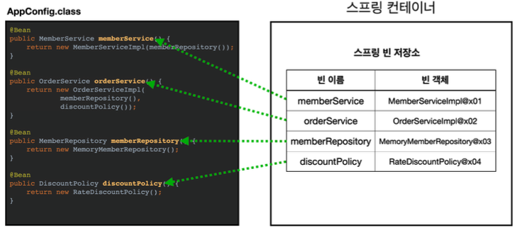
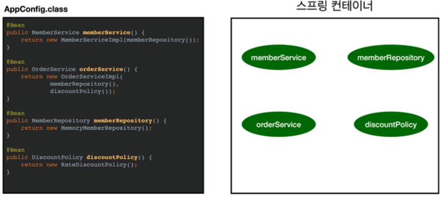
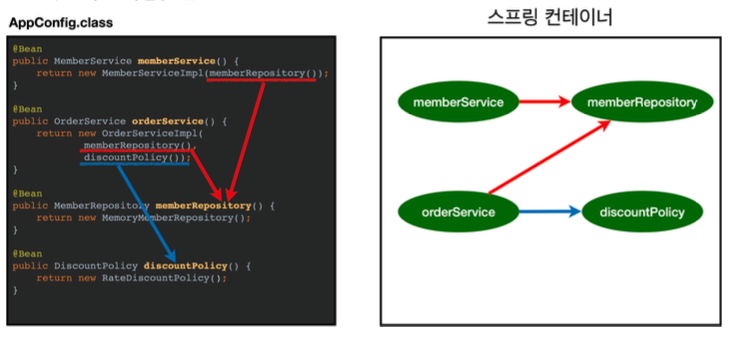
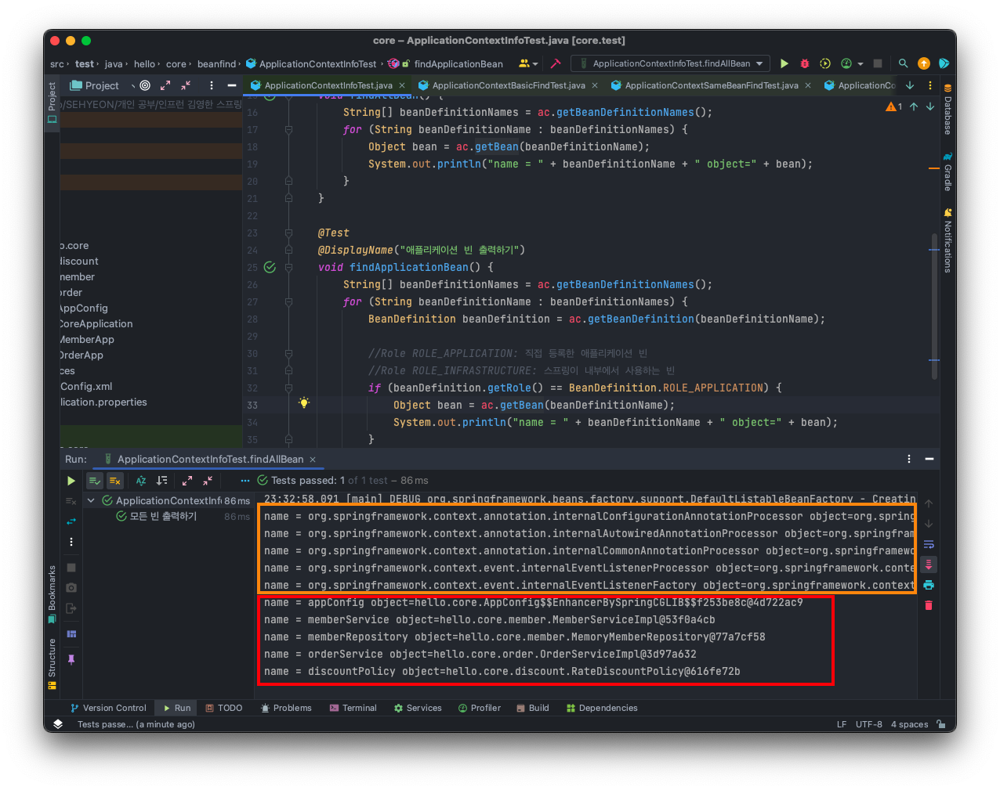
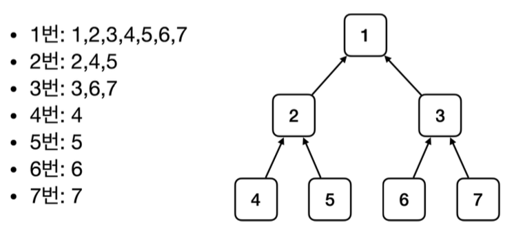
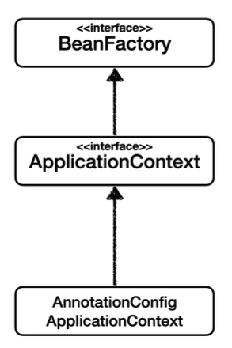
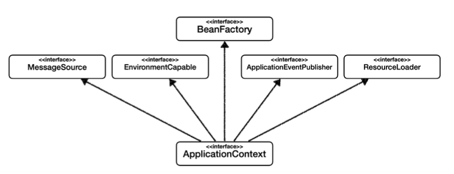
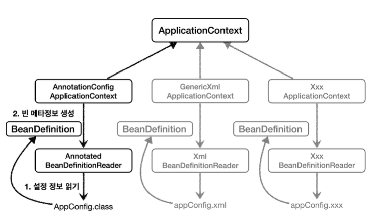
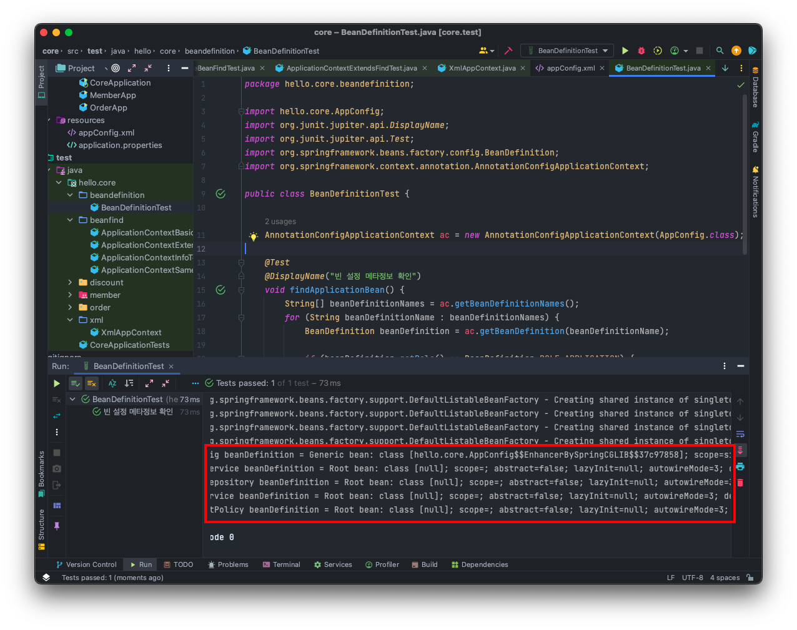

<br>

## 🤜 TIL (2023.07.22)
오늘 학습한 내용은 본격적으로 스프링에 대해 알아보았다. 스프링 컨테이너가 무엇인지, 스프링 빈은 어떻게 등록되는지, 등록된 스프링 빈을 조회하는 방법 등에 대해 알아보았다.

## 1. 스프링 컨테이너 생성
### ❓ 스프링 컨테이너란?
```java
//스프링 컨테이너 생성
ApplicationContext applicationContext =```
                     new AnnotationConfigApplicationContext(AppConfig.class);
```
- `ApplicationContext` 를 스프링 컨테이너라고 한다.
- `ApplicationContext` 는 인터페이스이다.
- 스프링 컨테이너는 XML 기반으로 만들 수 있고, 어노테이션 기반의 자바 설정 클래스로 만들 수 있다.
    - `AppConfig` 를 사용했던 방식이 어노테이션 기반의 자바 설정 클래스로 스프링 컨테이너를 만든 것이다.
- 자바 설정 클래스를 기반으로 스프링 컨테이너를 만들 때, `new AnnotationConfigApplicationContext(AppConfig.class);` 는 `ApplicationContext` 인터페이스의 구현체이다.

> 참고: 더 정확히는 스프링 컨테이너를 부를 때, `BeanFactory, ApplicationContext` 로 구분해서 이야기 한다.  `BeanFactory` 를 직접 사용하는 경우는 거의 없으므로 일반적으로 `ApplicationContext` 를 스프링 컨테이너라고 한다.
> 

### ⚙️ 스프링 컨테이너의 생성 과정

**1. 스프링 컨테이너 생성**

***스프링 컨테이너 생성***

- 스프링 컨테이너를 생성할 때는 구성 정보를 지정해주어야 한다.
- 여기서는 `AppConfig.class` 를 구성 정보로 지정했다.

**2. 스프링 빈 등록**


***스프링 빈 등록***

- 스프링 컨테이너는 파라미터로 넘어온 설정 클래스 정보를 사용해서 스프링 빈을 등록한다.
- 빈 이름은 메소드 이름을 사용한다.
- 빈 이름을 직접 부여할 수도 있다.
    - **@Bean(name=”memberService2”)**
- 주의할 점은 `빈 이름은 항상 다른 이름을 부여` 해야 한다는 점이다. 같은 이름을 부여하면, 다른 빈이 무시되거나 기존 빈을 덮어버리거나 설정에 따라 오류가 발생한다!

**3. 스프링 빈 의존관계 설정 - 준비**


***스프링 빈 의존관계 설정 - 준비***

**4. 스프링 빈 의존관계 설정 - 완료**


***스프링 빈 의존관계 설정 - 완료***

- 스프링 컨테이너는 설정 정보를 참고해서 의존관계를 주입 (DI) 한다.
- 단순히 자바 코드를 호출하는 것 같지만, 차이가 있다.
- 자바 코드로 스프링 빈을 등록하면 생성자를 호출하면서 의존관계 주입도 한번에 처리된다.

## 2. 컨테이너에 등록된 모든 빈 조회
스프링 컨테이너에 실제 스프링 빈들이 잘 등록되었는지 확인해보자.
```java
package hello.core.beanfind;

import hello.core.AppConfig;
import org.junit.jupiter.api.DisplayName;
import org.junit.jupiter.api.Test;
import org.springframework.beans.factory.config.BeanDefinition;
import org.springframework.context.annotation.AnnotationConfigApplicationContext;
import org.springframework.context.annotation.Bean;

public class ApplicationContextInfoTest {
    AnnotationConfigApplicationContext ac = new AnnotationConfigApplicationContext(AppConfig.class);

    @Test
    @DisplayName("모든 빈 출력하기")
    void findAllBean() {
        String[] beanDefinitionNames = ac.getBeanDefinitionNames();
        for (String beanDefinitionName : beanDefinitionNames) {
            Object bean = ac.getBean(beanDefinitionName);
            System.out.println("name = " + beanDefinitionName + " object=" + bean);
        }
    }

    @Test
    @DisplayName("애플리케이션 빈 출력하기")
    void findApplicationBean() {
        String[] beanDefinitionNames = ac.getBeanDefinitionNames();
        for (String beanDefinitionName : beanDefinitionNames) {
            BeanDefinition beanDefinition = ac.getBeanDefinition(beanDefinitionName);

            //Role ROLE_APPLICATION: 직접 등록한 애플리케이션 빈
            //Role ROLE_INFRASTRUCTURE: 스프링이 내부에서 사용하는 빈
            if (beanDefinition.getRole() == BeanDefinition.ROLE_APPLICATION) {
                Object bean = ac.getBean(beanDefinitionName);
                System.out.println("name = " + beanDefinitionName + " object=" + bean);
            }
        }
    }
}
```
**1. 모든 빈 출력하기**
- 실행하면 스프링에 등록된 모든 빈 정보를 출력할 수 있다.
- **ac.getBeanDefinitionNames()** : 스프링에 등록된 모든 빈 이름을 조회한다.
- **ac.getBean()** : 빈 이름으로 빈 객체 (인스턴스)를 조회한다.

**2. 애플리케이션 빈 출력하기**
- 스프링이 내부에서 사용하는 빈은 제외하고, 내가 등록한 빈만 출력할 수 있다.
- 스프링이 내부에서 사용하는 빈은 `getRole()` 로 구분할 수 있다.
    - **ROLE_APPLICATION** : 일반적으로 사용자가 정의한 빈
    - **ROLE_INFRASTRUCTURE** : 스프링이 내부에서 사용하는 빈


***실행 결과***

위 사진과 같이 코드를 실행하면 **주황색 박스** 부분이 스프링에 등록된 빈들을 조회한 결과이고, **빨간색 박스** 부분은 내가 등록한 빈을 조회한 결과이다.

## 3. 스프링 빈 조회
### 🚀 기본적인 조회 방법
스프링 컨테이너에서 스프링 빈을 찾는 가장 기본적인 조회 방법은 아래와 같다.
- **ac.getBean(빈이름, 타입)**
- **ac.getBean(타입)**
- 조회 대상 스프링 빈이 없으면 예외 발생
    - **NoSuchBeanDefinitionException : No bean name ‘xxxx’ available**

**예제 코드**
```java
package hello.core.beanfind;

import hello.core.AppConfig;
import hello.core.member.MemberService;
import hello.core.member.MemberServiceImpl;
import org.junit.jupiter.api.DisplayName;
import org.junit.jupiter.api.Test;
import org.springframework.beans.factory.NoSuchBeanDefinitionException;
import org.springframework.context.annotation.AnnotationConfigApplicationContext;

import static org.assertj.core.api.Assertions.*;
import static org.junit.jupiter.api.Assertions.*;

public class ApplicationContextBasicFindTest {
    AnnotationConfigApplicationContext ac = new AnnotationConfigApplicationContext(AppConfig.class);

    @Test
    @DisplayName("빈 이름으로 조회")
    void findBeanByName() {
        MemberService memberService = ac.getBean("memberService", MemberService.class);
        assertThat(memberService).isInstanceOf(MemberService.class);
    }

    @Test
    @DisplayName("이름 없이 타입만으로 조회")
    void findBeanByType() {
        MemberService memberService = ac.getBean("memberService", MemberService.class);
        assertThat(memberService).isInstanceOf(MemberServiceImpl.class);
    }

    @Test
    @DisplayName("구체 타입만으로 조회")
    void findBeanByName2() {
        MemberService memberService = ac.getBean("memberService", MemberServiceImpl.class);
        assertThat(memberService).isInstanceOf(MemberService.class);
    }

    @Test
    @DisplayName("빈 이름으로 조회X")
    void findBeanByNameX() {
        //ac.getBean("xxxxx", MemberService.class);
        assertThrows(NoSuchBeanDefinitionException.class, () ->
                ac.getBean("xxxxx", MemberService.class));
    }
}
```
- 참고로 구체 타입만으로 조회하면 변경 시 유연성이 떨어진다.

### 🚀 동일한 타입이 둘 이상
타입으로 조회 시 같은 타입의 스프링 빈이 둘 이상이면 오류가 발생한다.
- 이때는 빈 이름을 지정하자!
- **ac.getBeansOfType()** 을 사용하면 해당 타입의 모든 빈을 조회할 수 있다.

**예제 코드**
```java
package hello.core.beanfind;

import hello.core.member.MemberRepository;
import hello.core.member.MemoryMemberRepository;
import org.junit.jupiter.api.DisplayName;
import org.junit.jupiter.api.Test;
import org.springframework.beans.factory.NoUniqueBeanDefinitionException;
import org.springframework.context.annotation.AnnotationConfigApplicationContext;
import org.springframework.context.annotation.Bean;
import org.springframework.context.annotation.Configuration;

import java.util.Map;

import static org.assertj.core.api.Assertions.*;
import static org.junit.jupiter.api.Assertions.*;

public class ApplicationContextSameBeanFindTest {

    AnnotationConfigApplicationContext ac = new AnnotationConfigApplicationContext(SameBeanConfig.class);

    @Test
    @DisplayName("타입으로 조회시 같은 타입이 둘 이상 있으면, 중복 오류가 발생한다")
    void findBeanByTypeDuplicate() {
        //MemberRepository bean = ac.getBean(MemberRepository.class);
        assertThrows(NoUniqueBeanDefinitionException.class, () ->
                ac.getBean(MemberRepository.class));
    }

    @Test
    @DisplayName("타입으로 조회시 같은 타입이 둘 이상 있으면, 빈 이름을 지정하면 된다")
    void findBeanByName() {
        MemberRepository memberRepository = ac.getBean("memberRepository1", MemberRepository.class);
        assertThat(memberRepository).isInstanceOf(MemberRepository.class);
    }

    @Test
    @DisplayName("특정 타입을 모두 조회하기")
    void findAllBeanByType() {
        Map<String, MemberRepository> beansOfType = ac.getBeansOfType(MemberRepository.class);
        for (String key : beansOfType.keySet()) {
            System.out.println("key = " + key + " value = " + beansOfType.get(key));
            System.out.println("beansOfType = " + beansOfType);
            assertThat(beansOfType.size()).isEqualTo(2);
        }
    }

    @Configuration
    static class SameBeanConfig {
        @Bean
        public MemberRepository memberRepository1() {
            return new MemoryMemberRepository();
        }

        @Bean
        public MemberRepository memberRepository2() {
            return new MemoryMemberRepository();
        }
    }
}
```
- 여기서는 편의 상 `SameBeanConfig` 라는 구성 정보를 static class 로 만들어 사용했다.

### 🚀 상속 관계
- 부모 타입으로 조회하면, 자식 타입도 함께 조회한다.
- 그래서 아래 그림처럼 모든 자바 객체의 최고 부모인 `Object` 타입으로 조회하면 모든 스프링 빈을 조회한다.


***상속관계 출력 예시***

**예제 코드**
```java
package hello.core.beanfind;

import hello.core.discount.DiscountPolicy;
import hello.core.discount.FixDiscountPolicy;
import hello.core.discount.RateDiscountPolicy;
import org.junit.jupiter.api.DisplayName;
import org.junit.jupiter.api.Test;
import org.springframework.beans.factory.NoUniqueBeanDefinitionException;
import org.springframework.context.annotation.AnnotationConfigApplicationContext;
import org.springframework.context.annotation.Bean;
import org.springframework.context.annotation.Configuration;

import java.util.Map;

import static org.assertj.core.api.Assertions.*;
import static org.junit.jupiter.api.Assertions.*;

public class ApplicationContextExtendsFindTest {
    AnnotationConfigApplicationContext ac = new AnnotationConfigApplicationContext(TestConfig.class);

    @Test
    @DisplayName("부모 타입으로 조회시, 자식이 둘 이상 있으면, 중복 오류가 발생한다")
    void findBeanByParentTypeDuplicate() {
        // DiscountPolicy bean = ac.getBean(DiscountPolicy.class);
        assertThrows(NoUniqueBeanDefinitionException.class, () ->
                ac.getBean(DiscountPolicy.class));
    }

    @Test
    @DisplayName("부모 타입으로 조회시, 자식이 둘 이상 있으면, 빈 이름을 지정하면 된다")
    void findBeanByParentTypeBeanName() {
        DiscountPolicy rateDiscountPolicy = ac.getBean("rateDiscountPolicy", DiscountPolicy.class);
        assertThat(rateDiscountPolicy).isInstanceOf(RateDiscountPolicy.class);
    }

    @Test
    @DisplayName("특정 하위 타입으로 조회")
    void findBeanBySubType() {
        RateDiscountPolicy bean = ac.getBean(RateDiscountPolicy.class);
        assertThat(bean).isInstanceOf(RateDiscountPolicy.class);
    }

    @Test
    @DisplayName("부모 타입으로 모두 조회하기")
    void findAllBeanByParentType() {
        Map<String, DiscountPolicy> beansOfType = ac.getBeansOfType(DiscountPolicy.class);
        assertThat(beansOfType.size()).isEqualTo(2);
        for (String key : beansOfType.keySet()) {
            System.out.println("key = " + key + " value" + beansOfType.get(key));
        }
    }

    @Test
    @DisplayName("부모 타입으로 모두 조회하기 - Object")
    void findAllBeanByObjectType() {
        Map<String, Object> beansOfType = ac.getBeansOfType(Object.class);
        for (String key : beansOfType.keySet()) {
            System.out.println("key = " + key + " value" + beansOfType.get(key));
        }
    }

    @Configuration
    static class TestConfig {
        @Bean
        public DiscountPolicy rateDiscountPolicy() {
            return new RateDiscountPolicy();
        }

        @Bean
        public DiscountPolicy fixDiscountPolicy() {
            return new FixDiscountPolicy();
        }
    }
}
```

## 4. BeanFactory와 ApplicationContext


***BeanFactory와 ApplicationContext 상속 관계***

**BeanFactory**
- 스프링 컨테이너의 최상위 인터페이스이다.
- 스프링 빈을 관리하고 조회하는 역할을 담당한다.
- `getBean()` 을 제공한다.
- 지금까지 우리가 사용했던 대부분의 기능은 `BeanFactory` 가 제공하는 기능이다.

**ApplicationContext**
- `BeanFactory` 기능을 모두 상속받아서 제공한다.
- 빈을 관리하고 검색하는 기능을 BeanFactory 가 제공하는데, 둘의 차이가 무엇일까?
- 애플리케이션을 개발할 때는 빈을 관리하고 조회하는 기능은 물론이고, 수 많은 **부가기능** 이 필요하다.

**ApplicationContext가 제공하는 부가기능**


***ApplicationContext가 상속받는 부가기능***

- **메시지소스** 를 활용한 국제화 기능
    - 예를 들어 한국에서 들어오면 한국어로, 영어권에서 들어오면 영어로 출력
- **환경 변수**
    - 로컬, 개발, 운영 등을 구분해서 처리
- **애플리케이션 이벤트**
    - 이벤트를 발행하고 구독하는 모델을 편리하게 지원
- **편리한 리소스 조회**
    - 파일, 클래스패스, 외부 등에서 리소스를 편리하게 조회
이것들을 정리하면 `ApplicationContext` 는 빈 관리기능 + 편리한 부가 기능을 제공한다. <br>
`BeanFactory` 를 직접 사용할 일은 거의 없다. 부가기능이 포함된 `ApplicationContext` 를 사용한다.

## 5. 다양한 설정 형식 지원 - 자바코드 ,XML

> 스프링 컨테이너는 다양한 형식의 설정 정보를 받아들일 수 있게 유연하게 설계되어 있다. <br>
> ex) 자바코드, XML, Groovy 등

### ⚙️ XML 설정 사용
지금까지 했던 자바코드 대신 XML 설정을 사용해본다. 최근에는 스프링 부트를 많이 사용하면서 XML 기반의 설정은 잘 사용하지 않는다. 사용 방법은 `GenericXmlApplicationContext` 를 사용하면서 `xml` 설정 파일을 넘기면 된다.

**XmlAppConfig 사용 자바 코드**
```java
package hello.core.xml;

import hello.core.member.MemberService;
import org.assertj.core.api.Assertions;
import org.junit.jupiter.api.Test;
import org.springframework.context.ApplicationContext;
import org.springframework.context.support.GenericXmlApplicationContext;

import static org.assertj.core.api.Assertions.*;

public class XmlAppContext {

    @Test
    void xmlAppContext() {
        ApplicationContext ac = new GenericXmlApplicationContext("appConfig.xml");

        MemberService memberService = ac.getBean("memberService", MemberService.class);
        assertThat(memberService).isInstanceOf(MemberService.class);
    }
}
```
**xml 기반의 스프링 빈 설정 정보**
```xml
<?xml version="1.0" encoding="UTF-8"?>
<beans xmlns="http://www.springframework.org/schema/beans"
       xmlns:xsi="http://www.w3.org/2001/XMLSchema-instance"
       xsi:schemaLocation="http://www.springframework.org/schema/beans http://www.springframework.org/schema/beans/spring-beans.xsd">
    <bean id="memberService" class="hello.core.member.MemberServiceImpl">
        <constructor-arg name="memberRepository" ref="memberRepository" />
    </bean>
    <bean id="memberRepository"
          class="hello.core.member.MemoryMemberRepository" />
    <bean id="orderService" class="hello.core.order.OrderServiceImpl">
        <constructor-arg name="memberRepository" ref="memberRepository" />
        <constructor-arg name="discountPolicy" ref="discountPolicy" />
    </bean>
    <bean id="discountPolicy" class="hello.core.discount.RateDiscountPolicy" />
</beans>
```
- `xml` 기반의 `appConfig.xml` 스프링 설정 정보와 자바 코드로 된 `[AppConfig.java](http://AppConfig.java)` 설정 정보를 비교해보면 거의 비슷하다는 것을 알 수 있다.

## 6. 스프링 빈 설정 메타 정보 - BeanDefinition
> 스프링이 다양한 설정 형식을 지원하는데에는 `BeanDefinition` 이라는 추상화가 있기 때문이다.

### ❓ BeanDefinition 이란?
- `역할과 구현을 개념적으로 나눈 것` 이다!
    - XML을 읽어서 **BeanDefinition** 을 만들면 된다.
    - 자바 코드를 읽어서 **BeanDefinition** 을 만들면 된다.
    - 스프링 컨테이너는 자바 코드인지, XML 인지 몰라도 된다. 오직 **BeanDefinition** 만 알면 된다.
- `BeanDefinition` 을 빈 설정 메타정보라 한다.
    - **@Bean** , **<bean>** 당 각각 하나씩 메타 정보가 생성된다.
- 스프링 컨테이너는 이 메타정보를 기반으로 스프링 빈을 생성한다.

### 🔥 코드 레벨로 깊이 있게 이해하기


***코드 레벨***

- `AnnotationConfigApplicationContext` 는 **AnnotationBeanDefinitionReader** 를 사용해서 `AppConfig.class` 를 읽고, **BeanDefinition** 을 생성한다.
- `GenericXmlApplicationContext` 는 **XmlBeanDefinitionReader** 를 사용해서 `appConfig.xml` 설정 정보를 읽고, **BeanDefinition** 을 생성한다.
- 새로운 형식의 설정 정보가 추가되면, **XxxBeanDefinitionReader** 를 만들어서 **BeanDefinition** 을 생성하면 된다.

### 🚀 BeanDefinition 살펴보기
```java
package hello.core.beandefinition;

import hello.core.AppConfig;
import org.junit.jupiter.api.DisplayName;
import org.junit.jupiter.api.Test;
import org.springframework.beans.factory.config.BeanDefinition;
import org.springframework.context.annotation.AnnotationConfigApplicationContext;

public class BeanDefinitionTest {

    AnnotationConfigApplicationContext ac = new AnnotationConfigApplicationContext(AppConfig.class);

    @Test
    @DisplayName("빈 설정 메타정보 확인")
    void findApplicationBean() {
        String[] beanDefinitionNames = ac.getBeanDefinitionNames();
        for (String beanDefinitionName : beanDefinitionNames) {
            BeanDefinition beanDefinition = ac.getBeanDefinition(beanDefinitionName);

            if (beanDefinition.getRole() == BeanDefinition.ROLE_APPLICATION) {
                System.out.println("beanDefinitionName = " + beanDefinitionName +
                        " beanDefinition = " + beanDefinition);
            }
        }
    }
}
```


***빈 메타정보 조회 실행 결과***

**BeanDefinition 정보**
- **BeanClassName** : 생성할 빈의 클래스 명(자바 설정 처럼 팩토리 역할의 빈을 사용하면 없음)
- **factoryBeanName** : 팩토리 역할의 빈을 사용할 경우 이름, 예) appConfig
- **factoryMethodName** : 빈을 생성할 팩토리 메서드 지정, 예) memberService
- **Scope** : 싱글톤(기본값)
- **lazyInit** : 스프링 컨테이너를 생성할 때 빈을 생성하는 것이 아니라, 실제 빈을 사용할 때 까지 최대한 생성을 지연처리 하는지 여부
- **InitMethodName** : 빈을 생성하고, 의존관계를 적용한 뒤에 호출되는 초기화 메소드 명
- **DestroyMethodName** : 빈의 생명주기가 끝나서 제거하기 직전에 호출되는 메소드 명
- **Constructor arguments, Properties** : 의존관계 주입에서 사용한다. (자바 설정 처럼 팩토리 역할의 빈을 사용하면 없음)

## ✋ 마무리하며
오늘은 스프링 컨테이너와 스프링 빈에 대해 알아보았다. 직접 스프링 빈을 조회하고 상속 관계를 살펴보면서 이것에 대해 조금 더 깊이 있게 이해할 수 있었다. <br>
그리고 `BeanDefinition` 을 직접 생성해 사용하는 일은 거의 없으므로 가볍게 넘어가도 된다고 한다. 간단히 요약하자면 스프링이 다양한 형태의 설정 정보를 추상화해서 사용하는 것으로만 이해하면 된다.

<br>

> [인프런 스프링 핵심 원리 - 기본편](https://www.inflearn.com/course/%EC%8A%A4%ED%94%84%EB%A7%81-%ED%95%B5%EC%8B%AC-%EC%9B%90%EB%A6%AC-%EA%B8%B0%EB%B3%B8%ED%8E%B8) <br>
> > 이 글은 은 인프런 김영한님의 강좌, 스프링 핵심 원리 - 기본편 강좌를 수강 후 작성한 것입니다. <br>
> > 모든 코드와 사진들은 강의에서 가져왔습니다. <br>
> > 문제가 있다면 알려주세요!

```toc
```