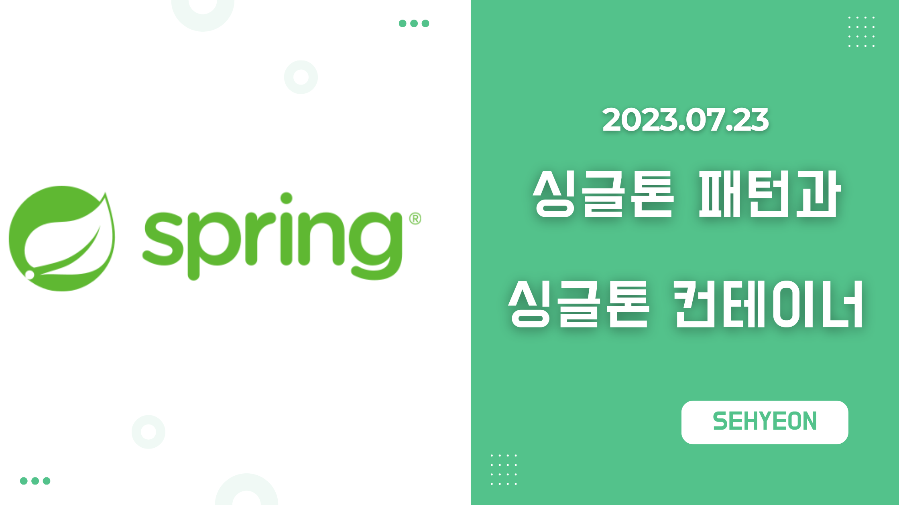
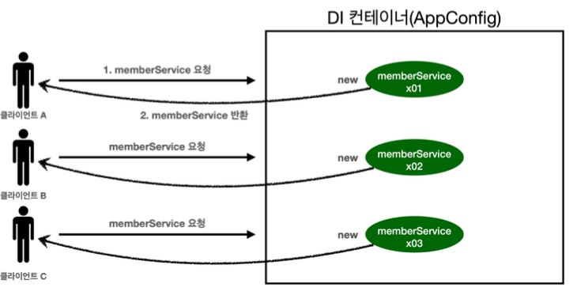
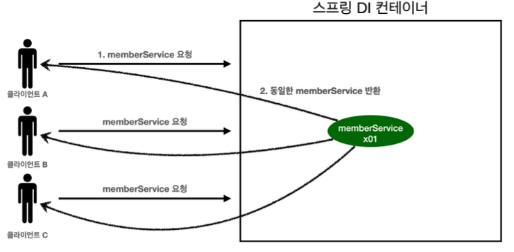
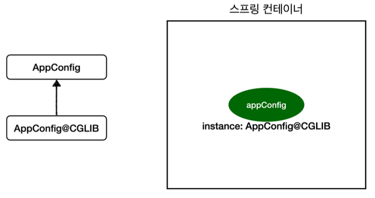

<br>

## 🤜 TIL (2023.07.23)
오늘 학습한 내용은 싱글톤 패턴과 싱글톤 패턴의 문제점에 대해서 알아보았다. 그리고 스프링에서 싱글톤 컨테이너가 어떻게 이 문제점들을 해결해주는 지에 대해서 알아보았다.

## 1. 웹 애플리케이션과 싱글톤
먼저, 스프링은 태생이 기업용 온라인 서비스 기술을 지원하기 위해 탄생했다. <br>
대부분의 스프링 애플리케이션은 웹 애플리케이션이다. 물론 웹이 아닌 애플리케이션 개발도 얼마든지 개발할 수 있다. <br>
또한, 웹 애플리케이션은 보통 여러 고객이 동시에 요청한다.


***웹 애플리케이션의 동작 방식***

### 📌 스프링 없는 순수한 DI 컨테이너
그동안 개발했던 것을 테스트하는 코드를 작성하고 실행해보자.
```java
package hello.core.singleton;

import hello.core.AppConfig;
import hello.core.member.MemberService;
import org.assertj.core.api.Assertions;
import org.junit.jupiter.api.DisplayName;
import org.junit.jupiter.api.Test;
import org.springframework.context.ApplicationContext;
import org.springframework.context.annotation.AnnotationConfigApplicationContext;

import static org.assertj.core.api.Assertions.*;

public class SingletonTest {

    @Test
    @DisplayName("스프링 없는 순수한 DI 컨테이너")
    void pureContainer() {
        AppConfig appConfig = new AppConfig();
        //1. 조회 : 호출할 때마다 객체를 생성
        MemberService memberService1 = appConfig.memberService();

        //2. 조회 : 호출할 때마다 객체를 생성
        MemberService memberService2 = appConfig.memberService();

        //참조값이 다른 것을 확인
        System.out.println("memberService1 = " + memberService1);
        System.out.println("memberService2 = " + memberService2);

        //memberService1 != memberService2
        assertThat(memberService1).isNotSameAs(memberService2);
    }
}
```
위의 코드는 다음 3가지 특징을 가지고 있다.
- 우리가 만들었던 스프링 없는 순수한 DI 컨테이너인 `AppConfig` 는 요청을 할 때마다 새로운 객체를 생성한다.
- 고객 트래픽이 초당 100이 나오면 초당 100개의 객체가 생성되고 소멸된다. 따라서 메모리 낭비가 심하다.
- 해결방안은 해당 객체가 딱 1개만 생성되고, 공유하도록 설계하면 된다. 이것을 `싱글톤 패턴`이라고 한다.

## 2. 싱글톤 패턴
### ❓ 싱글톤 패턴이란?
- 클래스의 인스턴스가 딱 1개만 생성되는 것을 보장하는 **디자인 패턴** 이다.
- 그래서 객체 인스턴스를 2개 이상 생성하지 못하도록 막아야한다. 그러기 위해 `private 생성자` 를 이용한다.

### ⚙️ 예시와 테스트
**예시** <br>
싱글톤 패턴이 무엇인지 알아보기 위해 간단한 `SingletonService` 를 아래와 같이 만든다.
```java
package hello.core.singleton;

public class SingletonService {

    //1. static 영역에 객체를 딱 1개만 생성한다.
    private static final SingletonService instance = new SingletonService();

    //2. public으로 열어서 객체 인스턴스가 필요하면 이 static 메소드를 통해서만 조회하도록 허용한다.
    public static SingletonService getInstance() {
        return instance;
    }

    //3. 생성자를 private으로 선언해서 외부에서 new 키워드를 사용한 객체 생성을 못하게 막는다.
    private SingletonService() {
    }

    public void logic() {
        System.out.println("싱글톤 객체 로직 호출");
    }
}
```
- static 영역에 객체 instance를 미리 하나 생성해서 올려둔다.
- 이 객체 인스턴스가 필요하면 오직 `getInstance()` 메소드를 통해서만 조회할 수 있다. 이 메소드를 호출하면 항상 같은 인스턴스를 반환한다.
- 딱 1개의 객체 인스턴스만 존재해야 하므로, 생성자를 **private** 으로 막아서 혹시라도 외부에서 new 키워드로 객체 인스턴스가 생성되는 것을 막는다.

**테스트** <br>
그리고 이제 이것을 테스트하는 코드를 작성해본다.
```java
package hello.core.singleton;

import hello.core.AppConfig;
import hello.core.member.MemberService;
import org.assertj.core.api.Assertions;
import org.junit.jupiter.api.DisplayName;
import org.junit.jupiter.api.Test;
import org.springframework.context.ApplicationContext;
import org.springframework.context.annotation.AnnotationConfigApplicationContext;

import static org.assertj.core.api.Assertions.*;

public class SingletonTest {

    @Test
    @DisplayName("싱글톤 패턴을 적용한 객체 사용")
    public void singletonServiceTest() {
        //1. 조회 : 호출할 때마다 같은 객체를 반환
        SingletonService singletonService1 = SingletonService.getInstance();

        //2. 조회 : 호출할 때마다 같은 객체를 반환
        SingletonService singletonService2 = SingletonService.getInstance();

        //참조값이 같은 것을 확인
        System.out.println("singletonService1 = " + singletonService1);
        System.out.println("singletonService2 = " + singletonService2);

        //singletonService1 == singletonService2
        assertThat(singletonService1).isSameAs(singletonService2);

        singletonService1.logic();
    }
}
```
> 참고 : 싱글톤 패턴을 구현하는 방법은 여러가지가 있다. 여기서는 객체를 미리 생성해두는 가장 단순하고 안전한 방법을 선택했다.

→ 싱글톤 패턴을 적용하면 요청이 올 때마다 객체를 생성하는 것이 아닌, 미리 만들어둔 객체를 공유해서 효율적으로 사용할 수 있다.

### 🔥 싱글톤 패턴의 문제점
하지만, 싱글톤 패턴은 다음의 수많은 **문제점**들을 가지고 있다.
- 싱글톤 패턴을 구현하는 코드 자체가 많이 들어간다.
- 의존관계 상 클라이언트가 구체 클래스에 의존한다. 따라서, `DIP를 위반` 한다.
- 클라이언트가 구체 클래스에 의존해서 `OCP 원칙을 위반` 할 가능성이 높다.
- 테스트하기 어렵다
- 내부 속성을 변경하거나 초기화 하기 어렵다.
- private 생성자로 자식 클래스를 만들기 어렵다.
- 결론적으로 `유연성` 이 떨어진다.
- 안티패턴으로 불리기도 한다.

## 3. 싱글톤 컨테이너
스프링 컨테이너는 싱글톤 패턴의 문제점을 해결하면서, 객체 인스턴스를 싱글톤으로 관리한다. 

### ❓ 싱글톤 컨테이너란?
- 스프링 컨테이너는 싱글톤 패턴을 적용하지 않아도, 객체 인스턴스를 싱글톤으로 관리한다.
- 스프링 컨테이너는 싱글톤 컨테이너 역할을 한다. 이렇게 싱글톤 객체를 생성하고 관리하는 기능을 `싱글톤 레지스트리` 라고 한다.
- 스프링 컨테이너의 이런 기능 덕분에 싱글톤 패턴의 모든 단점을 해결하면서 객체를 싱글톤으로 유지할 수 있다.

### ⚙️ 스프링 컨테이너를 사용하는 테스트
```java
package hello.core.singleton;

import hello.core.AppConfig;
import hello.core.member.MemberService;
import org.assertj.core.api.Assertions;
import org.junit.jupiter.api.DisplayName;
import org.junit.jupiter.api.Test;
import org.springframework.context.ApplicationContext;
import org.springframework.context.annotation.AnnotationConfigApplicationContext;

import static org.assertj.core.api.Assertions.*;

public class SingletonTest {

    @Test
    @DisplayName("스프링 컨테이너와 싱글톤")
    void springContainer() {
        ApplicationContext ac = new AnnotationConfigApplicationContext(AppConfig.class);

        //1. 조회 : 호출할 때마다 같은 객체를 반환
        MemberService memberService1 = ac.getBean("memberService", MemberService.class);

        //2. 조회 : 호출할 때마다 같은 객체를 반환
        MemberService memberService2 = ac.getBean("memberService", MemberService.class);

        //참조값이 같은 것을 확인
        System.out.println("memberService1 = " + memberService1);
        System.out.println("memberService2 = " + memberService2);

        //memberService1 == memberService2
        assertThat(memberService1).isSameAs(memberService2);
    }
}
```

### 🔥 싱글톤 컨테이너 적용 후


***싱글톤 컨테이너 적용 후***

스프링 컨테이너 적분에 고객의 요청이 올 때마다 객체를 생성하는 것이 아니라 이미 만들어진 객체를 공유해서 효율적으로 재사용할 수 있다.

## 4. 싱글톤 방식의 주의점
싱글톤 방식의 주의점은 아래와 같다.
- 싱글톤 패턴이든, 스프링 같은 싱글톤 컨테이너를 사용하든, 객체 인스턴스를 하나만 생성해서 공유하는 싱글톤 방식은 여러 클라이언트가 하나의 같은 객체를 `공유` 하기 때문에 싱글톤 객체는 `상태를 유지 (stateful)` 하게 설계하면 안된다.
- `무상태 (stateless)` 로 설계해야 한다.
    - 특정 클라이언트에 의존적인 필드가 있으면 안된다.
    - 특정 클라이언트가 값을 변경할 수 있는 필드가 있으면 안된다!
    - 가급적 읽기만 가능해야 한다.
    - 필드 대신에 자바에서 공유되지 않는 지역변수, 파라미터, ThreadLocal 등을 사용해야 한다.
- 스프링 빈의 필드에 공유 값을 설정하면 정말 큰 장애가 발생할 수 있다.

### 🚀 상태를 유지할 경우 발생하는 문제점 예시
싱글톤 패턴에서 상태를 유지할 경우 발생하는 문제를 알아보기 위해 아래와 같이 상태를 유지하는 서비스를 만들었다. <br>
```java
package hello.core.singleton;

public class StatefulService {

    private int price; //상태를 유지하는 필드

    public void order(String name, int price) {
        System.out.println("name = " + name + " price = " + price);
        this.price = price; //여기가 문제!
    }

    public int getPrice() {
        return price;
    }
}
```

**테스트** <br>
그리고 테스트를 만들어 실행해보면 아래와 같은 문제점이 발생한다는 것을 알 수 있다.
```java
package hello.core.singleton;

import org.assertj.core.api.Assertions;
import org.junit.jupiter.api.Test;
import org.springframework.context.ApplicationContext;
import org.springframework.context.annotation.AnnotationConfigApplicationContext;
import org.springframework.context.annotation.Bean;

import static org.assertj.core.api.Assertions.*;

class StatefulServiceTest {

    @Test
    void statefulServiceSingleton() {
        ApplicationContext ac = new AnnotationConfigApplicationContext(TestConfig.class);
        StatefulService statefulService1 = ac.getBean("statefulService", StatefulService.class);
        StatefulService statefulService2 = ac.getBean("statefulService", StatefulService.class);

        //ThreadA: A사용자 10000원 주문
        statefulService1.order("userA", 10000);
        //ThreadB: B사용자 20000원 주문
        statefulService2.order("userB", 20000);

        //TreadA: 사용자A 주문 금액 조회
        int price = statefulService1.getPrice();
        //ThreadA: 사용자A는 10000원을 기대했지만, 기대와 다르게 20000원 출력
        System.out.println("price = " + price);
        assertThat(statefulService1.getPrice()).isEqualTo(20000);
    }

    static class TestConfig {
        @Bean
        public StatefulService statefulService() {
            return new StatefulService();
        }
    }
}
```
- 최대한 단순히 설명하기 위해, 실제 쓰레드는 사용하지 않았다.
- ThreadA가 사용자A 코드를 호출하고 ThreadB가 사용자B 코드를 호출한다 가정하자.
- `StatefulService` 의 `price` 필드는 공유되는 필드인데, 특정 클라이언트가 값을 변경한다.
- 사용자A의 주문금액은 10000원이 되어야 하는데, 20000원이라는 결과가 나왔다.
- 실무에서 이런 경우를 종종 보는데, 이로인해 정말 해결하기 어려운 큰 문제들이 터진다.(몇년에 한번씩 꼭 만난다.)
- 진짜 공유필드는 조심해야 한다! 스프링 빈은 항상 무상태(stateless)로 설계하자.

## 5. @Configuration과 싱글톤
먼저 기존에 만들었던 `AppConfig` 코드를 살펴보자.
```java
	package hello.core;

import hello.core.discount.DiscountPolicy;
import hello.core.discount.RateDiscountPolicy;
import hello.core.member.MemberService;
import hello.core.member.MemberServiceImpl;
import hello.core.member.MemoryMemberRepository;
import hello.core.order.OrderService;
import hello.core.order.OrderServiceImpl;
import org.springframework.context.annotation.Bean;
import org.springframework.context.annotation.Configuration;

@Configuration
public class AppConfig {

    @Bean
    public MemberService memberService() {
        return new MemberServiceImpl(memberRepository());
    }

    @Bean
    public OrderService orderService() {
        return new OrderServiceImpl(
            memberRepository(),
            discountPolicy());
    }
	
    @Bean
    public MemberRepository memberRepository() {
        return new MemoryMemberRepository();
    }
    ...
}
```
`AppConfig` 코드에서 이상한 점이 있다.
- memberService 빈을 만드는 코드를 보면 `memberRepository()` 를 호출한다.
    - 이 메서드를 호출하면 `new MemoryMemberRepository()` 를 호출한다.
- orderService 빈을 만드는 코드도 동일하게 `memberRepository()` 를 호출한다.
    - 이 메서드를 호출하면 `new MemoryMemberRepository()` 를 호출한다.

결과적으로 각각 다른 2개의 `MemoryMemberRepository` 가 생성되면서 싱글톤이 깨지는 것처럼 보인다. 스프링 컨테이너는 이 문제를 어떻게 해결할까?

### 🚀 검증 용도 코드 추가
이것을 검증하기 위해 두 개의 서비스 구현체에 생성된 객체를 반환하는 코드를 삽입한다.
```java
public class MemberServiceImpl implements MemberService{

    private final MemberRepository memberRepository;

    //테스트 용도
    public MemberRepository getMemberRepository() {
        return memberRepository;
    }
}

public class OrderServiceImpl implements OrderService{

    private final MemberRepository memberRepository;

    //테스트 용도
    public MemberRepository getMemberRepository() {
        return memberRepository;
    }
}
```

### 🚀 테스트
```java
package hello.core.singleton;

import hello.core.AppConfig;
import hello.core.member.MemberRepository;
import hello.core.member.MemberServiceImpl;
import hello.core.order.OrderServiceImpl;
import org.junit.jupiter.api.Test;
import org.springframework.context.ApplicationContext;
import org.springframework.context.annotation.AnnotationConfigApplicationContext;

import static org.assertj.core.api.Assertions.*;

public class ConfigurationSingletonTest {

    @Test
    void configurationTest() {
        ApplicationContext ac = new AnnotationConfigApplicationContext(AppConfig.class);

        MemberServiceImpl memberService = ac.getBean("memberService", MemberServiceImpl.class);
        OrderServiceImpl orderService = ac.getBean("orderService", OrderServiceImpl.class);
        MemberRepository memberRepository = ac.getBean("memberRepository", MemberRepository.class);

        //모두 같은 인스턴스를 참조하고 있다.
        System.out.println("memberService -> memberRepository = " + memberService.getMemberRepository());
        System.out.println("orderService -> memberRepository = " + orderService.getMemberRepository());
        System.out.println("memberRepository = " + memberRepository);
        
        assertThat(memberService.getMemberRepository()).isSameAs(memberRepository);
        assertThat(orderService .getMemberRepository()).isSameAs(memberRepository);
    }

}
```
- 확인해보면 memberRepository 인스턴스는 모두 같은 인스턴스가 공유되어 사용된다.
- AppConfig의 자바 코드를 보면 분명히 각각 2번 `new MemoryMemberRepository` 호출해서 다른 인스턴스가 생성되어야 하는데?
- 어떻게 된 일일까? 혹시 두 번 호출이 안되는 것일까? 실험을 통해 알아보자.

### ⚙️ AppConfig에 호출 로그 추가
생성자의 호출 로그를 알아보기 위해 호출 로그를 추가한다.
```java
package hello.core;

import hello.core.discount.DiscountPolicy;
import hello.core.discount.RateDiscountPolicy;
import hello.core.member.MemberService;
import hello.core.member.MemberServiceImpl;
import hello.core.member.MemoryMemberRepository;
import hello.core.order.OrderService;
import hello.core.order.OrderServiceImpl;
import org.springframework.context.annotation.Bean;
import org.springframework.context.annotation.Configuration;

@Configuration
public class AppConfig {

    @Bean
    public MemberService memberService() {
        System.out.println("call AppConfig.memberService");
        return new MemberServiceImpl(memberRepository());
    }

    @Bean
    public MemoryMemberRepository memberRepository() {
        System.out.println("call AppConfig.memberRepository");
        return new MemoryMemberRepository();
    }

    @Bean
    public OrderService orderService() {
        System.out.println("call AppConfig.orderService");
        return new OrderServiceImpl(memberRepository(), discountPolicy());
    }

    @Bean
    public DiscountPolicy discountPolicy() {
//        return new FixDiscountPolicy();
        return new RateDiscountPolicy();
    }
}
```
호출 로그를 추가하고, 테스트를 다시 실행해보자.
출력 결과는 예상했던 것과 다르게 모두 1번만 호출된다. 이러한 이유는 `@Configuration` 과 바이트코드 조작에서 설명한다.

## 6. @Configuration과 바이트코드 조작의 마법

스프링 컨테이너는 싱글톤 레지스트리다. 따라서 스프링 빈이 싱글톤이 되도록 보장해주어야 한다. <br>
그런데 스프링이 자바 코드까지 어떻게 하기는 어렵다. 저 자바 코드를 보면 분명 3번 호출되어야 하는 것이 맞다. <br>
그래서 스프링은 클래스의 바이트코드를 조작하는 라이브러리를 사용한다. <br>
모든 비밀은 `@Configuration` 을 적용한 `AppConfig` 에 있다. <br>

### 🔥 AppConfig 클래스 정보 조회

```java
@Test
void configurationDeep() {
    ApplicationContext ac = new AnnotationConfigApplicationContext(AppConfig.class);

    //AppConfig도 스프링 빈으로 등록된다.
    AppConfig bean = ac.getBean(AppConfig.class);

    //출력 : bean = class hello.core.AppConfig$$EnhancerBySpringCGLIB$$1ac4a1de
    System.out.println("bean = " + bean.getClass());
}
```

순수한 클래스라면 `class hello.core.AppConfig` 와 같이 출력되어야한다.

하지만, 예상과 다르게 클래스 명에 xxxCGLIB 가 붙으면서 복잡해진 것을 알 수 있다. 이것은 내가 만든 클래스가 아니라 `스프링이 CGLIB` 라는 바이트코드 조작 라이브러리를 사용해서 AppConfig 클래스를 상속받은 `임의의 다른 클래스` 를 만들고 그것을 스프링 빈으로 등록한 것이다!


***바이트 코드 조작의 마법***

그 임의의 클래스가 바로 싱글톤이 보장되도록 해준다.

## ✋ 마무리하며
정리하자면, 싱글톤 패턴이 보장되도록 스프링에서는 바이트코드 조작 라이브러리를 사용해 임의의 클래스를 만들고 스프링 빈으로 등록한다. 그 결과 우리는 싱글톤 패턴이 보장된 상황에서 개발을 진행할 수 있는 것이다!

<br>

> [인프런 스프링 핵심 원리 - 기본편](https://www.inflearn.com/course/%EC%8A%A4%ED%94%84%EB%A7%81-%ED%95%B5%EC%8B%AC-%EC%9B%90%EB%A6%AC-%EA%B8%B0%EB%B3%B8%ED%8E%B8) <br>
> > 이 글은 은 인프런 김영한님의 강좌, 스프링 핵심 원리 - 기본편 강좌를 수강 후 작성한 것입니다. <br>
> > 모든 코드와 사진들은 강의에서 가져왔습니다. <br>
> > 문제가 있다면 알려주세요!

```toc
```