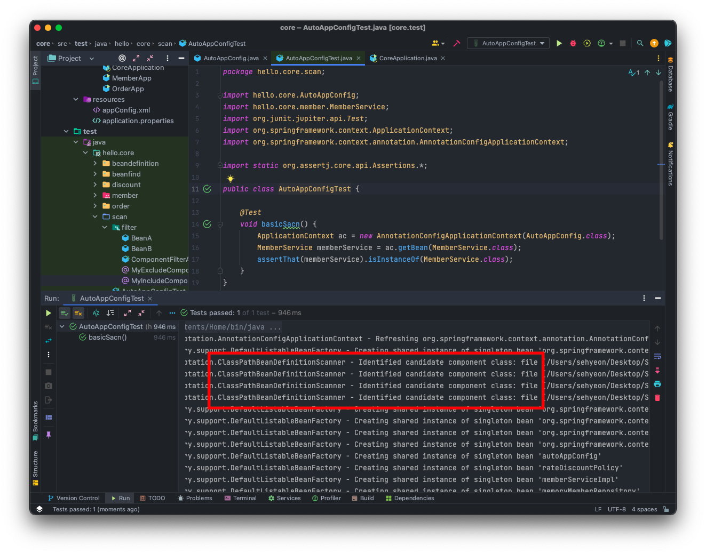
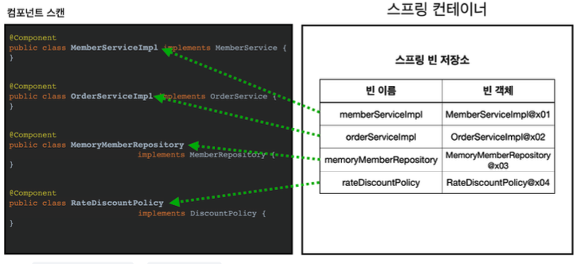
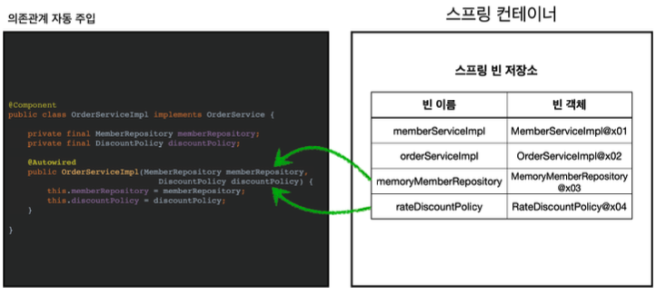
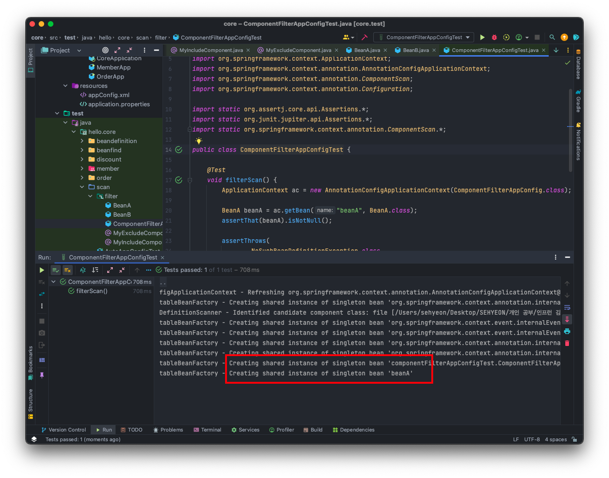
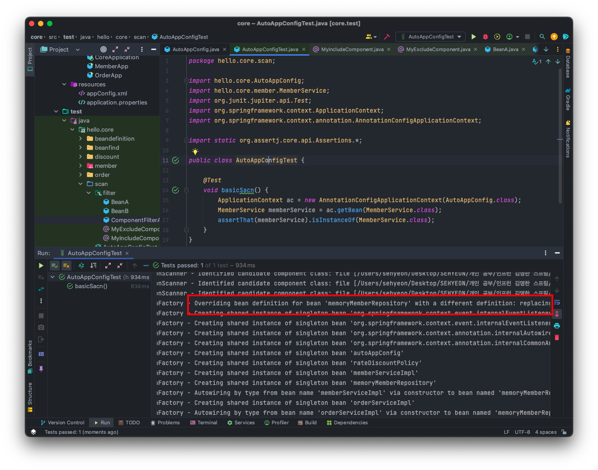
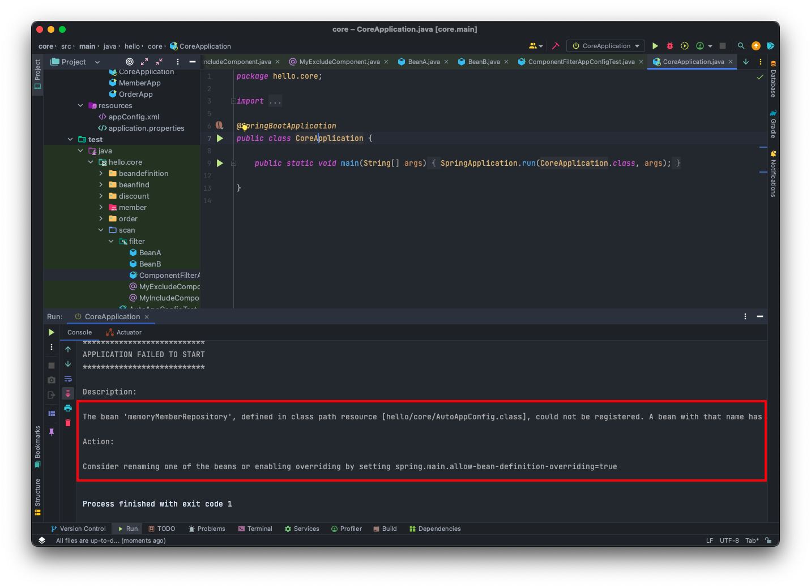

<br>

## 🤜 TIL (2023.07.24)
오늘 학습한 내용은 스프링 빈을 등록할 때 설정 정보에 직접 나열하는 것이 아닌, 스프링에서 자동으로 등록해주는 컴포넌트 스캔에 대해 알아보았다. 또한, 의존관계도 자동으로 주입해주는 **@Autowired** 에 대해서도 알아보았다. 컴포넌트 스캔의 동작 원리와 몇가지 옵션들에 대해 학습하는 시간을 가졌다.

## 1. 컴포넌트 스캔과 의존관계 자동 주입 시작하기
지금까지는 스프링 빈을 등록할 때 자바 코드의 **@Bean** 이나 XML의 **<bean>** 등을 통해 설정 정보에 직접 등록할 스프링 빈을 나열했다. <br>
만약 이렇게 등록해야 할 스프링 빈이 수백개가 되면 일일이 등록하기 귀찮고, 설정 정보도 커지고, 누락하는 문제도 발생한다. <br>
그래서 스프링은 설정 정보가 없어도 자동으로 스프링 빈을 등록하는 `컴포넌트 스캔` 이라는 기능을 제공한다. <br> 
또한, 의존관계도 자동으로 주입하는 `@Autowired` 라는 기능도 제공한다.

### 🔥 새로운 AutoAppConfig
컴포넌트 스캔을 적용한 새로운 `AutoAppConfig` 를 만들어보자!
```java
package hello.core;

import org.springframework.context.annotation.ComponentScan;
import org.springframework.context.annotation.Configuration;
import org.springframework.context.annotation.FilterType;

import static org.springframework.context.annotation.ComponentScan.*;

@Configuration
@ComponentScan(
        basePackages = "hello.core",
        excludeFilters = @Filter(type = FilterType.ANNOTATION, classes = Configuration.class)
)
public class AutoAppConfig {
}
```
- 컴포넌트 스캔을 사용하려면 먼저 `@ComponentScan` 을 설정 정보에 붙여주면 된다.
- 기존 **AppConfig** 와는 다르게 `@Bean` 으로 등록한 클래스가 하나도 없다.
> 참고 : 여기서는 기존에 만들어 두었던 AppConfig, TestConfig 등 설정 정보도 함께 등록되고 실행되는 것을막기 위해서 `excludeFilters` 을 이용해 설정 정보는 컴포넌트 스캔 대상에서 제외했다. 보통 설정 정보를 컴포넌트 스캔 대상에서 제외하지 않지만 기존 예제 코드를 남기고 유지하기 위해 이 방법을 선택했다.

### 🚀 @Component 어노테이션 붙이기
컴포넌트 스캔은 `@Component` 어노테이션이 붙은 클래스를 스캔해서 스프링 빈으로 등록한다. 각 클래스가 컴포넌트 스캔의 대상이 되도록 `@Component` 어노테이션을 추가한다.

**MemoryMemberRepository**
```java
@Component
public class MemoryMemberRepository implements MemberRepository {}
```

**RateDiscountPolicy**
```java
@Component
public class RateDiscountPolicy implements DiscountPolicy {}
```

**MemberServiceImpl**
```java
@Component
public class MemberServiceImpl implements MemberService {
	
    private final MemberRepository memberRepository;
    
    @Autowired
    public MemberServiceImpl(MemberRepository memberRepository){
        this.memberRepository = memberRepository;
    }
}
```

**OrderServiceImpl**
```java
@Component
public class OrderServiceImpl implements OrderService {
	
    private final MemberRepository memberRepository;
    private final DiscountPolicy discountPolicy

    @Autowired
    public OrderServiceImpl(MemberRepository memberRepository, DiscountPolicy discountPolicy) {
        this.memberRepository = memberRepository;
        this.discountPolicy = discountPolicy;
    }
}
```
- `@Autowired` 를 사용하면 생성자에서 여러 의존관계도 한번에 주입 받을 수 있다.

### ⚙️ AutoAppCofig 테스트
새롭게 만든 `AutoAppConfig` 가 기존 코드와 같이 동작하는지 확인해보자!
```java
package hello.core.scan;

import hello.core.AutoAppConfig;
import hello.core.member.MemberService;
import org.junit.jupiter.api.Test;
import org.springframework.context.ApplicationContext;
import org.springframework.context.annotation.AnnotationConfigApplicationContext;

import static org.assertj.core.api.Assertions.*;

public class AutoAppConfigTest {

    @Test
    void basicSacn() {
        ApplicationContext ac = new AnnotationConfigApplicationContext(AutoAppConfig.class);
        MemberService memberService = ac.getBean(MemberService.class);
        assertThat(memberService).isInstanceOf(MemberService.class);
    }
}
```
- **AnnotationConfigApplicationContext** 를 사용하는 것은 기존과 동일하다.
- 설정 정보로 `AutoAppCofig` 클래스를 넘겨준다.
- 실행해보면 기존과 같이 잘 동작하는 것을 확인할 수 있다.


***실행결과 - 기존과 같이 동작한다!***

로그를 잘 보면 컴포넌트 스캔이 잘 동작하는 것을 확인할 수 있다.
```
ClassPathBeanDefinitionScanner - Identified candidate component class:
 .. RateDiscountPolicy.class
 .. MemberServiceImpl.class
 .. MemoryMemberRepository.class
 .. OrderServiceImpl.class
```

### ❓ 컴포넌트 스캔과 자동 의존관계 주입의 동작 원리
위에서 작성했던 코드들, **컴포넌트 스캔** 과 **자동 의존관계 주입** 의 동작 원리를 알아보자!

**1. @ComponentScan**


***컴포넌트 스캔의 동작 원리***

- **@ComponentScan** 은 `@Component` 가 붙은 모든 클래스를 스프링 빈으로 자동 등록한다.
- 이때 스프링 빈의 기본 이름은 **클래스 명** 을 사용하되, 맨 앞글자만 **소문자를 사용한다**
    - **빈 이름 기본 전략** : MemberServiceImpl → memberServiceImpl
    - **빈 이름 직접 지정** : @Component(”memberService2”) → 빈 이름을 부여할 수 있다.

**2. @Autowired 의존관계 자동 주입**


***@Autowired, 의존관계 자동 주입의 동작 원리***

- 생성자에 `@Autowired` 을 지정하면, 스프링 컨테이너가 자동으로 해당 스프링 빈을 찾아서 주입한다.
- 이때 기본 조회 전략은 타입이 같은 빈을 찾아서 주입한다.
- 생성자에 파라미터가 많아도 다 찾아서 자동으로 주입한다.

## 2. 탐색 위치와 기본 스캔 대상

### 📌 탐색할 패키지의 시작 위치 지정

컴포넌트 스캔 시 아래와 같이 꼭 필요한 위치부터 탐색하도록 시작 위치를 지정할 수 있다.

```java
@ComponentScan(
	basePackages = "hello.core",
)
```
- `basePackages` : 탐색할 패키지의 시작 위치를 지정한다. 이 패키지를 포함해서 하위 패키지를 모두 탐색한다.
- `basePackages = {"hello.core", "hello.service"}` : 이렇게 여러 시작 위치를 지정할 수도 있다.
- `basePackagesClasses` : 지정한 클래스의 패키지를 탐색 시작 위치로 지정한다.
- 만약 지정하지 않으면 `@ComponentScan` 이 붙은 설정 정보의 클래스의 패키지가 시작 위치가 된다.

### 🔥 권장하는 방법
패키지 위치를 지정하지 않고, 설정 정보 클래스의 위치를 **프로젝트 최상단** 에 두는 것을 권장한다. 스프링 부트도 이 방법을 기본으로 제공한다.

**예시**
```
com.hello
com.hello.service
com.hello.repository
```
프로젝트 구조가 위와 같다면 `com.hello` 프로젝트의 루트에 **AppConfig** 와 같은 메인 설정 정보를 두고, `@ComponentScan` 어노테이션을 붙인다.

→ 이렇게 하면 `com.hello` 를 포함한 하위 패키지는 모두 자동으로 컴포넌트 스캔의 대상이 된다. 그리고 프로젝트 메인 설정 정보는 **프로젝트를 대표하는 정보** 이기 때문에 프로젝트 시작 루트 위치에 두는 것이 좋다.

→ 참고로 스프링 부트를 사용하면 스프링 부트이 대표 시작 정보인 `@SpringBootApplication` 을 프로젝트 시작 루트에 두는 것이 관례이다. 그리고 이 설정 안에 **@ComponentScan** 이 들어있다!

### ⚙️ 컴포넌트 스캔 기본 대상
컴포넌트 스캔은 `@Component` 뿐 아니라 다음과 같은 내용도 추가로 대상에 포함한다. 그리고 다음 어노테이션이 있으면 스프링은 부가 기능을 수행한다.
- **@Component** : 컴포넌트 스캔에서 사용
- **@Controller** : 스프링 MVC 컨트롤러에서 사용
    - 스프링 MVC 컨트롤러로 인식
- **@Repository** : 스프링 데이터 접근 계층에서 사용
    - 스프링 데이터 접근 계층으로 인식하고, 데이터 계층의 예외를 스프링 예외로 변환
- **@Configuration** : 스프링 설정 정보에서 사용
    - 스프링 설정 정보로 인식하고, 스프링 빈이 싱글톤을 유지하도록 추가 처리
- **@Service** : 스프링 비즈니스 로직에서 사용
    - 특별한 처리를 하지 않는 대신, 개발자들이 핵심 비즈니스 로직 계층을 인식하는데 도움

## 3. 필터
컴포넌트 스캔의 필터는 다음 두 가지가 있다.
- **includeFilters** : 컴포넌트 스캔 대상을 추가로 지정한다.
- **excludeFilters** : 컴포넌트 스캔에서 제외할 대상을 지정한다.

### 🚀 예제로 알아보기
컴포넌트 스캔의 필터 기능을 알아보기 위해 두 가지 어노테이션을 만든다. <br>
하나는 스캔 대상에 추가하고, 하나는 스캔 대상에서 제외하도록 아래와 같이 어노테이션을 만들어준다.
**컴포넌트 스캔 대상에 추가할 어노테이션**
```java
package hello.core.scan.filter;

import java.lang.annotation.*;

@Target(ElementType.TYPE)
@Retention(RetentionPolicy.RUNTIME)
@Documented
public @interface MyIncludeComponent {
}
```

**컴포넌트 스캔 대상에서 제외할 어노테이션**
```java
package hello.core.scan.filter;

import java.lang.annotation.*;

@Target(ElementType.TYPE)
@Retention(RetentionPolicy.RUNTIME)
@Documented
public @interface MyExcludeComponent {
}
```

그리고 이제 이 어노테이션을 적용한 클래스를 아래와 같이 두 가지를 만들어준다. <br>

**컴포넌트 스캔 대상에 추가할 클래스**
```java
package hello.core.scan.filter;

@MyIncludeComponent
public class BeanA {
}
```

**컴포넌트 스캔 대상에서 제외할 클래스**
```java
package hello.core.scan.filter;

@MyExcludeComponent
public class BeanB {
}
```

이제 전체 코드를 테스트해보자! <br>

**전체 코드 테스트**
```java
package hello.core.scan.filter;

import org.junit.jupiter.api.Test;
import org.springframework.beans.factory.NoSuchBeanDefinitionException;
import org.springframework.context.ApplicationContext;
import org.springframework.context.annotation.AnnotationConfigApplicationContext;
import org.springframework.context.annotation.ComponentScan;
import org.springframework.context.annotation.Configuration;
import org.springframework.context.annotation.FilterType;

import static org.assertj.core.api.Assertions.*;
import static org.junit.jupiter.api.Assertions.*;
import static org.springframework.context.annotation.ComponentScan.*;

public class ComponentFilterAppConfigTest {

    @Test
    void filterScan() {
        ApplicationContext ac = new AnnotationConfigApplicationContext(ComponentFilterAppConfig.class);

        BeanA beanA = ac.getBean("beanA", BeanA.class);
        assertThat(beanA).isNotNull();

        assertThrows(
                NoSuchBeanDefinitionException.class,
                () -> ac.getBean("beanB", BeanB.class));
    }

    @Configuration
    @ComponentScan(
            includeFilters = @Filter(classes = MyIncludeComponent.class),
            excludeFilters = @Filter(  classes = MyExcludeComponent.class)
    )
    static class ComponentFilterAppConfig {
    }
}
```


***컴포넌트 스캔 필터 테스트 결과***

- **BeanA** 는 컴포넌트 스캔 대상으로 지정해 스프링 빈에 등록되었지만, **BeanB** 는 컴포넌트 스캔 대상에서 제외해 스프링 빈으로 등록되지 않았다.

### ⚙️ FilterType 옵션
FilterType 옵션은 다음 5가지 옵션이 있다.
- **ANNOTATION** : 기본값, 어노테이션을 인식해서 동작한다. 기본값이므로, 생략할 수 있다.
- **ASSIGNABLE_TYPE** : 지정한 타입과 자식 타입을 인식해서 동작한다.
- **ASPECTJ** : AspectJ 패턴을 사용한다.
- **REGEX** : 정규 표현식
- **CUSTOM** : TypeFilter 이라는 인터페이스를 구현해서 처리한다.

> 참고 : `@ComponentScan` 이면 충분하기 때문에 **includeFilters** 를 사용할 일은 거의 없다. **excludeFilters** 는 여러 이유로 간혹 사용하지만 많지는 않다.
스프링 부트는 컴포넌트 스캔을 기본으로 제공하는데, 옵션을 변경해서 사용하기 보다 스프링의 기본 설정에 최대한 맞추어 사용하는 것을 권장한다.

## 4. 중복 등록과 충돌

컴포넌트 스캔에서 같은 빈 이름을 등록하면 어떻게 될까?

> 1. 자동 빈 등록 vs 자동 빈 등록 <br>
> 2. 수동 빈 등록 vs 자동 빈 등록

위의 두 가지 상황에서 어떻게 동작하는지 알아보자.

### 📌 자동 빈 등록 vs 자동 빈 등록
- 컴포넌트 스캔에 의해 자동으로 스프링 빈이 등록되는데, 이름이 같은 경우 스프링은 오류를 발생시킨다.
- 오류 종류 : **ConflictingBeanDefinitionException** 예외 발생

### 📌 수동 빈 등록 vs 자동 빈 등록
```java
package hello.core;

import hello.core.member.MemberRepository;
import hello.core.member.MemoryMemberRepository;
import org.springframework.context.annotation.Bean;
import org.springframework.context.annotation.ComponentScan;
import org.springframework.context.annotation.Configuration;
import org.springframework.context.annotation.FilterType;

import static org.springframework.context.annotation.ComponentScan.*;

@Configuration
@ComponentScan(
        basePackages = "hello.core",
        excludeFilters = @Filter(type = FilterType.ANNOTATION, classes = Configuration.class)
)
public class AutoAppConfig {
    @Bean("memoryMemberRepository")
    public MemberRepository memberRepository() {
        return new MemoryMemberRepository();
    }
}
```
- 위와 같이 설정 정보에 `MemoryMemberRepository` 를 스프링 빈으로 등록하도록 설정했다. 그리고 테스트를 돌려보자.


***수동 빈 등록 vs 자동 빈 등록***

- `Overriding bean definition for bean 'memoryMemberRepository' with a different definition: replacing` 이라는 로그와 함께 수동 빈 등록이 우선권을 가진다. 즉, 수동 빈이 자동 빈을 **오버라이딩** 해버린다!

### ❓ 스프링 부트에서는 어떻게 처리?
최근 스프링 부트에서는 수동 빈 등록과 자동 빈 등록이 충돌되면 오류가 발생하도록 기본 값을 바꾸었다. 그러한 이유는 개발자가 의도해서 이런 결과가 만들어지기 보다는 여러 설정들이 꼬여 만들어지는 경우가 대부분이며 이러한 경우 **해결하기 어려운 버그가 만들어지기 때문이다!**

스프링 부트인 `CoreApplication` 을 실행하면 보이는 에러는 다음과 같다.


***스프링 부트 테스트는 오류를 발생!***

- 스프링 부트는 수동 빈 등록과 자동 빈 등록이 충돌되면 `Consider renaming one of the beans or enabling overriding by setting` 이러한 에러 메시지를 출력하며 위에서처럼 수동 빈이 우선권을 가지도록 하려면 `spring.main.allow-bean-definition-overriding=true` 이와 같이 옵션을 변경하라고 한다.

## ✋ 마무리하며
스프링은 스프링 빈을 자동으로 등록하며 의존관계 역시 자동으로 주입해주는 컴포넌트 스캔과 자동 의존관계 주입을 지원한다. 오늘은 기존에 수동으로 등록했던 것들을 자동화해보는 시간을 가졌다. 요즘 스프링을 학습하며 느끼는 것 중 하나는 스프링이 뱉어내는 오류 코드가 매우 친절하다는 것이다. 오류 코드만 자세히 들여다보면 무엇이 문제인지 금방 알 수 있는 느낌이다.

<br>

> [인프런 스프링 핵심 원리 - 기본편](https://www.inflearn.com/course/%EC%8A%A4%ED%94%84%EB%A7%81-%ED%95%B5%EC%8B%AC-%EC%9B%90%EB%A6%AC-%EA%B8%B0%EB%B3%B8%ED%8E%B8) <br>
> > 이 글은 은 인프런 김영한님의 강좌, 스프링 핵심 원리 - 기본편 강좌를 수강 후 작성한 것입니다. <br>
> > 모든 코드와 사진들은 강의에서 가져왔습니다. <br>
> > 문제가 있다면 알려주세요!

```toc
```