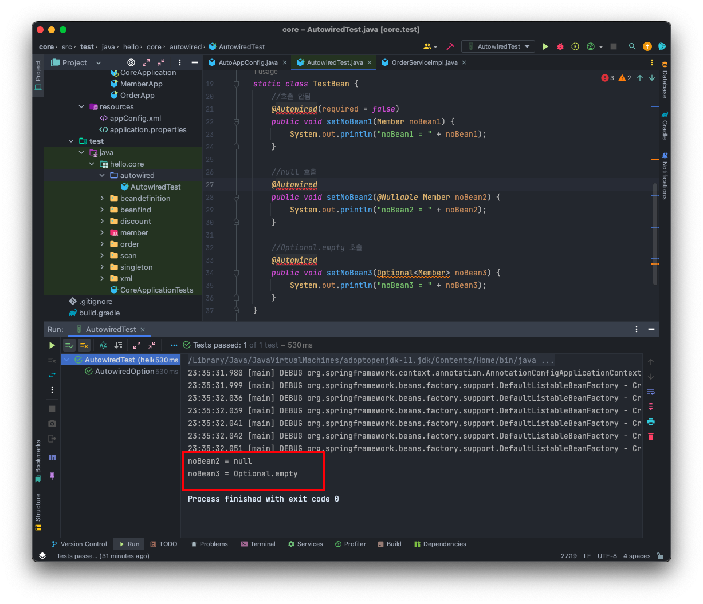
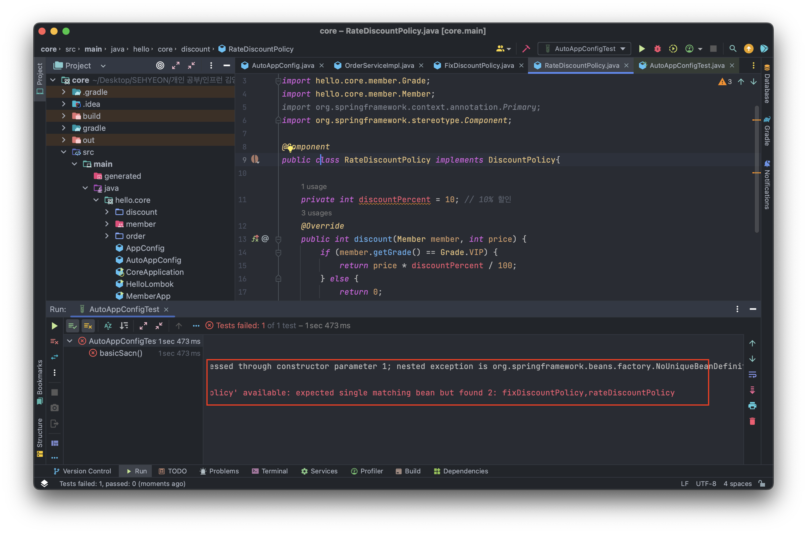

<br>

## 🤜 TIL (2023.07.25)
오늘 학습한 내용은 의존관계 주입의 4가지 방법에 대해 알아보았다. 또한, 이것을 어떻게 사용하는지, 어떤 의존관계 주입 방법을 사용하는 것이 바람직한지에 대해 알아보았다. 마지막으로, 자동 등록과 수동 등록 중 실무 운영 기준에 대해서도 알아보았다.

## 1. 다양한 의존관계 주입 방법
의존관계 주입은 크게 4가지 방법이 있다.
- 생성자 주입
- 수정자 주입 (setter 주입)
- 필드 주입
- 일반 메소드 주입

지금부터 이것들에 대해 하나씩 알아본다.
### ❄️ 생성자 주입
생성자 주입은 지금까지 사용해왔던 방식으로 **생성자를 통해** 의존관계를 주입 받는 방법이다. <br><br>
**특징**
- 생성자 호출 시점에 딱 1번만 호출되는 것이 보장된다.
- `불변, 필수` 의존관계에 사용한다.
**예시**
```java
public class OrderServiceImpl implements OrderService {

    private final MemberRepository memberRepository;
    private final DiscountPolicy discountPolicy;

    @Autowired
    public OrderServiceImpl(MemberRepository memberRepository, 
                    DiscountPolicy discountPolicy) {
        this.memberRepository = memberRepository;
        this.discountPolicy = discountPolicy;
    }
}
```
- 여기서 중요한 것은 `생성자가 딱 1개만 있으면` **@Autowired** 를 생략해도 자동 주입된다. 물론 스프링 빈에만 해당한다.

### ❄️ 수정자 주입 (setter 주입)
수정자 주입은 `setter` 라 불리는 필드의 값을 변경하는 `수정자 메소드` 를 통해 의존관계를 주입하는 방법이다. <br><br>
**특징**
- `선택, 변경` 가능성이 있는 의존관계에 사용
- **자바빈 프로퍼티 규약** 의 수정자 메소드 방식을 사용하는 방법이다.
**예시**
```java
public class OrderServiceImpl implements OrderService {

	private MemberRepository memberRepository;
    private DiscountPolicy discountPolicy;
    
    @Autowired
    public void setMemberRepository(MemberRepository memberRepository) {
        this.memberRepository = memberRepository;
    }

    @Autowired
    public void setDiscountPolicy(DiscountPolicy discountPolicy) {
        this.discountPolicy = discountPolicy;
    }
}
```
- **@Autowired** 의 기본 동작은 주입할 대상이 없으면 오류가 발생한다. 주입할 대상이 없어도 동작하게 하려면 **@Autowired(required = false)** 로 지정하면된다.

### ❄️ 필드 주입
필드 주입은 이름 그대로 필드에 바로 의존관계를 주입하는 방법이다. <br><br>
**특징**
- 코드가 간결해서 많은 개발자들을 유혹하지만, **외부에서 변경이 불가능** 해서 테스트하기 힘들다는 치명적인 단점이 있다.
- DI 프레임워크가 없으면 아무것도 할 수 없다.
- 결론은 **사용하지 말자!**
- 애플리케이션의 실제 코드와 관계 없는 테스트 코드, 스프링 설정을 목적으로 하는 @Configuration 같은 곳에서만 특별한 용도로 사용한다.
**예시**
```java
public class OrderServiceImpl implements OrderService {

    @Autowired private MemberRepository memberRepository;
    @Autowired private DiscountPolicy discountPolicy;
}
```
- 순수한 자바 테스트 코드에는 당연히 **@Autowired** 가 동작하지 않는다. **@SpringBootTest** 처럼 스프링 컨테이너를 테스트에 통합한 경우에만 가능하다.

### ❄️ 일반 메소드 주입
의존관계는 일반 메소드를 통해서도 주입 받을 수 있다. <br><br>
**특징**
- 한 번에 여러 필드를 주입 받을 수 있다.
- 일반적으로 잘 사용하지 않는다.
**예시**
```java
public class OrderServiceImpl implements OrderService {

    private MemberRepository memberRepository;
    private DiscountPolicy discountPolicy;
    
    @Autowired
    public void init(MemberRepository memberRepository, 
                    DiscountPolicy discountPolicy) {
        this.memberRepository = memberRepository;
        this.discountPolicy = discountPolicy;
    }
}
```

## 2. 옵션 처리
주입할 스프링 빈이 없어도 동작해야 할 때가 있다. 그런데 `@Autowired` 만 사용하면 `required` 옵션의 기본값은 `true` 이기 때문에 자동 주입 대상이 없으면 오류가 발생한다.

### ❓ 자동 주입 대상 옵션 처리 방법
자동 주입 대상을 옵션으로 처리하는 방법은 다음과 같다.
- **@Autowired(required = false)** : 자동 주입할 대상이 없으면 수정자 메소드 자체가 호출이 안된다.
- **org.springframework.lang.@Nullable** : 자동 주입할 대상이 없으면 `null` 이 입력된다.
- **Optional<>** : 자동 주입할 대상이 없으면 `Optional.empty` 가 입력된다.

### 🔥 예시
`AutowiredTest` 라는 것을 만들고, 이를 테스트 해보자!
```java
package hello.core.autowired;

import hello.core.member.Member;
import org.junit.jupiter.api.Test;
import org.springframework.beans.factory.annotation.Autowired;
import org.springframework.context.annotation.AnnotationConfigApplicationContext;
import org.springframework.lang.Nullable;

import java.util.Optional;

public class AutowiredTest {

    @Test
    void AutowiredOption() {
        AnnotationConfigApplicationContext ac = new AnnotationConfigApplicationContext(TestBean.class);

    }

    static class TestBean {
        //호출 안됨
        @Autowired(required = false)
        public void setNoBean1(Member noBean1) {
            System.out.println("noBean1 = " + noBean1);
        }

        //null 호출
        @Autowired
        public void setNoBean2(@Nullable Member noBean2) {
            System.out.println("noBean2 = " + noBean2);
        }

        //Optional.empty 호출
        @Autowired
        public void setNoBean3(Optional<Member> noBean3) {
            System.out.println("noBean3 = " + noBean3);
        }
    }
}
```


***AutowiredTest 실행 결과***

- 여기서 `Member` 는 **스프링 빈이 아니다.**
- `setNoBean1` 은 **required = false** 라는 옵션으로 인해 호출 자체가 안된다.
- `@Nullable` 과 `Optional` 은 스프링 전반에 걸쳐서 지원된다. 예를 들어서 생성자 자동 주입에서 특정 필드에서만 사용해도 된다.

## 3. 생성자 주입을 선택해라!
과거에는 수정자 주입과 필드 주입을 많이 사용했지만, 최근에는 스프링을 포함한 DI 프레임워크 대부분이 `생성자 주입을 권장` 한다. 그 이유는 다음과 같다.

<span style="font-size:130%;">1️⃣ 불변</span>

- 대부분의 의존관계 주입은 한번 일어나면 애플리케이션 종료시점까지 의존관계를 변경할 일이 없다. 오히려 대부분의 의존관계는 종료 전까지 **변하면 안된다. 즉, 불변해야한다!**
- 수정자 주입을 사용하면, `set` 메소드를 `public` 으로 열어두어야 한다.
- 누군가 실수로 변경할 수도 있고, 변경하면 안되는 메소드를 열어두는 것은 좋은 설계 방법이 아니다.
- 생성자 주입은 객체를 생성할 때 **딱 1번만 호출** 되기 때문에 이후로 호출되는 일이 없다.

<span style="font-size:130%;">2️⃣ 누락</span> <br>
프레임워크 없이 순수한 자바 코드를 단위 테스트하는 경우를 살펴보자

**수정자 의존관계인 경우**

```java
public class OrderServiceImpl implements OrderService {

    private MemberRepository memberRepository;
    private DiscountPolicy discountPolicy;

    @Autowired
    public void setMemberRepository(MemberRepository memberRepository) {
        this.memberRepository = memberRepository;
    }

    @Autowired
    public void setDiscountPolicy(DiscountPolicy discountPolicy) {
        this.discountPolicy = discountPolicy;
    }
}
```
- **@Autowired** 가 프레임워크 안에서 동작할 때는 의존관계가 없으면 오류가 발생하지만, 프레임워크 없이 순수한 자바 코드로만 단위 테스트 실행 시 `Null Point Exception` 이 발생한다.
- 이는 **memberRepository, discountPolicy** 가 의존관계 주입이 `누락` 되었기 때문이다!

**생성자 주입인 경우**
```java
public class OrderServiceImpl implements OrderService {

    private final MemberRepository memberRepository;
    private final DiscountPolicy discountPolicy;

    @Autowired
    public OrderServiceImpl(MemberRepository memberRepository, 
                DiscountPolicy discountPolicy) {
        this.memberRepository = memberRepository;
    }
}
```
- 위의 코드는 **discountPolicy** 에 값을 설정해야하는데 누락되어 있다. 이러한 경우 컴파일 시 오류를 발생시킨다.
- 오류 코드 : `java : variable discountPolicy might not have been initialized`
- **컴파일 오류는 세상에서 가장 빠르고, 좋은 오류이다!**
- 또한, 수정자 주입을 포함한 나머지 주입 방식은 모두 생성자 이후에 호출되므로, 필드에 `final` 키워드를 사용할 수 없다. 오직 생성자 주입 방식만 `final` 키워드를 사용할 수 있다!

<span style="font-size:130%;">3️⃣ 정리</span>

- 생성자 주입 방식을 선택하는 이유는 여러가지가 있지만, 프레임워크에 의존하지 않고 순수한 자바 언어의 특징을 잘 살리는 방법이기도 하다.
- 기본적으로 생성자 주입을 사용하고, 필수 값이 아닌 경우 수정자 주입 방식을 옵션으로 부여하면 된다.
- **항상 생성자 주입을 선택하자!** 그리고 가끔 옵션이 필요하면 수정자 주입을 선택하자. **필드 주입은 사용하지 않는 것이 좋다!**

## 4. 롬복과 최신 트랜드
막상 개발을 해보면 대부분이 다 **불변** 이고 필드에 `final` 키워드를 사용해야한다. <br>
그런데 생성자도 만들어야하고, 주입 받은 값을 대입하는 코드도 만들어야한다. <br>
필드 주입처럼 편리하게 사용하는 방법은 없을까? <br>
`롬복` 을 사용해 기본 코드를 최적화 해보자!

<span style="font-size:130%;">🔥 생성자가 1개 있으면 @Autowired 생략 가능!</span>

다음과 같이 생성자가 **딱 1개만 있으면** `@Autowired` 를 생략할 수 있다.
```java
@Component
public class OrderServiceImpl implements OrderService{

    private final MemberRepository memberRepository;
    private final DiscountPolicy discountPolicy;

    public OrderServiceImpl(MemberRepository memberRepository, DiscountPolicy discountPolicy) {
        this.memberRepository = memberRepository;
        this.discountPolicy = discountPolicy;
    }
}
```
<span style="font-size:130%;">🚀 Lombok 적용해보기</span>

이제 `Lombok` 라이브러리를 사용해보자. 롬복 라이브러리가 제공하는 `@RequiredArgsConstructor` 기능을 사용하면 **final** 이 붙은 필드를 모아 생성자를 자동으로 만들어준다.

**Lombok 라이브러리 적용 방법**
`build.gradle` 에 라이브러리 및 환경 추가
```java
plugins {
    id 'java'
    id 'org.springframework.boot' version '2.7.14'
    id 'io.spring.dependency-management' version '1.0.15.RELEASE'
}

group = 'hello'
version = '0.0.1-SNAPSHOT'

java {
    sourceCompatibility = '11'
}

//lombok 설정 추가 시작
configurations {
    compileOnly {
        extendsFrom annotationProcessor
    }
}
//lombok 설정 추가 끝

repositories {
    mavenCentral()
}

dependencies {
    implementation 'org.springframework.boot:spring-boot-starter'
	
    //lombok 라이브러리 추가 시작
    compileOnly 'org.projectlombok:lombok'
    annotationProcessor 'org.projectlombok:lombok'

    testCompileOnly 'org.projectlombok:lombok'
    testAnnotationProcessor 'org.projectlombok:lombok'
    //lombok 라이브러리 추가 끝
	
    testImplementation 'org.springframework.boot:spring-boot-starter-test'
}

tasks.named('test') {
	useJUnitPlatform()
}
```
- Preferences → plugin → lombok 검색 후 설치
- Preferences → Annotation Processors → Enable annotation processing 체크
- 임의의 클래스를 만들고 @Getter, @Setter 확인

**Lombok을 적용해 생성자 자동 생성**
```java
@Component
@RequiredArgsConstructor
public class OrderServiceImpl implements OrderService{

    private final MemberRepository memberRepository;
    private final DiscountPolicy discountPolicy;
}
```
- Lombok 에서 제공하는 **@RequiredArgsConstructor** 기능을 사용하면 생성자를 자동으로 만들어준다.
- 위의 최종 코드는 이전 코드와 동일하다. Lombok이 자바의 **Annotation Processor** 라는 기능을 이용해 컴파일 시점에 생성자 코드를 자동으로 추가해준다.

최근에는 생성자를 딱 1개 두고, `@Autowired` 를 생략하는 방법을 주로 사용한다. 여기에 `Lombok` 라이브러리의 `@RequiredArgsConstructor` 를 함께 사용하면 기능은 다 제공하면서 코드는 깔끔하게 사용할 수 있다!

## 5. 조회 빈이 2개 이상일 경우
먼저, `@Autowired` 는 타입으로 조회한다. 타입으로 조회하기 때문에 선택된 빈이 2개 이상일 때 문제가 발생한다.
- DiscountPolicy
    - FixDiscountPolicy
    - RateDiscountPolicy
이러한 상황에서 `DiscountPolicy` 하위 타입인 `FixDiscountPolicy` 와 `RateDiscountPoicy` 모두 스프링 빈으로 선언하고, 의존관계 자동 주입을 실행하면 다음과 같은 오류가 발생한다.


***조회한 빈이 2개 이상인 경우 에러 메시지***

```
NoUniqueBeanDefinitionException: No qualifying bean of type
 'hello.core.discount.DiscountPolicy' available: expected single matching bean
 but found 2: fixDiscountPolicy,rateDiscountPolicy
```
- 오류 메시지를 보면, 하나의 빈을 기대했는데 `fixDiscountPolicy, rateDiscountPolicy` 2개가 발견되었다고 알려준다.

이때, 이것을 해결하기 위해 하위 타입으로 지정할 수도 있지만 하위 타입으로 지정하는 것은 **DIP를 위배하고 유연성이 떨어진다.** <br> 
이것을 해결하기 위한 3가지 방법이 있다.

### ☘️ @Autowired 필드 명 매칭
`@Autowired` 는 타입 매칭을 시도하고, 여러 빈이 있으면 **필드 이름, 파라미터 이름** 으로 빈 이름을 추가 매칭한다.
```java
@Component
public class OrderServiceImpl implements OrderService{

    private final MemberRepository memberRepository;
    private final DiscountPolicy discountPolicy;

    @Autowired
    public OrderServiceImpl(MemberRepository memberRepository, DiscountPolicy rateDiscountPolicy) {
        this.memberRepository = memberRepository;
        this.discountPolicy = rateDiscountPolicy;
    }
}
```
위와 같이 파라미터 명이 `rateDiscountPolicy` 이므로, 의존관계가 정상적으로 주입된다.

**@Autowired 매칭 정리**
- 타입 매칭
- 타입 매칭의 결과가 2개 이상일 때, 필드 명 혹은 파라미터 명으로 빈 이름 매칭

### ☘️ @Qualifier 사용
`@Qualifier` 는 추가 구분자를 붙여주는 방법이다. 주입 시 추가적인 방법을 제공하는 것이지 빈 이름을 변경하는 것이 아니다!

**빈 등록 시 @Qualifier를 붙여준다**
```java
@Component
@Qualifier("mainDiscountPolicy")
public class RateDiscountPolicy implements DiscountPolicy {}
```
```java
@Component
@Qualifier("fixDiscountPolicy")
public class FixDiscountPolicy implements DiscountPolicy {}
```

**주입 시 @Qualifier를 붙여주고 등록한 이름을 적어준다.**
```java
@Autowired
public OrderServiceImpl(MemberRepository memberRepository, 
	@Qualifier("mainDiscountPolicy") DiscountPolicy discountPolicy) {
    this.memberRepository = memberRepository;
    this.discountPolicy = discountPolicy;
}
```
이렇게 생성자에 **@Qualifier** 를 붙여주고 테스트를 실행하면 **mainDiscountPolicy** 가 붙은 스프링 빈을 찾아 매칭해주는 것을 확인할 수 있다.

**@Qualifier 매칭 정리**
- @Qualifier 끼리 매칭
- 빈 이름 매칭
    - @Qualifier(”mainDiscountPolicy”) 를 못찾을 경우 mainDiscountPolicy 라는 이름의 스프링 빈을 추가로 찾는다!
- **NoSuchBeanDefinitionException** 예외 발생

### ☘️ @Primary 사용
`@Primary` 는 우선순위를 정하는 방법이다. 여러 빈이 매칭되었을 때, `@Primary` 가 우선권을 가진다.

**RateDiscountPolicy** 가 우선권을 가지도록 만들어보자!
```java
@Component
@Primary
public class RateDiscountPolicy implements DiscountPolicy {}

@Component
public class FixDiscountPolicy implements DiscountPolicy {}
```
- 이렇게 설정 후 실행하면, `@Primary` 가 붙은 **RateDiscountPolicy** 가 매칭되어 정상적으로 동작하는 것을 알 수 있다.

### ☘️ @Primary, @Qualifier 활용
코드에서 자주 사용하는 메인 데이터베이스의 커넥션을 획득하는 스프링 빈이 있고, 코드에서 특별한 기능으로 가끔 사용하는 서브 데이터베이스의 커넥션을 획득하는 스프링 빈이 있다고 생각해보자. 

메인 데이터베이스의 커넥션을 획득하 는 스프링 빈은 `@Primary` 를 적용해서 조회하는 곳에서 `@Qualifier` 지정 없이 편리하게 조회하고, 서브 데이터베이스 커넥션 빈을 획득할 때는 `@Qualifier` 를 지정해서 명시적으로 획득 하는 방식으로 사용하면 코드를 깔끔하게 유지할 수 있다.

물론 이때 메인 데이터베이스의 스프링 빈을 등록할 때 `@Qualifier` 를 지정해주는 것은 상관없다.

<span style="font-size:130%;">❓ 우선순위</span>

`@Primary` 는 기본값 처럼 동작하는 것이고, `@Qualifier` 는 매우 상세하게 동작한다. 이런 경우 어떤 것이 우선권을가져갈까? 

스프링은 자동보다는 수동이, 넒은 범위의 선택권 보다는 좁은 범위의 선택권이 우선 순위가 높다.

따라서 여기서도 `@Qualifier` 가 우선권이 높다.

## 6. 어노테이션 직접 만들기
`@Qualifier("mainDiscountPolicy")` 이렇게 문자를 적으면 컴파일 시 타입 체크가 안된다. 이것은 다음과 같이 어노테이션을 직접 만들어 문제를 해결할 수 있다.
```java
package hello.core.annotation;

import org.springframework.beans.factory.annotation.Qualifier;

import java.lang.annotation.*;

@Target({ElementType.FIELD, ElementType.METHOD, ElementType.PARAMETER, ElementType.TYPE, ElementType.ANNOTATION_TYPE})
@Retention(RetentionPolicy.RUNTIME)
@Inherited
@Documented
@Qualifier("mainDiscountPolicy")
public @interface MainDiscountPolicy {
}
```
생성자 자동 주입에도 만든 어노테이션을 명시해준다.
```java
@Autowired
public OrderServiceImpl(MemberRepository memberRepository,
	@MainDiscountPolicy DiscountPolicy discountPolicy) {
    this.memberRepository = memberRepository;
    this.discountPolicy = discountPolicy;
}
```
- 어노테이션에는 상속이라는 개념이 없다.
- 여러 어노테이션을 모아 사용하는 기능은 스프링이 지원해주는 기능이다.
- **@Qualifier** 뿐만 아니라 다른 어노테이션들도 함께 조합해서 사용할 수 있다. 단적으로 **@Autowired** 도 재정의할 수 있다.
- 물론, 스프링이 제공하는 기능을 뚜렷한 목적 없이 무분별하게 재정의 하는 것은 유지보수에 혼란만 가중할 수도 있다.

## 7. 조회한 빈이 모두 필요할 때, List & Map
- 의도적으로 해당 타입의 스프링 빈이 모두 필요한 경우도 있다.
- 예를 들어, 할인 서비스를 제공하는데 클라이언트가 할인의 종류를 선택할 수 있다고 가정해보자.
- 스프링을 사용하면 소위 말하는 전략 패턴을 매우 간단하게 구현할 수 있다.
```java
package hello.core.autowired;

import hello.core.AutoAppConfig;
import hello.core.discount.DiscountPolicy;
import hello.core.member.Grade;
import hello.core.member.Member;
import org.assertj.core.api.Assertions;
import org.junit.jupiter.api.Test;
import org.springframework.context.ApplicationContext;
import org.springframework.context.annotation.AnnotationConfigApplicationContext;

import java.util.List;
import java.util.Map;

import static org.assertj.core.api.Assertions.*;

public class AllBeanTest {

    @Test
    void findAllBean() {
        ApplicationContext ac = new AnnotationConfigApplicationContext(AutoAppConfig.class, DiscountService.class);
        DiscountService discountService = ac.getBean(DiscountService.class);
        Member member = new Member(1L, "userA", Grade.VIP);
        int discountPrice = discountService.discount(member, 10000, "fixDiscountPolicy");
        
        assertThat(discountService).isInstanceOf(DiscountService.class);
        assertThat(discountPrice).isEqualTo(1000);

        int rateDiscountPrice = discountService.discount(member, 20000, "rateDiscountPolicy");
        assertThat(rateDiscountPrice).isEqualTo(2000);
    }

    static class DiscountService {
        private final Map<String, DiscountPolicy> policyMap;
        private final List<DiscountPolicy> policies;

        public DiscountService(Map<String, DiscountPolicy> policyMap, List<DiscountPolicy> policies) {
            this.policyMap = policyMap;
            this.policies = policies;
            System.out.println("policyMap = " + policyMap);
            System.out.println("policies = " + policies);
        }

        public int discount(Member member, int price, String discountCode) {
            DiscountPolicy discountPolicy = policyMap.get(discountCode);

            System.out.println("discountCode = " + discountCode);
            System.out.println("discountPolicy = " + discountPolicy);

            return discountPolicy.discount(member, price);
        }
    }
}
```
<span style="font-size:130%;">⚙️ 로직분석</span>

- **DiscountService** 는 **Map** 으로 모든 `DiscountPolicy` 를 주입 받는다. 이때, **fixDiscountPolicy, rateDiscountPolicy** 가 주입된다.
- `discount()` 메소드는 **discountCode** 로 넘어온 할인 정책을 **Map** 에서 해당 스프링 빈을 찾아 실행한다.

<span style="font-size:130%;">⚙️ 주입 분석</span>

- **Map<String, DiscountPolicy>** : **Map** 의 키에 스프링 빈의 이름을 넣어주고, 그 값으로 `DiscountPolicy` 타입으로 조회한 모든 스프링 빈을 담아준다.
- **List<DiscountPolicy>** : `DiscountPolicy` 타입으로 조회한 모든 스프링 빈을 담아준다.
- 만약 해당하는 타입의 스프링 빈이 없으면, 빈 컬렉션이나 Map을 주입한다.

## 8. 자동, 수동의 올바른 실무 운영 기준
### 🔥 편리한 자동 기능을 기본으로 사용하자!
어떤 경우에 컴포넌트 스캔과 자동 주입을 사용하고, 어떤 경우에 설정 정보를 통해 수동으로 빈을 등록하고 의존관계도 수동으로 주입해야 할까?

**최근의 추세**
- 스프링이 나오고 시간이 지날수록 점점 자동 등록을 선호하는 추세이다!
- 스프링은 `@Component` 뿐 아니라 `@Controller` `@Service` 와 같이 계층에 맞춰 일반적인 애플리케이션 로직을 자동으로 스캔할 수 있도록 지원한다.
- 최근 스프링 부트는 **컴포넌트 스캔을 기본** 으로 사용하고 스프링 부트의 다양한 스프링 빈들도 조건이 맞으면 자동 등록되도록 설계했다.

**자동 등록이 좋은 이유!**
- 설정 정보를 기반으로 애플리케이션을 구성하는 부분과 실제 동작하는 부분을 명확하게 나누는 것이 이상적이다.
- 하지만, 개발자 입장에서 스프링 빈을 하나 등록할 때 `@Component` 만 넣어주면 끝나는 일을 설정 정보에 가서 **@Bean** 을 적고 객체를 생성하고 주입할 대상을 일일이 적는 과정은 상당히 번거롭다.
- 또한, 관리할 빈이 많아져 설정 정보가 커지면 관리하는 것 자체가 부담이 된다.
- **결정적으로** 자동 빈 등록을 사용해도 **OCP, DIP** 를 지킬 수 있다!

### 🔥 수동 빈 등록은 언제 사용하면 좋을까?
**업무 로직과 기술 지원 로직**
- **업무 로직 빈** : 웹을 지원하는 컨트롤러, 핵심 비즈니스 로직이 있는 서비스, 데이터 계층의 로직을 처리하는 리포지토리 등이 모두 업무 로직이다. 보통 비즈니스 요구사항을 개발할 때 추가되거나 변경된다.
- **기술 지원 빈** : 기술적인 문제나 AOP를 처리할 때 주로 사용된다. 데이터베이스 연결이나 공통 로그 처리와 같이 업무 로직을 지원하기 위한 하부 기술이나 공통 기술들이다.

**업무 로직?**
- 업무 로직은 숫자도 매우 많고, 어느정도 유사한 패턴이 있다.
- 이러한 경우 자동 등록 기능을 적극 사용하는 것이 좋다.
- 보통 문제가 발생해도 어떤 곳에서 발생한 문제인지 정확하게 파악하기 쉽다!

**기술 지원 로직?**
- 업무 로직과 비교해 그 수가 매우 적고, 애플리케이션 전반에 걸쳐 광범위하게 영향을 미친다.
- 기술 지원 로직은 적용이 잘 되고 있는지 조차 파악하기 어려운 경우가 많다.
- 따라서, 기술 지원 로직들은 가급적 수동 빈 등록을 사용해 명확하게 드러내는 것이 좋다!

정리하자면, 수동 빈 등록은 애플리케이션에 광범위하게 영향을 미치는 **기술 지원 객체** 를 **수동 등록** 해서 **설정 정보에 바로 나타나게 하는 것이 유지보수 하기 좋다!**

**비즈니스 로직 중 다형성을 적극 활용할 때**
- 위의 예제 중 `DiscountService` 코들르 보면 의존관계 자동 주입으로 어떤 빈들이 주입될 지, 각 빈들의 이름은 무엇일지 한 번에 파악하기 어렵다.
- 이런 경우 수동 빈으로 등록하거나 자동 빈 등록 시 **특정 패키지에 같이 묶어** 두는 것이 좋다!
- 핵심은 **한 번에 보고 딱 이해가 되어야 한다!**

아래와 같이 별도의 설정 정보를 만들고 수동으로 등록할 수 있다.

- 아래는 설정 정보만 봐도 한 눈에 파악하기 쉽다.
- 자동 빈 등록을 사용한다면 **DiscountPolicy** 의 구현 빈들만 따로 모아서 특정 패키지에 모아두면 된다!
```java
@Configuration
public class DiscountPolicyConfig {
    @Bean
    public DiscountPolicy rateDiscountPolicy() {
        return new RateDiscountPolicy();
    }

    @Bean
    public DiscountPolicy fixDiscountPolicy() {
        return new FixDiscountPolicy();
    }
}
```

### 🔥 정리
- 편리한 자동 기능을 기본으로 사용하자!
- 직접 등록하는 기술 지원 객체는 수동 등록을 사용하자!
- 다형성을 적극 활용하는 비즈니스 로직은 수동 등록을 고민해보자!

## ✋ 마무리하며
오늘은 의존관계를 주입하는 4가지 방법에 대해서 알아보았다. 어떤 이유에서 생성자 주입을 권장하는지 알게되면서 필드주입이 간편해보이는데 왜 생성자 주입을 권장하는지 알게 되어 많은 도움이 된 것 같다. 또한, 자동 주입을 사용하는 경우와 수동 주입을 사용하는 운영 기준에 대해 알아보며 수동 등록을 고려해야할 상황에 대해 정확히 인지한 것 같다.

<br>

> [인프런 스프링 핵심 원리 - 기본편](https://www.inflearn.com/course/%EC%8A%A4%ED%94%84%EB%A7%81-%ED%95%B5%EC%8B%AC-%EC%9B%90%EB%A6%AC-%EA%B8%B0%EB%B3%B8%ED%8E%B8) <br>
> > 이 글은 은 인프런 김영한님의 강좌, 스프링 핵심 원리 - 기본편 강좌를 수강 후 작성한 것입니다. <br>
> > 모든 코드와 사진들은 강의에서 가져왔습니다. <br>
> > 문제가 있다면 알려주세요!

```toc
```