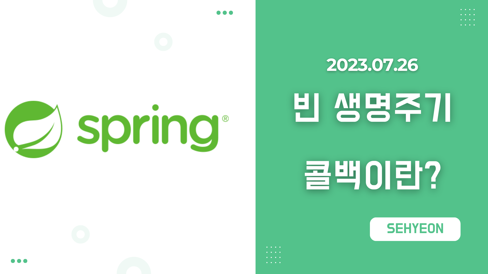
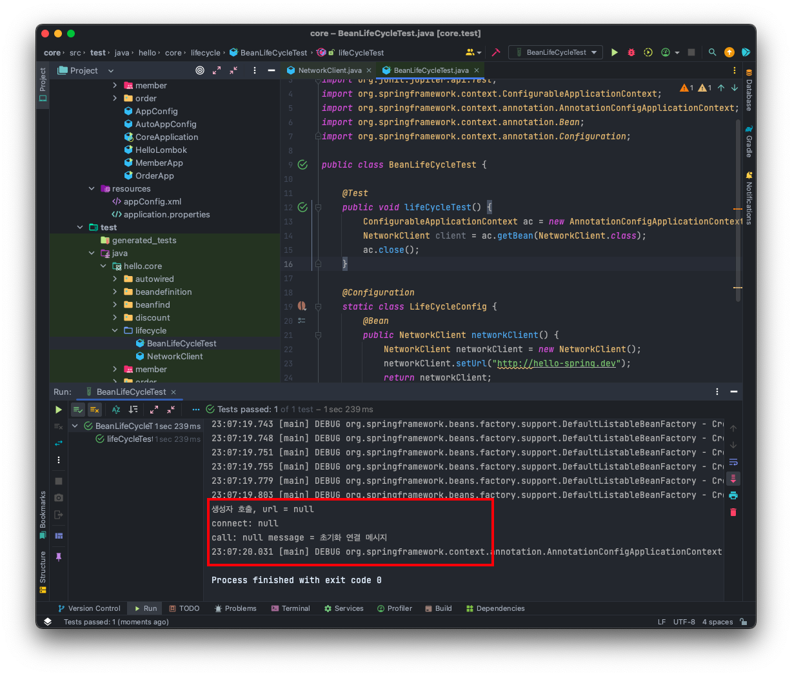
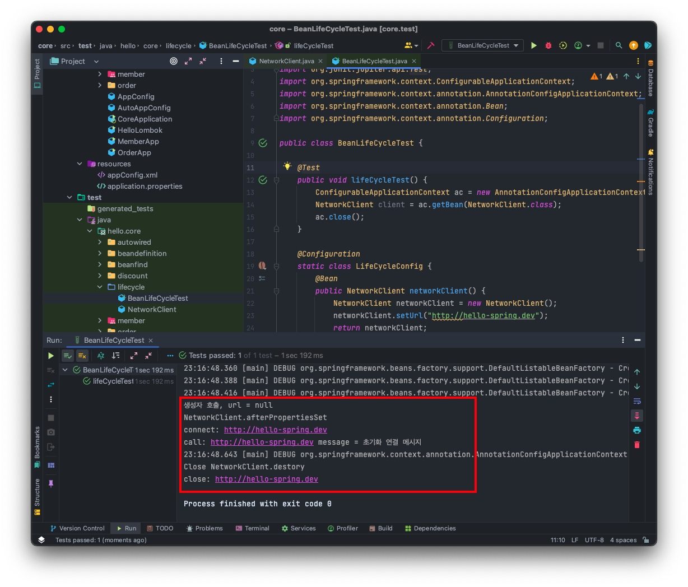
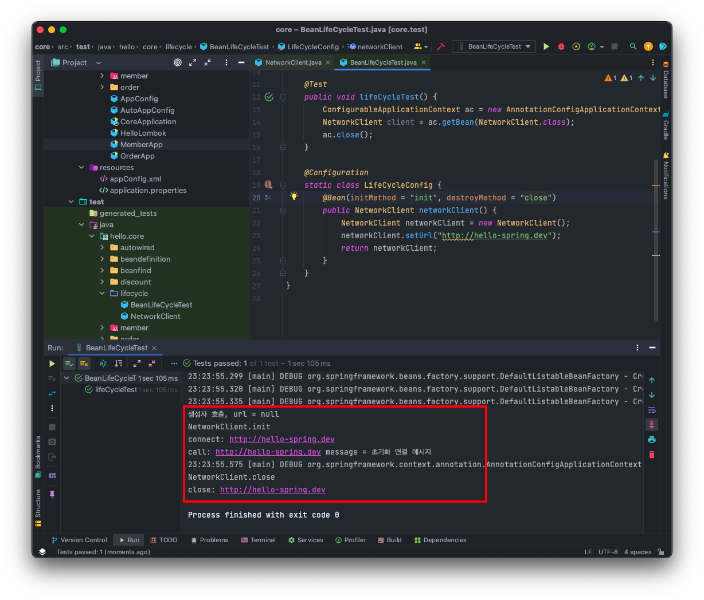
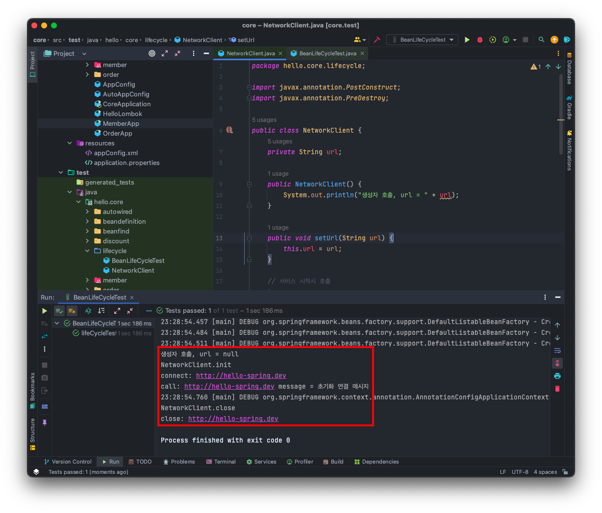

<br>

## 🤜 TIL (2023.07.26)
오늘 학습한 내용은 빈 생명주기 콜백에 대해 알아보았다. 스프링 컨테이너가 생성되어 스프링 빈이 등록되고 스프링이 종료되는 시점까지 라이프 사이클과 그 안에서 일어나는 콜백에 대해 알아보았다.

## 1. 빈 생명주기 콜백
데이터베이스 커넥션 풀이나, 네트워크 소켓처럼 애플리케이션 시작 시점에 필요한 연결을 미리 해두고, 애플리케이션 종료 시점에 연결을 모두 종료하는 작업을 진행하려면, 객체의 초기화와 종료 작업이 필요하다.

### 🌐 NetworkClient 예제 작성
외부 네트워크에 미리 연결하는 객체를 생성한다고 가정한다.

`NetworkClient` 는 애플리케이션 **시작 시점** 에 `connect()` 를 호출해서 연결을 맺어야하고, 애플리케이션 **종료 시점** 에 `disconnect()` 를 호출해서 연결을 끊어야한다.
```java
package hello.core.lifecycle;

public class NetworkClient {
    private String url;

    public NetworkClient() {
        System.out.println("생성자 호출, url = " + url);
        connect();
        call("초기화 연결 메시지");
    }

    public void setUrl(String url) {
        this.url = url;
    }

    // 서비스 시작시 호출
    public void connect() {
        System.out.println("connect: " + url);
    }

    public void call(String message) {
        System.out.println("call: " + url + " message = " + message);
    }

    //서비스 종료시 호출
    public void disconnect() {
        System.out.println("close: " + url);
    }
}
```

### ⚙️ 스프링 환경 설정과 실행
이것을 테스트할 테스트 코드를 작성하고, 스프링 환경 설정 정보를 작성한다.
```java
package hello.core.lifecycle;

import org.junit.jupiter.api.Test;
import org.springframework.context.ConfigurableApplicationContext;
import org.springframework.context.annotation.AnnotationConfigApplicationContext;
import org.springframework.context.annotation.Bean;
import org.springframework.context.annotation.Configuration;

public class BeanLifeCycleTest {

    @Test
    public void lifeCycleTest() {
        ConfigurableApplicationContext ac = new AnnotationConfigApplicationContext(LifeCycleConfig.class);
        NetworkClient client = ac.getBean(NetworkClient.class);
        ac.close();
    }

    @Configuration
    static class LifeCycleConfig {
        @Bean
        public NetworkClient networkClient() {
            NetworkClient networkClient = new NetworkClient();
            networkClient.setUrl("http://hello-spring.dev");
            return networkClient;
        }
    }
}
```


***LiftCycleTest 실행결과***

실행해보면 다음과 같은 결과가 나타난다.
```
생성자 호출, url = null
connect: null
call: null message = 초기화 연결 메시지
```
- 생성자 부분을 보면 url 정보 없이 connect가 호출되는 것을 알 수 있다.
- 객체를 생성하는 단계에는 url이 없고, 생성한 다음 외부에서 수정자 주입을 통해 `setUrl()` 이 호출되어야 url이 존재하게 된다.

### 🌀 스프링 빈의 라이프 사이클
스프링 빈은 **객체 생성 → 의존관계 주입** 이라는 라이프 사이클을 가진다.
- 스프링 빈은 객체를 생성하고, 의존관계 주입이 다 끝난 다음 필요한 데이터를 사용할 수 잇는 준비가 완료된다.
- 초기화 작업은 의존관계 주입이 모두 완료된 후 호출해야 한다.
- 스프링은 의존관계 주입이 완료되면 **스프링 빈에게 콜백 메소드를 통해 초기화 시점을 알려주는** 다양한 기능을 제공한다.
- 스프링은 **스프링 컨테이너가 종료되기 직전에 소멸 콜백** 을 준다.

**스프링 빈의 이벤트 라이프 사이클**
- 스프링 컨테이너 생성 → 스프링 빈 생성 → 의존관계 주입 → 초기화 콜백 → 사용 → 소멸 전 콜백 → 스프링 종료
- **초기화 콜백** : 빈이 생성되고, 빈의 의존관계 주입이 완료된 후 호출
- **소멸 전 콜백** : 빈이 소멸되기 직전에 호출

### ❗️ 객체의 생성과 초기화를 분리하자!
생성자와 초기화 동작을 살펴보면 다음과 같다!
- 생성자는 필수 정보 (파라미터) 를 받고, 메모리를 할당해서 객체를 생성하는 책임을 가진다.
- 초기화는 이렇게 생성된 값들을 활용해 외부 커넥션을 연결하는 등 무거운 동작을 수행한다.

따라서, 생성자 안에서 무거운 초기화 작업을 함께하는 것 보다 객체를 생성하는 부분과 초기화 하는 부분을 명확하게 나누는 것이 유지보수 관점에서 좋다!

### ❓ 스프링이 지원하는 빈 생명주기 콜백
스프링은 다음과 같은 빈 생명주기 콜백을 지원한다.
- 인터페이스 (InitializingBean, DisposableBean)
- 설정 정보에 초기화 메소드, 종료 메소드 지정
- @PostConstruct, @PreDestory 어노테이션 지원

지금부터 이 3가지 방법에 대해서 알아본다!

## 2. 인터페이스 InitializingBean, DisposableBean
### 🌐 NetworkClient에 적용
```java
package hello.core.lifecycle;

import javax.annotation.PostConstruct;
import javax.annotation.PreDestroy;

public class NetworkClient implements InitializingBean, DisposableBean{
    private String url;

    public NetworkClient() {
        System.out.println("생성자 호출, url = " + url);
    }

    public void setUrl(String url) {
        this.url = url;
    }

    // 서비스 시작시 호출
    public void connect() {
        System.out.println("connect: " + url);
    }

    public void call(String message) {
        System.out.println("call: " + url + " message = " + message);
    }

    //서비스 종료시 호출
    public void disconnect() {
        System.out.println("close: " + url);
    }

    @Override
    public void afterPropertiesSet() {
        System.out.println("NetworkClient.afterPropertiesSet");
        connect();
        call("초기화 연결 메시지");
    }

    @Override
    public void destory() {
        System.out.println("Close NetworkClient.destory");
        disconnect();
    }
}
```
- `InitializingBean` 은 `afterPropertiesSet()` 메소드로 초기화를 지원한다.
- `DisposableBean` 은 `destory()` 메소드로 소멸을 지원한다.


***InitializingBean, DisposableBean을 사용한 테스트 실행 결과***

실행해보면 다음과 같은 결과가 나타난다.

```
생성자 호출, url = null
NetworkClient.afterPropertiesSet
connect: http://hello-spring.dev
call: http://hello-spring.dev message = 초기화 연결 메시지
23:16:49.643 [main] DEBUF org.springframework.context.annotation.AnnotationConfigApplicationContext -
Close NetworkClient.destroy
close: http://hello-spring.dev
```
- 초기화 메소드가 의존관계 주입 완료 후에 적절하게 호출 된 것을 알 수 있다.
- 스프링 컨테이너의 종료가 호출되자 소멸 메소드가 호출된 것을 확인할 수 있다.

### 📌 인터페이스의 단점
- 이 인터페이스는 스프링 전용 인터페이스이다. 해당 코드가 스프링 전용 인터페이스에 의존한다.
- 초기화, 소멸 메소드의 이름을 변경할 수 없다.
- 내가 코들르 고칠 수 없는 외부 라이브러리에 적용할 수 없다.

## 3. 빈 등록 초기화, 소멸 메소드 지정
### 🌐 NetworkClient에 적용
```java
package hello.core.lifecycle;

public class NetworkClient {
    private String url;

    public NetworkClient() {
        System.out.println("생성자 호출, url = " + url);
    }

    public void setUrl(String url) {
        this.url = url;
    }

    // 서비스 시작시 호출
    public void connect() {
        System.out.println("connect: " + url);
    }

    public void call(String message) {
        System.out.println("call: " + url + " message = " + message);
    }

    //서비스 종료시 호출
    public void disconnect() {
        System.out.println("close: " + url);
    }
    
    public void init() {
        System.out.println("NetworkClient.init");
        connect();
        call("초기화 연결 메시지");
    }

    public void close() {
        System.out.println("NetworkClient.close");
        disconnect();
    }
}
```

### 🚀 설정 정보에 초기화, 소멸 메소드 지정
```java
@Configuration
static class LifeCycleConfig {
    @Bean(initMethod = "init", destoryMethod = "close")
    public NetworkClient networkClient() {
        NetworkClient networkClient = new NetworkClient();
        networkClient.setUrl("http://hello-spring.dev");
        return networkClient;
    }
}
```
`@Bean(initMethod = "init", destoryMethod = "close")` 와 같이 설정 정보에 초기화 , 소멸 메소드를 지정할 수 있다.


***설정 정보에 초기화&소멸 메소드를 지정한 테스트 실행결과***

실행해보면 다음과 같은 결과가 나타난다.
```
생성자 호출, url = null
NetworkClient.init
connect: http://hello-spring.dev
call: http://hello-spring.dev message = 초기화 연결 메시지
23:23:55.575 [main] DEBUF org.springframework.context.annotation.AnnotationConfigApplicationContext -
NetworkClient.close
close: http://hello-spring.dev
```

### 📌 설정 정보 사용의 특징
- 메소드 이름을 자유롭게 지정할 수 있다.
- 스프링 빈이 스프링 코드에 의존하지 않는다.
- 코드가 아니라 설정 정보를 사용하기 때문에 코드를 고칠 수 없는 외부 라이브러리에도 초기화, 종료 메소드를 적용할 수 있다.

### 🔥 종료 메소드 추론
- `@Bean` 의 `destoryMethod` 속성에는 아주 특별한 기능이 있다.
- `destroyMethod` 는 기본값이 `(inferred) (추론)` 으로 등록되어 있다.
- 이 추론 기능은 `close, shutdown` 이라는 대부분의 라이브러리 종료 메소드 이름을 자동으로 호출해준다.
- 따라서, 직접 스프링 빈으로 등록하면 종료 메소드는 따로 적어주지 않아도 잘 동작한다.
- 위 코드에서 `@Bean(initMethod = "init")` 이렇게만 적어도 정상적으로 동작한다!

## 4. 어노테이션 @PostConstruct, @PreDestory
### 🌐 NetworkClient에 적용
```java
package hello.core.lifecycle;

import javax.annotation.PostConstruct;
import javax.annotation.PreDestroy;

public class NetworkClient {
    private String url;

    public NetworkClient() {
        System.out.println("생성자 호출, url = " + url);
    }

    public void setUrl(String url) {
        this.url = url;
    }

    // 서비스 시작시 호출
    public void connect() {
        System.out.println("connect: " + url);
    }

    public void call(String message) {
        System.out.println("call: " + url + " message = " + message);
    }

    //서비스 종료시 호출
    public void disconnect() {
        System.out.println("close: " + url);
    }

    @PostConstruct
    public void init() {
        System.out.println("NetworkClient.init");
        connect();
        call("초기화 연결 메시지");
    }

    @PreDestroy
    public void close() {
        System.out.println("NetworkClient.close");
        disconnect();
    }
}
```
- 초기화, 소멸 메소드 코드에서 `@PostConstruct` 와 `@PreDestory` 어노테이션만 붙이면 된다.
- 그리고 설정 정보에서 지정해준 정보는 삭제한다.


***@PostConstruct, @PreDestroy 어노테이션을 적용한 테스트 실행결과***

실행해보면 다음과 같은 결과가 나타난다.
```
생성자 호출, url = null
NetworkClient.init
connect: http://hello-spring.dev
call: http://hello-spring.dev message = 초기화 연결 메시지
23:28:54.760 [main] DEBUF org.springframework.context.annotation.AnnotationConfigApplicationContext -
NetworkClient.close
close: http://hello-spring.dev
```
- `@PostConstruct` `@PreDestory` 어노테이션을 사용하면 가장 편리하게 초기화와 종료를 실행할 수 있다.

### 📌 @PostConstruct, @PreDestory 특징
- 최신 스프링에서 가장 권장하는 방법이다.
- 어노테이션 하나만 붙이면 되므로 매우 편리하다.
- 패키지를 잘 보면 **javax.annotation.PostConstruct** 이다. 스프링에 종속적인 기술이 아닌, 자바 표준이다. 따라서 다른 컨테이너에서도 동작한다.
- 컴포넌트 스캔과 잘 어울린다.
- 유일한 단점은 외부 라이브러리에는 적용하지 못한다는 것이다. 외부 라이브러리를 초기화, 종료 해야 한다면 **@Bean의 기능** 을 사용하면 된다.

## 5. 정리
- **@PostConstruct**, **@PreDestory** 어노테이션을 사용하자!
- 코드를 고칠 수 없는 외부 라이브러리를 초기화, 종료해야 하면 **@Bean** 의 **initMethod, destroyMethod** 를 사용하자!

## ✋ 마무리하며
오늘은 스프링 빈의 생명주기에 대해서 알아보았다. 초기화와 소멸 메소드를 호출해야할 때 스프링에서 지원하는 생명주기 콜백에 대해 알아보았고, 어노테이션을 사용하는 방법이 가장 권장되는 방법이라는 것을 알게 되었다. 이는 스프링에 종속적인 것이 아닌 자바 표준을 따르는 것으로 다른 컨테이너에서도 잘 동작하기 때문에 이를 활용하면서 외부 라이브러리는 초기화, 소멸 메소드를 지정하는 방법을 사용하면 된다는 것을 알게 되었다.

<br>

> [인프런 스프링 핵심 원리 - 기본편](https://www.inflearn.com/course/%EC%8A%A4%ED%94%84%EB%A7%81-%ED%95%B5%EC%8B%AC-%EC%9B%90%EB%A6%AC-%EA%B8%B0%EB%B3%B8%ED%8E%B8) <br>
> > 이 글은 은 인프런 김영한님의 강좌, 스프링 핵심 원리 - 기본편 강좌를 수강 후 작성한 것입니다. <br>
> > 모든 코드와 사진들은 강의에서 가져왔습니다. <br>
> > 문제가 있다면 알려주세요!

```toc
```