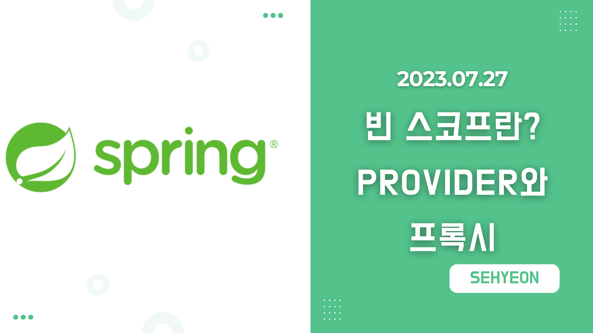
<br>

## 🤜 TIL (2023.07.26)
오늘 학습한 내용은 빈 스코프에 대해서 알아보았다. 빈이 존재할 수 있는 범위를 빈 스코프라고 하는데, 스프링에서 지원하는 빈 스코프에 대해서 알아보고 각각 예제를 만들어 알아보았다.

## 1. 빈 스코프란?
지금까지 우리는 스프링 빈이 스프링 컨테이너의 시작과 함께 생성되어 스프링 컨테이너가 종료될 때까지 유지된다고 학습했다. 이것은 스프링 빈이 기본적으로 **싱글톤 스코프** 로 생성되기 때문이다. 스코프는 말 그대로 **빈이 존재할 수 있는 범위** 를 뜻한다.

### 📌 스프링이 지원하는 스코프
- **싱글톤** : 기본 스코프로 스프링 컨테이너의 시작과 종료까지 유지되는 가장 넓은 범위의 스코프이다.
- **프로토타입** : 스프링 컨테이너는 프로토타입 빈의 생성과 의존관계 주입까지만 과녕하고 더는 관리하지 않는 매우 짧은 범위의 스코프이다.
- **웹 관련 스코프**
    - **request** : 웹 요청이 들어오고 나갈 때까지 유지되는 스코프이다.
    - **session** : 웹 세션이 생성되고 종료될 때까지 유지되는 스코프이다.
    - **application** : 웹의 서블릿 컨텍스트와 같은 범위로 유지되는 스코프이다.
빈 스코프는 다음과 같이 지정할 수 있다.
```java
// 컴포넌트 스캔 등록
@Scope("prototype")
@Component
public class HelloBean {}

// 수동 등록
@Scope("prototype")
@Bean
PrototypeBean HelloBean() {
    return new HelloBean();
}
```

## 2.  프로토타입 스코프
지금까지 싱글톤 스코프를 계속 사용했으니, 프로토타입 스코프부터 확인해본다.

싱글톤 스코프의 빈을 조회하면 스프링 컨테이너는 **항상 같은 인스턴스의 스프링 빈을 반환** 한다. 반면에, 프로토타입 스코프를 스프링 컨테이너에 조회하면 스프링 컨테이너는 **항상 새로운 인스턴스를 생성해서 반환** 한다.

### 🔥 싱글톤 빈 요청 vs 프로토타입 빈 요청

**싱글톤 빈 요청**

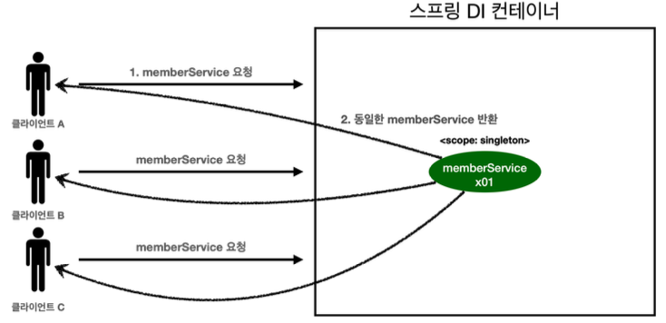
***싱글톤 빈 요청***

- 1.  싱글톤 스코프의 빈을 스프링 컨테이너에 요청한다.
- 2. 스프링 컨테이너는 본인이 관리하는 스프링 빈을 반환한다.
- 3. 이후 스프링 컨테이너에 같은 요청이 와도 같은 객체 인스턴스의 스프링 빈을 반환한다.

**프로토타입 빈 요청**

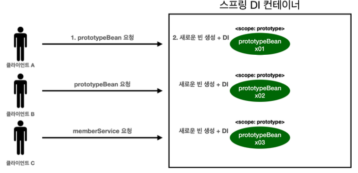
***프로토타입 빈 요청 1***

- 1. 프로토타입 스코프의 빈을 스프링 컨테이너에 요청한다.
- 2. 스프링 컨테이너는 이 시점에 프로토타입 빈을 생성하고, 필요한 의존관계를 주입한다.

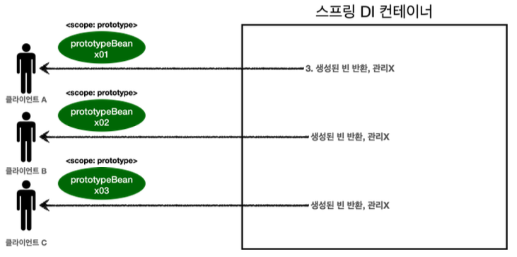
***프로토타입 빈 요청 2***

- 3. 스프링 컨테이너는 생성한 프로토타입 빈을 클라이언트에 반환한다.
- 4. 이후 스프링 컨테이너에 같은 요청이 들어오면 항상 새로운 프로토타입 빈을 생성해서 반환한다.

**정리** <br>
여기서 **핵심** 은 `스프링 컨테이너는 프로토타입 빈을 생성하고, 의존관계 주입, 초기화까지만 처리` 한다는 것이다. 클라이언트에 빈을 반환하고, 이후 스프링 컨테이너는 생성된 프로토타입 빈을 관리하지 않는다. 프로토타입 빈을 관리할 책임은 **프로토타입 빈을 받은 클라이언트** 에 있다. 따라서, **@PreDestroy** 같은 종료 메소드가 호출되지 않는다.

### 🔥 코드로 알아보기

**싱글톤 스코프 빈 테스트**
```java
package hello.core.scope;

import org.junit.jupiter.api.Test;
import org.springframework.context.annotation.AnnotationConfigApplicationContext;
import org.springframework.context.annotation.Scope;

import javax.annotation.PostConstruct;
import javax.annotation.PreDestroy;

import static org.assertj.core.api.Assertions.*;

public class SigletonTest {

    @Test
    void singletonBeanFind() {
        AnnotationConfigApplicationContext ac = new AnnotationConfigApplicationContext(SingletonBean.class);
        SingletonBean singletonBean1 = ac.getBean(SingletonBean.class);
        SingletonBean singletonBean2 = ac.getBean(SingletonBean.class);
        System.out.println("singletonBean1 = " + singletonBean1);
        System.out.println("singletonBean2 = " + singletonBean2);
        assertThat(singletonBean1).isSameAs(singletonBean2);

        ac.close();
    }

    @Scope("singleton")
    static class SingletonBean {
        @PostConstruct
        public void init() {
            System.out.println("SingletonBean.init");
        }

        @PreDestroy
        public void destroy() {
            System.out.println("SingletonBean.destroy");
        }
    }
}
```

먼저, 싱글톤 스코프 빈을 조회하는 테스트를 실행해보자
```
SingletonBean.init
singletonBean1 = hello.core.scope.SigletonTest$SingletonBean@21337f7b
singletonBean2 = hello.core.scope.SigletonTest$SingletonBean@21337f7b
19:37:51.083 [main] DEBUG org.springframework.context.annotation.AnnotationConfigApplicationContext -
SingletonBean.destroy
```
당연하게도, 초기화 메소드를 실행하고 같은 인스턴스의 빈을 반환하고 종료 메소드까지 정상적으로 호출된다.

**프로토타입 스코프 빈 테스트**
```java
package hello.core.scope;

import org.junit.jupiter.api.Test;
import org.springframework.context.annotation.AnnotationConfigApplicationContext;
import org.springframework.context.annotation.Scope;

import javax.annotation.PostConstruct;
import javax.annotation.PreDestroy;

import static org.assertj.core.api.Assertions.*;

public class PrototypeTest {

    @Test
    void prototypeBeanTest() {
        AnnotationConfigApplicationContext ac = new AnnotationConfigApplicationContext(PrototypeBean.class);
        System.out.println("find prototypeBean1");
        PrototypeBean prototypeBean1 = ac.getBean(PrototypeBean.class);
        System.out.println("find prototypeBean2");
        PrototypeBean prototypeBean2 = ac.getBean(PrototypeBean.class);
        System.out.println("prototypeBean1 = " + prototypeBean1);
        System.out.println("prototypeBean2 = " + prototypeBean2);
        assertThat(prototypeBean1).isNotSameAs(prototypeBean2);

        ac.close();
    }

    @Scope("prototype")
    static class PrototypeBean {
        @PostConstruct
        public void init() {
            System.out.println("PrototypeBean.init");
        }

        @PreDestroy
        public void destroy() {
            System.out.println("PrototypeBean.destroy");
        }
    }
}
```

이번엔 프로토타입 스코프 빈을 조회하는 테스트를 실행해보자

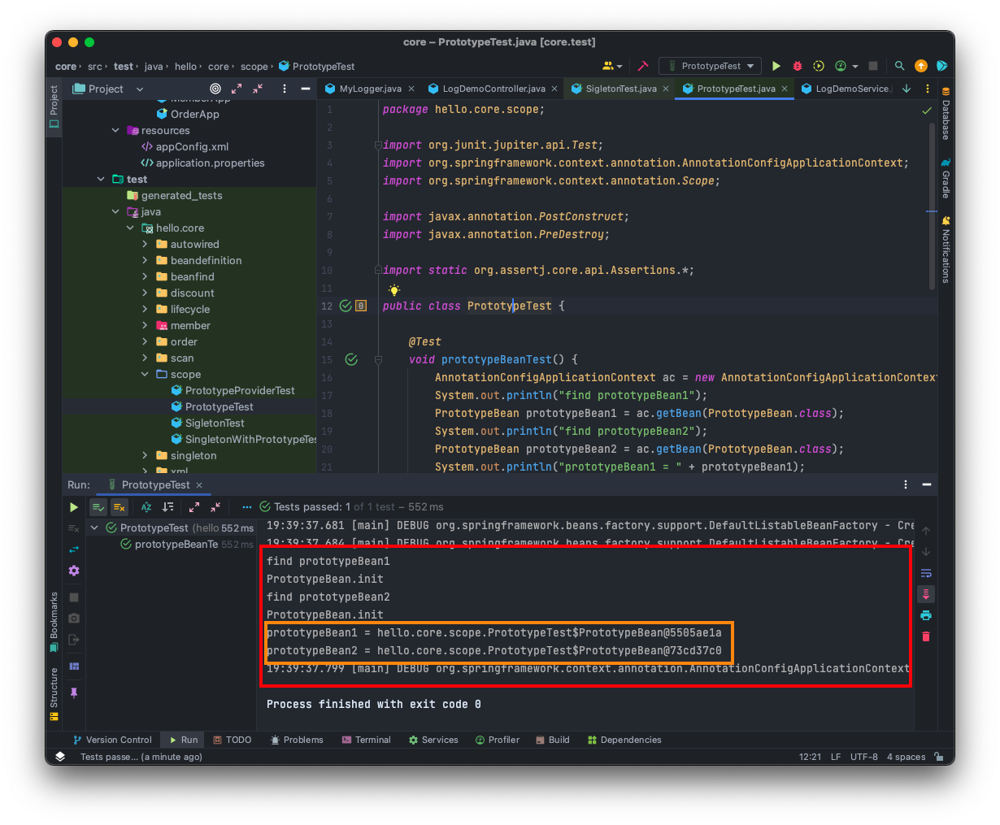
***프로토타입 빈 요청 실행 결과***

```
find prototypeBean1
PrototypeBean.init
find prototypeBean2
PrototypeBean.init
prototypeBean1 = hello.core.scope.PrototypeTest$PrototypeBean@5505ae1a
prototypeBean2 = hello.core.scope.PrototypeTest$PrototypeBean@73cd37c0
19:39:37.799 [main] DEBUG org.springframework.context.annotation.AnnotationConfigApplicationContext -
```
- 프로토타입 스코프의 빈은 스프링 컨테이너에서 빈을 조회할 때 생성되고, 초기화 메소드도 실행된다.
- 프로토타입 빈을 2번 조회했으므로, 완전히 다른 스프링 빈이 생성되고 초기화도 2번 실행된 것을 확인할 수 있다.
- 프로토타입 빈은 스프링 컨테이너가 생성과 의존관계 주입 그리고 초기화까지만 관여하고, 더는 관리하지 않는다. 따라서 프로토타입 빈은 스프링 컨테이너가 종료될 때 종료 메소드가 전혀 실행되지 않는다.

**프로토타입 빈의 특징 정리**
- 스프링 컨테이너에 요청할 때마다 새로 생성된다.
- 스프링 컨테이너는 프로토타입 빈의 생성과 의존관계 주입 그리고 초기화까지만 관여한다.
- 종료 메소드가 호출되지 않는다.
- 프로토타입 빈은 프로토타입 빈을 조회한 클라이언트가 관리해야한다. 종료 메소드에 대한 호출도 클라이언트가 직접 해야한다.

## 3. 프로토타입 스코프를 싱글톤 빈과 함께 사용 시 문제점
스프링 컨테이너에 프로토타입 스코프의 빈을 요청하면 **항상 새로운 객체 인스턴스를 생성해 반환** 한다. 하지만, 싱글톤 빈과 함께 사용할 때는 의도한 대로 동작하지 않으므로 주의해야 한다.

### 📌 프로토타입 빈 직접 요청
```java
package hello.core.scope;

import org.assertj.core.api.Assertions;
import org.junit.jupiter.api.Test;
import org.springframework.beans.factory.annotation.Autowired;
import org.springframework.context.annotation.AnnotationConfigApplicationContext;
import org.springframework.context.annotation.Scope;

import javax.annotation.PostConstruct;
import javax.annotation.PreDestroy;

import static org.assertj.core.api.Assertions.*;

public class SingletonWithPrototypeTest1 {

    @Test
    void prototypeFind() {
        AnnotationConfigApplicationContext ac = new AnnotationConfigApplicationContext(PrototypeBean.class);
        PrototypeBean prototypeBean1 = ac.getBean(PrototypeBean.class);
        prototypeBean1.addCount();
        assertThat(prototypeBean1.getCount()).isEqualTo(1);

        PrototypeBean prototypeBean2 = ac.getBean(PrototypeBean.class);
        prototypeBean2.addCount();
        assertThat(prototypeBean2.getCount()).isEqualTo(1);
    }

    @Scope("prototype")
    static class PrototypeBean {
        private int count = 0;

        public void addCount() {
            count++;
        }

        public int getCount() {
            return count;
        }

        @PostConstruct
        public void init() {
            System.out.println("PrototypeBean.init " + this);
        }

        @PreDestroy
        public void destroy() {
            System.out.println("PrototypeBean.destroy");
        }
    }
}
```
- 위 코드를 보면서 클라이언트 A와 B가 프로토타입 빈을 요청했을 때 일어나는 일을 알아보자!
- **클라이언트 A**
    - A가 프로토타입 빈을 요청하면, 스프링 컨테이너는 프로토타입 빈을 새로 생성해서 반환한다. 그리고 해당 빈의 **count 필드 값은 0** 이다.
    - A는 조회한 프로토타입 빈에 `addCount()` 를 호출하면서 **count 필드를 +1** 한다.
    - 결과적으로 프로토타입 빈의 **count는 1** 이 된다.
- **클라이언트 B**
    - B가 프로토타입 빈을 요청하면, 스프링 컨테이너는 프로토타입 빈을 또 다시 새로 생성해서 반환한다. 그리고 해당 빈의 **count 필드 값은 0** 이다.
    - B는 조회한 프로토타입 빈에 `addCount()` 를 호출하면서 **count 필드를 +1** 한다.
    - 결과적으로 프로토타입 빈의 **count는 1** 이 된다.

### 📌 싱글톤 빈에서 프로토타입 빈 사용
이번에는 `ClientBean` 이라는 싱글톤 빈이 의존관계 주입을 통해 프로토타입 빈을 주입받아 사용하는 예시를 살펴본다. 코드를 먼저 보면서 설명하도록 하겠다.
```java
package hello.core.scope;

import org.assertj.core.api.Assertions;
import org.junit.jupiter.api.Test;
import org.springframework.beans.factory.annotation.Autowired;
import org.springframework.context.annotation.AnnotationConfigApplicationContext;
import org.springframework.context.annotation.Scope;

import javax.annotation.PostConstruct;
import javax.annotation.PreDestroy;

import static org.assertj.core.api.Assertions.*;

public class SingletonWithPrototypeTest1 {

    @Test
    void singletonClientUserPrototype() {
        AnnotationConfigApplicationContext ac = new AnnotationConfigApplicationContext(ClientBean.class, PrototypeBean.class);

        ClientBean clientBean1 = ac.getBean(ClientBean.class);
        int count1 = clientBean1.logic();
        assertThat(count1).isEqualTo(1);

        ClientBean clientBean2 = ac.getBean(ClientBean.class);
        int count2 = clientBean2.logic();
        assertThat(count2).isEqualTo(2);
    }

    static class ClientBean {

        private final PrototypeBean prototypeBean;

        @Autowired
        public ClientBean(PrototypeBean prototypeBean) {
            this.prototypeBean = prototypeBean;
        }

        public int logic() {
            prototypeBean.addCount();
            int count = prototypeBean.getCount();
            return count;
        }
    }

    @Scope("prototype")
    static class PrototypeBean {
        private int count = 0;

        public void addCount() {
            count++;
        }

        public int getCount() {
            return count;
        }

        @PostConstruct
        public void init() {
            System.out.println("PrototypeBean.init " + this);
        }

        @PreDestroy
        public void destroy() {
            System.out.println("PrototypeBean.destroy");
        }
    }
}
```

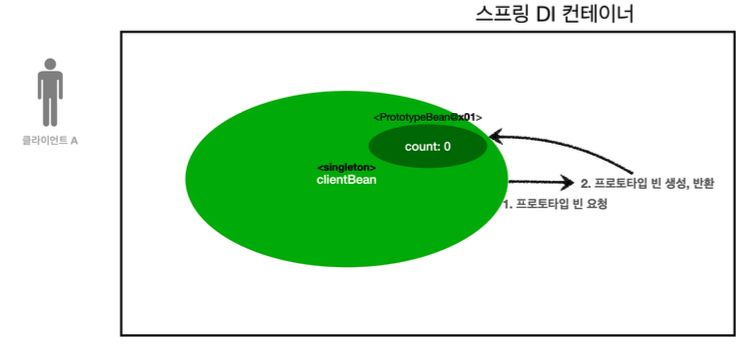
***스프링 컨테이너에 프로토타입 빈 요청***

- `ClientBean` 은 싱글톤이므로, 스프링 컨테이너 생성 시점에서 함께 생성되고 의존관계 주입도 발생한다.
- 1. `ClientBean` 은 의존관계 자동 주입을 사용한다. 주입 시점에 스프링 컨테이너에 프로토타입 빈을 요청한다.
- 2. 스프링 컨테이너는 프로토타입 빈을 생성해서 `ClientBean` 에 반환한다. 프로토타입 빈의 **count 필드 값은 0** 이다.
- 이제 `ClientBean` 은 프로토타입 빈의 참조값을 내부 필드에 보관한다.

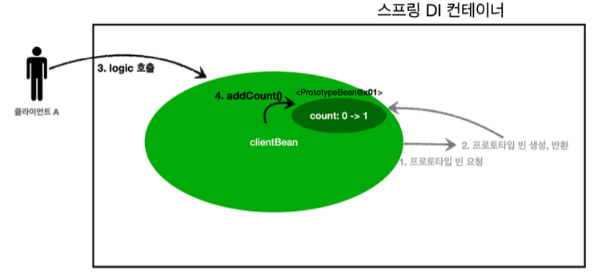
***클라이언트 A의 프로토타입 빈 요청***

- **클라이언트 A** 는 `ClientBean` 을 스프링 컨테이너에 요청해서 받는다. 싱글톤이므로 항상 같은 `ClientBean` 이 반환된다.
- 3. A는 `ClientBean.logic()` 을 호출한다.
- 4. `ClientBean` 은 프로토타입 빈의 `addCount()` 를 호출해서 프로토타입 빈의 **count를 +1** 한다. 결과적으로 **count값은 1** 이 된다.

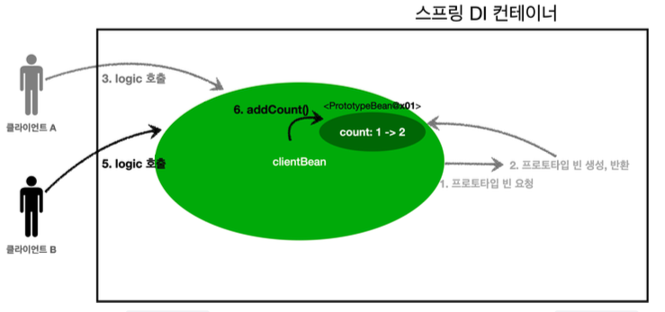
***클라이언트 B의 프로토타입 빈 요청***

- **클라이언트 B** 는 `ClientBean` 을 스프링 컨테이너에 요청해서 받는다. 싱글톤이므로 항상 같은 `ClientBean` 이 반환된다.
- 5. B는 `ClientBean.logic()` 을 호출한다.
- 6. `ClientBean` 은 프로토타입 빈의 `addCount()` 를 호출해서 프로토타입 빈의 **count를 +1** 한다.
- 이때, 중요한 점은 **ClientBean이 내부에 가지고 있는 프로토타입 빈은 과거에 주입이 끝난 빈이다! 주입 시점에 스프링 컨테이너에 요청해서 프로토타입 빈이 생성된 것이지, 사용할 때마다 새로 생성되는 것이 아니다!!**
- 결과적으로 **count값은 1이 아닌 원래 1이었으므로 2** 가 된다.

### 🔥 정리
스프링은 일반적으로 싱글톤 빈을 사용하므로, 싱글톤 빈이 프로토타입 빈을 사용하게 된다. 그런데 싱글톤 빈은 **생성 시점에만 의존관계 주입을 받기** 때문에 프로토타입 빈이 새로 생성되기는 하지만, **싱글톤 빈과 함께 계속 유지되는 것** 이 문제이다!

원하는 것은 이런 것이 아니라 **사용할 때마다 새로 생성해서 사용하는 것을 원할 것이다!**

그러면 이제부터 이것을 해결하는 방법을 알아본다.

## 4. Provider로 문제를 해결!
싱글톤 빈과 프로토타입 빈을 함께 사용할 때, 어떻게 하면 사용할 때마다 항상 새로운 프로토타입 빈을 생성할 수 있을까?
### 🚀 스프링 컨테이너에 요청
가장 간단한 방법은 싱글톤 빈이 프로토타입 빈을 사용할 때마다 스프링 컨테이너에 새로 요청하는 것이다!
```java
static class ClientBean {
    @Autowired
    private ApplicationContext ac;
    
    public int logic() {
        PrototypeBean prototypeBean = ac.getBean(PrototypeBean.class);prototypeBean.addCount();
        int count = prototypeBean.getCount();
        return count;
}
```
- `ac.getBean()` 을 통해 항상 새로운 프로토타입 빈이 생성되는 것을 알 수 있다.
- 의존관계를 외부에서 주입 (DI) 받는 것이 아니라 직접 필요한 의존관계를 찾는 것을 `Dependency Lookup` 의존관계 조회(탐색) 이라고 한다.
- 이렇게 스프링의 애플리케이션 컨텍스트 전체를 주입받게 되면 스프링 컨테이너에 종속적인 코드가 되고 단위 테스트도 어려워진다.

지금 필요한 기능은 지정한 프로토타입 빈을 컨테이너에서 대신 찾아주는 딱, **DL** 정도의 기능만 제공하는 무언가가 있으면 된다.

### 🚀 ObjectFactory, ObjectProvider
지정한 빈을 컨테이너에서 대신 찾아주는 **DL 서비스를 제공** 하는 것이 바로 `ObjectProvider` 이다. 과거에는 `ObjectFactory` 가 있었는데 여기에 편의 기능을 추가해 `ObjectProvider` 가 만들어졌다.
```java
static class ClientBean {
    @Autowired
    private ObjectProvider<PrototypeBean> prototypeBeanProvider;

    public int logic() {
        PrototypeBean prototypeBean = prototypeBeanProvider.getObject();
        prototypeBean.addCount();
        int count = prototypeBean.getCount();
        return count;
}
```
- `prototypeBeanProvider.getObject()` 를 통해서 항상 새로운 프로토타입 빈이 생성되는 것을 확인할 수 있다.
- `ObjectProvider` 의 `getObject()` 를 호출하면 내부에서는 스프링 컨테이너를 통해 해당 빈을 찾아 반환한다. **(DL)**
- 스프링이 제공하는 기능을 사용하지만, 기능이 단순하므로 단위테스트를 만들기는 훨씬 쉬워진다.

**특징**
- ObjectFactory : 기능이 단순, 별도의 라이브러리 필요 없음, 스프링에 의존
- ObjectProvider : ObjectFactory 상속, 옵션, 스트림 처리 등 편의 기능이 많고, 별도의 라이브러리 필요 없음, 스프링에 의존

### 🚀 JSR-330 Provider
마지막 방법은 `javax.inject.Provider` 라는 **JSR-330 자바 표준** 을 사용하는 방법이다. 스프링 부트 3.0은 `jakarta.inject.Provider` 를 사용한다.

사용 방법은 **build.gradle** 에 `javax.inject:javax.inject:1` 라이브러리를 추가해야 한다.
```java
static class ClientBean {
    @Autowired
    private Provider<PrototypeBean> provider;

    public int logic() {
        PrototypeBean prototypeBean = provider.get();
        prototypeBean.addCount();
        int count = prototypeBean.getCount();
        return count;
}
```
- `provider.get()` 을 통해서 항상 새로운 프로토타입 빈이 생성되는 것을 확인할 수 있다.
- `provider` 의 `get()` 을 홏루하면 내부에서는 스프링 컨테이너를 통해 해당 빈을 찾아서 반환한다. **(DL)**

**특징**
- `get()` 메소드 하나로 기능이 매우 단순하다.
- 별도의 라이브러리가 필요하다.
- 자바 표준이므로 스프링이 아닌 다른 컨테이너에서도 사용할 수 있다.

### 🔥 정리
**그러면 프로토타입 빈을 언제 사용할까?**
- 매번 사용할 때마다 의존관계 주입이 완료된 새로운 객체가 필요하면 사용하면 된다.
- 하지만, 실무에서 웹 애플리케이션을 개발해보면, 싱글톤 빈으로 대부분의 문제를 해결할 수 있기 때문에 직접적으로 사용하는 일은 매우 드물다.
- `ObjectProvider` `JSR-330 Provider` 등은 프로토타입 분 아니라 **DL** 이 필요한 경우 언제든지 사용할 수 있다.
> **참고** : 실무에서 자바 표준인 JSR-330 Provider 를 사용할지, 스프링이 제공하는 ObjectProvider 를 사용할 것인지 고민이 될 것이다. ObjectProvider 는 DL을 위한 편의 기능을 많이 제공해주고 스프링 이외 별도의 의존관계 추가가 필요 없기 때문에 편리하다. 만약 (그럴 일은 거의 없겠지만) 코드를 스프링이 아닌 다른 컨테이너에서도 사용할 수 있어야 한다면 JSR-330 Provider 를 사용해야한다. <br><br>
> 스프링을 사용하다보면, 다른 기능들도 자바 표준과 스프링이 제공하는 기능이 겹칠 때가 많다. 대부분 스프링이 더 다양하고 편리한 기능을 제공해주기 때문에 특별히 다른 컨테이너를 사용할 일이 없다면, **스프링이 제공하는 기능을 사용하면 된다**

## 5. 웹 스코프란?

<span style="font-size:120%">웹 스코프의 특징</span>
- 웹 스코프는 웹 환경에서만 동작한다.
- 웹 스코프는 프로토타입과 다르게 스프링이 해당 스코프의 종료시점까지 관리한다.
- 따라서 종료 메소드가 호출된다.

<span style="font-size:120%">웹 스코프 종류</span>

- **request** : HTTP 요청 하나가 들어오고 나갈 때까지 유지되는 스코프로 각각의 HTTP 요청마다 별도의 빈 인스턴스가 생성되고 관리된다.
- **session** : HTTP Sesison과 동일한 생명주기를 가지는 스코프이다.
- **application** : 서블릿 컨텍스트 (ServletContext)와 동일한 생명주기를 가지는 스코프이다.
- **websocket** : 웹 소켓과 동일한 생명주기를 가지는 스코프이다.

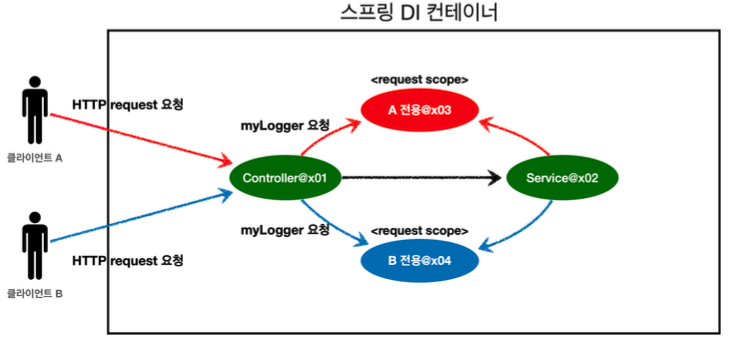
***웹 스코프의 동작 원리***

- 여기서는 **request 스코프** 를 예제로 설명한다.
- **request 스코프**는 HTTP 요청 당 각각 할당된다.

## 6. request 스코프 예제 만들기
먼저 request 스코프는 웹 환경에서만 동작하므로, **build.gradle** 에 `implementation 'org.springframework.boot:spring-boot-starter-web'` 라이브러리를 추가한다.

### 🌐 request 스코프 예제 개발
```
[d06b992f...] request scope bean create
[d06b992f...][http://localhost:8080/log-demo] controller test
[d06b992f...][http://localhost:8080/log-demo] service id = testId
[d06b992f...] request scope bean close
```
위와 같은 로그가 남도록 request 스코프를 활용해 기능을 개발해본다.
- 기대하는 공통 포멧 : UUID
- UUID 를 사용해서 HTTP 요청을 구분한다.
- requestURL 정보도 추가로 넣어서 어떤 URL을 요청해서 남은 로그인지 확인한다.

**MyLogger**
```java
package hello.core.common;

import org.springframework.context.annotation.Scope;
import org.springframework.stereotype.Component;

import javax.annotation.PostConstruct;
import javax.annotation.PreDestroy;
import java.util.UUID;

@Component
@Scope(value = "request")
public class MyLogger {

    private String uuid;
    private String requestURL;

    public void setRequestURL(String requestURL) {
        this.requestURL = requestURL;
    }

    public void log(String message) {
        System.out.println("[" + uuid + "]" + "[" + requestURL + "] " + message);
    }

    @PostConstruct
    public void init() {
        uuid = UUID.randomUUID().toString();
        System.out.println("[" + uuid + "] request scope bean create:" + this);
    }

    @PreDestroy
    public void close() {
        System.out.println("[" + uuid + "] request scope bean close:" + this);
    }
}
```
- `@Scope(value = "request")` 를 사용해서 request 스코프로 지정했다. 이제 이 빈은 HTTP 요청 당 하나씩 생성되고, HTTP 요청이 끝나는 시점에 소멸된다.
- `@PostConstruct` 를 통해 초기화 메소드를 호출해서 **UUID** 를 생성해서 저장해둔다. 이 빈은 HTTP 요청 당 하나씩 생성되므로 **UUID를 통해 다른 요청과 구분** 할 수 있다.
- `@PreDestroy` 를 사용해서 빈이 소멸되는 시점에 종료 메시지를 남긴다.
- `requestURL` 은 이 빈이 생성되는 시점에 알 수 없으므로 외부에서 **setter** 로 입력 받는다.

**LogDemoController**
```java
package hello.core.web;

import hello.core.common.MyLogger;
import lombok.RequiredArgsConstructor;
import org.springframework.stereotype.Controller;
import org.springframework.web.bind.annotation.RequestMapping;
import org.springframework.web.bind.annotation.ResponseBody;

import javax.servlet.http.HttpServletRequest;

@Controller
@RequiredArgsConstructor
public class LogDemoController {

    private final LogDemoService logDemoService;
    private final MyLogger myLogger;

    @RequestMapping("log-demo")
    @ResponseBody
    public String logDemo(HttpServletRequest request) {
        String requestURL = request.getRequestURL().toString();
        myLogger.setRequestURL(requestURL);

        myLogger.log("controller test");
        logDemoService.logic("tetsId");
        return "OK";
    }
}
```
- `HttpServletRequest` 를 통해서 요청 URL을 받았다.
- 이렇게 받은 **requestURL** 값을 **myLogger** 에 저장해둔다.
- 컨트롤러에서 controller test 라는 로그를 남긴다.

**LogDemoService**
```java
package hello.core.web;

import hello.core.common.MyLogger;
import lombok.RequiredArgsConstructor;
import org.springframework.stereotype.Service;

@Service
@RequiredArgsConstructor
public class LogDemoService {
    private final MyLogger myLogger;

    public void logic(String id) {
        myLogger.log("service id = " + id);

    }
}
```
- 비즈니스 로직이 있는 서비스 계층에서도 로그를 출력해본다.
- 여기서 중요한 점은 `request scope` 를 사용하지 않고, 파라미터로 모든 정보를 서비스 계층에 넘긴다면, 파라미터가 많아져 지저분해진다. 또한, `requestURL` 과 같은 웹 관련 정보가 웹과 관련없는 서비스 계층까지 넘어가게 된다. 웹과 관련된 부분은 **컨트롤러까지만 사용** 해야한다. 서비스 계층은 웹 기술에 종속되지 않고 가급적 순수하게 유지하는 것이 유지보수 관점에서 좋다.

### 🌐 실행
```
Error creating bean with name 'myLogger': Scope 'request' is not active for the
current thread; consider defining a scoped proxy for this bean if you intend to
refer to it from a singleton;
```
실행해보면 기대했던 로그를 출력하는 것과는 다르게 실행 시점에 오류가 발생한다. 오류를 살펴보면, 스프링 애플리케이션을 실행하는 시점에 싱글톤 빈은 생성해서 주입이 가능하지만, **request 스코프 빈** 은 아직 생성되지 않는다. 이 빈은 **실제 고객의 요청이 와야** 생성할 수 있다.

## 7. 스코프와 Provider
첫번째 해결방법은 `Provider` 를 사용하는 것이다!

**Controller**
```java
package hello.core.web;

import hello.core.common.MyLogger;
import lombok.RequiredArgsConstructor;
import org.springframework.beans.factory.ObjectProvider;
import org.springframework.stereotype.Controller;
import org.springframework.web.bind.annotation.RequestMapping;
import org.springframework.web.bind.annotation.ResponseBody;

import javax.servlet.http.HttpServletRequest;

@Controller
@RequiredArgsConstructor
public class LogDemoController {

    private final LogDemoService logDemoService;
    private final ObjectProvider<MyLogger> myLoggerProvider;

    @RequestMapping("log-demo")
    @ResponseBody
    public String logDemo(HttpServletRequest request) {
        String requestURL = request.getRequestURL().toString();
        MyLogger myLogger = myLoggerProvider.getObject();
        myLogger.setRequestURL(requestURL);

        myLogger.log("controller test");
        logDemoService.logic("tetsId");
        return "OK";
    }
}
```

**Service**
```java
package hello.core.web;

import hello.core.common.MyLogger;
import lombok.RequiredArgsConstructor;
import org.springframework.beans.factory.ObjectProvider;
import org.springframework.stereotype.Service;

@Service
@RequiredArgsConstructor
public class LogDemoService {
    private final ObjectProvider<MyLogger> myLoggerProvider;

    public void logic(String id) {
        MyLogger myLogger = myLoggerProvider.getObject();
        myLogger.log("service id = " + id);

    }
}
```

이제 스프링을 실행하고, 웹에서 `http://localhost:8080/log-demo` 를 입력하면 다음과 같이 정상적으로 동작하는 것을 확인할 수 있다.

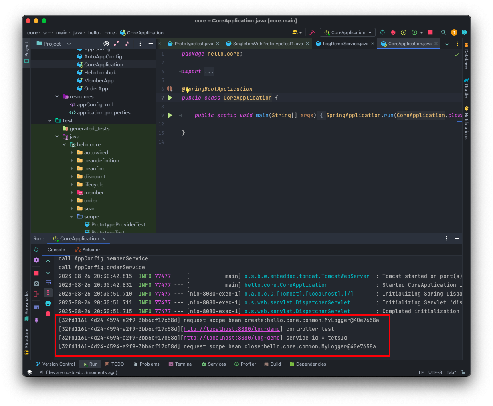
***Provider를 사용한 웹 스코프 실행 결과***

- `ObjectProvider` 덕분에 `ObjectProvider.getObject()` 를 호출하는 시점까지 **request scope 빈의 생성을 지연** 할 수 있다.
- `ObjectProvider.getObject()` 를 호출하는 시점에서 HTTP 요청이 진행중이므로, **request scope 빈** 의 생성이 정상 처리된다.

## 8. 스코프와 프록시
개발자들의 코드 몇자를 줄이려는 욕심은 끝이 없다. 이번에는 프록시 방식을 사용해보자!
```java
@Component
@Scope(value = "request", proxyMode = ScopedProxyMode.TARGET_CLASS)
public class MyLogger {
}
```
- `proxyMode = ScopedProxyMode.TARGET_CLASS` 여기가 핵심이다!
    - 적용 대상이 인터페이스이면 **INTERFACES** 를 선택
    - 인터페이스가 아닌 클래스이면 **TARGET_CLASS** 선택
- 이렇게 하면 **MyLogger** 의 `가짜 프록시 클래스` 를 만들어두고 HTTP request와 상관없이 가짜 프록시 클래스를 다른 빈에 미리 주입해 둘 수 있다.

이제 나머지 코드를 Provider 사용 이전으로 돌려두고 실행해보면 정상적으로 잘 동작하는 것을 확인할 수 있다!

### ❓ 웹 스코프와 프록시 동작 원리
다음과 같이 주입된 myLogger를 확인해보자
```java
System.out.println("myLogger = " + myLogger.getClass());
```
출력 결과 `myLogger = class hello.core.common.MyLogger$$EnhancerBySpringCGLIB$$b68b726d` 이렇게 나타나는 것을 알 수 있다.

**CGLIB 라이브러리는 내 클래스를 상속 받은 가짜 프록시 객체를 만들어 주입한다**
- `@Scope` 의 `proxyMode = ScopedProxyMode.TARGET_CLASS` 를 설정하면 스프링 컨테이너는 **CGLIB** 라는 바이트코드를 조작하는 라이브러리를 사용해서 MyLogger 를 상속받은 **가짜 프록시 객체** 를 생성한다.
- 결과를 보면 **MyLoger$$EnhancerBySpringCGLIB** 라는 클래스로 만들어진 객체가 등록된 것을 확인할 수 있다.
- 그리고 스프링 컨테이너에 **myLogger** 라는 이름으로 이 가짜 프록시 객체를 등록한다.
- 그래서 의존관계 주입도 이 가짜 프록시 객체가 주입된다.

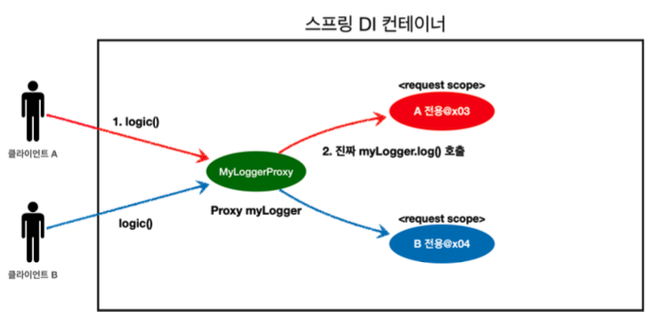
***웹 스코프와 프록시 동작 원리***

**가짜 프록시 객체는 요청이 오면 그때 내부에서 진짜 빈을 요청하는 위임 로직이 들어있다!**
- 가짜 프록시 객체는 내부에 진짜 `myLogger` 를 찾는 방법을 알고 있다.
- 클라이언트가 `myLogger.log()` 를 호출하면 사실은 가짜 프록시 객체으 메소드를 호출한 것이다.
- 가짜 프록시 객체는 request 스코프의 진짜 `myLogger.log()` 를 호출한다.
- 가짜 프록시 객체는 원본 클래스를 상속받아 만들어졌기 때문에 이 객체를 사용하는 클라이언트 입장에서는 사실 원본인지 아닌지도 모르게 사용할 수 있다. **(다형성)**\

**동작 정리**
- **CGLIB** 라이브러리로 내 클래스를 상속받은 가짜 프록시 객체를 만들어 주입한다.
- 가짜 프록시 객체는 실제 요청이 오면 그때 내부에서 실제 빈을 요청하는 위임 로직이 들어있다.
- 가짜 프록시 객체는 실제 request scope와는 관계가 없다. 그냥 가짜이고, 내부에 단순한 위임 로직만 있고 싱글톤처럼 동작한다.

**특징 정리**
- 프록시 객체 덕분에 클라이언트는 마치 싱글톤 빈을 사용하듯 편리하게 request scope를 사용할 수 있다.
- 사실 Provider를 사용하던, 프록시를 사용하던 핵심 아이디어는 **진짜 객체 조회를 꼭 필요한 시점까지 지연처리** 한다는 점이다.
- 단지 어노테이션 설정 변경만으로 원본 객체를 프록시 객체로 대체할 수 있다. 이것이 바로 **다형성과 DI 컨테이너가 가진 큰 강점** 이다.
- 꼭 웹 스코프가 아니어도 프록시는 사용할 수 있다.

**주의점**
- 마치 싱글톤을 사용하는 것 같지만 다르게 동작하기 때문에 주의해서 사용해야 한다.
- 이런 특별한 scope는 꼭 필요한 곳에서만 최소화해서 사용하자. 무분별하게 사용하면 유지보수하기 어려워진다!

## ✋ 마무리하며
CGLIB 라이브러리는 스프링 입문 강의를 들으며 프록시에 대해 어느정도 배웠기 때문에 이해하는데 어렵지 않았다. 핵심은 객체 조회를 필요한 시점까지 지연처리한다는 것이고, 이것이 다형성과 DI 컨테이너의 가장 큰 장점이자 강점이라는 것이다. 스프링 핵심원리 기본편 강의는 여기까지이다. 스프링의 동작 원리에 대해 어느정도 깊이 있게 학습할 수 있는 시간을 가졌다. 이제는 좀 더 깊게 이해하며 내 것으로 만들어야되겠다. 다음 강의도 차근차근 수강하면서 말이다.

<br>

> [인프런 스프링 핵심 원리 - 기본편](https://www.inflearn.com/course/%EC%8A%A4%ED%94%84%EB%A7%81-%ED%95%B5%EC%8B%AC-%EC%9B%90%EB%A6%AC-%EA%B8%B0%EB%B3%B8%ED%8E%B8) <br>
> > 이 글은 은 인프런 김영한님의 강좌, 스프링 핵심 원리 - 기본편 강좌를 수강 후 작성한 것입니다. <br>
> > 모든 코드와 사진들은 강의에서 가져왔습니다. <br>
> > 문제가 있다면 알려주세요!

```toc
```