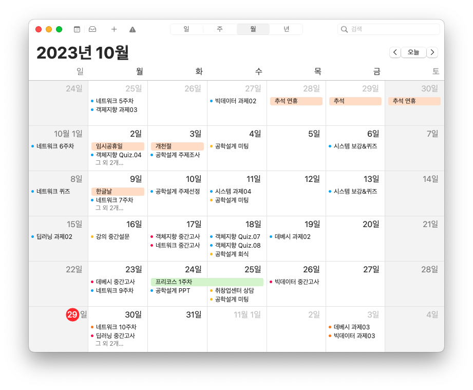
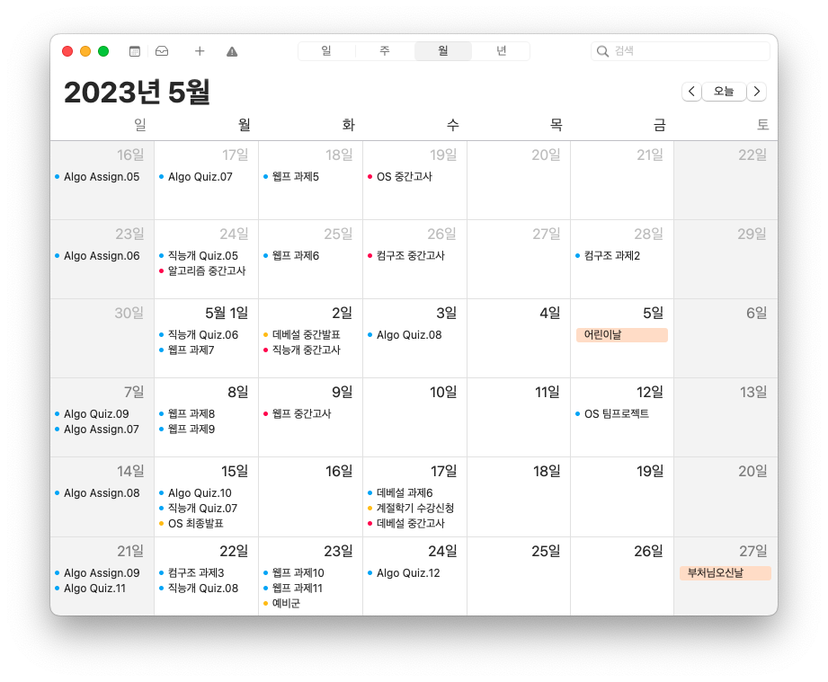
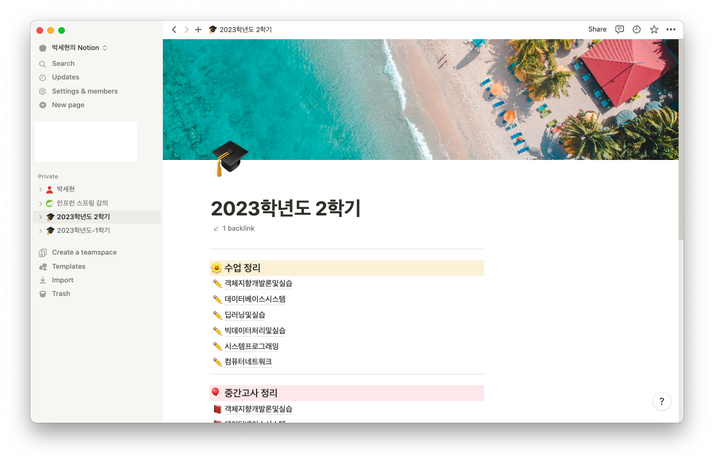
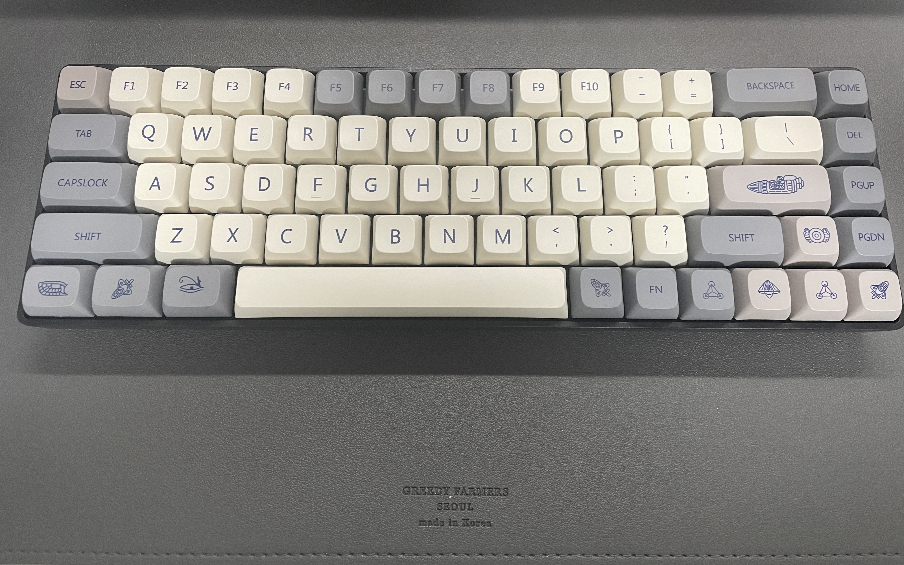
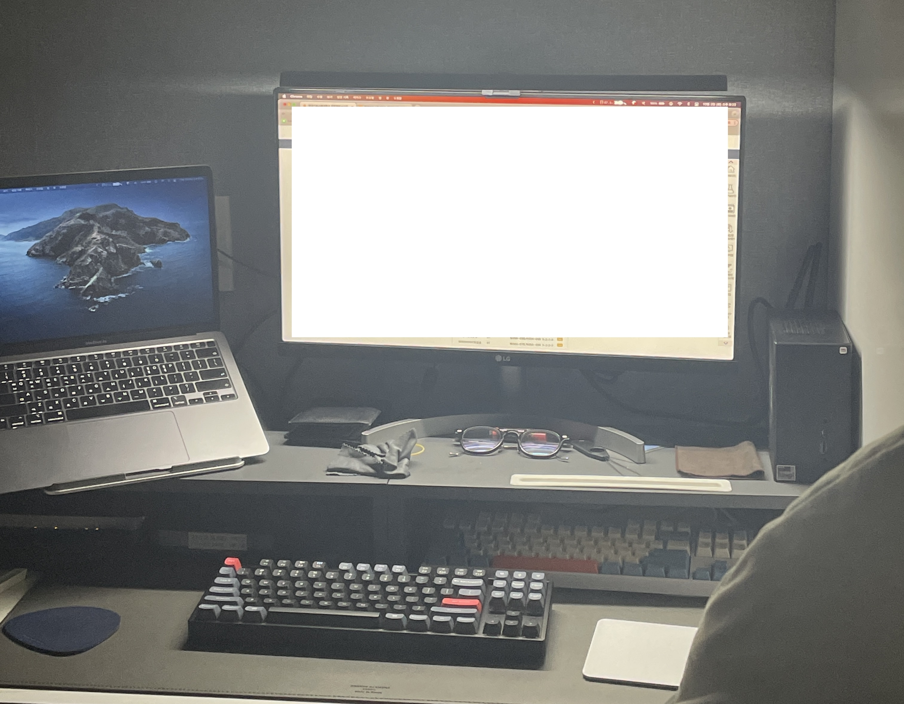
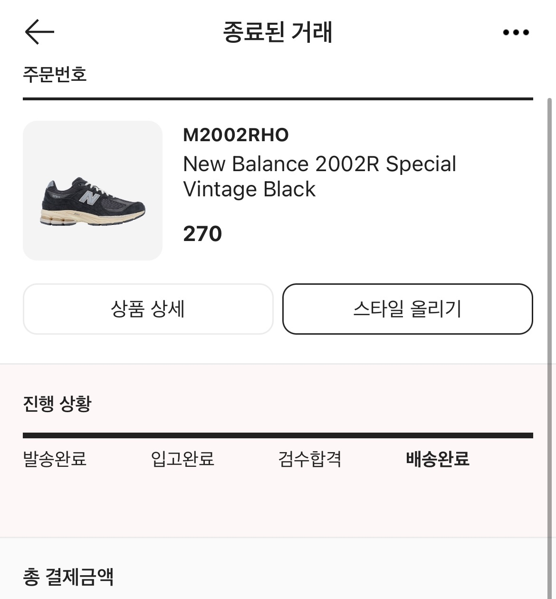
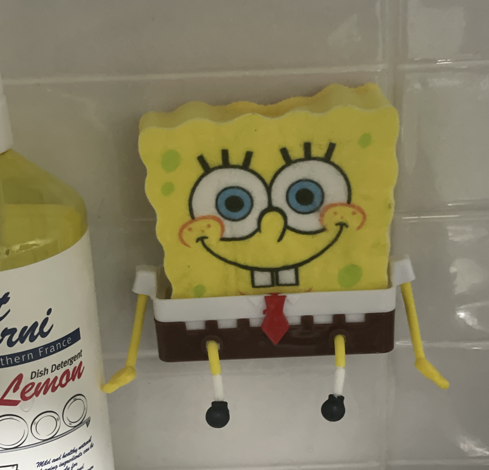
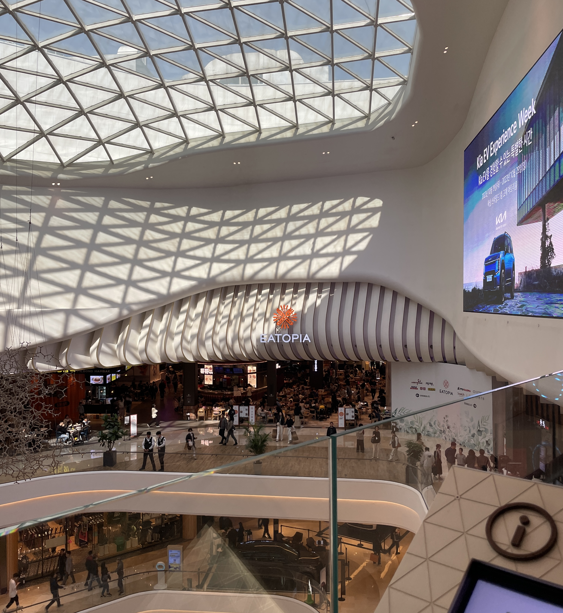
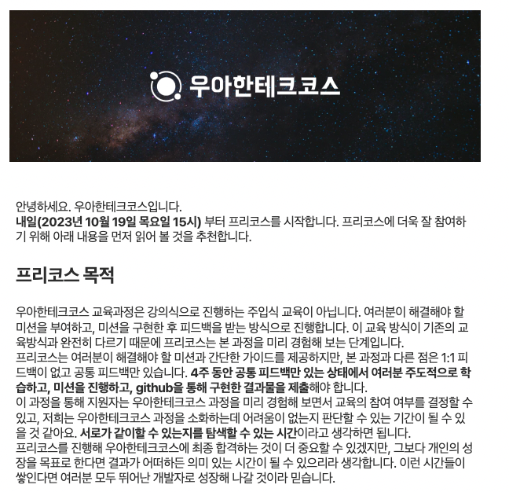

## 😡 시험이 안끝나

2주전부터 중간고사를 보기 시작했다. 2주전이 8주차였고 보통 중간고사는 8주차에 다 본다. <br>
늦어도 9주?? 그런데 아직 하나 남았다😡😡😡😡


근데 이건 약과다. 저번 학기는 5주동안 중간고사를 봤기 때문이다. 4월 19일 시작, 5월 17일 종료. 말이 되냐?? <br>
아무튼 시험이 길어질 수록 긴장의 끈을 놓지 않고 집중해서 공부하기 힘들다. 그래서 오랜만에 블로그를 써본다. 그동안 기억에 남는 일화들 시작~

## ❓ 블로그 안쓴지 오래됐다
방학때는 공부한거 기록하고 하느라 나름 열심히 포스팅 했던 것 같다. <br>
2학기 시작하고 조금 뜸해졌는데 공부했던 것을 계속 블로그에 올리려 했지만 뭔가 블로그에 올릴만큼 정리한 내용을 다듬고 할 시간적 여유가 없었던 것 같다.


그래도 노션에 차곡차곡 기록해두고 있으니! 시험 끝나면 하루 날 잡고 정리해서 올릴 예정이다.

## ✨ 쇼핑은 즐거워
2학기 시작하고 이것저것 많이 샀다. 
### 끝없는 장비 욕심

강의실에서 수업을 듣다보면 모니터로 빨려 들어가는 내 모습이 자주 느껴진다. 전체적으로 구부정한 자세가 되어서 목이 점점 아파서 노트북 거치대를 들고 다닐까 생각했다. 근데 그러면 트랙패드랑 키보드 조작하기 너무 불편해서 휴대하기 편한 작은 키보드를 사볼까? 했다. <br>
원래 저런 디자인은 아니고 키캡도 알리에서 저렴하게 구매했다. 원래는 전체적으로 검은 느낌인데 키캡을 바꿔주니까 귀여워졌다. 진짜 마음에 든다👍 <br>
이 키보드의 장점! 작고 가볍다. 귀엽다. 무선도 되고 USB 토글도 된다. 근데 USB 토글 반대편에 C타입도 있다. 미친 이런 친절함이...


자취방 책상에 스탠드를 둘 공간이 부족해서 모니터에 얹어두고 사용하는 모니터 조명을 찾아봤다. 핑계이고 모니터에 얹어두는게 좀 예뻐서 사고 싶은거였다. <br>
대충 저런 느낌인데 불빛도 3가지이고 밝기 조절도 되고 낫배드다!

### 가을엔 옷을 사야지!

가을이 되면서 옷과 신발을 구매해버렸다. 무신사 추석 세일은 못참지~ <br>
신발도 오랜만에 하나 샀는데 아~주 마음에 든다! 날씨가 추워져서 눕시도 하나 샀다. 텅장...

### 이건 그냥 자랑하고 싶음

이건 그냥 보여주고 싶어서 ㅋㅋㅋㅋㅋ 진짜 귀엽지 않나요? <br>
쿠팡에서 둘러보다가 이런 수세미를 팔길래 귀여워서 냅다 구매해버렸다. <br>
설거지할 때마다 애가 쭈굴쭈굴... ㅋㅋㅋㅋㅋㅋ 수세미 놓을 수 있는 스폰지밥 바지도 준다!

## 🚗 스타필드

학부에서 문화의 날 행사로 스타필드에 [스몹](https://www.smob.co.kr/)을 다녀왔다. <br>
맨날 집에 앉아서 컴퓨터하고 공부하다가 오랜만에 활동적으로 뛰어노니까 재밌었다. 동심을 찾은 느낌? ㅋㅋㅋㅋ 근데 다음날 몸이 조금 쑤셨던 것은 운동부족이 아니라 늙은거다.

## 🚀 우테코

그리고 우테코 6기를 모집하길래 BE 신청해서 프리코스 참여중이다. <br>
지난 수요일에 1주차 미션을 완료해서 제출했고, 다음주까지 2주차 미션을 구현해야한다. <br>
시험 기간이 겹쳐서 1주차는 시간을 조금 더 할애하지 못한게 아쉬웠다. 2주차도 그럴 예정.. <br>
그래도 시간을 쪼개서 열심히 참여해 볼 생각이다. 배우는게 많지 않을까! 세상에는 잘하는 사람이 정말 많구나 새삼 느끼고 있다.🥲

## ✋ 마무리
사실 개강하고 그냥저냥 이전과 크게 다를 것 없는 일상을 보냈다. <br>
이번 학기는 전공을 7개나 신청했다. 그냥 모두 전공.. 배우고 싶은 과목들이 있어서 굳이 교양 과목 넣지 않았다. 예상했지만 너무 힘들다. 특히 딥러닝이!!!! 지금 하나 남은 시험도 딥러닝... 제일 어려웠던 과제도 딥러닝... 뭐든 처음은 어려우니까 그래도 교수님께서 강의를 참 잘하셔서 배우는게 재밌기 때문에 다행이라 생각한다. <br>
아무튼 남은 시험 공부하기 싫어서 블로그 오랜만에 써봤다. 여기서 끝~

```toc
```