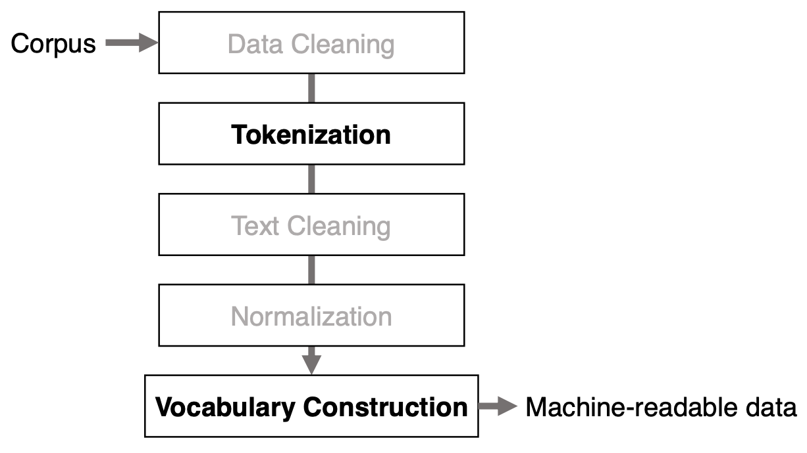

## 1. Text Preprocessing
### What is Text Preprocessing?

비정형화 (unstructured) 된 자연어 텍스트를 **컴퓨터가 잘 이해** 할 수 있도록 표현하는 것을 말한다.

- 자연어 텍스트를 `machine-readable data` 로 변경
- 자연어 텍스트를 `간결하고 일관적` 으로 텍스트 변경


- `Corpus` 란 자연언어 연구를 위해 특정 목적을 가지고 언어의 표본을 추출한 집합
- 컴퓨터는 Corpus 를 이해할 수 없기 때문에 `machine-readable data` 로 변경하는 과정을 **Text Preprocessing** 이라고 한다.
- 이 과정을 통해 비정형화된 자연어 텍스트를 `vector` 형태로 표현하는 것이 목적이다.

### Overall Precedure of Text Preprocessing



**Text Preprocessing** 의 전체적인 과정은 위와 같다.

`Data Cleaning, Text Cleaning, Normalization` 은 선택사항이다.

- 크롤링해서 수집한 데이터가 아닌, AI Hub, Kaggle 등을 통해 수집한 학습용 데이터는 위 과정이 이미 처리된 경우도 있다.

 `Tokenization, Vocabulary Construction` 은 필수 사항이다.

### Data Cleaning

**Data Cleaning** 은 불필요한 데이터, 오류, 중복 등을 제거해 `목적에 적합한` 데이터를 남기는 과정이다. <br>
상황과 목적에 맞는 처리 방법이 필요하다.

- 일반적으로 길이가 너무 짧거나 긴 데이터, 형식이 다른 데이터와 크게 다른 데이터, 목적에 적합하지 않는 데이터 등을 제거한다.

데이터셋으로 배포되는 많은 경우 이미 처리가 되어 있다.

예시로, 1.8M개의 뉴스 기사와 650K개의 요약본을 수집했다고 하자.
- Classification을 위해서 36K개의 뉴스 기사를 제외한 나머지 데이터를 제거할 수 있다.
- Summarization을 위해서 650K개의 요약본과 뉴스기사의 쌍을 남길 수도 있다.

### Tokenization

**Tokenization** 은 텍스트를 `Token` 이라고 하는 작은 단위의 텍스트로 나누는 작업을 말한다. <br>
영어에서 띄워쓰기 (white space), non-alphanumeric characters (e.g., puncuations) 를 기준으로 간단하게 수행이 가능하다.

- 하지만, 언어별로 규칙이 필요하고 이 규칙을 가지고 있는 것을 `Tokenizer` 라고 한다.

아래의 sentence를 통해 Tokenization의 예시를 살펴본다.

> **Steve’s house in N.Y. was sold with $25.5M on 22/02/09!**

- `WhitespaceTokenizer`
    - Steve’s house in N.Y. was sold with $25.5M on 22/02/09!
    - 띄워쓰기를 기준으로 텍스트를 나눈다.
- `TreebankWordTokenizer`
    - Steve’s house in N.Y. was sold with $ 25.5M on 22/02/09!
    - WhitespaceTokenizer와 다르게 달러 표시($)도 토큰으로 나누어졌다.
- `WordPuncTokenizer`
    - Steve ‘ s house in N . Y . was sold with $ 25 . 5M on 22 / 02 / 09 !
    - 띄워쓰기 뿐 아니라 문장부호를 기준으로 토큰이 나누어졌다.
- `PunktWordTokenizer`
    - Steve’s house in N.Y. was with $25.5M on 22/02/09 !

위 예시를 통해 알 수 있는 것은 Tokenization 방법에 따라 토큰이 가지는 의미가 변하거나 사라질 수 있다는 것이다. WhitespaceTokenizer의 **N.Y.** 은 뉴욕을 뜻하지만, WordPuncTokenizer의 **N** 은 아무 의미가 없다.

따라서 `Task에 맞는, 상황과 목적에 맞는 방법을 택할 필요가 있다!`

### Vocabulary : 단어 사전

**Vocabulary** 는 고유한 단어(token)들에 고유한 ID를 할당한 집합을 말하며, token sequence를 machine-readable 하게 만들기 위해 사용한다.

**OOV(Out of Vocabulary)** 는 텍스트에서 추출한 token이 vocabulary에 없는 경우를 말한다. 이 경우 고유한 ID를 할당할 수 없다. 이때, 해당 token에 대해서 ID를 할당하지 않는 것이 아닌 `Unknown Token [UNK]` 를 추가하여 OOV 문제에 대응한다.

- Vocabulary에 없는 token이 해당 자리에 있었다는 정보를 기록하는 역할을 하며, 이것을 머신에 알려주는 것도 중요한 정보가 될 수 있다.

OOV 문제를 통해 알 수 있는 사실은 vocabulary의 크기가 작을수록 많은 정보가 손실된다는 것이다.

Vocabulary의 크기에 따른 장단점은 다음과 같다.

- Large
  - 장점
    - 정보를 세분화하여 표현할 수 있다.
  - 단점
    - 정보가 분산되어 표현된다.
    - 많은 연산과 저장공간이 필요하다.
- Small
  - 장점
    - 문제에 특화된 핵심 정보만 유지한다.
  - 단점
    - 정보를 세분화하여 표현할 수 없다.
    - OOV 문제가 있다.

결국엔 정답은 없으며 적절한 크기의 vocabulary 를 구축해 사용해야한다.

### Text Cleaning

**Text Cleaning** 은 Tokenization 후에 token을 정제하는 목적으로 행해진다.
Tokenizer의 특성에 따라 **노이즈** 가 발생할 수 있다.

- 너무 짧거나 긴 토큰, 오탈자에 의한 노이즈 토큰 등
- 등장 빈도가 적은 토큰

Text Cleaning 과정에서 주로 다음 작업을 수행한다.

- 등장 빈도가 적은 토큰 제거
    - Corpus에서 등장 빈도가 적은 토큰의 경우 **오탈자와 같은 단순 오류** 이거나 **중요하지 않은 단어** 일 경우가 많다.
- 길이가 길거나 짧은 토큰
    - 영어의 경우 단어의 평균 길이가 6~7 문자로 구성된다.
    - **길이가 1~2인 짧은 토큰** 의 경우 대부분 `큰 의미가 없는` stopword일 가능성이 높다.
    - **길이가 너무 긴 토큰** 의 경우 **띄어쓰기 오류 등** 일 가능성이 높다.
- 불필요한 메타 정보 제거
    - HTML과 같은 웹 문서는 태그 정보가 포함되어 있는데, 이러한 **메타 정보** 를 제거해 본문을 추출하는 것이 필요하다.

### Text Normalization

- Case-insensitive
    - 영어에서 대소문자는 특별한 의미 (인명, 지명, 문장의 첫글자, 강조 등)를 가진다. 하지만, 이로 인해 vocabulary의 크기가 비약적으로 커지는 문제가 있다.
    - 따라서 일반적으로 토큰을 소문자로 변환하여 대소문자 구분을 하지 않는다.
- Stopword removal
    - 자체로는 의미가 크지 않은 단어를 제거한다.
    - 주로 문서 분류와 정보검색 등 문서 단위 작업을 수행할 때 사용한다.
- Lemmatization (표제어 추출)
    - 단어의 문법적 요소를 고려하여 표제어 (기본형 단어)를 찾아 변환한다.
        - ex) am, are, is → **be**
        - ex) 짜증나는, 짜증난다, 짜증날 → **짜증나다**
    - 표제어 추출 시 토큰의 문법적인 요소인 품사를 고려한다.
- Stemming (어간 추출)
    - 형태가 변형된 단어로부터 접사 등을 제거하여 어간을 추출한다.
        - ex) 짜증나는, 짜증난다, 짜증날 → **짜증**
    - 정해진 규칙에 따라 단어의 어미를 자르는 방법을 주로 사용한다.
        - ing, ize, ance 등의 어미를 제거한다.
    - Lemmatization과 달리 품사를 고려하지 않는다.

---

## 2. Text Representation

### What is Text Representation?
Vocabulary에 기반하여 컴퓨터가 이해할 수 있도록 텍스트를 표현하는 방법이다. <br>
Machine/Deep Learning 기반 NLP에서는 텍스트를 `vector` 로 표현해야 한다. <br>
Text Representation 방법은 아래와 같이 분류할 수 있다. <br>


### Word Representation: One-hot Vector

Vocabulary 크기의 vector에 해당 단어의 index에 해당하는 값만 1로 표시한 벡터이다.

예시
> **V = {Steves’s: 1, son: 2, graduated: 3, from: 4, KOREATECH: 5}**

```
→ Steve’s = [1, 0, 0, 0, 0]
→ son = [0, 1, 0, 0, 0]
→ graduated = [0, 0, 1, 0, 0]
→ from = [0, 0, 0, 1, 0]
→ KOREATECH = [0, 0, 0, 0, 1]
```

### Document Representation: One-hot Vectors

문서의 각 단어의 `one-hot vector` 를 순서대로 합쳐 sequential 한 matrix를 형성해 문서를 표현한다.

- 장점
    - 간단하며 토큰의 순서를 유지함으로써 문서의 정보를 모두 유지한다.
- 단점
    - 이론상으로 문서에 토큰이 많을수록 많은 메모리와 계산량이 필요하다.
    - 실제로는 word ID 만을 list 형식으로 저장해서 사용함으로써 문제를 해결한다.

### Document Representation: Bag-of-Words

문서에서 토큰의 순서를 무시하고 단어의 출현 빈도를 이용해서 문서를 표현한다. <br>
주로 텍스트 분류와 정보 검색에서 사용한다.

- 장점
    - 간단하며 적은 메모리와 계산량이 필요하다.
- 단점
    - 단어의 순서 정보가 없으므로 세분화된 정보를 알 수 없다.

예시
> **Steve's son and my son graduated from KOREATECH**
```
<Positioning>
{Steve's: 1, son: 2, and: 3, my: 4, graduated: 5, from: 6, KOREATECH: 7}

<Counting>
{Steve's: 1, son: 2, and: 1, my: 1, graduated: 1, from: 1, KOREATECH: 1}
```

### Document Representation: Document-Term Matrix

서로 다른 문서의 `BoW` 를 결합하여 matrix 형태로 표현한다. <br>
이를 통해 문서 사이의 유사도를 계산할 수 있다.

- `cosine similarity` 를 통해!

여기서 발생할 수 있는 문제점은 **단어의 빈도 수** 를 이용하기 때문에 원치 않는 결과가 발생할 수 있다는 것이다.

- 문서에 `common words` 가 많은 경우 높은 유사도를 보인다.

이를 해결하기 위해 유사도 계산 시 common words의 기여도는 낮추고 **topical words** 의 기여도는 높이는 방법이 필요하다.

### Document Representation: Term Weighting

**TF-IDF (Term Frequency - Inverse Document Frequency)**

- Corpus D에서 단어 t가 하나의 문서 d에서 얼마나 중요한지에 대한 통계적 수치이다.
- BoW가 한 문서에서의 단어 빈도를 표현한 것에 비해 corpus와 문서에서의 빈도를 모두 고려한다.

중요도를 계산하는 방법은 다음과 같다.

- `tf(t, d)`
    - 단어 **t** 가 문서 **d** 에서 출현한 빈도
    - **t** 가 **d** 에서 많이 출현하면 **t는 d에서 중요한 단어** 임을 나타낸다.
- `idf(t, D)`
    - 단어 **t** 가 전체 corpus **D** 에 출현한 빈도의 역수
    - **t** 가 **D** 에 많이 출현하면 일반적인 단어임을 나타낸다.

따라서, **TF-IDF** 는 다음과 같이 계산할 수 있다.


위 식이 의미하는 것은 단어 **t** 가 문서 **d** 에 많이 출현해도 다른 문서에서도 많이 출현한다면 그것은 `common words` 일 가능성이 있고, 중요도가 낮다는 것을 의미한다.

- 장점
    - 의미 있는 유사도 계산이 가능하다.
    - Corpus 내의 문서에서 각 단어 별 중요도를 파악 가능하다.
- 단점
    - 맥락적인 내용을 고려하지 않는다.

---

## Summary

자연어를 컴퓨터가 이해하는 표현 (numerical representation) 으로 변환

- 자연어 → 텍스트 전처리 → vocabulary 생성 → numerical representation

다양한 텍스트 전처리를 `적절히` 사용해 해결하고자 하는 문제에 적합한 `vocabulary` 를 생성하는 것이 중요!