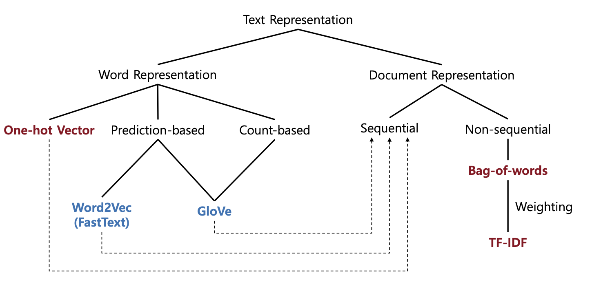
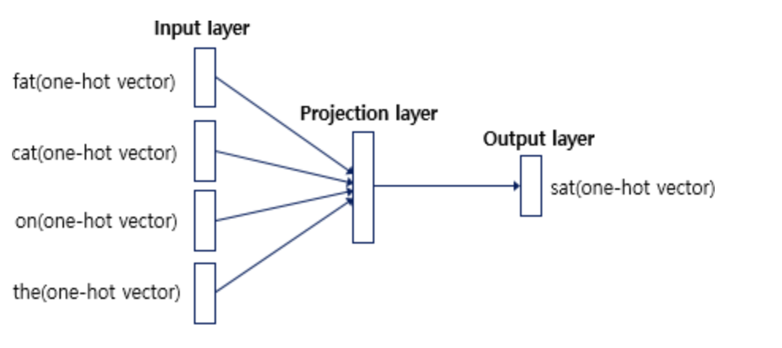
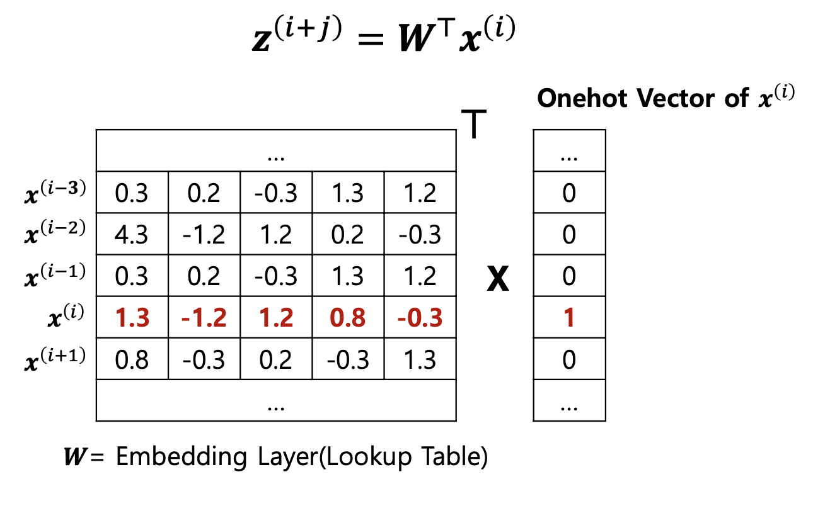
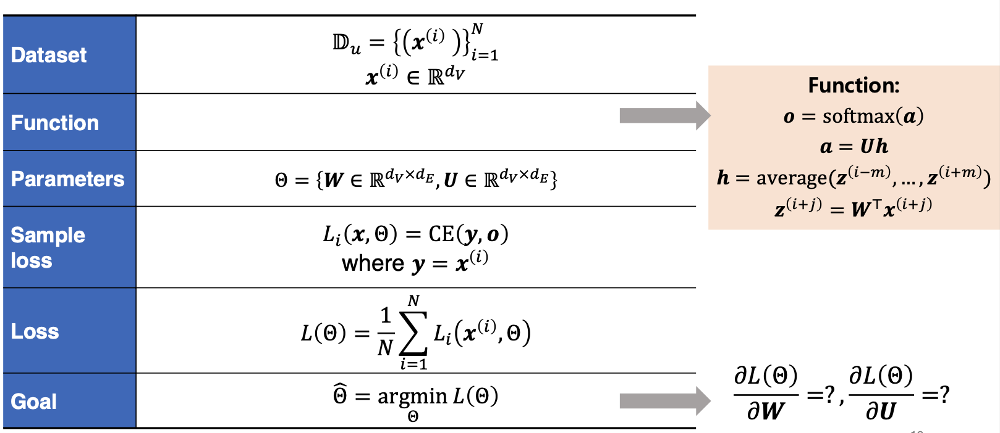
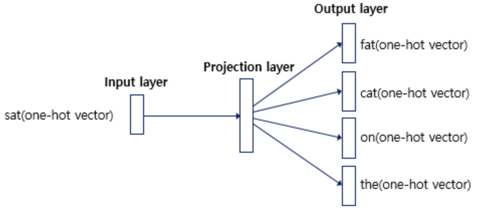
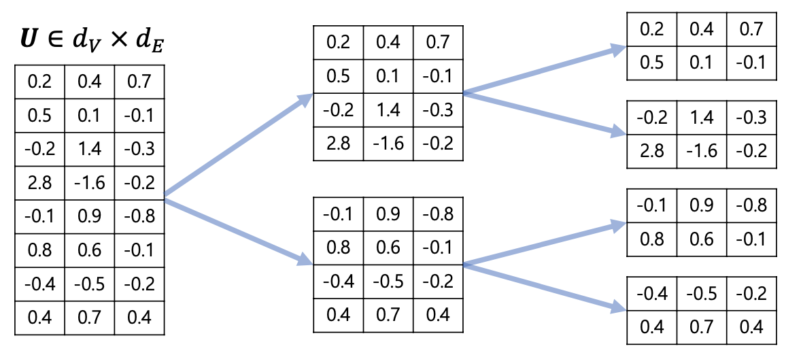
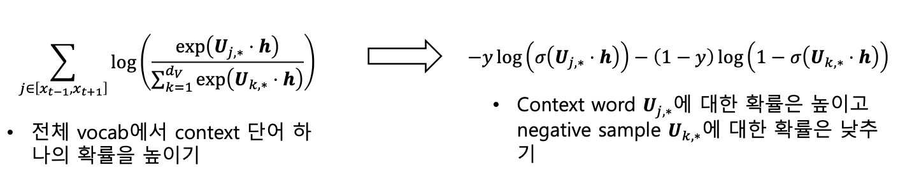

***Table of Contents***

- [Limitations of Previous Text Representation](#1-limitations-of-previous-text-representation)  
- [Word2Vec](#2-word2vec)
  - [CBOW](#cbow-continous-bag-of-words)
  - [Skip-Gram](#skip-gram)
- [Word2Vec, Skip-gram with Negative Sampling](#3-word2vec-skip-gram-with-negative-sampling)
- [구현 및 실습](#4-구현-및-실습)

## 1. Limitations of Previous Text Representation

`One-hot Vector` , `TF-IDF` 와 같이 이전에 배운 Text Representation에는 한계가 있다.

### Sparse Representation

`One-hot Vector` 는 표현하고자 하는 단어의 인덱스 값만 1이고 나머지는 모두 0으로 표현되는 벡터 표현 방법이다. 이와 같이 벡터 또는 행렬의 값이 대부분 0으로 표현되는 방법을 `희소 표현 (Sparse Representation)` 이라고 한다.

여기에는 2가지 관점에서 한계가 존재한다.
- 하나의 텍스트는 매우 큰 크기를 가지므로 메모리를 많이 사용한다는 단점
- 각 단어가 독립적으로 표현되어 맥락 및 단어 벡터 간 유의미한 유사성을 파악할 수 없다는 단점

`TF-IDF` 는 단어 간의 유의미한 유사도를 계산할 수 있지만, 맥락적인 내용을 고려하지 못한다.

### Distributed Representation

대안으로 단어의 의미를 다차원 공간에 벡터화하는 방법을 사용할 수 있는데 이를 `분산 표현 (Distributed Representation)` 이라고 한다.  
이는 기본적으로 **비슷한 문맥에서 등장하는 단어들은 비슷한 의미를 가진다** 는 분포가설이라는 가정 하에 만들어진 표현 방법이다.

희소 표현이 고차원에 각 차원이 분리된 표현 방법이라면, 분산 표현은 **저차원에 단어의 의미를 여러 차원에 분산하여 표현**한다. 이런 표현 방법을 통해 **단어 벡터 간 유의미한 유사도**를 계산할 수 있다. 대표적인 학습 방법으로 `Word2Vec` 이 있다.

---

## 2. Word2Vec

### Word2Vec 란?

`Word2Vec` 은 단어들 간의 의미와 관계를 파악할 수 있도록 단어의 의미를 벡터화하는 방법이다.  
분포가설을 따르는 분산 표현 방법을 사용한다.

> ex) ‘강아지’는 주로 ‘귀엽다’, ‘예쁘다’ 등의 단어와 함께 등장하는데, 이러한 텍스트를 벡터화하면 이 단어들은 의미적으로 가까운 단어가 된다.

Word2Vec에는 2가지 방법이 있다.
- CBOW (Continuous Bag of Words)
- Skip-Gram

### CBOW (Continous Bag of Words)

`CBOW` 는 주변 단어(Context Word)를 통해 중심 단어(Center Word)를 예측하는 방법이다.  
윈도우를 두고 윈도우 내의 주변 단어로부터 중심 단어를 예측한다.

> "The fat cat sat on the mat” 와 같은 문장에서 윈도우 크기가 2라면,  
> The, fat, sat, on (중심 단어 앞/뒤로 2개의 단어!) 을 통해 **cat** 을 예측하는 것이다.

CBOW의 인공신경망 구조는 위와 같다.
- 입력층은 윈도우 크기 범위 안에 있는 주변 단어들의 one-hot vector가 들어간다.
- 출력층은 예측하고자 하는 중심 단어의 one-hot vector가 레이블로서 필요하다.
- 은닉층은 일반적인 은닉층과 달리 활성화 함수가 존재하지 않으며, Lookup Table이라는 연산을 담당하는 층으로 `투사층 (Projection Layer` 라고 부른다.

[’fat’, ‘cat’, ‘on’, ‘the’] 의 주변 단어를 통해 ‘sat’ 이라는 중심 단어의 Embedding Vector를 계산하는 과정은 다음과 같다.

**Context Word의 Embedding Vector 취하기**

Context Word의 one-hot vector에 가중치 행렬 W를 곱해 각 단어의 Embedding Vector를 취한다. 이때, *i* 번째 인덱스에 1 값을 가지는 단어는 W 행렬에서 *i* 번째 행을 취한 것과 동일하기 때문에 이 단계를 *Lookup Table 이라고 한다.*

**주변 단어들로 평균 벡터 구하기**

Projection Layer에서 각 벡터들의 평균을 구한다.  
이 과정은 중심 단어로부터 주변 단어를 예측하는 `Skip-Gram` 에서는 수행되지 않는다.

**Softmax**

Vocabulary Representation과 *dot product* 를 통해 유사도를 계산한다.  
그리고 여기서 *Softmax* 를 취하고 이는 각 원소가 중심 단어일 확률을 의미한다.  
예측과 실제 중심 단어의 오차, **cross-entropy loss** 가 최소화되도록 학습을 진행한다.  
**CBOW**의 전체 과정을 요약하면 다음과 같다.

### Skip-Gram

`Skip-Gram` 은 중심 단어(Center Word)를 통해 주변 단어(Context Word)를 예측하는 방법이다.  
작은 학습 데이터에서도 잘 동작하고, 희귀한 단어를 예측할 수 있다는 장점이 있지만 계산 비용이 크다는 문제점이 있다.

Skip-Gram의 인공신경망 구조는 위와 같다.
- 입력층은 중심 단어가 들어가며 출력층에서 주변 단어가 레이블로서 필요하다.
- 투사층에서 벡터의 평균을 구하는 과정이 없다.

### CBOW vs Skip-Gram

**CBOW**가 **Skip-Gram**보다 많은 정보를 가지고 학습을 진행한다. 따라서 *Prediction Accuracy* 는 **CBOW**가 높다. 하지만, *Prediction Accuracy* 와 *Representation Power* 는 다르다!  
일반적으로 **Skip-Gram**이 *Representation Power* 가 더 뛰어난 표현을 보이는 것으로 알려져 있다. 하지만, *Learning Cost* 는 **Skip-Gram**이 훨씬 높다.

---

## 3. Word2Vec: Skip-Gram with Negative Sampling

Word2Vec의 출력층에서 Softmax 함수를 통과한 단어 집합 크기의 벡터와 실제값인 one-hot vector의 오차를 구한다. 이를 통해 Embedding Table에 있는 모든 단어에 대한 Embedding Vector 값을 업데이트한다.  
만약, Vocab의 크기가 매우 크다면, 이 과정에서 드는 *Computational Cost* 는 매우 무거운 작업이 되고 학습하기 꽤 무거운 모델이 된다.

여기서 효율성을 높이기 위한 2가지 시도가 있었다.

### Hierarchical Softmax

먼저, Softmax 함수의 시간 복잡도는 Vocabulary size를 𝑑𝑉 라고 할 때, O(𝑑𝑉) 이다.
이것을 O(𝑙𝑜𝑔2(𝑑𝑉)) 로 줄일 수 있는 방법이 `Hierarchical Softmax` 이다.

위와 같이 Binary Tree 구조로 Context Word를 찾아갈 수 있는 확률을 최대화하도록 학습하는 것이 목적이다.

### Negative Sampling

Word2Vec 학습 과정에서 전체 단어 집합이 아닌 일부 단어 집합에만 집중할 수 있도록 하는 방법이다.

예를 들면, 현재 집중하고 있는 주변 단어가 ‘고양이’, ‘귀여운’ 일 때, ‘돈가스’, ‘회의실’ 과 같은 단어 집합에서 무작위로 선택된 **주변 단어가 아닌 단어들**을 일부 가져온다. 이렇게 하나의 중심 단어에 대해 전체 단어 집합보다 훨씬 작은 단어 집합을 만들어놓고 마지막 단계를 **이진 분류 문제**로 변환한다.

 즉, 위와 같이 기존의 전체 vocab에서 주변 단어 하나의 확률을 높이는 방법에서, 주변 단어(positive)에 대한 확률은 높이고, 랜덤으로 샘플링된 단어(negative)에 대한 확률을 낮추는 것이다.

---

## 4. 구현 및 실습
👉 [Gensim을 이용한 CBOW, Skip-Gram 모델 학습 바로가기](https://github.com/BBOXEEEE/CSE541-NLP/blob/main/Lecture03/Lec03P_WordRepresentation.ipynb)