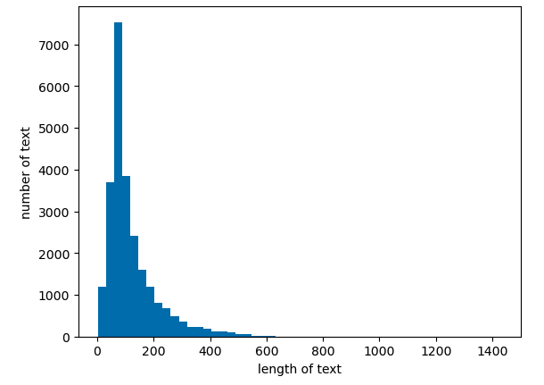
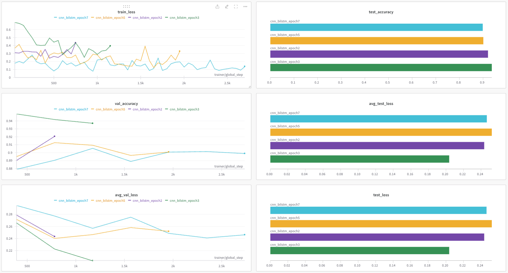

Stanford University에서 제공하는 IMDB Movie Review Dataset 을 활용해 감정 분류 모델을 만들어본다.

## 1. 데이터 불러오기

### 1.1 데이터셋 확인

먼저 [링크](https://ai.stanford.edu/~amaas/data/sentiment/) 를 통해 데이터셋을 다운로드 받고, 압축을 해제하면 다음과 같은 폴더구조에 데이터들이 담겨있고, 디렉토리의 용도는 다음과 같다.

- train/pos : 긍정 label의 학습 데이터
- train/neg : 부정 label의 학습 데이터
- test/pos : 긍정 label의 테스트 데이터
- test/neg : 부정 label의 테스트 데이터

### 1.2 텍스트 파일로 만들기

`.txt` 파일에 흩어져있는 데이터들을 각각 하나의 `train.txt` `test.txt` 파일로 만들어준다.

```python
from pathlib import Path

raw_data_dir = './aclImdb'
data_dir = Path(raw_data_dir)

train_datas = []
test_datas = []

for sentiment in ["pos", "neg"]:
    samples = list(data_dir.glob(f"train/{sentiment}/*.txt"))
    train_datas.extend(samples)

for sentiment in ["pos", "neg"]:
    samples = list(data_dir.glob(f"test/{sentiment}/*.txt"))
    test_datas.extend(samples)

train_file = open("train.txt", "w", encoding="utf-8")
test_file = open("test.txt", "w", encoding="utf-8")

for file, datas in [(train_file, train_datas), (test_file, test_datas)]:
    file.write("id\ttext\tlabel\n")
    for data in datas:
        lines = [line.strip().replace("\t", " ") for line in data.open().readlines()]
        text = " ".join(lines)
        id = data.name[:-4]
        label = 1 if "pos" in data.parts else 0
        file.write(f"{id}\t{text}\t{label}\n")
    
train_file.close()
test_file.close()
```

### 1.3 데이터셋 불러오기

위에서 만든 .txt 파일은 아래와 같이 불러와서 `train_data` `test_data` 에 담을 수 있다.

```python
with open("train.txt", "r", encoding="utf-8") as file:
    contents = file.read()
    lines = contents.split("\n")[1:]
    train_data = [line.split("\t") for line in lines if len(line) > 0]

with open("test.txt", "r", encoding="utf-8") as file:
    contents = file.read()
    lines = contents.split("\n")[1:]
    test_data = [line.split("\t") for line in lines if len(line) > 0]
```

## 2. Vocabulary 구축 및 Word Embedding

### 2.1 Text Preprocessing

다양한 기법을 사용해 텍스트를 전처리한다. 내가 사용한 기법은 다음과 같다.

- 텍스트를 모두 소문자로 변환
- `<br />` 태그 제거
- Punctuation 제거
- Tokenizing
- 불용어 처리
- Stemming

```python
import re
from tqdm import tqdm
from nltk.tokenize import word_tokenize
from nltk.corpus import stopwords
from nltk.stem import PorterStemmer

stop_words = set(stopwords.words('english'))
stemmer = PorterStemmer()

tokenized_train_dataset = []
tokenized_test_dataset = []

for data in tqdm(train_data):
    text = data[1].lower().replace('<br />', '')
    text = re.sub(r'[^\w\s]', '', text)
    tokens = word_tokenize(text)
    tokens = [word for word in tokens if word not in stop_words]
    tokens = [stemmer.stem(word) for word in tokens]
    labels = data[2]
    tokenized_train_dataset.append((tokens, labels))

for data in tqdm(test_data):
    text = data[1].lower().replace('<br />', '')
    text = re.sub(r'[^\w\s]', '', text)
    tokens = word_tokenize(text)
    tokens = [word for word in tokens if word not in stop_words]
    tokens = [stemmer.stem(word) for word in tokens]
    labels = data[2]
    tokenized_test_dataset.append((tokens, labels))
```

위와 같이 학습, 테스트 데이터 각각에 전처리를 진행한다.

### 2.2 Vocabulary 구축

단어를 기준으로 토크나이징하고 전처리 과정을 거친 `tokenized_dataset` 을 이용해 vocab을 구축한다.

이때, 2번 이하로 등장하는 토큰들은 제외하고 vocab을 구축한다. 이렇게 하는 이유는 중요하지 않은 토큰을 vocab에서 제거해 vocab의 크기를 줄이기 위함이다.

```python
from collections import Counter

token_counter = Counter()

for tokens, _ in tokenized_train_dataset:
    token_counter.update(tokens)

min_count = 2
vocab = {"[PAD]":0, "[UNK]":1}
vocab_idx = 2

for token, count in token_counter.items():
    if count > min_count:
        vocab[token] = vocab_idx
        vocab_idx += 1
```

### 2.3 Word Embedding

One-Hot Vector는 메모리 측면에서도 문맥 파악 측면에서도 한계점이 있다.

따라서 `Word2Vec` 을 사용해 그 중 `Skip-Gram` 을 사용해 Embedidng Lookup Matrix를 만든다.

```python
from gensim.models import Word2Vec

word2vec_train_datas = []
for train_text, _ in tokenized_train_dataset:
    word2vec_train_datas.append([word for word in train_text])

SkipGram_W2V = Word2Vec(sentences = word2vec_train_datas, vector_size = 200, window = 5, min_count = 1, workers = 4, sg = 1)
```

이때, `vector_size` 는 일반적으로 100~300 사이로 설정한다. 나는 여러번의 실험 끝에 200으로 설정했을 때 괜찮은 성능이 나와서 이렇게 결정했다.

```python
import numpy as np

embedding_list = []

for token, idx in vocab.items():
    if token in SkipGram_W2V.wv:
        embedding_list.append(SkipGram_W2V.wv[token])
    elif token == "[PAD]":
        embedding_list.append(np.zeros(SkipGram_W2V.wv.vectors.shape[1]))
    elif token == "[UNK]":
        embedding_list.append(np.random.uniform(-1, 1, SkipGram_W2V.wv.vectors.shape[1]))
    else:
        embedding_list.append(np.random.uniform(-1, 1, SkipGram_W2V.wv.vectors.shape[1]))

embedding_lookup_matrix = np.vstack(embedding_list)

print(embedding_lookup_matrix.shape)
print(len(vocab))
```

위와 같이 코드를 실행했을 때 출력 결과는 다음과 같다.

```shell
(29544, 200)
29544
```

여기서 중요한 점은 `embedding_lookup_matrix` 와 `vocab` 의 크기가 같아야한다는 것이다.

## 3. 모델 구축 및 학습

### 3.1 Padding

GPU 연산을 위해서 서로 다른 텍스트의 길이를 통일해 matrix 형태로 맞춰줄 필요가 있다.<br>
Padding을 어느 정도의 길이에서 할 것인가를 정하기 위해 우리가 가지고 있는 데이터의 최대 길이 및 평균 길이, 분포 등을 확인해 볼 수 있다.



텍스트의 최대 길이는 **1429**, 평균 길이는 **121** 이다.

최대 길이만큼 패딩을 하기엔 과한 것 같다. 길이의 분포는 대략 약 400 이하에 대다수가 분포되어 있는 것을 확인할 수 있다.

나는 최대 길이의 약 1/3 수준인 500을 기준으로 잡고 길이가 500 이상인 텍스트의 비율 즉, 패딩을 500으로 했을 때 손실되는 텍스트의 비율을 확인했다. 결과적으로 **99.37%** 의 텍스트를 보존할 수 있어 패딩의 길이는 500으로 결정했다.

### 3.2 Modeling

성능을 높이기 위해 여러 모델을 통해 실험을 진행했다. 과제에서 MLP, CNN, LSTM, BiLSTM 등을 통한 모델을 구축하라고 했기에 이들 중 성능이 좋은 모델을 찾기 위해 노력했다. <br>
결과적으로 대부분 약 87%의 정확도 이상을 넘기질 못했다.

그래서 선택한 것은 `CNN-BiLSTM` 모델을 사용하는 것이다.

텍스트의 의미 단위는 각 단어가 될 수도 있지만 여러 단어가 하나의 의미를 나타낼 수 있다. 따라서 CNN을 통해 **n-gram의 Local Context** 를 파악한다.

또한 CNN을 통해 만들어진 n-gram의 정보를 입력으로 받는 BiLSTM을 통해 **Sequence 전체의 의미 즉, Global Context** 를 유지한다.

이러한 모델이라면 조금 더 좋은 성능을 낼 수 있을 것이라 판단하고 모델링을 했다.

```python
class CNN_biLSTM(nn.Module):
    def __init__(self, vocab_size):
        super(CNN_biLSTM, self).__init__()
        self.embedding = nn.Embedding.from_pretrained(torch.FloatTensor(embedding_lookup_matrix), freeze=False)

        self.conv1 = nn.Conv2d(1, 128, (3, 200))
        self.conv2 = nn.Conv2d(1, 128, (5, 200))
        self.conv3 = nn.Conv2d(1, 128, (7, 200))
        self.conv4 = nn.Conv2d(1, 128, (9, 200))

        self.dropout = nn.Dropout(0.5)
        self.bn = nn.BatchNorm1d(128)

        self.rnn = nn.LSTM(128, 128, batch_first=True, num_layers=1, bidirectional=True)
        self.fc = nn.Sequential(
            nn.Linear(4*128*2, 256),
            nn.ReLU(),
            nn.Linear(256, 2)
        )
    
    def forward(self, x):
        embedding = self.embedding(x).unsqueeze(1)

        conv1_feature = F.relu(self.conv1(embedding).squeeze(3))
        conv2_feature = F.relu(self.conv2(embedding).squeeze(3))
        conv3_feature = F.relu(self.conv3(embedding).squeeze(3))
        conv4_feature = F.relu(self.conv4(embedding).squeeze(3))

        max1 = F.max_pool1d(conv1_feature, conv1_feature.size(2)).squeeze(2)
        max2 = F.max_pool1d(conv2_feature, conv2_feature.size(2)).squeeze(2)
        max3 = F.max_pool1d(conv3_feature, conv3_feature.size(2)).squeeze(2)
        max4 = F.max_pool1d(conv4_feature, conv4_feature.size(2)).squeeze(2)
        
        max1 = self.bn(self.dropout(max1))
        max2 = self.bn(self.dropout(max2))
        max3 = self.bn(self.dropout(max3))
        max4 = self.bn(self.dropout(max4))

        rnn1, _ = self.rnn(max1)
        rnn2, _ = self.rnn(max2)
        rnn3, _ = self.rnn(max3)
        rnn4, _ = self.rnn(max4)
        
        x = torch.cat([rnn1, rnn2, rnn3, rnn4], dim=1)

        x = self.fc(x)

        return x
```

모델의 구조는 4개의 Multi Branch 형태로 구성된다.

- 3,5,7,9의 CNN filter를 통해 3,5,7,9-gram의 Local Context를 파악한다.
- 이들이 LSTM의 입력으로 들어가기 전 Max Pooling과 Dropout, BatchNormalization을 진행한다.
- LSTM은 Bidirectional 하게 진행하며 양방향 문맥을 파악할 수 있도록 한다.

### 3.3 Evaluate



위 사진과 같이 epoch 3에서 **Test Accuracy 93.71%** 를 달성했다.

약간의 오차가 있기는 하지만 그래도 그동안 했던 실험들 중 처음으로 90% 이상의 Accuracy를 대부분의 경우에서 보여주었다.

## 4. 마무리하며

NLP 수업을 들으며 배웠던 것들을 적용해보는 시간이 힘들지만 재밌었고, <br>
Accuracy 향상을 위해 검색하고 논문도 찾아보며 나는 미처 생각지 못한 다른 사람들의 생각을 발견할 수 있어 좋았다.

